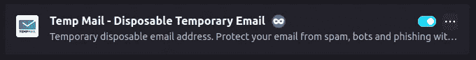
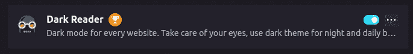
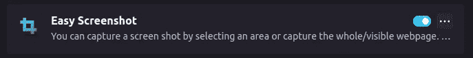

# 我作为 Flutter 开发者使用的浏览器插件/扩展。

> 原文：<https://blog.devgenius.io/browser-add-on-extension-i-use-as-flutter-developer-3c8c59c642e?source=collection_archive---------8----------------------->

是的，扩展。我们今天将谈论扩展。我知道有大量的文章关注开发人员的扩展。但是在这一篇中，我将谈论我使用的扩展，以及这些扩展如何帮助我提高开发人员的日常工作效率。

詹姆斯·哈里逊在 [Unsplash](https://unsplash.com?utm_source=medium&utm_medium=referral) 上拍摄的照片

让我们开始列举它们

1.  **Vimium C**

如果你是一个 vim 用户，那么你可能知道这个(假设你使用 Vim 键绑定)。这个附加组件允许你不使用鼠标通过键绑定和快捷方式来导航/使用浏览器。

*火狐插件:*[*https://mzl.la/3bciP1M*](https://mzl.la/3bciP1M)*—谷歌扩展:*[*https://bit.ly/3zieKAR*](https://bit.ly/3zieKAR)

**2。比特沃顿**

谁会因为试用期只有 15 天就拥有同一个网站的十个不同账号？并且拥有数百个跨网站、跨应用的账号？我知道，我知道你们大多数人都知道。那么，我们如何记住这些帐户凭证呢？—我们没有。比特沃顿记得他们。是的，这是一个密码管理器。

*火狐插件:*[*https://mzl.la/3Q69qaA*](https://mzl.la/3Q69qaA)*—谷歌扩展:*[*https://bit.ly/2IOyENd*](https://bit.ly/2IOyENd)

**3。临时邮件**

你只是想查看网站，但他们想让你创建一个帐户？临时邮件会帮你处理一次性邮件。

火狐插件:[https://mzl.la/2QXzIRn](https://mzl.la/2QXzIRn)—谷歌扩展:[https://bit.ly/3zIQl90](https://bit.ly/3zIQl90)

**4。八叉树**

如果你浏览大量开源代码或者花大量时间在 GitHub 上查看不同的项目？那么这个插件可能会对你有很大的帮助。这个插件显示了 IDE 中的 GitHub 库，比如代码树、文件夹和文件搜索，以及其他许多直接在浏览器中显示的很酷的功能。

火狐插件:[https://mzl.la/3zgI0Iw](https://mzl.la/3zgI0Iw)—谷歌扩展:[https://bit.ly/3Q7z26Y](https://bit.ly/3Q7z26Y)

**5。GitHub 回购规模**

是的，顾名思义，它显示了 GitHub 库的大小。在克隆 1GB 存储库之前，这可能会有所帮助。

火狐插件:[https://mzl.la/3zLzkeF](https://mzl.la/3zLzkeF)—谷歌扩展:[https://bit.ly/3JhoOig](https://bit.ly/3JhoOig)

**6。选项卡会话管理器**

当我们在一个项目中工作时，我们都会打开几十个不同的浏览器标签。如果我们必须处理多个项目，那么几十个标签很快就会变成二十多个标签。选项卡会话管理器允许我们将选项卡组保存为一个会话，以便我们可以组织和返回到我们离开的地方。

火狐插件:[https://mzl.la/3cUarnN](https://mzl.la/3cUarnN)—谷歌 Chrome 扩展:[https://bit.ly/3bf8ORc](https://bit.ly/3bf8ORc)

**7。伊马格斯**

这个插件可以放大缩略图，只需鼠标悬停就可以显示链接中的图像和视频。你不必点击并打开它就能看到链接另一边的内容。有点酷吧？

火狐插件:[https://mzl.la/3cUarnN](https://mzl.la/3cUarnN)—谷歌 Chrome 扩展:[https://bit.ly/3bf8ORc](https://bit.ly/3bf8ORc)

8。黑暗阅读器

当你访问一个网站，当你在一个黑暗的房间里工作时，它发出白光，难道你不讨厌吗？如果你这么做了，黑暗读者就是你的朋友。它让你看到的一切变成一个黑暗的网站(有点像魔术)。

火狐插件:[https://mzl.la/3Q4CfnN](https://mzl.la/3Q4CfnN)—Chrome 扩展:[https://bit.ly/3SfmH2H](https://bit.ly/3SfmH2H)

9。轻松截图

这个插件使我们能够拍摄网站的长截图，而不仅仅是你看到的那部分。

火狐插件:[https://mzl.la/3Bvmvq8](https://mzl.la/3Bvmvq8)—Chrome 扩展:[https://bit.ly/3vop3T6](https://bit.ly/3vop3T6)(Chrome 中没有完全相同的扩展，因为 easy screenshot 是由 Mozila 制作的)

**10。子块原点**

我讨厌广告。解决方法是 uBlock Origin。这可以阻止网站上的追踪器和广告。

火狐插件:[https://mzl.la/3zG2D26](https://mzl.la/3zG2D26)—Chrome 扩展:[https://bit.ly/3JowfV2](https://bit.ly/3JowfV2)

**11。Youtube 增强器**

这有很多功能，但我最喜欢的是当你滚动评论时屏幕上的迷你视频播放器。

火狐插件:[https://mzl.la/2AsjpTE](https://mzl.la/2AsjpTE)—Chrome 扩展:[https://bit.ly/2EGVpi4](https://bit.ly/2EGVpi4)

**12。语法上**

你的母语是英语还是像我一样把英语作为第四语言？无论哪种方式，语法上有助于你的英语，并帮助你向你的客户发送无错误的电子邮件。

火狐插件:[https://mzl.la/3SfnwIP](https://mzl.la/3SfnwIP)—Chrome 扩展:[https://bit.ly/3zc6D8U](https://bit.ly/3zc6D8U)

**13。Youtube 的 sponsor block**

这个插件会跳过 YouTube 视频中的赞助商片段。(抱歉，YouTubers 们)。

火狐插件:[https://mzl.la/3zG5kRg](https://mzl.la/3zG5kRg)—Chrome 扩展:[https://bit.ly/3BuJG3I](https://bit.ly/3BuJG3I)

目前就这些。如果你使用的任何其他东西对你有帮助，请与我们分享。