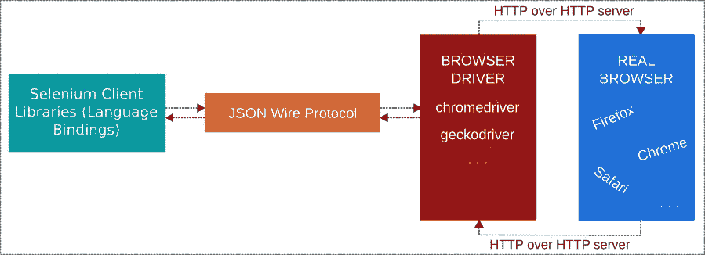
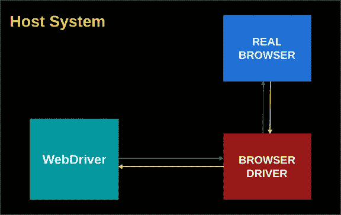
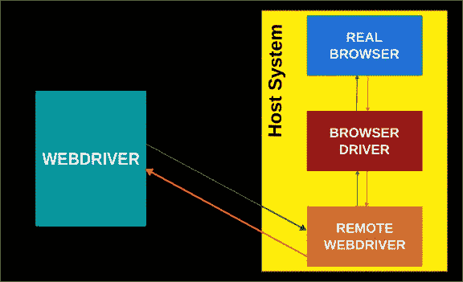
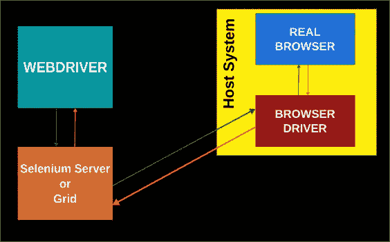

# 使用 Python 和 Selenium 实现浏览器自动化— 3:架构

> 原文：<https://blog.devgenius.io/browser-automation-with-python-and-selenium-3-architecture-fa01f7d0763a?source=collection_archive---------3----------------------->

## 硒应用的鸟瞰图


伦敦经济学院图书馆在 [Unsplash](https://unsplash.com/?utm_source=unsplash&utm_medium=referral&utm_content=creditCopyText) 上拍摄的照片

在[之前的文章](https://codenineeight.medium.com/browser-automation-with-python-and-selenium-2-getting-started-708a6c17f2a3)中，我们看了一个简单完整的例子。在本文中，我将尝试解释 Selenium 应用程序的高级架构。

# 主要构件

*   Selenium 客户端库: Selenium 客户端库或 Selenium 语言绑定允许我们用自己选择的语言编写自动化脚本，如 Python、Ruby、Java 等。
*   **JSON Wire 协议:** JSON Wire 协议是一个基于 REST 的 API，负责 selenium 脚本和浏览器驱动程序之间的通信。
*   **浏览器驱动:** Selenium 脚本通过相关的浏览器驱动与实际浏览器通信。浏览器驱动负责控制真正的浏览器。驱动程序与浏览器运行在同一系统上。由于有了驱动程序，Selenium framework 不需要知道不同 web 浏览器的实现细节。
*   **浏览器:**这些是执行所需自动化任务的实际浏览器。它们从驱动程序接收命令，并调用各自的方法来完成任务。执行命令后，它们通过相同的路由返回响应。



作者用 Inkscape 绘制

# 通信类型

Selenium WebDriver 以两种不同的方式与浏览器对话:直接和远程。

## 1.直接交流

WebDriver 通过驱动程序与浏览器对话。在这种类型的通信中，web 驱动程序、浏览器驱动程序和真正的浏览器在同一个系统上。WebDriver 通过相同的路由传递命令和接收响应。



作者用 Inkscape 绘制

## 2.远程通信

也可以通过 Selenium 服务器或 RemoteWebDriver 进行远程通信。在这种情况下，RemoteWebDriver 与驱动程序和浏览器运行在同一系统上。通过远程 webdriver 发送和接收命令。



作者用 Inkscape 绘制

远程通信的另一种方式是通过 Selenium 服务器或 Selenium 网格组件。它们与主机系统上的浏览器驱动程序对话。



作者用 Inkscape 绘制

如[官方文件](https://www.selenium.dev/documentation/en/webdriver/understanding_the_components/)所述

> " WebDriver 有一个任务并且只有一个任务:通过上面的任何一种方法与浏览器通信."

# 沟通的步骤

```
driver = Chrome()
driver.get("https://www.python.org")
```

**执行上面的代码片段会发生什么？**

*   Selenium WebDriver 首先启动特定于浏览器的服务器。
*   使用 HTTP 上的 JSON Wire 协议创建一个 HTTP 请求并发送给浏览器驱动程序(在本例中为 chromedriver)。
*   浏览器驱动程序接收 HTTP 请求。
*   浏览器驱动程序通过 HTTP 服务器将请求发送给真正的浏览器(Chrome)。
*   该命令在浏览器上执行。
*   浏览器将响应发送回浏览器驱动程序，浏览器最终将响应发送回自动化脚本。

# 通过示例进行更详细的解释

1.  在这一步中，我们将创建一个 Firefox WebDriver 实例。通过这个实例，我们将调用 api 来在真实的浏览器上运行一些操作。

*   Selenium WebDriver 首先启动特定于浏览器的服务器。
*   这通过对`/session` [端点](https://github.com/SeleniumHQ/selenium/wiki/JsonWireProtocol#session)进行`POST`调用来创建一个新会话。
*   这里使用的实际类是[selenium . web driver . Firefox . web driver . web driver](https://github.com/SeleniumHQ/selenium/blob/trunk/py/selenium/webdriver/firefox/webdriver.py)

2.在创建了一个驱动实例之后，我们正在进行`get` api 调用。

*   首先，创建一个 HTTP 请求发送给浏览器驱动程序。
*   浏览器驱动程序(在本例中是 geckodriver)通过 HTTP 服务器接收 HTTP 请求。
*   Selenium WebDriver API 将在 JSON Wire 协议的帮助下，将从语言级绑定中取出的命令发送给浏览器驱动程序。
*   这个`get`方法向`[/session/:sessionId/url](https://github.com/SeleniumHQ/selenium/wiki/JsonWireProtocol#sessionsessionidurl)`端点发出一个`POST`请求，指示浏览器打开给定的 url。
*   浏览器驱动程序通过 HTTP 服务器向真正的浏览器(Firefox)发送请求。
*   浏览器将响应发送到浏览器驱动程序，然后以相同的路线发送到自动化脚本。

3.在这一步中，我们使用 webdriver 接口的`[title](https://github.com/SeleniumHQ/selenium/blob/f8d557d94788ebd12165aa36d2b6122ea0c42d88/py/selenium/webdriver/remote/webdriver.py#L365)`属性查询页面的标题。

*   一个`GET`请求被发送到`[/session/:sessionId/title](https://github.com/SeleniumHQ/selenium/wiki/JsonWireProtocol#sessionsessionidtitle)`端点。

4.最后一步，我们通过调用 webdriver 接口的`[quit](https://github.com/SeleniumHQ/selenium/blob/f8d557d94788ebd12165aa36d2b6122ea0c42d88/py/selenium/webdriver/remote/webdriver.py#L779)`方法退出浏览器。

*   该方法通过第 2 项中提到的步骤向`[/session/:sessionId](https://github.com/SeleniumHQ/selenium/wiki/JsonWireProtocol#sessionsessionid)`端点发出`DELETE`请求。

## 要记住的事情

*   Selenium 客户端库或 Selenium 语言绑定允许我们用不同的语言编写自动化脚本。它们通过使用 JSON Wire 协议的浏览器驱动程序发送命令，在真实的浏览器上执行一些操作。
*   Selenium WebDriver 以两种不同的方式与浏览器对话:直接和远程通信。
*   WebDriver 有一个工作，也只有一个工作:与浏览器通信。

在下一篇文章中，我将讲述如何在网页上定位元素并与之交互。

## 参考

1.  [https://www . selenium . dev/documentation/en/web driver/understanding _ the _ components/](https://www.selenium.dev/documentation/en/webdriver/understanding_the_components/)
2.  [https://www . lambdatest . com/blog/automated-browser-testing-with-opera-and-selenium-in-python/](https://www.lambdatest.com/blog/automated-browser-testing-with-opera-and-selenium-in-python/)
3.  [https://w3c.github.io/webdriver/#endpoints](https://w3c.github.io/webdriver/#endpoints)
4.  [https://artoftesting.com/selenium-webdriver-architecture](https://artoftesting.com/selenium-webdriver-architecture)
5.  [https://www . journal dev . com/25698/selenium-web driver-architecture](https://www.journaldev.com/25698/selenium-webdriver-architecture)
6.  [http://makeseleniumeasy . com/2017/03/03/architecture-of-selenium-web driver/](http://makeseleniumeasy.com/2017/03/03/architecture-of-selenium-webdriver/)

谢谢你的时间。