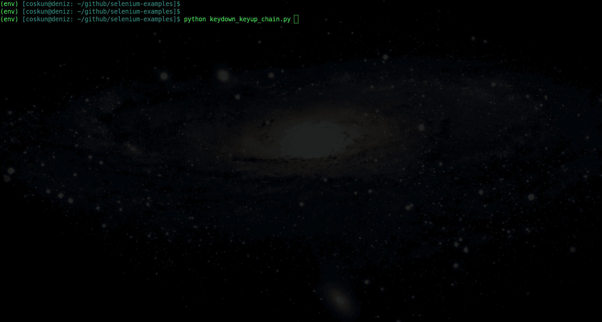

# 使用 Python 和 Selenium 实现浏览器自动化— 7:键盘和动作链

> 原文：<https://blog.devgenius.io/browser-automation-with-python-and-selenium-7-keyboard-and-action-chains-44152348a02c?source=collection_archive---------1----------------------->

## 控制键盘


[张杰](https://unsplash.com/@jay_zhang?utm_source=medium&utm_medium=referral)在 [Unsplash](https://unsplash.com?utm_source=medium&utm_medium=referral) 上的照片

在[之前的文章](http://link_to_post_6)中，我们研究了不同的导航策略。我们将在这篇文章中看到如何控制键盘动作。

Selenium 允许我们模仿键盘上的动作，比如按键，或者清除书写的内容。此外，我们可以使用 CTRL 或 SHIFT 这样的修饰键，在`[ActionChains](https://github.com/SeleniumHQ/selenium/blob/0e0194b0e52a34e7df4b841f1ed74506beea5c3e/py/selenium/webdriver/common/action_chains.py#L30)`类的帮助下执行一些复合/组合按键。

# 动作链

动作链允许诸如鼠标移动、鼠标按钮动作、按键和拖放之类的交互。当您为`ActionChains`对象上的动作调用方法时，这些动作存储在`ActionChains`对象的队列中。当您调用`perform`时，事件按照它们排队的顺序被触发。`ActionChains`可采用连锁模式或逐个排队，然后执行。

对于以下情况

1.  通过传递 WebDriver 实例来创建一个`ActionChains`实例。
2.  一个动作(move_to_element)被添加到菜单元素的动作队列中。
3.  另一个动作(单击)被添加到 hidden_submenu 元素的动作队列中。
4.  当`perform`被调用时，添加到队列中的第一个动作被执行以移动到主菜单。
5.  然后执行添加的第二个动作，单击子菜单元素。

# 键盘

## 发送键

`send_keys`方法在元素中键入一个键序列。修饰键可从`[Keys](https://github.com/SeleniumHQ/selenium/blob/trunk/py/selenium/webdriver/common/keys.py)`类获得。它可以将来自`Keys`类的一个字符串或一个键作为参数。

下面的[示例](https://github.com/coskundeniz/selenium-examples/blob/main/keyboard/sending_keys.py)用“example@somedomain.com”值填充邮件输入字段。

## 向下键

`key_down`用于模拟按下修饰键(Ctrl、Alt、Shift)而不释放。

该示例将以下代码写入文本区域，并使用`CTRL+A`组合选择它。

```
def foo():
    pass
```

## 向上键

`key_up`用于模拟用`key_down`方法按下的修饰键的上键或松键动作。

以下示例在 Google 上搜索“SELENIUM webdriver”。它使用 SHIFT 键将 selenium 写成大写。



执行 keydown_keyup_chain.py

## 清楚的

此方法清除可编辑元素的内容。


执行 clear_content.py

## 要记住的事情

*   Selenium 允许我们模拟键盘动作，比如按键、使用 CTRL、SHIFT 等修饰键或者清除所写的内容。
*   修饰键可以在`ActionChains`类的帮助下使用。
*   您可以通过调用`ActionChains`对象上的`perform`方法来组合多个动作并按顺序运行它们。
*   Selenium Python api 为键盘动作提供了`send_keys`、`key_down`、`key_up`和`clear`方法。

在下一篇文章中，我将讲述浏览器的功能和将选项传递给 webdriver。

## 参考

1.  [https://www . selenium . dev/documentation/en/web driver/keyboard/](https://www.selenium.dev/documentation/en/webdriver/keyboard/)
2.  [https://github . com/selenium HQ/selenium/blob/trunk/py/selenium/web driver/common/action _ chains . py](https://github.com/SeleniumHQ/selenium/blob/trunk/py/selenium/webdriver/common/action_chains.py)
3.  [https://www . software testing material . com/mouse-and-keyboard-interactions-in-selenium-python/](https://www.softwaretestingmaterial.com/mouse-and-keyboard-interactions-in-selenium-python/)
4.  [https://www . geeks forgeeks . org/action-chains-in-selenium-python/](https://www.geeksforgeeks.org/action-chains-in-selenium-python/)

谢谢你的时间。

[](https://medium.com/dev-genius/browser-automation-with-python-and-selenium-5-waits-4b9e4636548c) [## 使用 Python 和 Selenium 实现浏览器自动化— 5:等待

### 确保它在那里

medium.com](https://medium.com/dev-genius/browser-automation-with-python-and-selenium-5-waits-4b9e4636548c) [](https://medium.com/dev-genius/browser-automation-with-python-and-selenium-3-architecture-fa01f7d0763a) [## 使用 Python 和 Selenium 实现浏览器自动化— 3:架构

### 硒应用的鸟瞰图

medium.com](https://medium.com/dev-genius/browser-automation-with-python-and-selenium-3-architecture-fa01f7d0763a) [](https://codenineeight.medium.com/browser-automation-with-python-and-selenium-1-installation-1596d079d4d) [## 使用 Python 和 Selenium 实现浏览器自动化— 1:安装

### 即将开始…

codenineeight.medium.com](https://codenineeight.medium.com/browser-automation-with-python-and-selenium-1-installation-1596d079d4d)