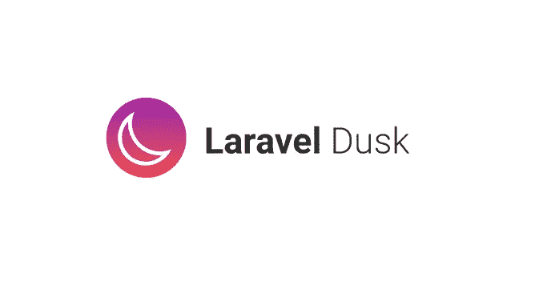

# 用 Laravel Dusk 进行浏览器测试

> 原文：<https://blog.devgenius.io/browser-testing-with-laravel-dusk-aeef2e8b30f8?source=collection_archive---------8----------------------->

## Laravel 从头开始创建管理面板——第 18 部分



通常，后端开发人员使用 PHPUnit 来测试后端功能。默认的 Laravel 支持 [PHPUnit](https://laravel.com/docs/9.x/testing) 。但是我们需要对应用进行端到端的测试，包括前端。为了实现这一点，我们需要使用浏览器测试。Laravel 也支持浏览器测试。

# 拉勒维尔黄昏

Laravel Dusk 是一个 Laravel 包，用于在 Laravel 应用程序上运行浏览器测试。

> 默认情况下，Dusk 不要求您在机器上安装 JDK 或 Selenium。相反，Dusk 使用一个独立的 chrome 驱动程序。但是，您可以随意使用任何其他 Selenium 驱动程序。

## 1.安装 Laravel 黄昏

我们可以使用下面的 composer 命令添加黄昏包。

> 如果您正在手动注册 Dusk 的服务提供者，您不应该在您的生产环境中注册它，因为这样做会导致任意用户能够通过您的应用程序进行身份验证。

```
./vendor/bin/sail composer require --dev laravel/dusk
```


添加包后，我们需要执行`dusk:install` Artisan 命令。

```
./vendor/bin/sail artisan dusk:install
```


这个`dusk:install`命令将在你的项目上创建一个`tests/Browser`目录。示例测试被添加到`ExampleTest.php`文件中。


## 2.URL 设置

在中的`APP_URL`上指定正确的应用程序 URL。环境文件。通常，我们在 sail 中使用本地主机。

```
APP_URL=http://localhost
```

## 3.环境设置

你可以通过在下面的名字上创建一个环境文件来为黄昏创建你自己的环境文件。

在项目的根目录下创建一个`.env.dusk.{environment}`文件。例如，您应该创建一个`.env.dusk.local`文件。

因此，您可以通过使用环境文件来更改用于黄昏测试的数据库。

## 4.运行测试

为了理解黄昏测试，我们将分析并运行现有的`ExampleTest.php`测试。

ExampleTest.php 包含以下代码

```
<?php

namespace Tests\Browser;

use Illuminate\Foundation\Testing\DatabaseMigrations;
use Laravel\Dusk\Browser;
use Tests\DuskTestCase;

class ExampleTest extends DuskTestCase
{
    /**
     * A basic browser test example.
     *
     * @return void
     */
    public function testBasicExample()
    {
        $this->browse(function (Browser $browser) {
            $browser->visit('/')
                    ->assertSee('Laravel');
        });
    }
}
```

`browse`方法将用于创建一个浏览器实例。然后使用 browser `visit`方法导航到应用程序中给定的 URI。

assertSee 是一个[断言方法](https://laravel.com/docs/9.x/dusk#available-assertions),用于检查给定的文本是否出现在页面断言中。

我们可以通过启动 Sail 并运行`dusk`命令来运行 Dusk 测试套件

```
./vendor/bin/sail dusk
```


帆黄昏成功地执行，没有任何错误。

## 5.测试失败

当测试失败时，Dusk 会自动截图并保存到`screenshots`文件夹。

现在，我们将通过将`assertSee`更改为其他文本来使您的测试失败。

```
 public function testBasicExample()
    {
        $this->browse(function (Browser $browser) {
            $browser->visit('/')
                    ->assertSee('Laravel not found');
        });
    }
```

这次`sail dusk`会显示保存在`tests\Browser\screenshots`文件夹中的错误信息和主页截图。


主页的截图


我们了解基本的 Laravel Dusk 测试套件是如何工作的。因此我们可以为零件创建自己的测试。

Laravel 管理面板可在 https://github.com/balajidharma/basic-laravel-admin-panel 的[获得。安装管理面板并分享您的反馈。](https://github.com/balajidharma/basic-laravel-admin-panel)

感谢您的阅读。

敬请关注更多内容！

*跟我来*[***balajidharma.medium.com***](https://balajidharma.medium.com/)。

上一部分—第 17 部分:[如何使用 Laravel Debugbar 调试 Laravel App](/how-to-debug-laravel-app-using-laravel-debugbar-ec51a8587786)

下一部分—第 19 部分:[如何创建自己的 Laravel 包](/how-to-create-your-own-laravel-packages-2b68da22506a)