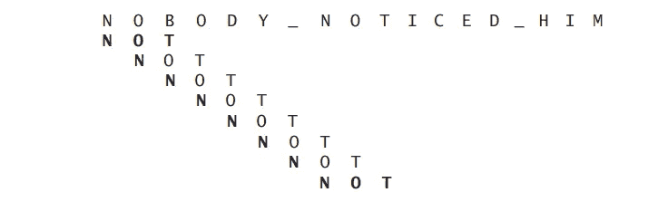

# 算法的强力方法

> 原文：<https://blog.devgenius.io/brute-force-approach-to-algorithms-351dda5e3dc5?source=collection_archive---------0----------------------->

在所有的算法设计策略中，蛮力是最简单的方法，它是实现基本运算的最直接的方法之一。


只是引用一句话，做好一件事在我看来往往是有回报的:)

> ”*“就这么办吧！“可以用另一种方式来描述强力方法的处方*”，Anany Levitin 在他的名为**的书《算法的设计和分析**》中这样说道。

1.  由于这种策略思想的简单性，蛮力可以应用于各种各样的问题，而大多数算法策略则以更具体的方式应用于问题。
2.  效率相当低。即便如此，它对于解决小规模的问题仍然很有用。
3.  如果一个问题只有几个实例需要解决，强力可能会有用，而不是设计一个复杂而昂贵的算法。

让我们把理论放在一边，用一个例子来考虑这个策略。

## **寻找配对问题**

这是一个非常著名的初学者问题，假设我们有一个数组，

int[] arr = {12，-1，5，8，3}带 5 个整数。

我们想找到一个和等于 17 的对。

```
public static void main(String[] args) { 

        int[] arr = {12, -1, 5, 8, 3}; 
        int target = 17; 

        for (int i = 0; i < arr.length; i++) { 

            for (int j = i+1; j < arr.length ; j++) { 
                if (arr[i] + arr[j] == target) { 
                    break; 
                }
            }
        }
        System.out.println("first index:" + i +".element = "+ arr[i]);
        System.out.println("second index:" + j +".element = "+ arr[j]);
}
```

这段代码是暴力破解的一个很好的例子。因为在寻找目标对的同时，这个算法需要 ***检查我们数组中每一个可能的对*** 。因此我们的时间复杂度是 O(n ) 。

## **更省时的方法**

```
public static void main(String[] args) { 

    int[] arr = {12, -1, 5, 8, 3}; 
    Arrays.sort(arr); 
    int target = 17; 

    for (int i = 0; i < arr.length; i++) { 
        int j = Arrays.binarySearch(arr, target - arr[i]); 
        if (j >= 0) { 
            break; 
        } 
    } 
    System.out.println("first index:" + i +".element = "+ arr[i]);
    System.out.println("second index:" + j +".element = "+ arr[j]);
}
```

这里我们使用了数组。BinarySearch 方法找到满足我们目标的一对数字。正如我们所看到的，只有一个循环来执行我们的基本操作(寻找配对)。

**注意:**循环次数少并不总是意味着更快，但这次很明显。

这个策略带给我们的是 **O(n*logn)** 时间复杂度，比 **O(n)略快。**

## 强力字符串匹配


暴力字符串匹配的伪代码

正如我们从上面给出的伪代码中看到的，这种方法通过从头到尾进行比较来测试要与包含所需单词的数组进行比较的数组。

时间复杂度= **O(n*m)** (m 是我们想要的单词的长度，n 是我们数组的长度)



这个算法如何执行的例子

你看到问题了吗？

是的。该算法将单词与整个数组进行比较，而不管它的第一个字母是什么。这是一种耗时的方式，但不是最糟糕的。

可以通过使用不同的方法(数组方法、字符串解析器等)来解决这个问题。)以便更快地达到目标。

## 快速小结

强力方法依赖于测试每一种可能性，以确保期望输出的真实性。因此，这使得算法相当慢。此外，蛮力方法可以应用于各种各样的问题。

**一些暴力破解算法的例子，**

选择排序，冒泡排序，顺序搜索，最接近对问题，凸壳问题，深度优先搜索，广度优先搜索，等等…

***注:*** DFS 和 BFS 算法都是穷举搜索的例子。穷举搜索是一种简单的组合问题的强力方法。

*参考文献:*

> **算法的设计与分析第三版，Anany Levitin**
> 
> [https://www.quora.com/What-is-the-brute-force-method](https://www.quora.com/What-is-the-brute-force-method)