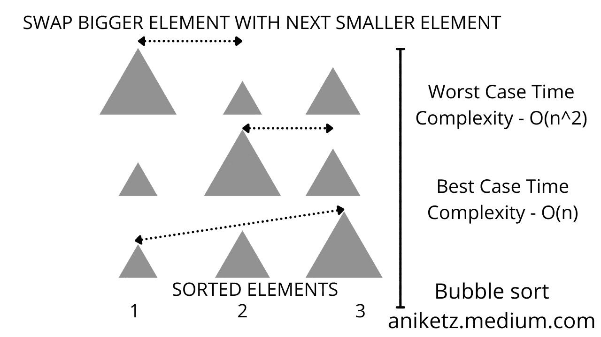

# 简单解释了冒泡排序

> 原文：<https://blog.devgenius.io/bubble-sort-explained-in-nutshell-ab000caa4f6d?source=collection_archive---------12----------------------->

## 使用冒泡排序对元素进行排序



图片来自作者: [Aniket](https://medium.com/u/63e8b30e596f?source=post_page-----ab000caa4f6d--------------------------------)

## 为什么叫冒泡排序

传统上，气泡排序得名于气泡从水底升起的现象。因此，通过不断地与下一个元素进行比较，更高的值从一端上升到另一端。

在 C++ 11 引入 sort 函数对时间复杂度为 O(N log N)的数组和向量进行排序的现代世界，程序员经常忘记阅读基本的排序技巧，完全依赖 sort()函数。但是老实说，这是一个非常错误的做法。在使用快捷方式之前，我们应该总是清除我们的基础。

让我们编写冒泡排序代码，并了解它的工作原理。假设你有一个数组 a[4]={4，3，1，2}你应该如何对数组中的元素进行排序？

```
The most common and useful approach is to use sort(a.begin(),a.end()); in c++
But what if you want to build your own sorting mechanism from scratch or what if you are not allowed to use sort function by your interviewer?
Hence, bubble sort comes into the game. Think of sorting 4,3,1,2 
Step one - Select first element compare it with its next element and if Selected Element larger than the next element that swap them with each other. Congratulations! you just learned bubble sort. Isn't it easy. Approach- Swap two elements if they are in wrong orderLet's DRY RUN OUR APPROACH elements- 4, 3, 1, 2     // select first element 4 and comparing it with its next element and swap if order is incorrect SWAP 1
4 3 1 2
3 4 1 2  // Now compare 4 with its next element 1 and swap it
3 1 4 2  // SWAP 4 with 2
3 1 2 4 Wait is our elements sorted? NO 
We need to do apply same approach for other elements too. 
Hence we can observe that we compared one element with all its next n elements and we will do the same comparison for all its next elements. Hence, we get time complexity as O(n*n)= O(n^2)**CODE- considering the array a[n] with size n;**for(int i=0;i<n-1;i++)
{
  for(int j=1;j<n-i-1;j++)
      {
         if(a[j] > a[j+1])
            {
              int temp = a[j];   //SWAP the two elements
              a[j] = a[j+1];
              a[j+1] = temp;
            }
       }
}
```

最后，现在你知道冒泡排序是如何工作的了。一定要用你选择的任何语言来表达，如果你有任何困难，请告诉我。

另外，请注意，还有其他比冒泡排序更有效的排序技术，但是了解每个概念同样重要。

**祝你的编程之旅好运，继续编程……**

[](https://aniketz.medium.com/membership) [## 通过我的推荐链接加入 Medium-Aniket

### 作为一个媒体会员，你的会员费的一部分会给你阅读的作家，你可以完全接触到每一个故事…

aniketz.medium.com](https://aniketz.medium.com/membership) [](https://javascript.plainenglish.io/3-books-every-programmer-should-read-97ac12422cfb) [## 每个程序员都应该读的 3 本书

### 帮助我理解编程基础的书籍。

javascript.plainenglish.io](https://javascript.plainenglish.io/3-books-every-programmer-should-read-97ac12422cfb) [](https://javascript.plainenglish.io/top-10-programming-languages-of-2021-d2d48c634ae7) [## 2021 年十大编程语言

### 你是使用顶级编程语言的用户之一吗？

javascript.plainenglish.io](https://javascript.plainenglish.io/top-10-programming-languages-of-2021-d2d48c634ae7)