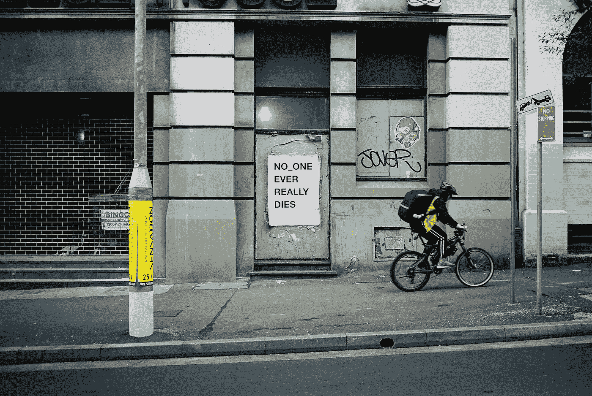

# Buefy —开关和标签输入

> 原文：<https://blog.devgenius.io/buefy-switch-and-tags-input-102381938baa?source=collection_archive---------1----------------------->



Joel Stylis 在 [Unsplash](https://unsplash.com?utm_source=medium&utm_medium=referral) 上拍摄的照片

Buefy 是一个基于布尔玛的 UI 框架。

在本文中，我们将了解如何在我们的 Vue 应用程序中使用 Buefy。

# 转换

Buefy 提供了一个开关组件供我们使用。

例如，我们可以写:

```
<template>
  <section>
    <div class="field">
      <b-switch>Default</b-switch>
    </div>
  </section>
</template><script>
export default {
  data() {
    return {};
  }
};
</script>
```

我们可以将该值与`v-model`绑定:

```
<template>
  <section>
    <div class="field">
      <b-switch v-model="isSwitched">{{ isSwitched }}</b-switch>
    </div>
  </section>
</template><script>
export default {
  data() {
    return { isSwitched: false };
  }
};
</script>
```

`type`道具让我们改变风格:

```
<template>
  <section>
    <div class="field">
      <b-switch v-model="isSwitched" type="is-success">{{ isSwitched }}</b-switch>
    </div>
  </section>
</template><script>
export default {
  data() {
    return { isSwitched: false };
  }
};
</script>
```

`size`道具改变大小:

```
<template>
  <section>
    <div class="field">
      <b-switch v-model="isSwitched" size="is-large">{{ isSwitched }}</b-switch>
    </div>
  </section>
</template><script>
export default {
  data() {
    return { isSwitched: false };
  }
};
</script>
```

此外，我们可以将`rounded`道具设置为`false`，使其呈方形:

```
<template>
  <section>
    <div class="field">
      <b-switch v-model="isSwitched" :rounded="false">{{ isSwitched }}</b-switch>
    </div>
  </section>
</template><script>
export default {
  data() {
    return { isSwitched: false };
  }
};
</script>
```

`outlined`道具让它轮廓分明:

```
<template>
  <section>
    <div class="field">
      <b-switch v-model="isSwitched" outlined>{{ isSwitched }}</b-switch>
    </div>
  </section>
</template><script>
export default {
  data() {
    return { isSwitched: false };
  }
};
</script>
```

# 标签输入

我们可以用`b-taginput`组件添加标签输入。

例如，我们可以写:

```
<template>
  <section>
    <div class="field">
      <b-taginput v-model="tags" ellipsis placeholder="Add a tag"></b-taginput>
      {{tags}}
    </div>
  </section>
</template><script>
export default {
  data() {
    return { tags: [] };
  }
};
</script>
```

我们用`v-model`将输入的标签绑定到一个字符串数组。

`ellipsis`截断长标记文本，并在其后添加省略号。

# 自动完成

我们可以添加`autocomplete`属性来添加自动完成值:

```
<template>
  <section>
    <div class="field">
      <b-taginput v-model="tags" :data="filteredTags" autocomplete placeholder="Add a tag"></b-taginput>
      {{tags}}
    </div>
  </section>
</template><script>
export default {
  data() {
    return { tags: [], filteredTags: ["foo", "bar", "baz"] };
  }
};
</script>
```

`data`有一个我们可以从中选择的字符串数组。

`autocomplete`启用自动完成下拉菜单。

# 模板化自动完成

我们可以填充默认槽来更改 autocomplete 控件的模板:

```
<template>
  <section>
    <div class="field">
      <b-taginput v-model="tags" :data="filteredTags" autocomplete placeholder="Add a tag">
        <template slot-scope="props">
          <strong>{{props.option}}</strong>
        </template>
        <template slot="empty">There are no items</template>
      </b-taginput>
      {{tags}}
    </div>
  </section>
</template><script>
export default {
  data() {
    return { tags: [], filteredTags: ["foo", "bar", "baz"] };
  }
};
</script>
```

`props.option`有我们可以选择的项目。

# 自定义选定的项目

我们可以通过填充`selected`插槽来定制所选项目:

```
<template>
  <section>
    <div class="field">
      <b-taginput
        ref="tagInput"
        v-model="tags"
        :data="filteredTags"
        autocomplete
        placeholder="Add a tag"
      >
        <template slot="selected" slot-scope="props">
          <b-tag
            v-for="(tag, index) in props.tags"
            :key="index"
            type="is-success"
            rounded
            :tabstop="false"
            ellipsis
            closable
            @close="$refs.tagInput.removeTag(index, $event)"
          >{{tag}}</b-tag>
        </template>
      </b-taginput>
      {{tags}}
    </div>
  </section>
</template><script>
export default {
  data() {
    return { tags: [], filteredTags: ["foo", "bar", "baz"] };
  }
};
</script>
```

我们设置`type`来改变样式。

`is-success`使标签变成绿色。

`closable`显示关闭按钮，我们可以将其移除。

`b-tag`发出`close`事件，这样我们可以在单击关闭按钮时删除条目。

# 结论

我们可以用 Buefy 添加开关和标记输入。