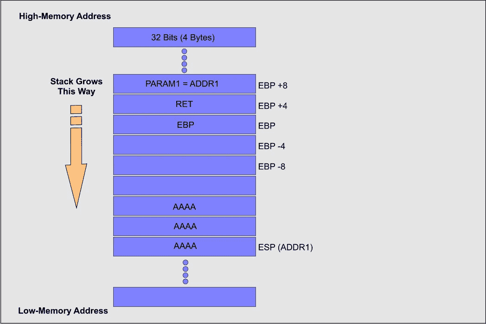

# 缓冲区溢出教程(第 1 部分)

> 原文：<https://blog.devgenius.io/buffer-overflow-tutorial-part1-efc6b9f3e4ee?source=collection_archive---------1----------------------->

安加德·辛格·www.officialhacker.com

缓冲区是存储信息的临时区域。当程序或框架进程放入更多的信息时，额外的信息就会泛滥。它使一部分信息泄漏到不同的缓冲区，这些缓冲区可能会退化或覆盖它们保存的任何信息。在缓冲区溢出攻击中，附加信息有时包含黑客或恶意用户提议的活动的明确准则；例如，数据可能引发损害文档、更改信息或泄露私人数据的反应。

缓冲区溢出很可能是最常见的软件安全漏洞。大多数编程设计者都意识到缓冲区溢出漏洞是什么，但是针对继承和最近创建的应用程序的缓冲区溢出攻击仍然无处不在。这个问题的一部分是因为缓冲区溢出可能发生的方式多种多样，另一部分是因为经常用来防止缓冲区溢出的容易出错的技术。很难发现缓冲区溢出，尽管如此，当您检测到一个缓冲区溢出时，通常很难利用它。尽管如此，攻击者已经找到了如何在数量惊人的产品和组件中识别缓冲区溢出的方法。

# 1 — **理解记忆**

为了完全理解缓冲区溢出攻击是如何工作的，我们必须理解信息内存在一个进程中是如何组织的。当程序运行时，它需要内存空间来存储信息。假设主机框架利用虚拟存储器组件，进程虚拟地址空间分成至少三个存储器部分。

1.*【文本】*段，是内存的只读部分，用于在运行时保持程序的代码。

2.*“数据”*段，这是一个进程可以额外写入信息的不同内存位置。如果信息访问这个区域，数据段将被放在一个比文本段交替的内存页上。

3.最后是 *"Stack"* 部分，它是赋予操作框架的内存的一部分。它用于存储函数内部定义的局部变量或与系统调用相关的信息。

将最初的两个内存部分分开，我们将讨论堆栈，因为它是发生缓冲区溢出的地方。

如前所述，名为*“Stack”*的内存是程序存储其参数、局部变量和一些控制程序执行流的信息的地方。在 PC 体系结构中，存储在堆栈中的每个数据都调整为 4 字节长的倍数。在 Intel 32 位架构上，四字节长的信息被称为*【双字】*或*【dword】*Linux 操作框架上的栈从高内存地址开始，发展到低内存地址。此外，英特尔 x86 上的内存遵循 little-endian 惯例，因此最低有效字节值存储在低内存地址，其他字节按照重要性递增的顺序存储。我们可以说，内存是由低内存地址到高内存地址组成的。

*“堆栈”*据称是其名为后进先出(L.I.F.O)的库存策略的结果。这意味着最后一个存放在内存中的*【dword】*将首先被检索。堆栈中允许的活动是 PUSH 和 POP。利用 PUSH 将一个*【dword】*信息嵌入到*【Stack】*中，POP 通过*【Stack】检索最后一个*【dword】*。*调用函数使用*“堆栈”*为被调用函数传递参数。对于每个函数调用，制定一个*【堆栈】*框架，以包含以下内容:

1.函数参数。

2.返回地址—用于存储函数返回后调用的下一条指令的内存地址。

3.帧指针——用于获取对当前*“堆栈”*帧的引用，并授予它们进入局部变量和函数参数的权限。

4.和函数的局部变量。

在 x86 位架构中，至少有三个进程注册表可能成为最关键的因素，其中包括*“堆栈”*；那些是“EIP”、“EBP”、“T27”和“超感官知觉”“EIP”代表扩展指令指针，它是一个只读寄存器，它包含程序上要读取的后续指令的位置。它始终指向*“程序代码”*内存部分。*【EBP】*代表扩展基栈指针，其动机是指向*栈的基位置*和*“ESP”*代表扩展堆栈指针；该寄存器旨在告诉您在*【堆栈】*中的位置。这意味着*“ESP”*始终标记着*堆栈的最高点*

*《EBP》意义重大，因为它在记忆中给了一个停留点，我们可以有很多东西参照那个价值。当函数在程序内部被调用时，我们有几个参数发送给它，内存中的位置被*【EBP】*连续引用，就像局部变量一样，如下图所示。*

**

*我们知道，内存是由低内存地址到高内存地址组成的。假设我们发送一个由 12 个*“A”*字符组成的字符串。内存将如下图所示:*

**

*当分析此图像时，我们看到 *"PARAM1"* 指向保存在*" Stack "*中的信息的位置，正如我们可能知道的那样 *"ESP"* 聚焦到堆栈的顶部，因此字符串从 *"ADDR1"* 4 字节一个接一个地复制到更高的内存中，这是因为这是留在 *"Stack 中的最佳方式。*万一该函数在将信息组合到*【堆栈】*上之前没有控制缓冲区的长度，并且我们发送了大量的*【A】*字符，我们可能会以如下图所示的情况结束。*

**

*万一*“EIP”*寄存器被*“A”*字符覆盖，此时，您修改地址以返回执行以下指令。当*【EIP】*被*【噪音】*覆盖时，你会得到一个豁免，程序会停止。*

*在接下来的部分中，我们将向您展示并解释如何执行缓冲区溢出攻击并危害目标计算机。*

*[缓冲区溢出教程(第一部分)](https://medium.com/@nuriddin.artykow/buffer-overflow-tutorial-part1-efc6b9f3e4ee)*

*[缓冲区溢出教程(第二部分)](https://medium.com/@nuriddin.artykow/buffer-overflow-tutorial-part2-c21c6de5c11c)*

*[缓冲区溢出教程(第三部分)](https://medium.com/@nuriddin.artykow/buffer-overflow-tutorial-part3-98ab394073e3)*

*[缓冲区溢出教程(第四部分)](https://medium.com/dev-genius/buffer-overflow-tutorial-part4-1e80e90a2f03)*