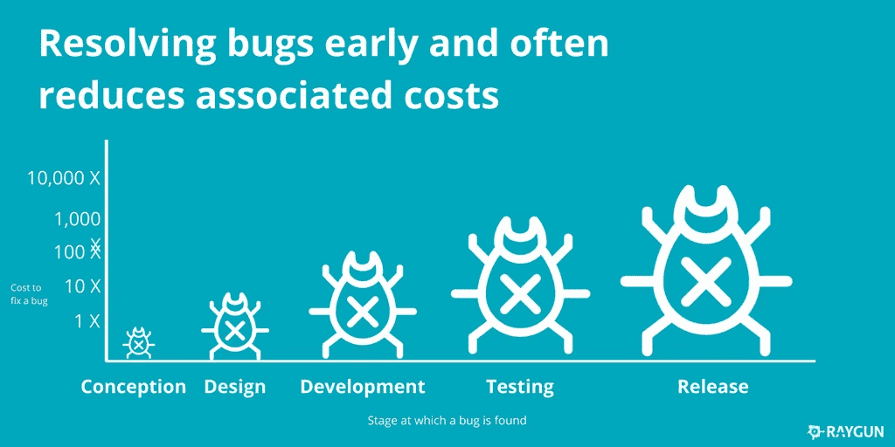

# 缺陷与特性

> 原文：<https://blog.devgenius.io/bugs-vs-features-189ebb9f0e26?source=collection_archive---------1----------------------->

## 两者都是我们的创造，但是为什么我们讨厌虫子呢？

[图片由来自 Pixabay 的克里斯蒂安·瓦兹奎拍摄](https://pixabay.com/users/Cristiandel76-9364024/?utm_source=link-attribution&amp;utm_medium=referral&amp;utm_campaign=image&amp;utm_content=3626231)

> **软件错误**是计算机程序或系统中的错误、缺陷或故障，导致其产生不正确或意想不到的结果，或以意想不到的方式运行。
> [维基百科](https://en.wikipedia.org/wiki/Software_bug)

除了特性之外，软件缺陷并不存在于软件中，当我们(开发人员)创建一个缺陷时，我们试图给我们的系统添加一个新的特性或者修复另一个缺陷。它们是我们的创造，不同的是，当我们注意到它们时，我们会感到羞耻。

我在问自己产生 bug 的过程是什么，它们的原因和结果是什么？。

## 错误的原因

我确信代码中发生的一切都是现实世界中发生的事情的反映。在我的职业生涯中，我已经在我创建的所有软件中引入了大量的错误。我为什么要创造那些虫子？

*   我不太明白利益相关者想要创建什么样的 PO。
*   我测试的不够。
*   太多假设没有得到验证。
*   我没有足够的领域知识，所以我的代码没有涵盖所有的场景。
*   意外的复杂，我不得不改变的代码对我不利。

现在我认为 bug 实际上是代码的尖叫，试图告诉我“你做错了”。请改变你的方法，否则你会遇到更多这样的问题。难的是理解我做错了什么？。

在我的最后几年里，我试图回答这个问题，也许这是软件中最难回答的问题之一。因为软件更多的是与人和他们的关系相关，而不是技术技能。

bug 就像代码的味道，它们只是提醒我们可能有问题。我们的工作是倾听他们来解决我们真正的问题。

## 如何修复一个 bug？

当开发人员不得不修复产品中发现的 bug 时，他们通常会感到焦虑。如果在开发过程中发现了 bug，焦虑就会减少，因为 bug 的成本更低。

[一个 bug 的成本是多少？](https://azevedorafaela.com/2018/04/27/what-is-the-cost-of-a-bug/)

正如我之前所说，我们的代码是我们现实的反映，那么焦虑是如何反映在代码中的呢？。

*   没有创建测试来避免再次出现错误。
*   没有人检查用来修复 bug 的代码。

我们没有考虑我们行为的后果，因为我们的情绪控制着我们。我们承担的风险可能是:

*   将技术债务添加到我们的代码中。
*   引入新的错误，比我们试图解决的错误花费更多。

避免这些问题的答案是，我们需要学会管理焦虑。理解我们的决定并采取正确的行动来避免更大的问题，错误只是让我们看到我们的错误。这并不意味着 bug 会在生产中持续一周，因为你想重构有问题的代码。
这意味着一旦你创建了测试来修复你的 bug，并且你确定它如预期的那样工作，你就部署它(焦虑现在变得更慢了)，然后你开始修复真正的问题(这一部分不能被忘记)。

## 什么时候修复 bug？

我会回答当你发现它时，你必须修复它([零缺陷政策](https://sookocheff.com/post/process/zero-bug-policy/))。当你的应用被控制时，这种方法是很好的，但是如果你有大量的 bug，你需要在这些 bug 和新特性之间找到一个平衡点。我并不是说这是最好的方法，但是你需要和公司里占用你时间的势力斗争。

我记得有一个项目有很多 bug。当一个新经理来解决这种情况时，他决定停止添加新功能，集中精力解决我们团队的问题。我们为此工作了四个月。这个决定解决了大部分问题，使产品变得可行，但他个人为此付出了巨大的代价。尽管他能够解决这个问题，但利益相关者的压力迫使他退出。

## 我们需要避免 bug 吗？

虫子是好的，因为它们告诉我们，我们需要修复一些东西，我们需要虫子来生长。这里的要点是尽早发现错误，从而减少错误决策，降低成本。我们可以尝试提高我们的技能，改变我们的工作方式(TDD、结对、CI/CD 等)，从而改变我们与团队同事互动的方式。

遵循帕累托法则，80%的错误来自于 20%的代码。哪些是不重构代码的原因？。

*   筒仓，除了一两个人没有人知道代码。他们没有时间去修复它们或者传播知识。
*   糟糕代码，没有人理解它，没有对代码的测试。这可能是因为当代码被创建时，团队没有足够的知识来做得更好。害怕改代码。
*   缺乏商业知识。
*   产品压力，我们需要创造越来越多的功能，尽管这些功能给公司的钱比防止新的错误少。
*   没有办法改变的事情，太严格的流程。这也和现状有关。
*   其他…

你也可以看到问题中你没有考虑到的部分。所以你没有解决整个问题，只是换了一个更简单的问题。大多数时候，当我们试图创建大的功能来解决问题时，我们会引入新的错误。简化功能是一种解决方案，但也需要不断迭代以降低风险:

> 对于每个想要的改变，让改变变得容易(警告:这可能很难)，然后让改变变得容易。
> 肯特·贝克

## 技术债务

反之亦然，你的代码反映在你的组织中。你的工作方式，团队的习惯等等。

科技债也是一个像 bug 一样时不时出现的问题。这就像你有一块布满地雷的田地，在一段时间内你知道地雷在哪里，但如果你继续添加越来越多的地雷，你就会失去控制。所以下一次你不得不在雷区行走时，你需要花很长时间才不会踩到地雷。

修改代码的困难反映在避免地雷的[会议](https://medium.com/dev-genius/its-the-coordination-stupid-f3581bbf25cd?source=friends_link&sk=644c395aad2747e8409c2f81d5917897)中，反映在试图避免与越来越拖慢你的团队的[官僚主义](https://medium.com/dev-genius/do-you-trust-me-19f411708e4d)一起犯错中。您还将看到，将会创建一个专家小组来决定架构。
通常我会想，我们的过程是在帮助我们，还是只是把我们越推越远。这就是为什么最好开始在您的组织中推行包括作为一等公民的质量的[流程，](https://medium.com/dev-genius/quality-vs-speed-9a46a6254a4e?source=friends_link&sk=001e5f300ca6a77c86bfc03f923052d4)因为这将反映在准则中。

在这种情况下，偿还债务是解决办法，但问题还是出在机构身上，因为他们**不了解问题**。