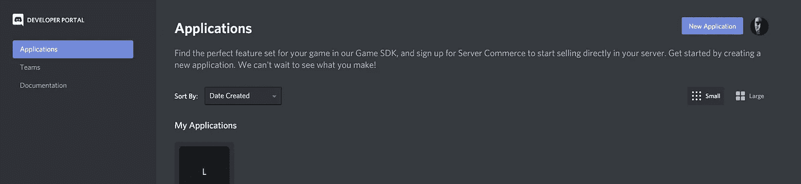
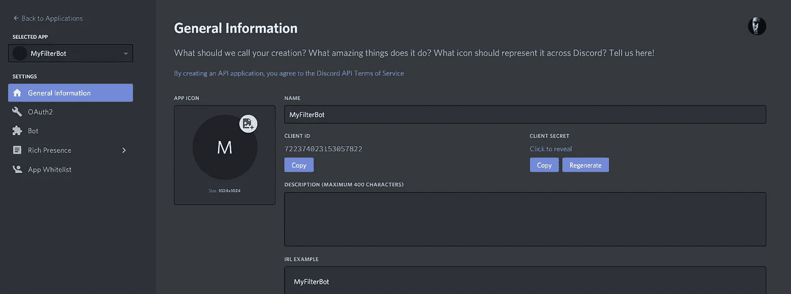
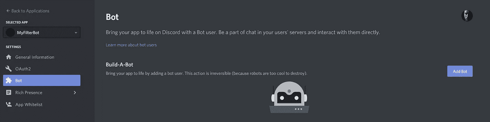
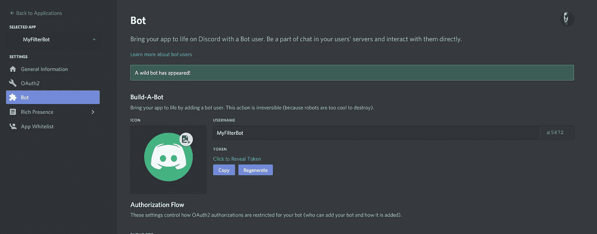
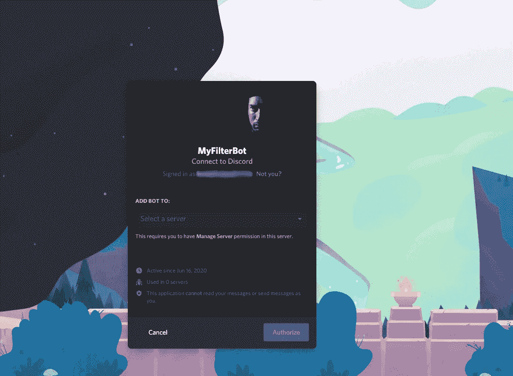

# 用 Node.js 构建一个 Discord bot

> 原文：<https://blog.devgenius.io/build-a-discord-bot-with-node-js-6c3040b7051?source=collection_archive---------11----------------------->


马克·努尔曼在 [Unsplash](https://unsplash.com?utm_source=medium&utm_medium=referral) 上的照片

所以，你已经有了这个不和谐的服务器，它的地方。唯一的问题是，一些用户变得有点吵闹或粗鲁，您需要一种方法来帮助管理这种情况，而不必全天候坐在那里监视它。

你需要一个机器人来帮忙。当然，有一些地方可以获得预建的机器人，但就你对它的控制而言，没有什么比构建自己的机器人更好的了。更不用说能够在这三个法则中编程并帮助防止机器人犯罪。

太好了。已经决定了。让我们建造一个不会接管宇宙的机器人…只是你的不和谐服务器。

我们将使用 Node.js，现在我们将看看如何设置基础知识来制作一个功能性机器人。在我们启动并运行后，我们将添加很酷的“接管您的服务器”代码。

# 注册不和谐的应用程序

在我们做任何事情之前，我们需要访问 Discord 开发者门户，并告诉它我们伟大的新机器人。

你可以在这里进入开发者门户:【https://discord.com/developers/applications 

在那里，用你的 discord 帐户登录后，你需要点击新建应用程序按钮，并给你的应用程序起一个名字。



Discord 开发者门户。点按“新应用程序”以注册新应用程序。

接下来，您将进入应用程序设置屏幕。



不和谐应用程序设置

你可以为你的应用上传个人资料图片，还可以添加描述。我们将需要此处显示的客户端 ID，因此单击其下的复制按钮。但是首先…

点击左侧的**机器人**菜单。我们需要通过创建一个机器人用户来告诉 Discord 我们的应用程序将有一个机器人。这将允许应用程序与文本消息和任何您希望它能够与之交互的内容进行交互。



添加 bot 用户。

单击添加机器人并接受条款。

万岁。一个野生机器人出现了。



我们的新机器人用户。

确保您设置的用户名有意义。它将显示在您的服务器与这个用户名。

我们将很快需要这个令牌，但在此之前，我们需要使用之前的客户端令牌授权新的应用程序。要做到这一点，我们需要去另一个不和谐的网址:[https://discord.com/oauth2/authorize?client_id=<把你的应用客户端 id 放在这里> & scope=bot](https://discord.com/oauth2/authorize?client_id=722374023153057822&scope=bot)

将`<put your app client id here>`替换为我们之前复制的应用程序本身的客户端 id，然后将其粘贴到一个新的浏览器选项卡中。确保你已经登录，选择这个机器人将被授权的服务器，然后点击那个按钮。



授权我们的应用程序。

即授权按钮。

一旦完成，如果你进入不和谐并打开你的服务器，你应该看到机器人作为一个用户和离线。

在这一点上，我强烈建议您设置一个合适的角色和权限来做您希望它能够做的事情。这取决于你，因为它非常依赖于你的服务器设置。

但是机器人离线了…我们如何解决这个问题？

# 到编码上

为了让机器人在您的服务器上真实存在，我们需要编写一些 Node.js 代码来让它活起来。

在你系统的某个地方创建一个文件夹，给它起个超级有创意的名字，比如 DiscordBot 或者 MyAwesomeBot……这由你决定。

在文件夹中创建一个名为 *config.json* 的文件

该文件将包含我们之前设置的应用程序中的 bot 令牌，因此返回到该文件并导航到 bot 菜单，从那里复制令牌，以便我们可以像这样将其添加到我们的配置文件中。

```
{
  "token"  : "thisisverymuchafaketoken.please.donotusethistokeninyourapp!",
  "prefix" : "+"
}
```

正如您所看到的，这是一个简单的 json 文件，它包含 bot 用户的令牌，以及一个前缀，我们将在代码中使用它来标识 bot 的命令。

让我们也创建一个 JavaScript 文件，名为: *bot.js*

首先加载 Discord 库。

```
const Discord = require("discord.js");
```

我们将使用版本 12，但我们不需要在这里指定。

接下来，我们需要使用这个库创建一个 Discord 客户机，并加载我们刚才创建的 json 配置文件。

```
const client = new Discord.Client();
const config = require("./config.json");
// config.token contains the bot's token
// config.prefix contains the message prefix.
```

我们将能够使用 config.token 和 config.prefix 从配置文件中访问这些值。

接下来，我们需要处理“就绪”事件。该功能将在 bot 启动并成功登录时运行。我们将使用它向控制台记录一条成功消息，并设置针对 bot 用户显示的活动。

```
client.on("ready", () => {
  // If the bot starts and logs in.
  console.log('Bot has started');
  client.user.setActivity('Totally not plotting world domination');
});
```

正如你所看到的，我们将显示在机器人名称下的活动设置为“完全没有策划世界统治”。你可以把你想要的放在这里，或者作为额外的奖励，从你定义的活动列表中随机选择。

现在，我们通过处理“消息”事件来处理这个非常简单的机器人。每当机器人看到消息时，无论是来自通道还是 DM，都会发生这种情况。

```
client.on("message", async message => {
```

我们将从忽略其他机器人开始，包括它自己。这不仅有助于阻止他们合谋启动 robopocalypse，而且也不会最终自说自话并完全劫持频道。

```
if(message.author.bot) 
   return;
```

现在，我们还将告诉它忽略不以我们在配置文件中设置的前缀开头的任何内容。这就是我们将如何向机器人发送命令，也意味着它不会(还)窃听一切。

```
if(!message.content.startsWith(config.prefix)) 
   return;
```

这将意味着我们的机器人将忽略不以 **+** *(或任何您设置的前缀)*开头的任何内容。

接下来，因为我们忽略了没有前缀的内容。让我们将截获的消息分成命令和参数。

```
const args = message.content.slice(config.prefix.length).trim().split(/ +/g);const command = args.shift().toLowerCase();
```

所以，如果我们发送一条消息，比如:*+向世界问好！*

那么在这一点上，命令将是:+say，args 将是一个包含每个单词的数组。['你好'，'世界！']

到目前为止，我们还没有取得很大的成就，所以让我们在这里添加一些处理来处理接收到的命令。如果我们回到我上面提到的+say 命令，让我们实现机器人，告诉它要做什么。

```
if(command === "say") {
    /* To get the message for the bot to send, we will join the `args` back into a string with spaces: */
    const sayMessage = args.join(" "); // Then delete the command message from the user that sent it
    message.delete().catch(O_o=>{});    // And we get the bot to say the thing: 
    message.channel.send(sayMessage);
}
```

我们将忽略该命令，并将所有“参数”连接回一个字符串。在上面的例子中，我们将得到“Hello World！”作为信息。

接下来，我们删除发送命令的用户的消息，这样就没有人看到它了。哈哈哈哈。

那我们就让机器人发送信息。

现在关闭消息处理函数。

```
});
```

最后但同样重要的是(对于代码)。我们会告诉机器人登录到 Discord。

```
// Login to discord with the secret bot user token
client.login(config.token);
```

下面是一个有代码的 gist:[https://gist . github . com/apoc survivor/c5ca 606952 e 89069 d0d 596 e 265 ACB 3 ff](https://gist.github.com/apocsurvivor/c5ca606952e89069d0d596e265acb3ff)

# 运行机器人

在我们运行这个机器人之前，还需要做几件事情。

在我们放了代码的文件夹里打开一个终端。我们需要创建 Node.js project.json 并下载所需的依赖项。

运行命令:

***npm init -y***

这应该会以正确的格式创建一个 project.json。您可以根据需要继续编辑该文件，将您添加为作者，设置版本号等。

接下来，我们需要安装我们首先包含在代码中的 discord 库。确保您已经保存了对 project.json 的任何更改，运行以下命令:

***npm 安装不协调-保存***

这应该会安装 discord 库。如果没有错误，那么您可以继续运行您的 bot，方法是运行:

***节点 bot.js***

你应该看到一个确认信息记录在终端上，如果你看起来不协调，机器人应该显示为在线，带有一个活动标签“完全没有策划世界统治”或你设置的任何东西。

如果一切正常，通过向它发送命令来测试它:

```
+say Hello World!
```

如果一切按计划进行，你的信息应该消失，机器人应该说“你好，世界！”

如果您的消息没有消失，请确保 bot 用户拥有删除消息的角色集和权限。

# 下一步是什么？

下一次，我们将着眼于扩展这个机器人来检测我们不想使用的语言，以便它可以帮助保持频道中的文明交谈。如果你有任何其他建议，请随时告诉我。我们可能还会添加一些更有趣的小东西。

当然，您可以从这里开始，按照您认为合适的方式为您的机器人实现您想要的特性。