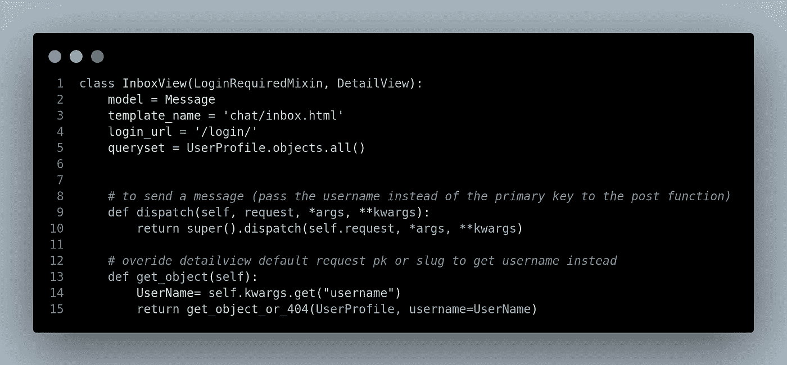

# Django 聊天应用程序(无 Django 频道)

> 原文：<https://blog.devgenius.io/build-a-django-chat-app-without-django-channels-ef31838de64a?source=collection_archive---------1----------------------->

有没有想过 Django 聊天应用程序会是什么样子，而不会看起来不和谐或松弛？不要再看了！这篇文章是关于将这种想法变成现实的。


我假设您已经掌握了一些 python 和 python Django 的知识。如果你想修改模板，你可能需要一些顺风知识。

# 创建您的项目

创建一个名为`**chat_django**` 的文件夹，并导航到该文件夹。

```
mkdir chat_django && cd chat_django
```

对于这个项目，我将使用虚拟环境。

```
# first
python3 -m venv env
# second
source env/bin/activate # macos/linux
env/scripts/activate.bat # windows
```

接下来，安装 Django 和 [cripsy_tailwind](https://github.com/django-crispy-forms/crispy-tailwind) 。Crispy _ tailwind 是 bootstrap 的 cripsy_form 的顺风版本，用于设计表单模板。

```
# install django
pip install Django
# install crispy tailwind
pip install crispy-tailwind
```

现在，我们创建 Django 项目。

```
django-admin startproject django_chat && cd django_chat
```

最后，创建一个名为`**chat**` **的 app。**

```
python3 manage.py startapp chat
```

# 设置您的项目

我们将对我们的项目`**settings.py**`进行以下更改

在`**settings.py**`的顶端加上`import os`。


导入操作系统以避免后置错误并获取主题路径

在我们的`**INSTALLED_APPS = []**` 中，我们将添加自定义应用程序(`chat`)、crispy forms 和 crispy _ tailwind。


我们将把我们的静态文件/文件夹和模板存储在 Django 项目目录中一个名为`**theme**` 的文件夹中。

```
mkdir theme
```

您的项目文件夹应该是这样的。

```
chat_django
|_env
|_django_chat
  |_chat
  |_django_chat
  |_theme
```

转到你的主题目录并创建这三个目录: **src** 、**模板**和**静态**

```
cd theme && mkdir src templates static
```

我们将使 Django 可以访问这些文件夹，因为它们不在 Django 的默认指定位置。

在您的`**settings.py**` 中添加

```
(BASE_DIR / 'themes/templates')
```

对着`**TEMPLATES = []**` 像是这样:


在您的`**settings.py**` 中添加一个`**STATICFILES_DIRS = []**`，这将告诉 Django 从哪个目录读取静态文件。


我们现在应该完成`**settings.py**`了。

# 聊天应用程序设置

## 模型

在我们聊天 app 的`**models.py**` 中，我们要创建一个用户模型和一个消息模型。

1.  用户模型:对于我们的用户模型，我们将从`**django.contrib.auth.models**`扩展`**AbstractUser**` 。我们使用 AbstractUser 来获得 Django 默认用户模型的授权好处。我们的用户模型将有两个字段。用户名字段和电子邮件字段。两者都是独一无二的。


2.消息模型:我们将使用 Django 的默认数据库模型作为消息模型。我们将为`sender`和`recipient`添加一个字段，这将是对`**UserProfile**` 模型的引用。我们还将添加一个`date`字段来获取消息的日期时间，以及一个`is_read`字段来标记已读消息


在`**Message**`模型元类下面，我们将添加两个函数:

1.  **get_all_messages(id_1，id_2):** 该函数获取你的主键和你正在打开的聊天收件箱的那个人的主键，获取你们两个之间的所有消息，并按日期排序。


2. **get_message_list(u):** 获取您的主键，过滤所有以您的主键作为收件人或发件人的消息，按用户名和日期对它们进行排序，并在删除所有其他没有您的主键的消息的同时返回它们。


## 形式

在您的`**chat**`应用程序中创建一个`forms.py`文件。由于我们希望用户注册该应用程序，我们将使用`**django.contrib.auth.forms**` **中的`**UserCreationForm**` 创建一个自定义注册表单。因为我们使用的是简洁的表单，我们在注册表单中需要调用的唯一字段是用户名和电子邮件；剩下的就交给`**UserCreationForm**`了。**该表单将添加密码字段，并创建一个没有管理员或员工权限的用户。


# 视图

对于`**views.py**` **，**我们将创建四个视图:

1.  **注册视图**:注册用户
2.  **消息列表视图**:显示登录用户的所有消息
3.  **收件箱视图**:您和其他用户之间的聊天视图
4.  **用户列表视图**:寻找聊天的新用户

在我们继续创建视图之前，在视图文件的顶部，您需要导入以下内容:


现在看风景:

> 注册视图


用户注册后登录的注册视图

> 邮件列表视图


该视图有一个 LoginRequiredMixin，因此经过身份验证的用户只能访问它。使用消息模型中的 get_message_list 函数

> 收件箱视图



我们在 url 中使用用户名，而不是主键。上面的代码获取视图的用户名，并将用户名传递给 post 函数


使用 get_all_messages 和 get_message_list 在模板的聊天和消息列表中显示消息


在聊天中调用这个函数来发送消息。

> 用户列表视图


显示所有用户，不包括已登录的用户

## 资源定位符

默认情况下，Django 应用程序不是使用`urls.py`文件创建的，所以您需要像使用`forms.py`一样创建它。我们不打算构建定制的注销和登录视图，所以我们将使用 Django 默认的来自`**django.contrib.auth.views**`的 **LoginView** 和 **LogoutView** 视图。我们需要做的就是为默认的 auth 视图呈现一个模板或 url 重定向(用于 LogoutView)。

在`urls.py`中添加以下内容:


# 又是设置？

对于我们在`settings.py`中的最后一个调整，我们将添加`**AUTH_USER_MODEL**` 来指定我们想要将哪个模型认证为用户模型，我们还将设置登录和注销视图的 URL 以及重定向 URL。

在`STATICFILES_DIRS`下添加以下代码


# 主题/模板/静态

要设置顺风、静态和模板，请查看本文:

[](https://medium.com/@gr1nch3/django-tailwind-simplified-8befa0a281d4) [## Django +简化顺风

### 正如我们所知，Django 是一个强大的 web 框架，允许您处理后端和前端解决方案，今天我们…

medium.com](https://medium.com/@gr1nch3/django-tailwind-simplified-8befa0a281d4) 

## 脆皮 _ 顺风

为了在我们的 crisp 表单中使用 crispy tailwind，我们需要在`settings.py`中添加以下内容


完成后，结果应该是:


git 项目:[https://github.com/gr1nch3/django_chat.git](https://github.com/gr1nch3/django_chat.git)

感谢阅读！

# 临时演员

要继续该项目，您可以添加:

1.  未读邮件计数
2.  群组聊天功能
3.  也许比我做的更好的模板
4.  聊天中上传的图像或文件