# 使用 Github 操作自动构建 Docker 映像并将其推送到 AWS ECR 逐步]

> 原文：<https://blog.devgenius.io/build-a-docker-image-and-publish-it-to-aws-ecr-using-github-actions-step-by-step-2cd2f4e667a7?source=collection_archive---------2----------------------->

## 让我们看看如何在 Github 到 AWS 上构建 CI/CD 管道和云映像。


官方标志

# 先决条件

1.  [**【AWS】**账户(自由层)](https://aws.amazon.com/free/)。
2.  **Docker** 、 **Git** & **Github** 、 **AWS** 的基础知识。

对于本教程，我们将使用现有的[**React 项目**](https://github.com/sagarkudu/docker-ecr-react-demo) **。
查看这里:**[https://github.com/sagarkudu/docker-ecr-react-demo](https://github.com/sagarkudu/docker-ecr-react-demo)

[](https://sagarkudu.medium.com/how-to-dockerize-an-application-step-by-step-e32e8a9561c9) [## 如何将申请归档[逐步]

### 对任何应用程序进行 dockerize 是非常容易的，在本教程中，我们将以 React 项目为例。

sagarkudu.medium.com](https://sagarkudu.medium.com/how-to-dockerize-an-application-step-by-step-e32e8a9561c9) 

# 在 AWS ECR 上创建存储库

1.  登录您的 [AWS](https://aws.amazon.com/console/) ，在搜索栏中搜索**弹性容器注册表** (ECR)。(注意:您可能需要先选择您所在的地区)。

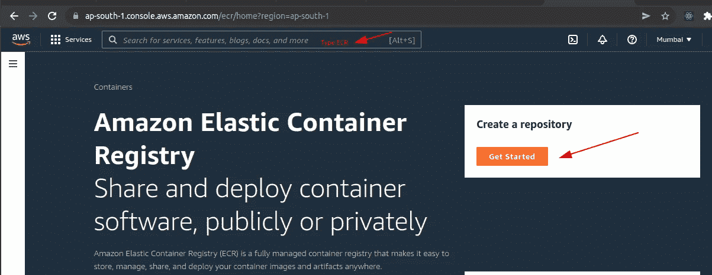

**让我们在 AWS 上创建一个** [**资源库**](https://ap-south-1.console.aws.amazon.com/ecr/create-repository) **。**

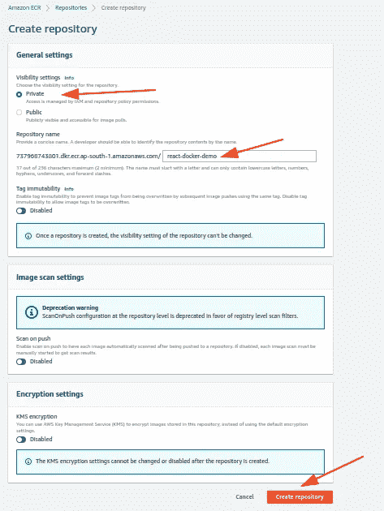

创建仓库 ECR

成功创建了 **react-docker-demo** 的存储库。

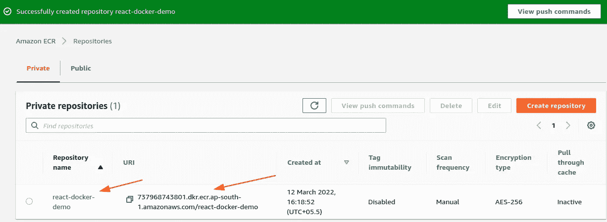

# 创建 AWS 用户并设置权限

1.  在搜索栏中输入' **IAM** '，然后点击菜单中的**用户**。之后点击**添加用户。**

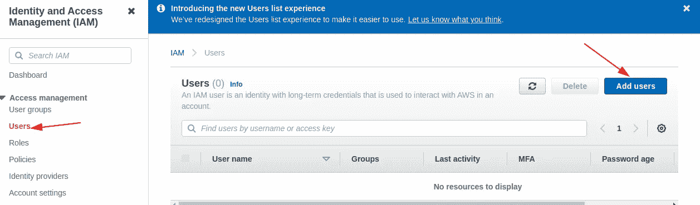

身份和访问管理

**2。设置用户详细信息** 给出用户名: **github-ci** 并检查**编程访问**，这将允许我们创建一个**密钥**对。

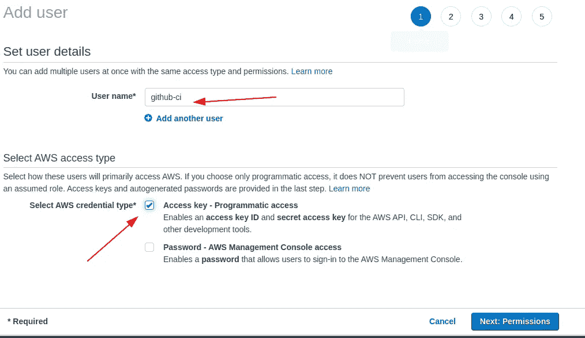

添加用户

3.单击“下一步:权限”后，选择“直接附加现有策略”。要查找策略，请搜索**弹性容器注册表**并选择**amazonec 2 containerregistryfull access。**

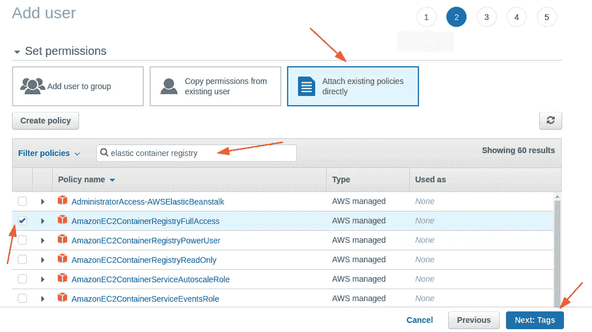

4.点击**下一步:标签**跳过步骤 **3** 现在点击**下一步:查看**并确认**创建用户。**

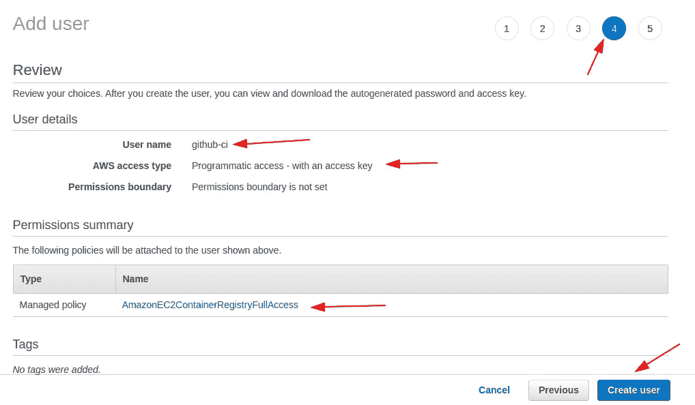

5.创建后，您需要保存凭证文件并复制**“访问密钥 ID”**和**“秘密访问密钥”。**

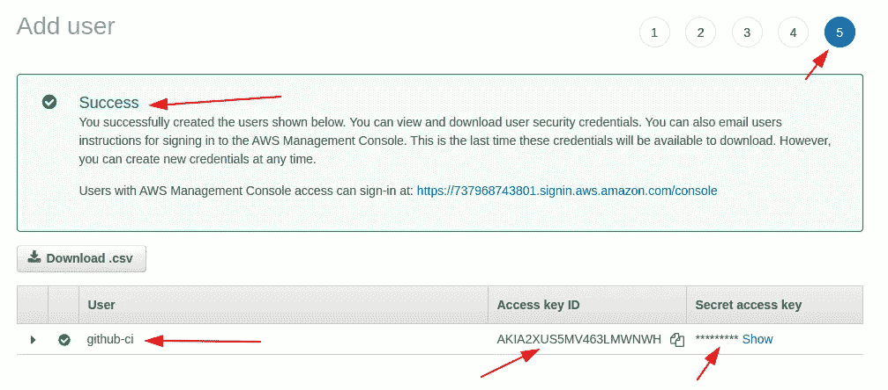

生成访问和成功密钥。

# 创建 Docker 文件

我们必须创建一个 docker 文件，这样我们就可以为我们的项目创建一个 docker 映像。该文件将在我们的应用程序的根文件夹中创建，名称为' **Dockerfile** '，不带扩展名。

```
# pull the official base image (Background o.s for container)
 FROM node:17-alpine3.14# set working direction (directory for my project)
 WORKDIR /app# set environment path
 ENV PATH="./node_modules/.bin:$PATH"# Copy everything from local machine to our server, second dot refers to the directory on the container.
 COPY . .# install npm dependencies
 RUN npm install# lets build the application
 RUN npm run build

 # # start an application (starting our react server)
 CMD ["npm", "run", "start"]
```

## 创建撰写 docker 文件

我们将在根目录下创建一个文件 **docker-compose.yml**

**代码:docker-compose.yml**

```
version: "3.8"
services:
  app:
    build:
      context: .
    volumes:
      - .:/app
    ports:
      - 3000:3000
    image: app:react-docker-demo
    container_name: react_container
    command: npm start
```

# 将 Github 操作工作流写入现有项目

有多种方法可以让你设置 Github 动作，比如直接从 GitHub repo 或者自定义创建文件和文件夹到你的项目中。根据您的喜好仅选择一种方法。

> 让我们创建一个文件 **deploy-on-aws.yml**

```
# This is a basic workflow to help you get started with Actionsname: Deploy to AWS ECR# Controls when the workflow will run
on:
  # Triggers the workflow on push or pull request events but only for the master branch
  push:
    branches: [master]
  pull_request:
    branches: [master]jobs:build:name: Build Image
    runs-on: ubuntu-latest# Steps represent a sequence of tasks that will be executed as part of the job
    steps:

      - name: Check out code
        uses: actions/checkout@v2- name: Configure AWS credentials
        uses: aws-actions/configure-aws-credentials@v1
        with:
          aws-access-key-id: ${{ secrets.AWS_ACCESS_KEY_ID }}
          aws-secret-access-key: ${{ secrets.AWS_SECRET_ACCESS_KEY }}
          aws-region: ap-south-1- name: Login to Amazon ECR
        id: login-ecr
        uses: aws-actions/amazon-ecr-login@v1- name: Build, tag, and push image to Amazon ECR
        env:
          ECR_REGISTRY: ${{ steps.login-ecr.outputs.registry }}
          ECR_REPOSITORY: react-docker-demo
          IMAGE_TAG: 1
        run: |
          # Build a docker container and push it to ECR 
          docker build -t $ECR_REGISTRY/$ECR_REPOSITORY:$IMAGE_TAG .
          echo "Pushing image to ECR..."
          docker push $ECR_REGISTRY/$ECR_REPOSITORY:$IMAGE_TAG
          echo "::set-output name=image::$ECR_REGISTRY/$ECR_REPOSITORY:$IMAGE_TAG"
```

**注意**:这里我们要修改下面的代码。 **ECR_REPOSITORY** 是我们在 Amazon ECR 中创建的项目的名称。这里我使用了 **react-docker-demo** 作为项目名称，你可以使用任何名称。

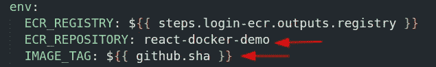

**方法 1** :使用 GitHub repo

*   转到**操作**并点击**自行设置工作流程。**

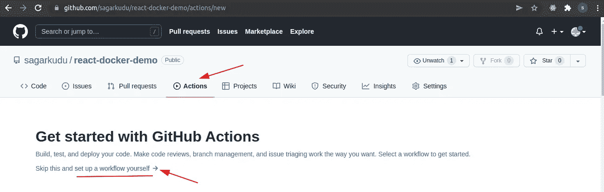

*   添加有效文件名，如 **deploy-on-aws.yml** ，删除现有代码，并在 YAML 文件中添加我们的自定义代码(请查看下面的代码)，最后单击**开始提交**。

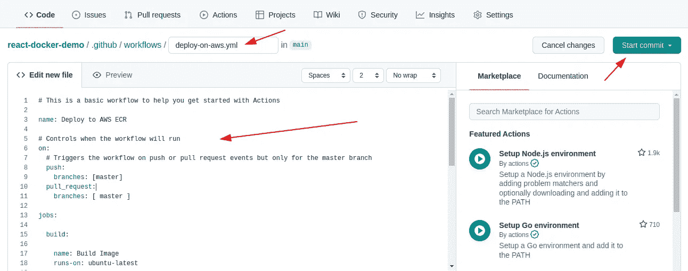

*   提交后

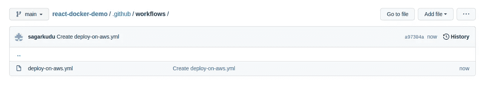

*   进入终端输入命令`git pull`

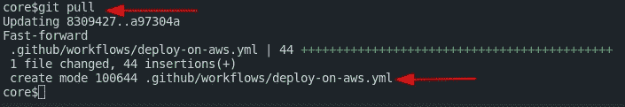

YAML 文件是为我们现有的项目创建的

**方法二**:创建自定义文件和文件夹

创建一个文件夹**。github** 在应用程序的根目录下，再次在**内创建一个名为 **workflows** 的新文件夹。github** 文件夹，最后在**工作流**文件夹中创建一个名为 **deploy-on-aws.yml** 的文件(请检查上面的代码)

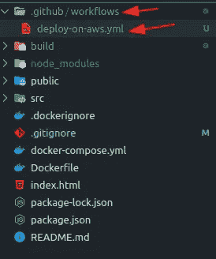

# 添加 Docker 忽略文件

让我们创建一个名为。以便我们在将映像推送到 AWS 之前忽略那些文件。

**文件名-** **。dockerignore**

```
node_modules
npm-debug.log
```

# 将 Github 操作与 AWS ECR 连接起来

1.  现在我们将登录到 [GitHub 项目](https://github.com/sagarkudu/react-docker-demo/settings),并转到:

```
Go here -> settings > secret > actions
```

2.现在点击**新的存储库密码**来添加变量和它们的值。

*   添加 **REPO_NAME** 作为名称& your ECR Name 作为值 **react-docker-demo**
*   同样，添加 **AWS_ACCESS_KEY_ID** 作为名称，并从控制台粘贴**访问密钥 ID** 。
*   类似地，从控制台添加 **AWS_SECRET_ACCESS_KEY** 作为名称，粘贴**访问密钥**作为值。

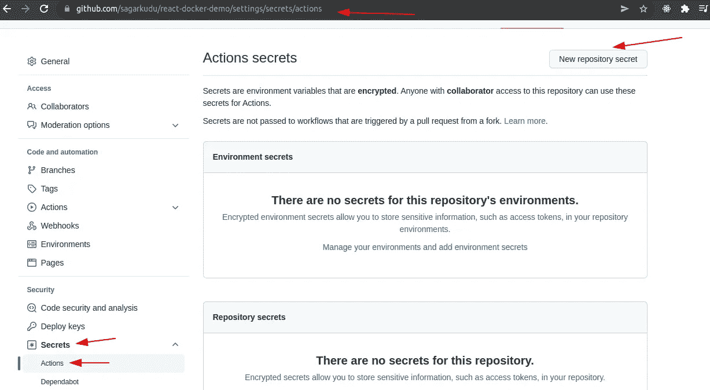

*   从这里，我们将 ID 和密钥复制到 GitHub:

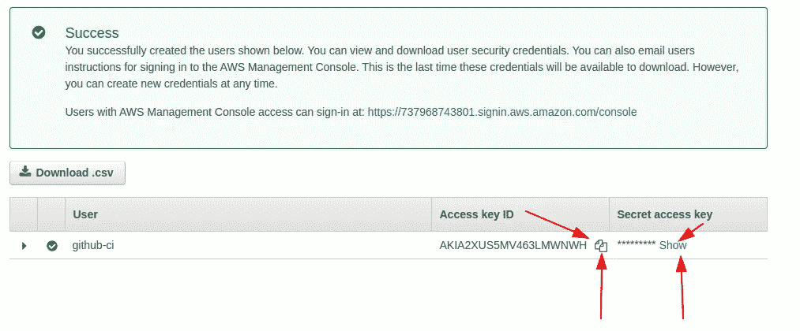

ID 和密钥

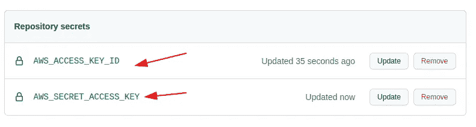

AWS 机密密钥

注意:进入 Github 并检查你的分支名称是否为`master`，否则重命名它。
`git checkout master`

# 监控、构建和向 AWS 推送映像

1.  一旦变更被推送到存储库，签出 **Actions** 选项卡。—这里您将看到一个**新的**动作已经开始，用黄色的**表示，表示构建正在工作流程中进行。**

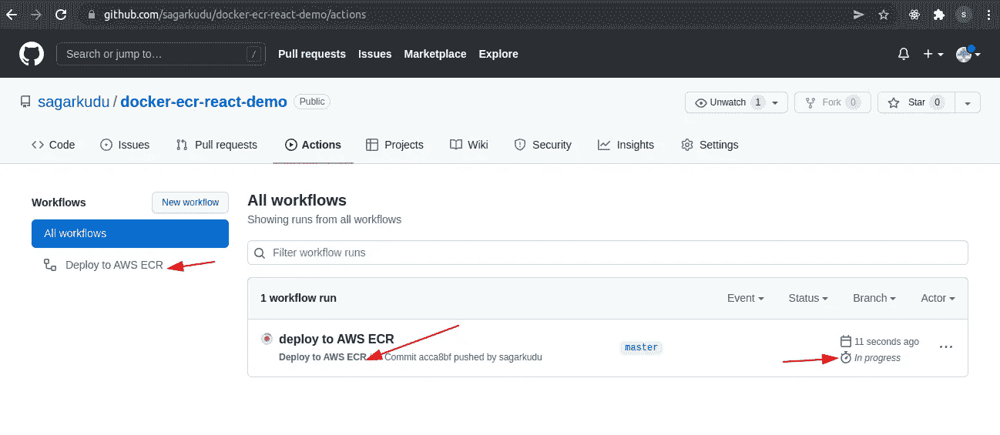

2.单击正在处理的构建名称，并打开当前部署。

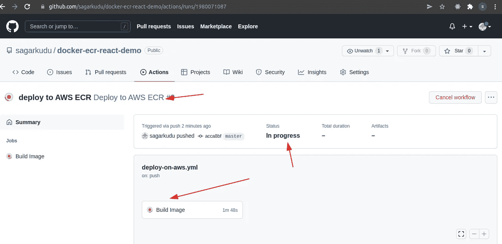

3.在这里，您可以看到构建日志，其中每个选项卡显示当前任务，展开每个选项卡，您可以看到其日志。

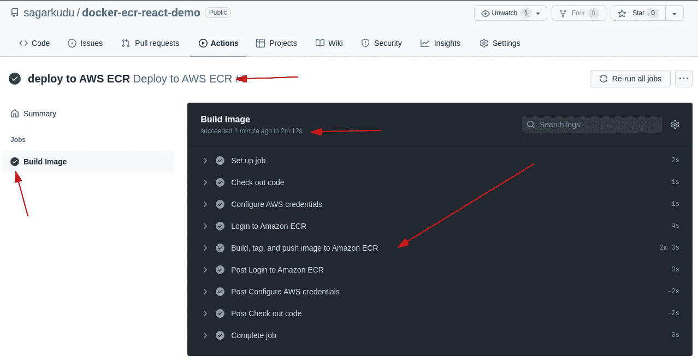

4.等待部署完成，如果颜色为**绿色**，则图像已成功部署到 AWS ECR，如果颜色为红色，则表示存在错误。

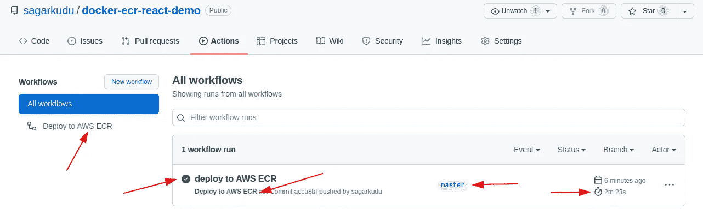

5.现在转到 [Amazon ECR 仓库](https://ap-south-1.console.aws.amazon.com/ecr/repositories?region=ap-south-1)查看刚刚使用 Github Actions 创建的最新图片。

最终输出:

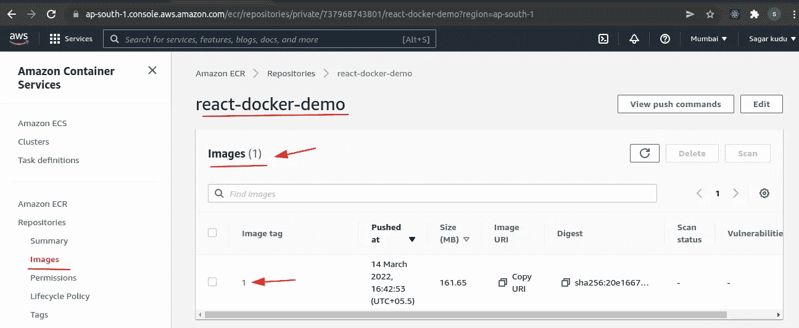

创建的图像带有标签:1

**结论**:恭喜！！！你学会了为你的项目建立 **CI/CD 管道**，这在今天是非常必要的。

# 您可能会对以下内容感兴趣:

[](https://sagarkudu.medium.com/host-any-app-to-aws-and-github-using-continuous-deployment-ci-cd-pipeline-step-by-step-d4150dbee2e8) [## 托管网站或应用程序，使用 ECR 和 GitHub 自动构建 Docker 映像并将其推送到 AWS ECS | Continuous…

### 让我们为 AWS 托管一个 React 或任何应用程序或网站。

sagarkudu.medium.com](https://sagarkudu.medium.com/host-any-app-to-aws-and-github-using-continuous-deployment-ci-cd-pipeline-step-by-step-d4150dbee2e8) 

# DevOps 博客列表:

[](https://sagarkudu.medium.com/lists) [## 媒介上的萨加尔·库杜策划了一些名单

### 开始探索 Devops，React，SpringBoot 和更多

sagarkudu.medium.com](https://sagarkudu.medium.com/lists) 

# 作者:萨加尔·库杜

1.  [Github](https://github.com/sagarkudu)
2.  [领英](https://www.linkedin.com/in/sagarkudu/)

感谢您的宝贵时间！