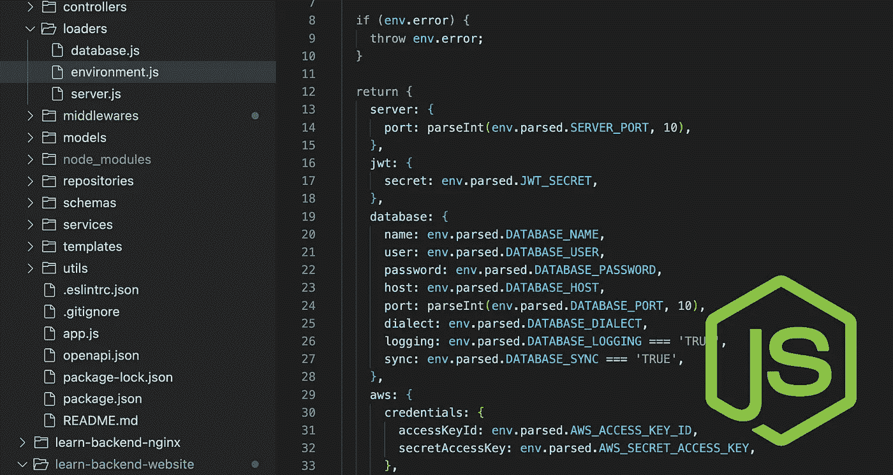

# 在 Node.js 中构建一个动态配置加载器

> 原文：<https://blog.devgenius.io/build-a-dynamic-configuration-loader-in-node-js-2d4d2117d750?source=collection_archive---------0----------------------->

🚀 [**打造分层微服务**](https://learnbackend.dev/books/build-layered-microservices) 这本书出来了！现在就在 [learnbackend.dev](https://learnbackend.dev/books/build-layered-microservices) 购买你自己的副本。



在编程中，*配置*是一个键值对列表，用于配置计算机程序的参数和初始设置，以定制它们的行为。

在 Node.js 中，这些值通常在流程的*环境*中定义，可以通过全局`process.env`对象访问。

虽然实用，但这种方法有两个缺点:

1.  它迫使程序依赖于目标机器的波动环境，其变量可以被其他开发人员或程序覆盖或删除。
2.  它迫使开发人员在每次想要改变应用程序的部署环境时覆盖这些值(`development`、`staging`、`production`等等)。

更好的方法是使用几个配置文件——每个部署环境一个——它们在流程启动时加载。

# 节点环境变量

`NODE_ENV`变量是由 Express framework 推广的环境变量，它指定了应用程序运行的部署环境，如`development`或`staging`。

就像任何其他环境变量一样，它可以通过全局`process.env`对象访问，并使用一个选项标志来运行一段特定的代码，或者作为一个动态参数来改变应用程序的行为，例如打开和关闭调试。

这个变量可以通过在命令之前声明来本地设置，这意味着它只对那个程序可见。

```
$ NODE_ENV=development node index.js
```

或者全局使用导出实用程序，这意味着它将对所有程序可见。

```
$ export NODE_ENV=development
```

为了说明这一点，我们可以创建一个名为`index.js`的脚本，它将简单地记录这个`NODE_ENV`变量的值。

```
// index.jsconsole.log(process.env.NODE_ENV);
```

并在新的终端窗口中运行以下命令进行测试。

```
$ NODE_ENV=development node index.js
development
$ NODE_ENV=production node index.js
production
```

# dotenv 包装

`dotenv`是一个零依赖 Node.js 包，它将环境变量从一个文件加载到正在运行的进程的环境中。

```
$ npm install dotenv
```

由`dotenv`模块公开的`config()`函数将默认尝试解析位于项目顶层目录中的`.env`文件的内容。

```
var_1=123
var_2=hello
```

然后，它将把它的值赋给全局`process.env`对象，或者返回一个包含带有加载内容的`parsed`键的对象，或者返回一个`error`键。

```
const { config } = require('dotenv');const env = config();if (env.error) {
  throw env.error;
}
console.log(env.parsed);
```

或者，如果我们想以不同的方式命名我们的配置文件，我们可以通过向`config()`函数传递一个带有`path`属性的可选对象来告诉`dotenv`加载哪个文件。

```
const { config } = require('dotenv');const env = config({
  path: '/path/to/config'
});
```

[](https://learnbackend.dev/) [## 构建分层微服务|学习后端

### 这是一个循序渐进的大师班，面向初学者和初级开发人员，致力于 Node.js 中的实用编程

learnbackend.dev](https://learnbackend.dev/) 

# 配置加载器模块

正如简介中提到的，现实世界中的应用程序必须能够在多个部署环境之间切换，因此可以根据上下文加载适当的配置文件——这可以通过使用`NODE_ENV`环境变量和`dotenv`包的组合来轻松实现。

让我们从创建两个名为`.env.development`和`.env.production`的配置文件开始，这两个文件将包含一个名为`SERVER_PORT`的变量，该变量表示服务器将监听传入请求的端口号。

```
$ echo "SERVER_PORT=3000" > .env.development
$ echo "SERVER_PORT=80" > .env.production
```

让我们创建一个名为`loadenv.js`的模块，它导出一个工厂函数:

1.  使用`dotenv`包加载由以下字符串插值定义的指定文件；如果`NODE_ENV`变量为`undefined`，则默认为`".env.development"`。
2.  如果文件不存在或由于某种原因无法访问，将引发错误。
3.  基于分析的数据返回格式化的对象。

```
// loadenv.jsconst { config } = require('dotenv');module.exports = () => {
  const env = config({  // (1)
    path: `./.env.${process.env.NODE_ENV || 'development'}`,
  }); if (env.error) {  // (2)
    throw env.error;
  } return {  // (3)
    server: {
      port: parseInt(env.parsed.SERVER_PORT, 10),
    },
  };
};
```

让我们创建一个名为`index.js`的脚本，它导入配置加载器模块并记录调用它时返回的对象。

```
// index.jsconst Env = require('./loadenv');try {
  const env = Env();
  console.log(env);
} catch(error) {
  console.error(error);
  process.exit(1);
}
```

最后，让我们通过在终端窗口中运行以下命令来测试加载器模块，这将根据按照`NODE_ENV`环境变量定义的部署环境打印出正确的`SERVER_PORT`值。

```
$ NODE_ENV=development node index.js
{ server: { port: 3000 } }
$ NODE_ENV=production node index.js
{ server: { port: 80 } }
$ node index.js
{ server: { port: 3000 } }
```

现在，您可以轻松地将新变量添加到配置文件中。

```
# .env.developmentSERVER_PORT=3000
DATABASE_NAME=project
DATABASE_USER=user
DATABASE_PASSWORD=password
```

并在由配置加载器返回的对象内的公共关键字下对它们进行重新分组。

```
// loadenv.js// ...
return {
  server: {
    port: parseInt(env.parsed.SERVER_PORT, 10),
  },
  database: {
    name: env.parsed.DATABASE_NAME,
    user: env.parsed.DATABASE_USER,
    password: env.parsed.DATABASE_PASSWORD,
  },
};
```

# 下一步是什么？

👉你喜欢这种内容？请查看本书 [***构建分层微服务***](https://learnbackend.dev) ，网址为 [https://learnbackend.dev](https://learnbackend.dev) 了解如何使用 Express framework 构建生产就绪的分层认证微服务，从第一行代码到最后一行文档，该服务在开发实践和软件架构方面符合行业标准。