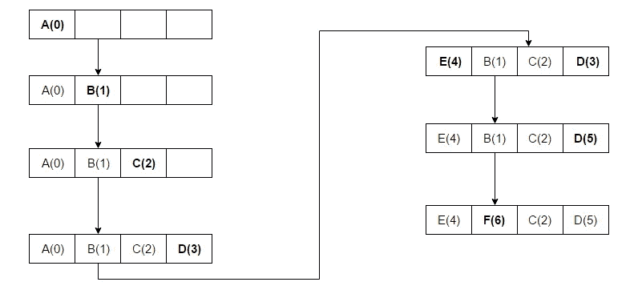
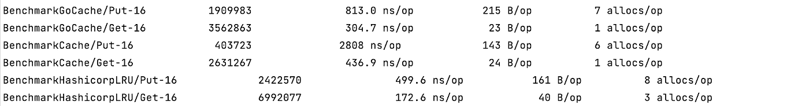

# 在 20 分钟内从头构建一个 Go KV 缓存

> 原文：<https://blog.devgenius.io/build-a-go-kv-cache-from-scratch-in-20-minutes-a13616a4929f?source=collection_archive---------8----------------------->

缓存似乎是几乎每一个程序或产品的必需品，我们可以在每个角落看到它，就像在 web、数据库、应用程序中，甚至在云中。它之所以有意义，是因为它带来了效率。这就像当你和那些燃烧卡路里的问题纠缠在一起时，把你最喜欢的零食放在桌子上快速拿起。


[布鲁克·拉克](https://unsplash.com/photos/C1fMH2Vej8A)

我们已经讨论了使用`sync.Pool`优化 kv 缓存的主题，并深入探讨了缓存设计。那么，今天是关于弄脏我们的手。在 20 分钟内，我们将从头开始实施一个可靠且可用的本地 kv 缓存。

# 千伏缓存的基本元素

您是否列出了在实现键值缓存时应该考虑的因素？如果没有，请记下。

*   **储存**。通常，最常用的数据结构是`map[string]Element{}`，其中字符串是关键，而元素包含`value`信息。
*   **元素**。最简单的元素至少应该包含值和过期时间。值类型通常为`interface{}`，可根据场景替换为`string`、`int`或其他特定类型，以加快速度。
*   **并发**。除非是线程特定的映射，否则缓存必须考虑并发访问。像其他高级语言一样，Go 也提供了一个线程安全的映射(`sync.map`)。当然，将`map`和`sync.RWMutex`结合起来可以实现同样的功能，提供更多的灵活性，有助于更好地理解 Go。
*   **容量**。如果您想在 Kubernetes Pod 中运行缓存，请提前设置缓存大小。否则，它可能会消耗太多内存，并由于内存限制而导致整个 pod 被逐出。
*   **删除已到期的**。及时释放过期密钥可以提高缓存利用率、节省开销并提高性能。
*   **GC 调谐**。它与 Go 相关，并减少了 GC 对缓存的影响。`sync.Pool`可用于进一步优化。
*   **API 设计**。缓存具有`Put`、`Get`、`Remove`、`Flush`4 个基本功能，并对其他方法开放以获得更好的支持。

# 缓存实现

考虑到这些因素，我们现在将设计我们的缓存。

让我们暂停一下，解读一下这些步骤。首先简单两步。

*   定义所有的类型和函数。

*   定义默认参数，并在`New`功能中使用它们。

然后是`put`方法。在为 map 设置键和值之前，还有一些额外的工作要做。

*   获取并设置密钥的过期时间。
*   获取并设置密钥的上次访问时间。

在缓存已满，但无法删除过期密钥来为新密钥腾出空间的情况下，我们需要引入一些额外的收回策略。

[**LRU**](https://en.wikipedia.org/wiki/Cache_replacement_policies#Least_recently_used_(LRU)) ，最近最少用户，是我们在这种情况下应用的:最近没有被访问的键将被消除。但是，需要注意的是，对史料并不友好。



LRU，来自[维基](https://en.wikipedia.org/wiki/Cache_replacement_policies#/media/File:Lruexample.png)

还有一些其他驱逐策略，例如，

*   **LFU** ，最不常用，剔除使用频率低的按键。潜在的问题是，如果这些键在短时间内被频繁访问，它们将在缓存中保留很长时间，尽管将来不会被访问。
*   **FIFO** ，先进先出，最新的留下。它的缺点和 LFU 的一样。
*   [**圆弧**](https://en.wikipedia.org/wiki/Adaptive_replacement_cache#:~:text=From%20Wikipedia%2C%20the%20free%20encyclopedia%20Adaptive%20Replacement%20Cache,pages%20plus%20a%20recent%20eviction%20history%20for%20both.) ，自适应替换缓存。作为 LRU 的高级版本，它通过集成 LFU 和 LRU、4 个队列和消耗更多内存来实现更高性能的缓存。

此外，还有其他算法，如双队列，MRU 等。

最后，让我们看看`sync.Pool`。只有当存储的对象将被立即使用时，才需要这种选择加入功能。否则，在`Get`中运行之前，池中的对象将被频繁替换。但这是我们未来需要改进缓存的一个特性。

`Put`循序渐进，功法尽在不言中。

然后你会发现`Get`函数已经在你的口袋里了:只需从`pool`和`map`中获取结果，并更新上次访问时间和到期时间。

接下来要做的是构建一个自动清理器，启动一个 goroutine 来定期清理过期时间小于当前时间的密钥。

同时，在前面的`New`方法中增加下面两行。

```
go c.cleaner.Run(c)
runtime.SetFinalizer(c, stopCleaner)
```

到目前为止，缓存功能基本完成，是时候进行测试了👉[单元测试](https://github.com/slaise/go_localcache/blob/f95c94f760784826693c20bc7450b9af5033f679/cache_test.go#L5)。

# 性能比较

迫不及待地将我们构建的缓存与 Github 的完美缓存进行性能比较，我以 [go-cache](https://github.com/patrickmn/go-cache) 和 [hashicorp-lrucache](https://github.com/hashicorp/golang-lru) 为例，编写了一个[基准测试](https://github.com/patrickmn/go-cache)测试，比较访问效率。

结果符合我的预期。我们的缓存比那些成熟的开源缓存要慢。但是当它只花费我们 20 分钟的时候，我们还能期待什么。



这个结果给了我一个提示:T1 这么快肯定有原因。好了，我下一篇文章的主题找到了！

# 改进的方法

我们的缓存比较慢，但是我们可以做些事情来加快它的速度。那怎么做？

最重要的因素是并发和缓存大小，这两个因素相互影响:并发越大，元素越多，内存占用越大，缓存越慢。因此，降低并发性是第一要务。

这里我们需要一个着色方法，将一个缓存映射分成多个，以降低并发的可能性，并缩小每个缓存的大小。毫无疑问，`hash`最常用于着色，因为

*   哈希结果离散率高，也就是随机性高。
*   哈希可以避免产生过多的内存分配，减轻垃圾收集带来的压力。
*   哈希算法超高效。

很容易得出结论，哈希方法的速度决定了着色算法的效率，因为键是通过 hash(key)分配给不同的缓存的。

那么问题就在于选择哪种算法。 [MD5](https://en.wikipedia.org/wiki/MD5) 和 [SHA-256](https://www.simplilearn.com/tutorials/cyber-security-tutorial/sha-256-algorithm) 是最常见的哈希算法， [FNV](https://en.wikipedia.org/wiki/Fowler%E2%80%93Noll%E2%80%93Vo_hash_function) 和 [DJB2](https://doc.riot-os.org/group__sys__hashes__djb2.html) 各有千秋。如果你正纠结于这些选项，那么就做一个基准比较。

此外，添加更多的方法，如直接访问`string`和直接存储`int`，或者优化`sync.Pool`的使用，也是改善我们缓存的方法。

# 结束了

我们有各种各样的开源缓存，这让我们不用自己写，而且效率更高。但是当你喝完一杯咖啡后，你会有什么感觉呢？实践让我们变得更好。我们的手越脏，我们就是越好的开发者。在优化 kv 缓存的意愿的驱使下，我开始了哈希和阴影研究。

参见[源代码](https://github.com/slaise/go_localcache)这里。

感谢阅读！