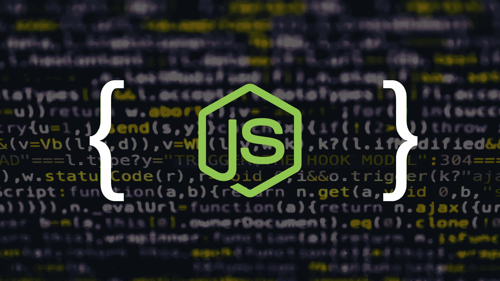

# 在 Node.js 中构建一个 JSON 主体解析中间件

> 原文：<https://blog.devgenius.io/build-a-json-body-parsing-middleware-in-node-js-14f7d7ca9bb?source=collection_archive---------1----------------------->

🚀 [**打造分层微服务**](https://learnbackend.dev/books/build-layered-microservices) 这本书出来了！现在就在 learnbackend.dev 上购买你自己的副本。



在 Express 中，中间件是一种特殊类型的功能，允许在传入的 HTTP 请求到达控制器之前拦截它们。它可以用于各种各样的事情，比如记录请求、验证头、解析有效负载等等。

在本文中，您将学习如何构建一个 JSON 主体解析中间件，该中间件模仿 Express 提供的中间件的行为。

# Express JSON 主体解析中间件

Express 提供的`json()`内置中间件函数使用 JSON 有效负载解析传入的请求。它在`request`对象(即`req.body`)上添加一个新的包含解析数据的`body`对象，或者添加一个空对象(`{}`)，如果没有要解析的主体、`Content-Type`不匹配(即`application/json`)或者出现错误。

```
const { json } = require('express');

app.post('/', json(), (req, res) => {
  console.log(req.body);
  // ...
});
```

# 中间件框架

让我们首先创建一个名为`parseJSON`的中间件函数，它:

*   向包含空对象的请求对象添加新的`body`属性。
*   调用`next()`处理程序，该处理程序将请求转发给中间件堆栈的下一个组件。

```
function parseJSON(req, res, next) {
  req.body = {};
  next();
}
```

# 验证有效负载编码

现在，让我们通过将请求对象的`headers`属性中包含的`Content-Type`头的值与 JSON 媒体类型(也称为 MIME 类型)进行匹配来验证有效负载编码，JSON 媒体类型是`application/json`。

```
function parseJSON(req, res, next) {
  req.body = {};

  if (req.headers['content-type'] === 'application/json') {
    // ...
  }

  next();
}
```

# 收集有效载荷块

由于 HTTP 消息的内容在某些情况下可能非常庞大，如图像或视频，因此通常会被分解成几个数据块，一个接一个地发送。

为了收集这些数据块，我们必须设置两个独立的事件监听器:

*   一个将监听一个`data`事件，并将接收到的块连接到前一个。
*   一个将监听表示数据流结束的`end`事件。

```
function parseJSON(req, res, next) {
  req.body = {};

  if (req.headers['content-type'] === 'application/json') {
    let data = '';

    req.on('data', chunk => {
      data += chunk;
    });

    req.on('end', () => {
      // ...
    });
  }

  next();
}
```

# 解析有效负载

一旦接收到所有的原始数据，我们需要解析它，这意味着将它转换成应用程序可以处理的格式。在 JavaScript 中，可以使用内置的`JSON.parse()`方法将 JSON 字符串转换成数据对象。

```
function parseJSON(req, res, next) {
  req.body = {};

  if (req.headers['content-type'] === 'application/json') {
    let data = '';

    req.on('data', chunk => {
      data += chunk;
    });

    req.on('end', () => {
      req.body = JSON.parse(data);
    });
  }

  next();
}
```

# 改变函数的流程

由于事件监听器本质上是异步的——由于它们使用回调函数——我们需要稍微改变中间件函数的流程，以确保在接收到所有数据之前不会调用`next()`处理程序。

为此，让我们:

*   将现有的调用转移到`else`语句中的`next()`,这样只有在`Content-Type`头与预期的 MIME 类型不匹配时才会被调用。
*   在负责处理`end`事件的事件监听器的回调函数中添加另一个对`next()`的调用，这样它只在数据被解析后被调用。

```
function parseJSON(req, res, next) {
  req.body = {};

  if (req.headers['content-type'] === 'application/json') {
    let data = '';

    req.on('data', chunk => {
      data += chunk;
    });

    req.on('end', () => {
      req.body = JSON.parse(data);
      next();
    });
  } else {
    next();
  }
}
```

# 处理解析错误

如果出现格式错误的数据，默认情况下，内置的`JSON.parse()`将抛出一个`SyntaxError`，如果处理不当，将导致应用程序崩溃。为了解决这个问题，我们可以添加一个`try…catch`块来捕捉错误并调用`next()`处理程序。

```
function parseJSON(req, res, next) {
  req.body = {};

  if (req.headers['content-type'] === 'application/json') {
    let data = '';

    req.on('data', chunk => {
      data += chunk;
    });

    req.on('end', () => {
      try {
        req.body = JSON.parse(data);
        next();
      } catch(error) {
        next();
      }
    });
  } else {
    next();
  }
}
```

或者，我们可以通过使用一个`finally`语句来避免重复并以一种更优雅的方式处理错误，无论是否抛出错误，该语句都会被调用。

```
function parseJSON(req, res, next) {
  req.body = {};

  if (req.headers['content-type'] === 'application/json') {
    let data = '';

    req.on('data', chunk => {
      data += chunk;
    });

    req.on('end', () => {
      try {
        req.body = JSON.parse(data);
      } catch(error) {
        // Ignore the error
      } finally {
        next();
      }
    });
  } else {
    next();
  }
}
```

# 测试中间件

让我们从导出`parseJSON()`中间件函数开始。

```
function parseJSON(req, res, next) {
  // ...
}

module.exports = parseJSON;
```

并将其导入到 minimal Express 应用程序中。

```
const express = require('express');
const parseJSON = require('./parseJSON');

const app = express();

app.post('/', parseJSON, (req, res) => {
  console.log(req.body);
  res.sendStatus(200);
});

app.listen(3000);
```

为了验证中间件的行为符合预期，我们现在可以使用`cURL`来发送:

带有无效`Content-Type`标头的请求；其中应该输出一个空对象(即`{}`)。

```
curl -X POST -H 'Content-Type: text/plain' -d '{"name":"John"}' 127.0.0.1:3000
```

具有无效负载的请求；其中应该输出一个空对象(即`{}`)。

```
curl -X POST -H 'Content-Type: application/json' -d 'name=John' 127.0.0.1:3000
```

具有有效`Content-Type`报头和有效有效载荷的请求；它应该输出一个填充的对象(即`{ name: 'John' }`)。

```
curl -X POST -H 'Content-Type: application/json' -d '{"name":"John"}' 127.0.0.1:3000
```

# 下一步是什么？

👉你喜欢这种内容？在 [https://learnbackend.dev](https://learnbackend.dev/) 查看《如何使用 Express framework 构建生产就绪的分层认证微服务》一书 [**构建分层微服务**](https://learnbackend.dev/books/build-layered-microservices) ，该书从第一行代码到最后一行文档都符合开发实践和软件架构方面的行业标准。