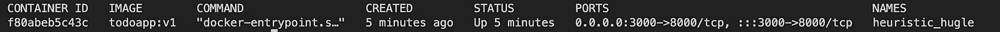
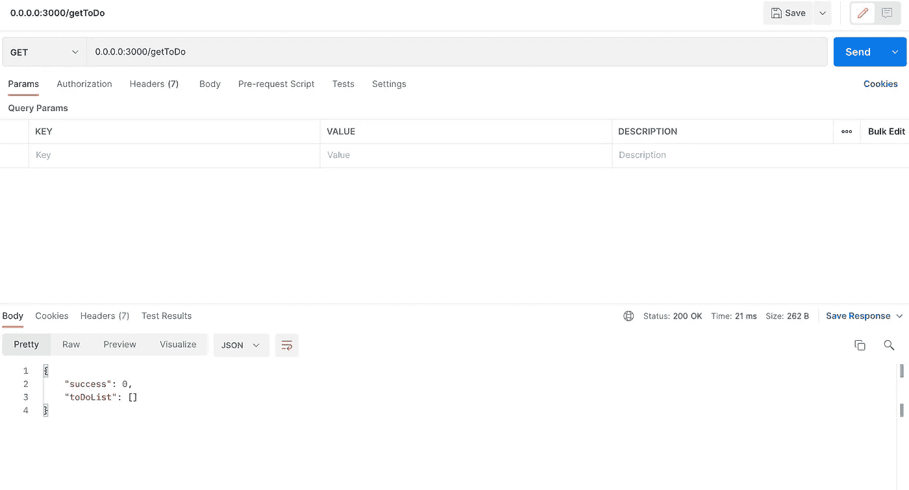
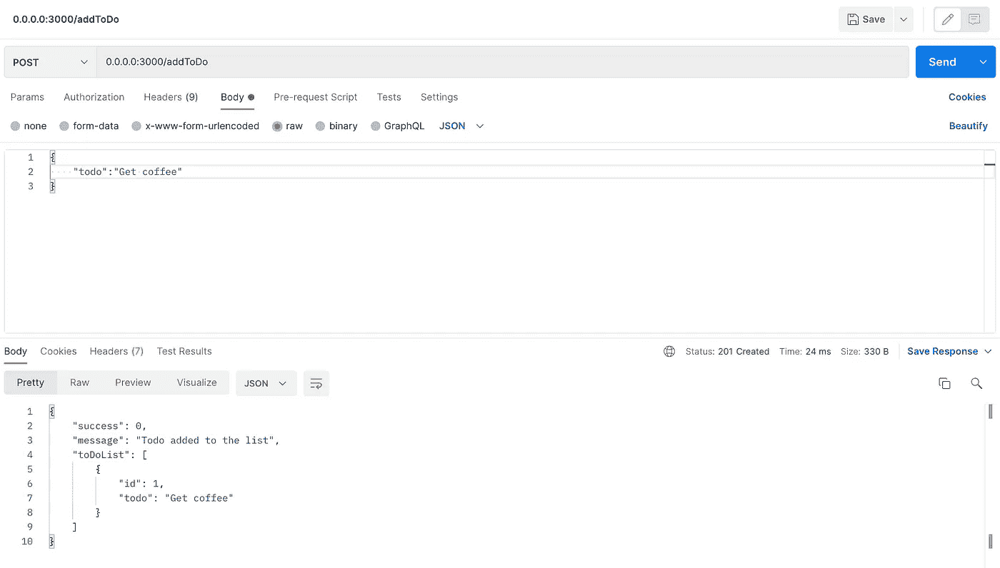
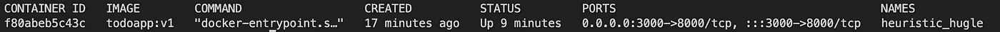
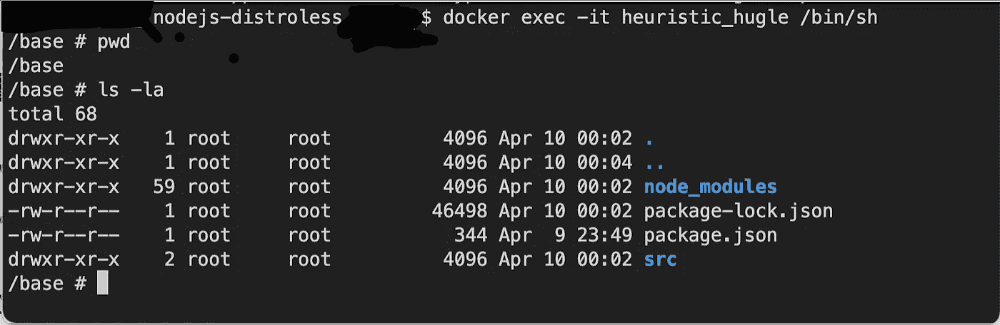
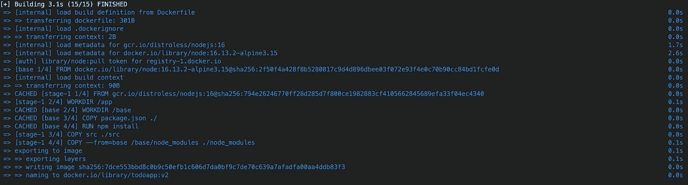
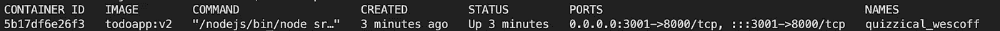
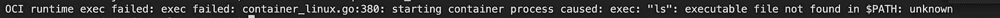

# 构建一个更简单、更安全的节点 docker 映像

> 原文：<https://blog.devgenius.io/build-a-lighter-and-secure-nodejs-docker-image-3345f449e754?source=collection_archive---------3----------------------->

一个企业应用程序将是云原生的，并被数百万用户使用，我想构建一个更轻、更安全的 nodeJs docker 容器。

**先决条件**

1.  关于 nodeJS 的一点知识

2.一些码头工人的知识

3.机器中的 Docker 运行时间(如果是本地机器，则为 docker 桌面)

4.NodeJS 已安装(使用 NVM 进行更好的控制【https://github.com/nvm-sh/nvm

5.邮递员或同等的 rest 客户端

**初始图像**

我在这个例子中使用的应用程序是一个简单的微服务 nodeJS 应用程序，但同样适用于任何 nodeJS 应用程序(NextJS 也是)

最初我使用节点高山图像。在这个例子中，我使用的是 alpine(docker pull node:16 . 13 . 2-alpine 3.15)，但同样适用于任何版本的 nodeJS

1.  首先在 express JS 中创建一个简单的 nodeJS 服务器。在这个练习中，我创建了一个简单的 express 服务器，将一个待办事项添加到我的待办事项列表中。

从下面的链接下载/克隆示例应用程序

[https://github.com/codedaemon12/nodejs-distroless.git](https://github.com/codedaemon12/nodejs-distroless.git)

2.创建完成后，添加一个 docker 文件作为 docker file 并放在线下

> *从节点:16.13.2-alpine3.15 作为基础*
> 
> *工作方向/基本方向*
> 
> *复制 package.json。/*
> 
> *运行 npm 安装*
> 
> *复制 src。/src*
> 
> *曝光 8000*
> 
> *CMD ["npm "，" start"]*

3.建立 docker 形象

> 语法:docker build -t 
> 
> " docker build -t todoapp:v1 . "

这里 docker 文件路径是工作目录，所以在末尾点

4.这样，node JS 应用程序将使用来自 docker hub 的 alpine 映像进行构建

5.运行上面的 docker 映像构建。这里，我们在构建时将应用程序端口映射到 8000，在运行期间，我将端口连接到 3000

> docker run-d-p 3000:8000 todo app:v1

6.检查容器是否正在运行

> docker ps

7.现在打开 postman 或任何 rest 工具，首先执行 get

[http://0 . 0 . 0 . 0:3000/getToDo](http://0.0.0.0:3000/getToDo)

它将返回一个空列表

现在在 postman 中打开另一个标签，选择 post。将待办事项添加到列表中

[http://0 . 0 . 0 . 0:3000/add todo](http://0.0.0.0:3000/addToDo)

> {
> 
> " todo ":"买咖啡"
> 
> }

Todo 将被添加并在响应中返回。

恭喜您，您的节点应用程序正在 docker 容器中运行。

以上步骤有助于创建 docker 映像，我们也可以将相同的映像应用于生产环境。

现在让我们进入 docker 容器

为此，首先获取 docker 容器名

> docker ps

我们可以使用 docker exec 命令对正在运行的容器运行任何命令。在我们的例子中，我们想进入容器内部，所以

语法:docker exec -it <container name="">/bin/sh</container>

> docker exec-it heuristic _ hugle/bin/sh

或者列出工作目录中的文件

> docker exec-it heuristic _ hugle ls-la

现在我们在集装箱里面。您可以运行命令 ls -la，它将列出我们在上面构建的应用程序

因此，有了这个，我们就可以进入正在运行的容器，进行任何操作。对于生产中的应用来说，这可能不是一个好主意。这是图片的发行版。

[https://github.com/GoogleContainerTools/distroless](https://github.com/GoogleContainerTools/distroless)

> “发行版”映像只包含您的应用程序及其运行时依赖项。它们不包含包管理器、shells 或任何其他您期望在标准 Linux 发行版中找到的程序。

基本上，我们将改变我们的形象，以 distroless 版本，这将更加安全。

我们将修改我们的 docker 文件如下。因为我们是在 docker 容器中构建我们的应用程序，所以我们需要安装一些依赖项。我们不能没有 shell，所以我们必须将 docker 构建步骤转换成两个阶段。

> #第一阶段
> 
> 从节点:16.13.2-alpine3.15 作为基础
> 
> 工作目录/基本
> 
> 复制 package.json。/
> 
> 运行 npm 安装
> 
> #第二阶段
> 
> 来自 gcr.io/distroless/nodejs:16
> 
> 工作目录/应用程序
> 
> 复制 src。/src
> 
> COPY-from = base/base/node _ modules。/节点 _ 模块
> 
> 暴露 8000
> 
> CMD ["src/server.js"]

让我们重新建造。让我们添加一个新标签作为 v2

> " docker build -t todoapp:v2 . "

现在，在不同的端口运行映像

> docker run-p 3001:8000-d todo app:v2

让我们在这个容器中再次运行我们的 exec 命令

首先获取容器名

> docker ps

现在运行 exec 命令

> docker exec-it quickical _ wes coff/bin/sh

它将返回如下错误

> *“OCI 运行时 exec 失败:exec 失败:container_linux.go:380:启动容器进程导致:exec: "/bin/sh": stat /bin/sh:没有这样的文件或目录:未知”*

我们可以尝试其他类似命令

> docker exec-it quickical _ wes coff ls-la

但是我们会得到同样的错误。该命令在之前的图像中运行良好。

所以通过使用 distroless 镜像，我们去掉了外壳，从而增加了容器的安全性。Distroless 图像有更多的好处和细节可以在上面分享的链接中查看。

分布式图像被广泛使用。我正在运行多个 java 和 go 应用程序，它们使用相同的发行版映像进行最终构建。

多阶段构建技术还减少了图像大小，因为我们可以构建应用程序并只复制所需的文件。这在我们缩小/压缩文件时更有帮助。