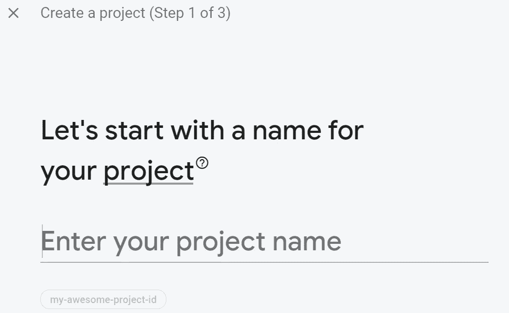
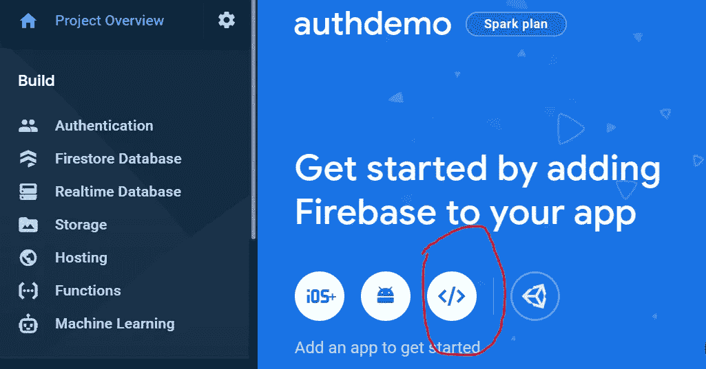
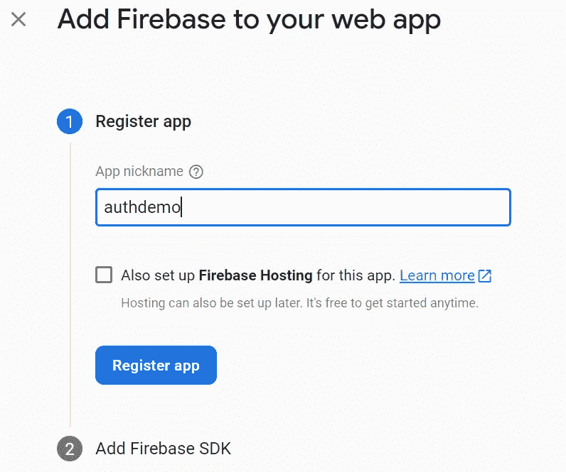
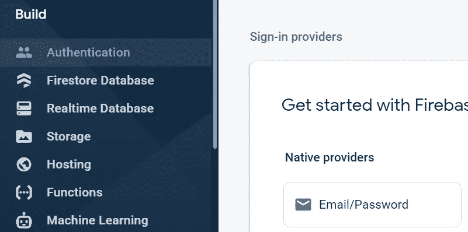
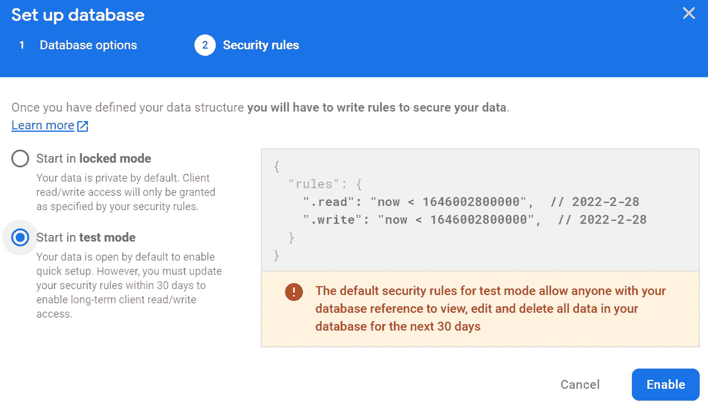
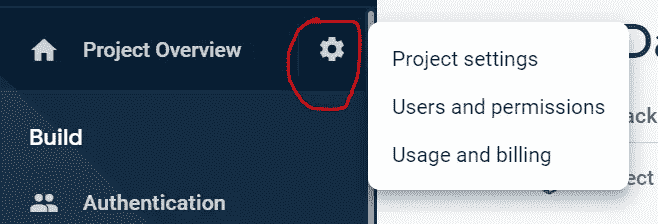
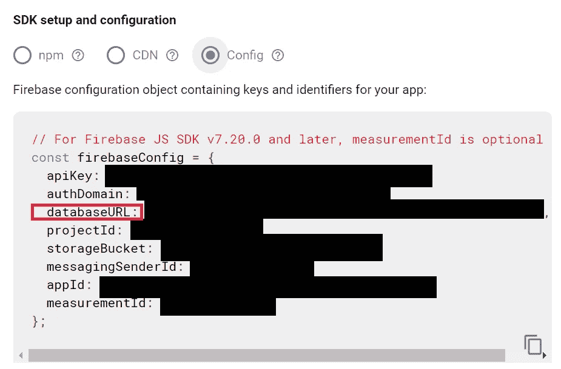
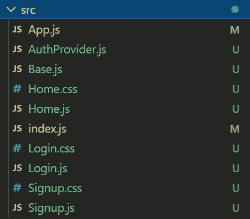

# 用 React 和 Firebase 构建一个登录/注销演示

> 原文：<https://blog.devgenius.io/build-a-login-logout-demo-with-react-and-firebase-322d02cb9479?source=collection_archive---------2----------------------->

# 介绍

本文给出了一个如何用 React 和 Firebase 构建登录/注销 web 应用程序的例子。状态由上下文 API 和 React 挂钩管理。Firebase 身份验证用于用户凭证。此外，用户的个人资料信息存储在 Firebase 实时数据库中。react-router-dom 实现了简单的重定向特性。立正！！！本文中的 web 应用程序演示是用 React 17 . 0 . 2 版、Firebase 9 . 6 . 5 版和 React-router-DOM 6 . 2 . 1 版构建的。

# Firebase 设置

## Firebase 认证

首先，转到 Firebase 控制台并创建一个新项目。为你的项目选择一个名字，基本上你可以继续使用默认设置。

创建项目后，通过单击用红色圈出的图标将 web 应用程序添加到该项目中。

用昵称注册此 web 应用程序。Firebase 托管是不必要的，也不会在本文中解释。这时候可以跳过第二步“添加 Firebase SDK”。

然后转到左侧导航栏上的身份验证，并启用电子邮件/密码。

## Firebase 实时数据库

现在，我们可以开始实时数据库。它也在左侧导航栏上。你可以选择任何你喜欢的位置。开发时选择安全规则的测试模式。安全规则可以根据自己的情况设置。更多关于安全规则的信息可以在[这里](https://firebase.google.com/docs/rules/basics#realtime-database)找到。

这样就成功地建立了实时数据库。接下来，转到项目设置。

向下滚动，直到看到“SDK 设置和配置”。稍后将使用 firebase 配置。创建实时数据库后，应该添加一个 databaseURL。否则，刷新您的控制台页面。

现在，Firebase 部分完成了。🎉🎉🎉

# 让我们编码

当然，第一步是在终端运行`npx create-react-app YOUR-APP-NAME` 创建一个新的 React 项目。还记得运行`npm i firebase`和`npm i react-router-dom`。该应用程序将有一个主页(Home.js)。不同的动作会将路线引向不同的路径。一个单独的文件(base.js)用于存储 firebase 配置。因为上下文 API 用于管理属性和状态，所以身份验证提供程序(AuthProvider.js)是在单个文件中编写的。在`src`文件夹中将要创建的所有文件如下图所示:

## 索引. js

## base.js

复制 Firebase 项目设置中的 Firebase 配置，并将其粘贴到此文件中。

## AuthProvider.js

在这个简单的演示中，使用 react 钩子的 React 上下文足以管理状态和道具，而不是使用 Redux。即使你把应用程序变得更复杂，context API 仍然可以很好地处理大多数情况。

当用户登录时，web 能够从数据库中获取用户信息，并记住当前用户。因此，用户的信息不会在页面刷新或重新加载后丢失。

要写一个 context API，首先要通过`const AuthContext = React.createContext()`创建一个 context 对象。“每个上下文对象都带有一个提供者 React 组件”[1]。提供者组件“允许消费组件订阅上下文更改”[1]。我们可以向提供者提供一个价值属性，这样所有相关的消费组件都可以获得这个价值属性。

在本文中，对当前用户(`currentUser`)数据感兴趣(注意`currentUser`周围的双花括号)。最开始应该是`null`。在提供者内部，`{children}`代表所有由提供者包装的组件。由于`currentUser` 数据在登录和注销后发生变化，并被`onAuthStateChanged`检测到，因此当`currentUser` 发生变化时，应用`useEffect` 重新渲染网页。

## App.js

现在，我们可以将所有消费组件包装在身份验证提供程序中。react-router-dom 用于指引路径。版本 6 之后的 react-router-dom 库和版本 6 之前的库有一些不同。例如，`<Route>`应该放在`<Routes>`里面，不再使用`component` 而是用`element` 代替。

## Home.js

我们先来看看回归部分。它有一个标题“家”。当`currentUser` 不是`null`时，它会用`currentUser’s username` 和一个退出按钮表示“欢迎”。否则，不会显示欢迎信息，而是有一个登录按钮和一个注册按钮。`useNavigate` 用于点击登录或注册后的重定向。

`currentUser` 是从带有`useContext(AuthContext)`的上下文中获得的。尽管如此，当`currentUser` 改变时，应用`useEffect` 来重新呈现网页。但是这一次，我们还需要从实时数据库中读取用户的名字和姓氏。为了读取数据，数据库的一个`ref` 应该通过`const starCountRef = ref(db, “users/” + currentUser.uid)`来澄清。然后，可以通过`onValue(starCountRef, …)`获取数据。

更多关于在实时数据库中读写数据的信息可以在[这里](https://firebase.google.com/docs/database/web/read-and-write)找到。

## 注册. js

有一个表格可以帮助用户填写一些基本信息(名字，姓氏，电子邮件和密码)以通过`createUserWithEmailAndPassword`注册 Firebase 身份验证。更多关于 Firebase 认证的信息可以在[这里](https://firebase.google.com/docs/auth/web/start)找到。用户资料将由`set(ref(db, “users/” + userCredential.user.uid), {…})`保存在实时数据库中。注册后，网站被重定向到显示“欢迎”的主页。

## Login.js

登录页面也是一个表单。用户的邮箱和密码由`signInWithEmailAndPassword`检查。登录后，网站再次被重定向到主页。然后，检测到的身份验证状态变化会使页面重新呈现，从而使当前用户的用户名可见。

最后，我们检查应用程序的每个 JS 文件。给自己一个机会来编写 CSS 文件，并使之成为自己的风格！

> 感谢 reading🥂，欢迎任何建议！

# 参考

[1][https://reactjs.org/docs/context.html#reactcreatecontext](https://reactjs.org/docs/context.html#reactcreatecontext)