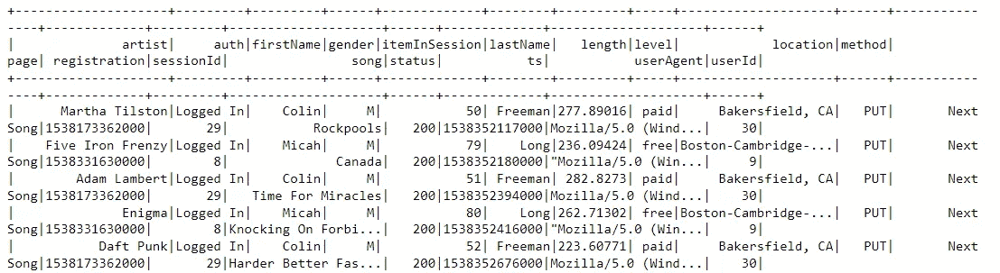
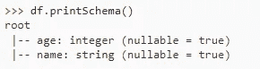
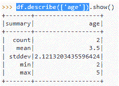
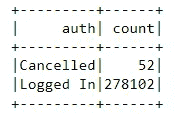

# 用 PySpark 构建机器学习模型

> 原文：<https://blog.devgenius.io/build-a-machine-learning-model-with-pyspark-641cd70b7923?source=collection_archive---------3----------------------->


来源: [RealPython](https://realpython.com/pyspark-intro/)

非分布式的机器学习库已经无法满足企业的业务需求(尤其是流量驱动的技术行业)，将数据库部署到多个节点甚至云端是不可避免的。然而，分布式机器学习对数据、硬件和任务管理提出了挑战。现有的大数据引擎(Spark)已经接管了这些挑战，并且它还为机器学习开发提供了 python 库。与传统的大数据平台相比，Spark 具有以下优势:

*   Spark 通常比 Hadroop 快得多，这是因为 Hadoop 将中间结果写入磁盘，而 Spark 尽可能将中间结果保存在内存中。
*   Spark 拥有多种 API，可以支持 java、python 和 scala 等。
*   Spark 还包含多个其他应用程序的库，如数据分析、图形分析和流式实时数据处理。
*   Spark 不仅可以使用 Hadoop 分布式文件系统 **(** HDFS)，还可以使用其他一些数据存储系统，如亚马逊网络服务(AWS) S3
*   …

本博客将展示 PySpark 如何用于建立机器学习模型，并将使用虚拟流媒体公司的客户流失(取消服务)示例进行演示。本博客感谢 Udacity 提供数据。这个项目的代码可以在[这里](https://github.com/xujiang1993/Customer_Churn_with_PySpark)找到，代码会不断更新，所以如果你喜欢我的 Github，你不会错过任何更新。

# 客户流失预测

## 问题陈述

Sportify 和腾讯音乐等流媒体公司很容易加入或取消服务，从而导致客户流失(客户停止使用服务或产品)。如果能提前预测到客户会流失，就可以提前采取送优惠券等行动留住客户。这个博客将使用 PySpark 来预测客户是否会流失。

## 数据

因为这个演示只在本地工作，所以我为这项工作选择了一个相对较小的数据子集(128MB)(完整的数据集将是 12GB)。本博客中使用的数据包含客户行为的记录(例如，添加朋友、添加到播放列表、下一首歌曲、滚动广告、拇指向下和拇指向上等)、歌曲的详细信息、艺术家、登录设备和事件时间戳。下面是这些记录的简要介绍。



数据的快照

每行数据代表一个用户操作日志，时间戳可以帮助我们对事件进行排序。

## 图书馆

PySpark libaries 包含多个模块。在本博客中， **pyspark.sql** 和 **pyspark.ml** 是数据处理和建模主要使用的库。 **pyspark.sql** 用于数据查询、数据挖掘和数据分析。 **pyspark.ml** 用于管道/模型开发、评估和数据工程。

## 工作流程

使用 PySpark 构建机器学习模型需要以下步骤:

*   **创建一个火花对象**

需要创建一个 Spark 会话，它可以用下面的代码创建

```
spark = SparkSession.builder \
 .master(“local”) \
 .appName(“Sparkify Project”) \
 .getOrCreate()
```

值得注意的是，这个项目是建立在本地模式，因为这是更容易演示和测试。

然后，创建的 Spark 对象可以用来加载数据

```
stack_overflow_data = 'data.json'
df = spark.read.json(stack_overflow_data)
df.persist()
```

persist()是一种优化技术，用于捕获内存中的数据，以便在 PySpark 中进行数据处理

```
df.show()  
df.collect()
```

为了减少计算量，spark 通常使用声明式编程(惰性求值)而不是命令式编程。大多数代码用于建立逻辑/工作流的抽象。如果您想查看代码运行的结果，show()或 collect()函数是触发计算的命令。

*   **数据探索**

此阶段通常会探索一些描述性的统计特征，并将一些特征可视化。常见命令有:

观察变量的数据类型

```
df.printSchema()
```



printSchema()的输出

获取描述性的统计摘要

```
df.describe(['age'])
```



describe()的输出

获取分类特征的计数

```
df.dropDuplicates()\
    .groupBy('auth')\
    .count()\
    .show()
```



groupBy()和 count()的输出

Pyspark 还包含多个内置绘图功能，包括散点图、条形图、饼图、折线图等。他们可以很容易地被谷歌找到。

*   **数据角力**

有两种方式进行数据争论:pandas dataframe 或 sql commands 方式。

**熊猫数据帧**:

这种方式类似于 pandas dataframe，我们可以使用上传的 spark dataframe 数据调用各种函数，包含 **select()** ， **filter()/where()** ， **groupBy()** ， **sort()** ， **dropDuplicates()** ， **withColumn()** 和 **pivot()** 等。它还包含一些聚合函数，可以用来计算一些统计汇总，如 **count()** ， **countDistinct()** ， **avg()** ， **max()** ， **min()** 。最后，PySpark 还为我们提供了用户自定义函数(UDF)并通常与 lambda 函数一起工作(它也可以与自定义函数一起工作)。下面给出了一个例子

```
slen = udf(**lambda** s: len(s), IntegerType())
```

**SQL 方式**:

这种方式可以调用 **sql()** 函数，方便地使用 sql 命令查询数据，对于熟悉 sql 语法的人来说，可以使数据争论的步骤变得更容易。下面给出了一个例子

```
spark.sql('''
          SELECT * 
          FROM data_table 
          LIMIT 5
          '''
          ).show()
```

在这个项目中，我使用 dataframe 的方式进行数据角力，使用大量的聚合函数提取数字特征，使用 **pivot()** 函数生成虚拟列。

值得注意的是，这个项目的任务是预测用户是否有流失的趋势。因此，在进行数据角力时，我们需要将表转换成以 **user_Id** 为主键的表。

*   **标签搅拌**

下一步是生成客户流失的标签。数据的**页**栏记录了客户的**取消确认**和**降级**事件。因此，选择这两个事件作为流失的标签，代码如下

```
#define the flag event udf to transform event to 0 or 1
flag_event = udf(lambda x : 1 if x in {'Cancellation Confirmation', 'Downgrade'} else 0, IntegerType())
#define the current churn or not state
df = df.withColumn('Churn',flag_event('page'))
```

因为数据是用户操作日志，所以在客户流失之前标记活动是值得的，并且 Window()函数对于跟踪这些活动是有用的。下面给出了一个代码示例

```
# label users who have churned
churn_window = Window.partitionBy("userId").rangeBetween(Window.unboundedPreceding, Window.unboundedFollowing)
df = df.withColumn("user_churned", sum('Churn').over(churn_window))
df.show()
```

*   **数据收集**

创建完所有特征后，下一步是将所有特征和标签收集到一个变量中， **join()** 函数很有用。的代码如下所示

```
# numeric features gathering
numeric_features=num_songs_df.join(user_page_df,on='userId',how='outer').join(song_length_df,'userId','outer').join(num_artists_user_df,'userId','outer').join(num_sessions_user_df,'userId','outer').join(reg_df,'userId','outer')# categorical features gathering
categorical_features=userAgent_df.join(gender_df,'userId','outer').join(level_df,'userId','outer').join(location_df,'userId','outer')# Gather all
data=categorical_features.join(numeric_features.select('userId','Numeric_Features'),on='userId',how='outer'.join(label,on='userId',how='outer').drop('userId').fillna(0)
```

值得注意的是，在我们将所有的特性和标签组合在一起之后，我们需要删除 **userId** 。

此外，数字特征通常具有不同的标度，这可能误导机器学习模型。因此，我们通常也希望在将数字特征与其他特征结合之前对其进行规范化。可以使用 **StandardScaler()** 函数进行归一化。在 PySpark 中，大多数变压器要求输入必须是矢量，因此通常需要 **VectorAssembler()** 。也有一些其他的软件包可以用于特征转换，如 **RegexTokenizer()** 、 **Normalizer()** 、 **StandardScaler()** 和 **MinMaxScaler()** 等。本项目中使用的变压器代码如下

```
assembler = VectorAssembler(inputCols=numeric_features.columns[1:], outputCol="Numerical_Features")
numeric_features = assembler.transform(numeric_features)
scaler2 = StandardScaler(inputCol="Numerical_Features", outputCol="Numeric_Features", withStd=True)
scalerModel = scaler2.fit(numeric_features)
numeric_features = scalerModel.transform(numeric_features)
```

*   **建模和评估**

在所有准备活动之后，最后的工作是建立一个机器学习模型来预测用户流失，该任务可以进一步分为以下子任务。

**步骤 1 数据集分割**

randomSplit()函数可用于将收集的数据分成训练集和测试集。

```
train,test = data.randomSplit([0.8, 0.2], seed=50)
```

**第二步构建管道**

那么可以用 pipeline()函数来构造管道

```
pipeline = Pipeline(stages=[transformer1, transformer2, estimator])
```

由于时间有限，本项目直接使用估算器而不是流水线。但是，这个项目已经测试了多个估计器，如逻辑回归、决策树、梯度提升树、随机森林模型、多层感知器分类器和线性向量机。

**步骤 3 调整模型**

这一步是为管道或估计器设置验证方法和参数。为了选择最佳模型，通常使用 gridsearch。为此，使用了 ParamGridBuilder()和 CrossValidator()函数。

```
# parameters
param_grid = ParamGridBuilder().addGrid(model.regParam,[0.0, 0.5]).build()# validator
crossval=CrossValidator(estimator=estimator,estimatorParamMaps=paramGrid,evaluator=MulticlassClassificationEvaluator(),numFolds=3)
```

**第四步评估**

最后一步是评估，通常有两个评估器:**多类分类评估器()**和**二元分类评估器()**。在评估器中，可以选择不同的度量标准，如 f1 值、准确度和假阳性率等。

```
evaluator=BinaryClassificationEvaluator()
    model_results['f1_score'] = evaluator.evaluate(results.select('label','prediction'),{evaluator.metricName: 'f1'})
    model_results['accuracy'] = evaluator.evaluate(results.select('label','prediction'), {evaluator.metricName: "accuracy"})
```

# 调试和优化

由于 PySpark ML 是一个分布式库和惰性评估，代码调试比 scikit-learn 库更困难。数据子集通常会被发送到不同的工作节点进行处理，并且很难跟踪本地情况。其中一个叫做累加器的函数可以用来创建全局变量来跟踪不正确的记录。下面给出了一个例子

```
incorrect_records = SparkContext.accumulator(0,0)
def add_incorrect_record():
   global incorrect_records
   incorrect_records +=1
correct_ts = udf(lambda x: 1 if x.isdigit() else add_incorrect_record())
data = data.withColumn("ts_digit",correct_ts(data.ts))
```

除了 accumulator 之外，Web UI(Spark 内置用户界面)是另一种调试方式，它显示集群的状态、配置和任何最近作业的状态。端口 8080 可用于连接 WebUI。

这个博客使用本地模式，所以在这个项目中不需要调试方法，但它对其他模式非常有用。我将在未来创建另一个博客来讨论模式和调试的事情。

# 结论

随着数据爆炸或昂贵但有效的算法出现，分布式机器学习对于商业和数据分析将变得更加重要。这篇博客展示了如何使用 PySpark 来建立和找到一个最佳机器学习模型来预测客户流失。这项工作仅用于指导，因此准确性仍有提高的空间(特别是对于完整的 12GB 数据集)。订阅我，我将尝试创建另一个博客来描述云的后续工作。最后，如果你能点击**鼓掌**来支持我的博客，我会非常感激，我会继续围绕数据科学或一些热点领域制作更多有趣的内容。