# 制作一个多项选择的琐事游戏——做出反应

> 原文：<https://blog.devgenius.io/build-a-multiple-choice-trivia-game-react-61ee0f5bcf12?source=collection_archive---------7----------------------->

我对源于琐事的交互式用户体验的解决方案。

如果你正在构建一个单页面应用程序，一个简单的小游戏是进一步吸引你的观众的好工具。在这个简短的教程中，我将解释一些我喜欢在 React 应用程序中构建的简单琐事游戏中使用的概念。

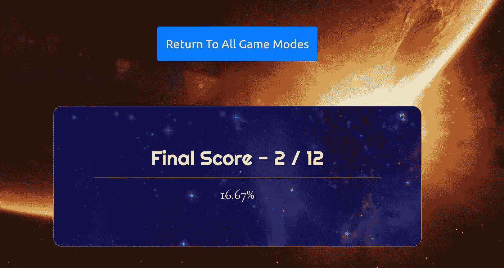

我需要为这一个学习…

# 在我们开始之前…

总是概述你想要添加到你的应用程序的琐事游戏是有帮助的。您应该考虑测验的大小，是否有时间限制，UI 是否会随着测验的进行而更新，UX 是否会根据用户的表现而变化，等等。像编程中的所有事情一样，一些预先计划可以在编码开始之前帮助弥补弱点，并且无疑会在构建应用程序时节省时间和精力。

# 组织您的文件系统…

当谈到他们在应用程序中使用的布局时，许多人有他们自己的组织系统，我将提供我的一个简短的概述。如果您在家学习，React 将用于构建整个应用程序，包括琐事部分。在**src** 文件夹中，我总是添加一个 **components** 文件夹来保存我的应用程序的每个单独的组件，如果你是 React 新手，这可能是一种相对较新的参与文件结构的方式，但以这种方式开始布局 React 应用程序是有帮助的。

在 components 文件夹中，添加一个带有 index.js 和 style.css 的**游戏**组件，更高级的用户会理所当然地认为游戏中可以有几个不同的子组件，而不是一个。js 文件，以便重用和更容易维护，尽管在本练习中我们不会进一步分解该文件。

在本教程中，我们将从直接编码到应用程序中的 JSON 文件中提取我们的问题和答案。这对于学习来说非常好，因为它很容易连接起来，而且不需要创建数据库，但是这意味着使用 GitHub 将显示你的答案，以及各种其他问题，如果你更愿意使用数据库，我鼓励你这样做。如果你像我一样跳过 DB，在组件的同一层添加一个 **json** 文件夹，然后在该文件夹中创建一个新的 json 文件，类似 earthGame.json。

如果你正在编码，你的文件结构应该看起来像这样…

> *src*
> 
> *//组件*
> 
> *// //游戏*
> 
> *// // // index.js*
> 
> ///////style . CSS
> 
> *// json*
> 
> *// //earthGame.json*

# 添加问题和答案…

如果你已经想好了你想问的问题以及它们的适当答案，这一部分应该会很快。您将希望将这些信息添加到游戏的 json 文件中，本质上需要创建一个对象数组，每个对象包括所有问题和一个正确答案的字段，参见下面的示例。

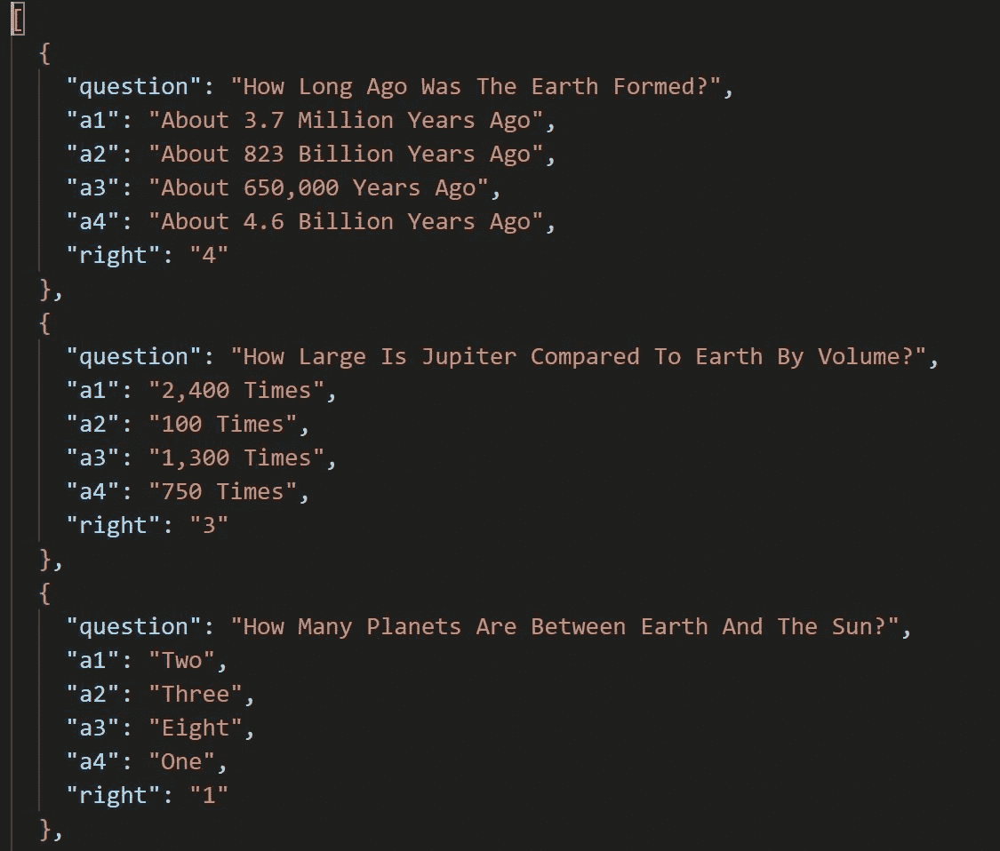

你能猜出这个版本的游戏是关于哪个星球的吗？

正如你所看到的，我发现有一个简单的设置非常有用，它询问问题，提供一系列选项，这些选项将在用户玩游戏时显示给用户，以及一个“正确”值，该值对应于正确的答案，因此对于第一个问题，第 4 个(a4)答案是正确的，而在第二个问题中，第 3 个(a3)答案是正确的。

# 回到游戏组件…

游戏组件是我们接下来要讨论的，我们将实现 JSX 来让琐事游戏正常运行。如果 JSX 和 React 对你来说是新的，不要担心，只要知道 JSX 本质上是 HTML 和 JavaScript 的结合，我们在 React 中使用它来构建我们的组件并最终构建我们的用户体验。

确保导入 React { Component }，你的 earthGame json 文件和你的样式表。

在本教程中，我们使用有状态的组件或类，尽管如果您选择使用功能组件和 React 钩子，同样的原则也适用，但是当我最初构建这个应用程序时，我对钩子的理解还不够基本，所以我选择了类。阅读 [**这篇**](https://medium.com/@cgcrutch18/stateful-vs-stateless-react-components-13f647f7fc4#:~:text=It%20is%20created%20by%20extending,properties%20on%20a%20props%20object.) 的好文章，了解关于类和功能组件的更多信息。

在添加游戏类并导出之后，是时候设置状态了，这将允许我们跟踪用户给出的答案，以及游戏是否已经开始，用户的分数是多少等等。在 React 中，状态是一个非常强大的概念，在我看来，这也是这个库被广泛使用的主要原因。

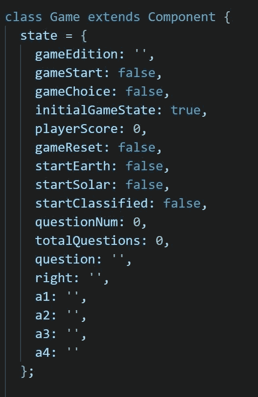

状态对于决定用户体验是非常重要的

我已经包含了一个我在构建应用程序时使用的状态的例子，尽管不是所有的字段都是必需的，例如，如果你只是托管一个游戏的“分类”,你不需要在状态中包含 gameEdition，也不需要编写逻辑来判断正在玩的游戏的版本。

如果您希望用户能够再次玩游戏，这是有帮助的，包括一个重置值，以及如果游戏已经开始，当这些值改变时，用户界面将随之改变。

对于这个例子，假设只有 earthGame 被引入到组件中，所以不需要设置额外的参数来决定加载哪些问题。

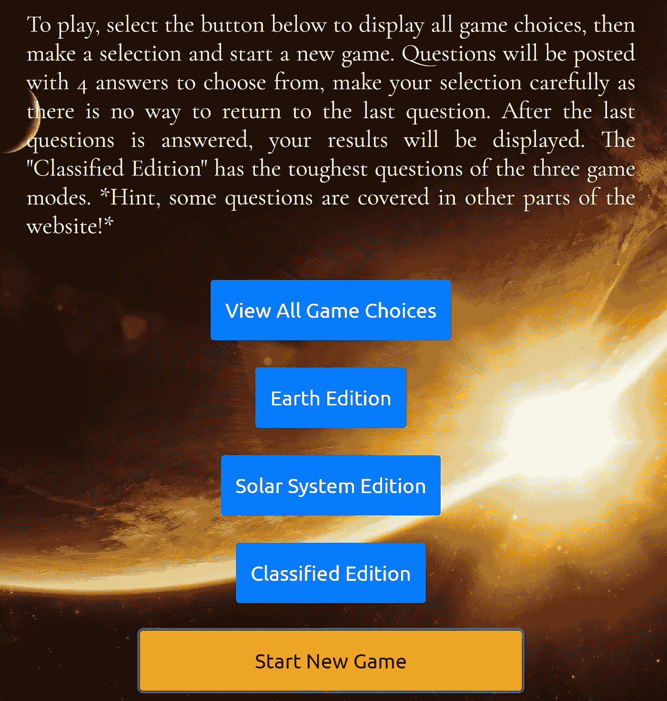

我花了太多时间来为分类版寻找问题

类似地，让我们假设只有地球版存在，一旦你点击地球版，开始新游戏按钮出现，可以点击。如果你想让“开始”按钮只在用户选择了游戏类型后出现，你可以添加在点击地球版后触发的状态值，下面有更多的例子。

接下来的四个图像概述了游戏如何开始，在这种情况下，需要用户选择地球版，然后开始新的游戏。一旦这个过程完成，因为我们的状态现在反映了用户打算玩 Earth Edition，所以可以从导入的 JSON 文件中抓取适当的问题来显示。

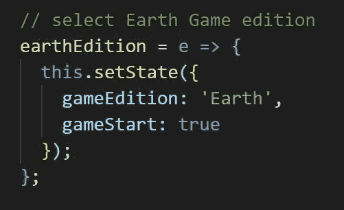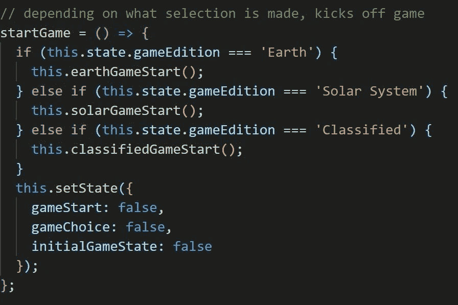

左上—步骤 1，用户指示游戏将是地球版|右上—步骤 2，地球处于 gameEdition，startGame 然后开始，其他状态被修改。

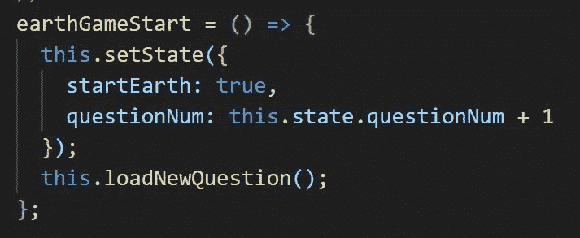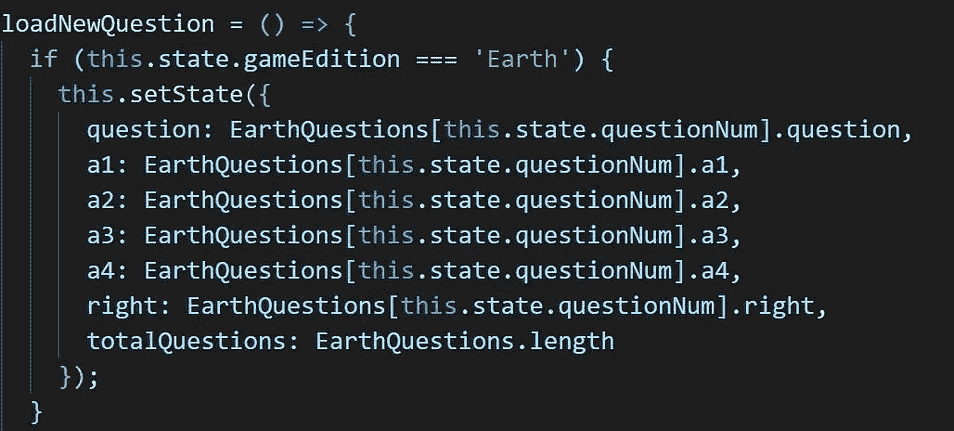

左下角—步骤 3，地球游戏现在已经开始，将加载一个新问题|右下角—步骤 4，在多个区域更新状态，以反映所提问题、四个选项、正确答案和问题总数。

从上面的代码中可以看出，只要用户点击地球版按钮，其余的代码就会被启动，这可以通过一个包含 onClick 的按钮来实现，例如

接下来，我们必须在每次用户选择答案时更新前端的应用程序，我们还将快速检查所选答案是否正确，在这种情况下，我们还将更新 UI 以显示一个进度条，该进度条随着问题的回答而填充，显示当前游戏的整体进度。我把我的代码贴在下面了…

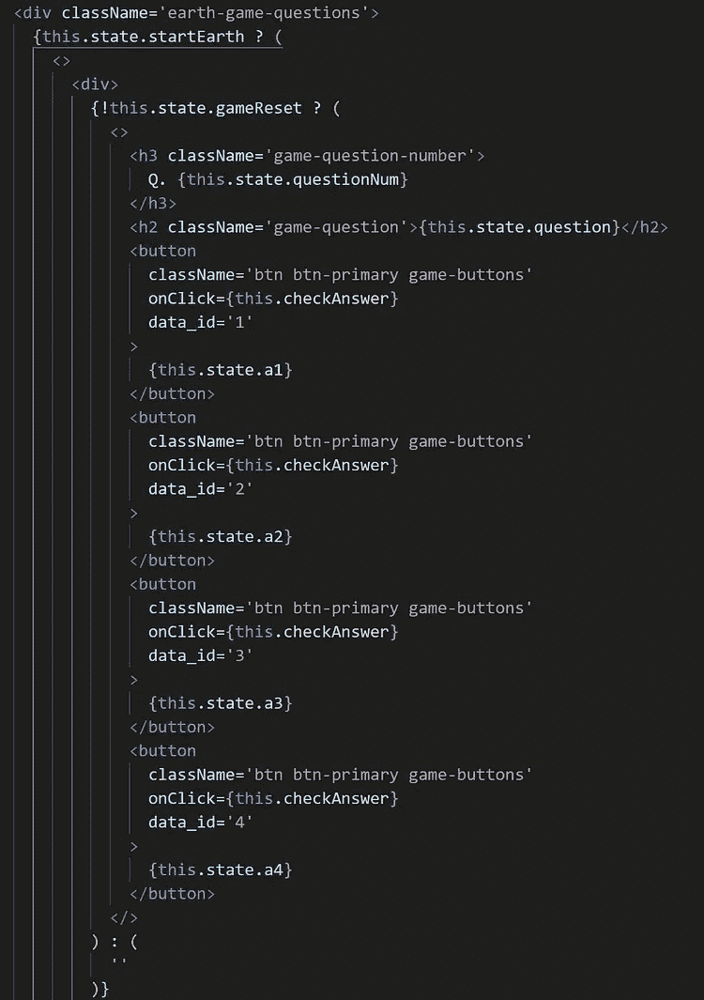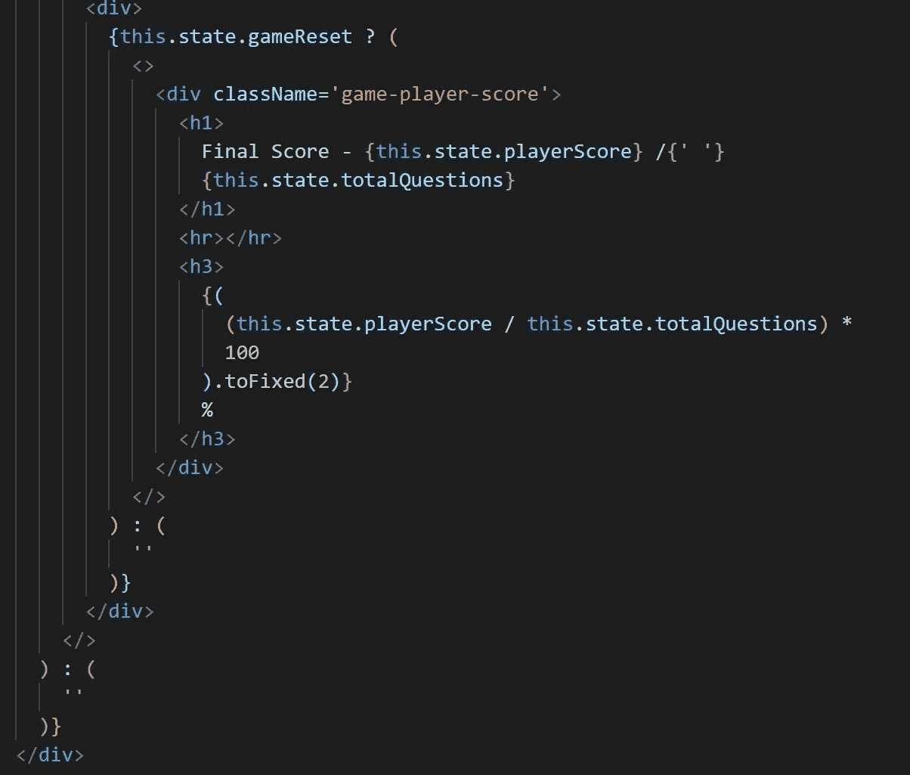

左上角—地球问题部分的开始|右上角—根据游戏设置的状态，以原始数字和总百分比显示最终分数，这些分数将根据游戏开始时计算的总问题数而变化。

您会注意到，每个问题都显示了问题和四个可能的答案，并且每个都有一个从 1 到 4 的唯一 data_id 属性，这个值是我们决定答案是否正确的方式，并且在创建测验内容时会与我们存储在 JSON 文件中的“正确”键值对进行比较。无论用户点击哪个答案，都会调用 checkAnswer 函数，如果 data_id 匹配“正确”的答案，我们就会更新 playerScore 状态。

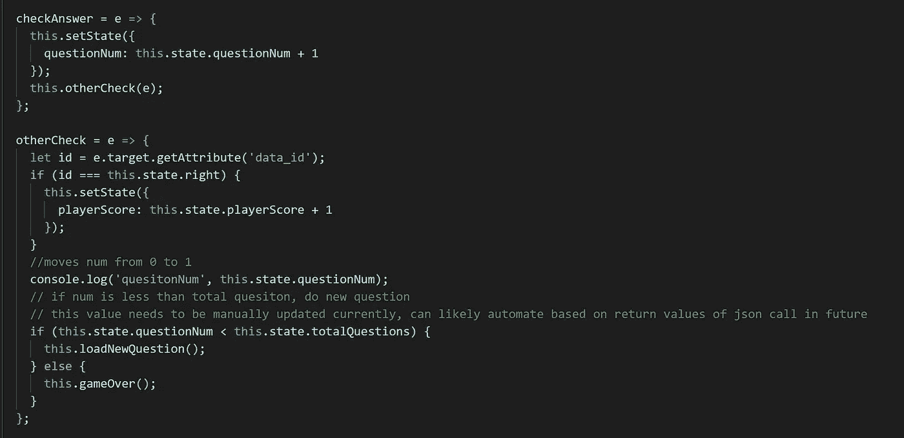

请原谅那些相当糟糕的评论，并且总是努力拥有你自己的非常描述性的评论！

您可以看到 checkAnswer 首先被调用，它增加了总的 questionNum，同时将事件(按钮单击)传递给 otherCheck(哇，请比我更清楚地命名您的函数)。然后，otherCheck 判断 JSON 值中的 id 和“right”键值是否相同，如果相同，则用户的分数上升，如果不相同，则什么都不会发生。最后，只要 questionNum 或下一个问题的结果不大于在游戏开始时计算的 totalQuestions 的值，就会开始新的问题，否则将调用 gameOver 函数。一旦 gameOver 被调用，用户就会看到他们的最终得分。

最后要注意的是，如果你一直在浏览代码，你可能会发现在某个时候 totalQuestions 和 questionNum 被用来做一个浮动的进度条。代码和输出发布在下面。请注意，只有当 this.state.gameReset 为 false，questionNum 大于 1，并且至少有一个游戏版本为 true 时，才会显示。你可以非常有创造性地设置必须满足的条件，以使 UI 的某些元素可用，这是我非常喜欢使用 react 构建 web 应用程序的原因之一。

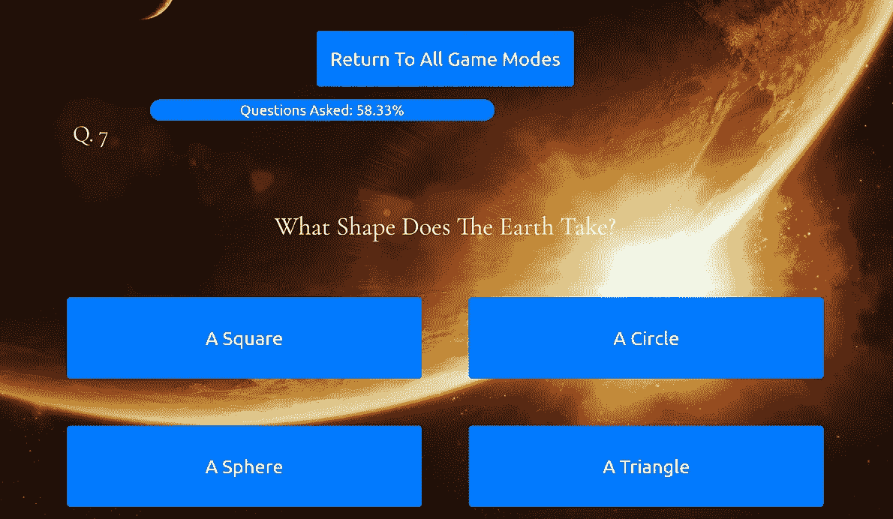

我保证游戏的后续版本会变得更有挑战性。

好了，至少在大多数情况下，现在是你编写琐事游戏的时候了，请记住，这只是完成将琐事游戏添加到应用程序的任务的一种方式，编程的奇妙之处在于，几乎有各种方法来解决任何问题，所以发挥创造力吧！

# 总结想法…

感谢你通读这篇文章，我知道它有点乱，但我很高兴能构建这个应用程序，并认为琐事部分是我最喜欢构建的部分之一。如果有任何问题或意见，请随时联系我，twitter 是联系我获取更多信息的好方法。

如果你想看看我们的太阳系，包括这个小游戏和一些其他版本的应用程序，你可以在这里找到…【https://sheltered-anchorage-22057.herokuapp.com/

编码快乐！