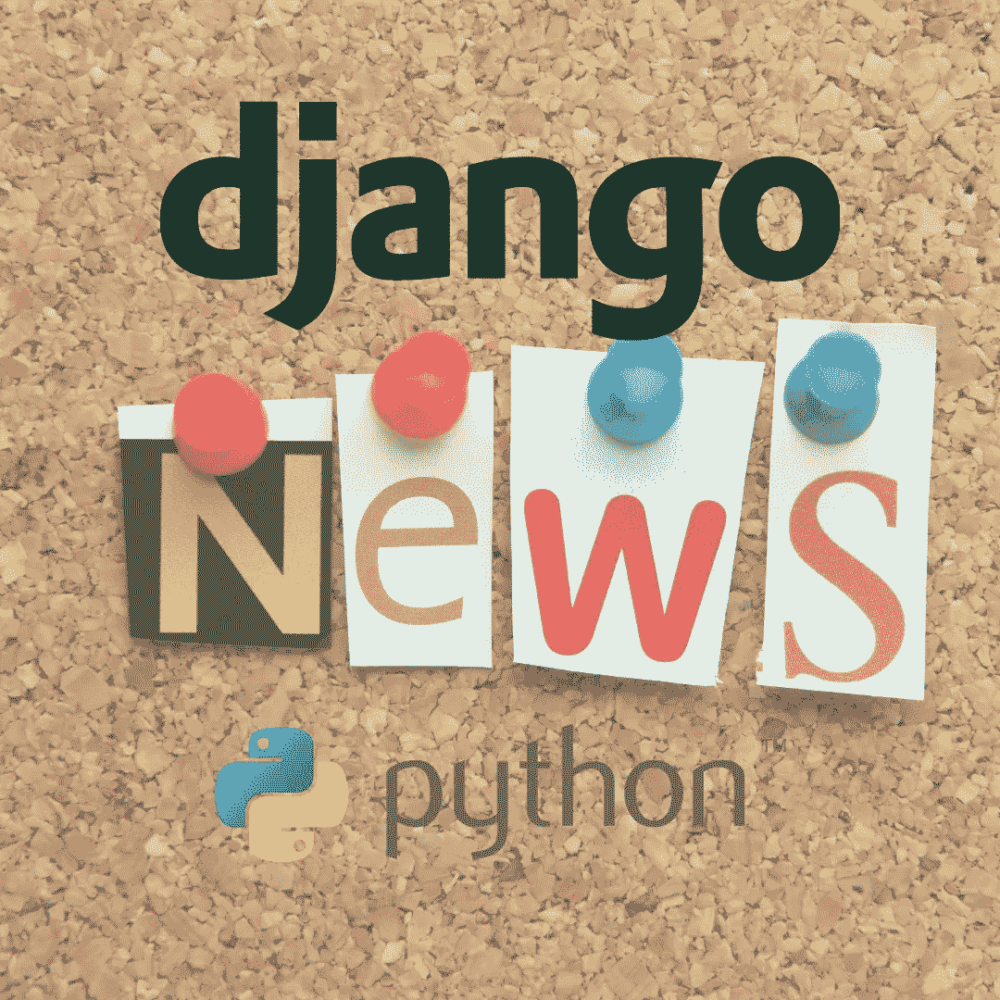
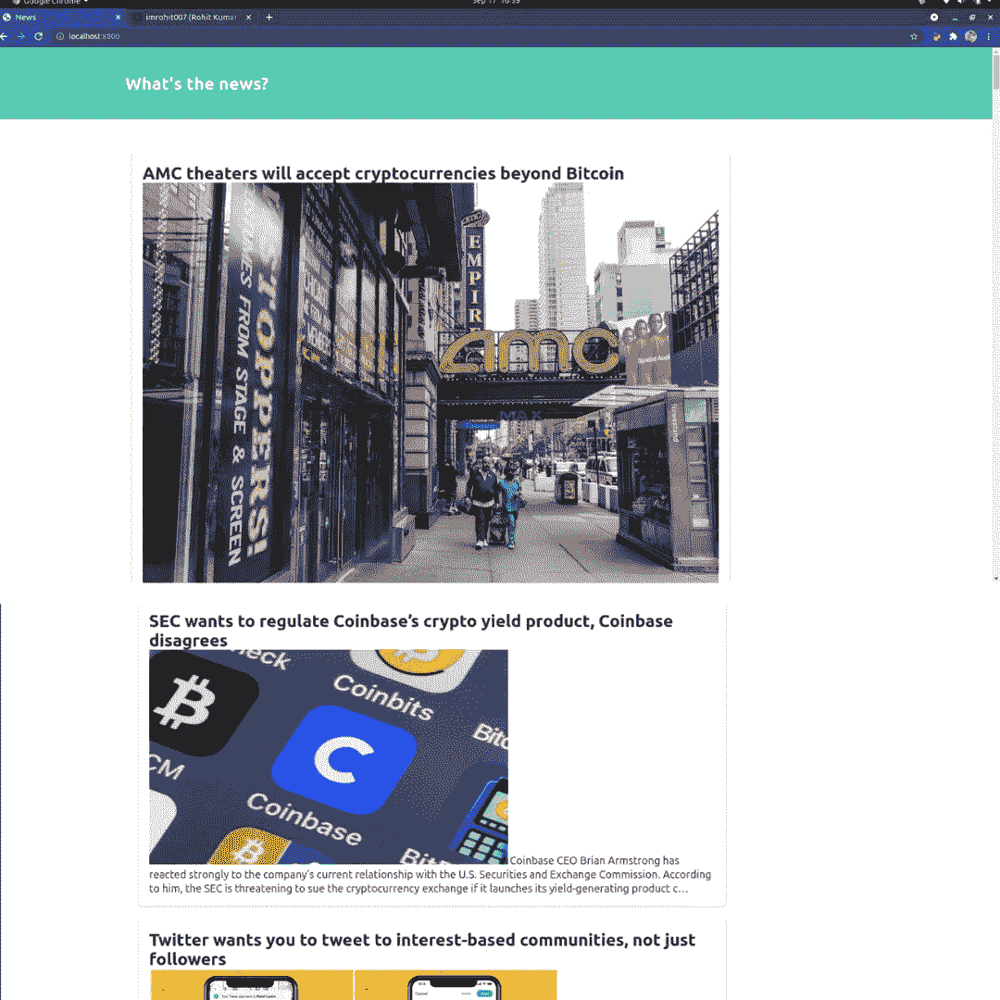
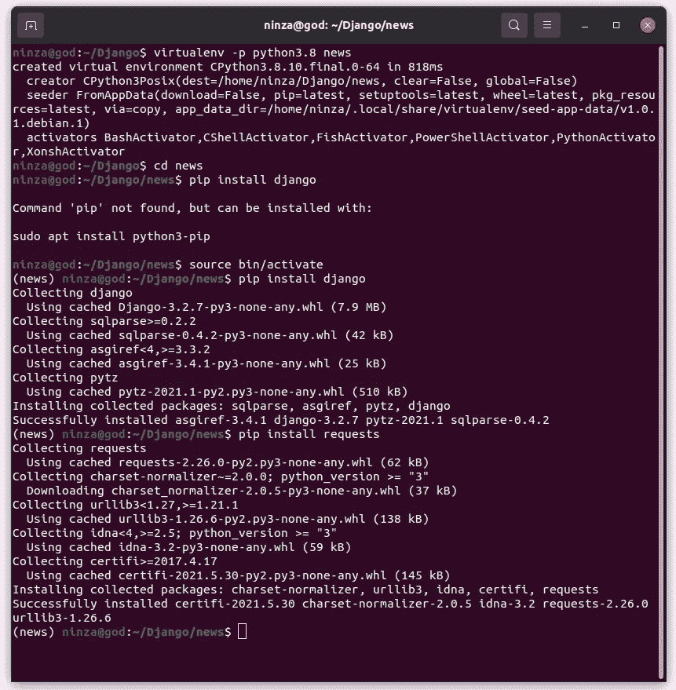
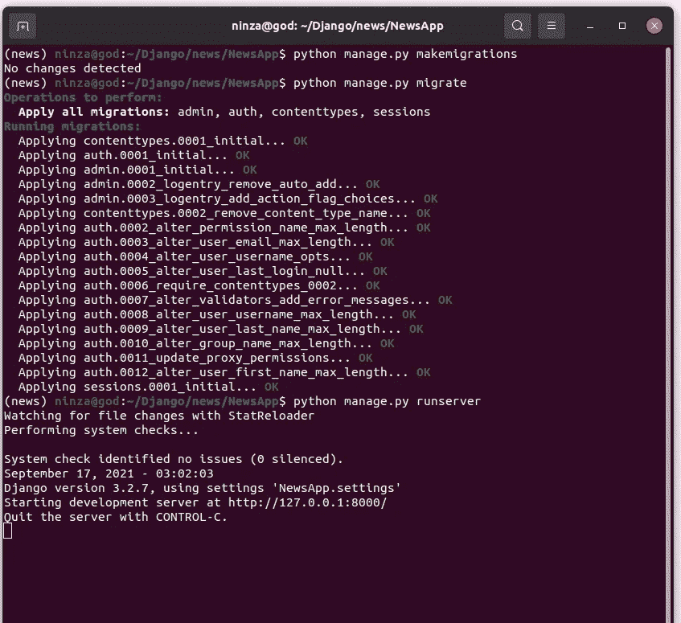

# 用 Django 和 Python 构建一个新闻应用

> 原文：<https://blog.devgenius.io/build-a-news-app-using-django-python-3e209fdb0913?source=collection_archive---------0----------------------->

## Django 针对初学者和中间用户的项目



使用 Django 的新闻应用程序

# 项目概述

使用 Django 的新闻应用程序是一个初级和中级水平的项目。我们将在虚拟环境中制作这个项目，然后从新闻 API 获取新闻。最后，我们将做一点造型。

## 项目的成果



使用 Django 和新闻 API 的新闻应用程序

我们最终的结果看起来会和上面的图片一模一样。

如果您正在寻找视频教程，那么它就在这里:

# 项目设置和安装

总是尝试在虚拟环境中启动您的 Django 项目。作为一名 python 开发人员，在虚拟环境中制作项目是一个好习惯。如果你不知道如何在虚拟环境中开始一个 Django 项目，那么[这里有一个链接](https://python.plainenglish.io/make-your-first-web-app-with-django-python-in-a-virtual-environment-4cce2241031d)可以帮助你。它同时适用于 Windows 和 Linux 用户。

打开您选择的目录并运行下面的命令。

```
virtualenv -p python3.8 news
cd news
source bin/activate
```

现在，在同一个目录中安装 Django 和我们将在这个项目中使用的其他库。

```
pip install django
pip install requests
```



使用 Django 的新闻应用程序

在同一个目录中启动一个 Django 项目。

```
django-admin startproject NewsApp
cd NewsApp
python manage.py startapp MainApp
```

完成上述步骤后，您的 Django 项目就准备好了。

## 新闻 API

在这个项目中，我们将使用 [NewsAPI](https://newsapi.org/) 的 API。你只需要在这里开个账户。之后，你会得到一个 API 密匙。我们将使用那个 API 键来获取新闻数据。您可以从这个 API 获取趋势标题、世界新闻或特定主题的新闻。请记住，API 密钥是不可共享的。所以，请保守这个秘密。

我们已经完成了项目设置和安装。让我们转到代码部分。

# 天气 App 代码

我将在本文末尾提供该项目的源代码。现在，让我们一步一步地编码。

我们没有在数据库中存储任何新闻，因为我们将从 API 中获取它。所以，让模型空着。

## MainApp

**views.py**

```
from django.shortcuts import render
import requests# Create your views here.def index(request):url = '[https://newsapi.org/v2/everything?q=Cryptocurrency&from=2021-09-08&sortBy=popularity&apiKey=NEWS_API'](https://newsapi.org/v2/everything?q=Cryptocurrency&from=2021-09-08&sortBy=popularity&apiKey=NEWS_API')crypto_news = requests.get(url).json()a = crypto_news['articles']
    desc =[]
    title =[]
    img =[]for i in range(len(a)):
        f = a[i]
        title.append(f['title'])
        desc.append(f['description'])
        img.append(f['urlToImage'])
    mylist = zip(title, desc, img)context = {'mylist': mylist}return render(request, 'index.html', context)
```

*   导入所需的库。
*   定义一个索引函数。在函数中，将您的 API 密钥添加到 URL。
*   我们以 JSON 格式获取新闻。
*   如果查看 NEWS API 的文档，新闻数据存储在“articles”数组中。我们将使用该数组。首先，把它拿来。然后从新闻 API 中定义我们需要的信息，并将这些信息存储在一个数组中。在这个项目中，我们需要新闻的描述、标题和图像。
*   现在，将数据追加到各自的数组中。
*   呈现 HTML 模板。

**urls.py**

在 MainApp 中创建一个 urls.py 文件，并添加以下代码。

```
from django.urls import path
from . import viewsurlpatterns = [
    path('', views.index),
]
```

我们已经完成了 MainApp。

查看该项目的 Github Repo 中的模板代码。链接在下面。

## NewsApp

**urls.py**

```
from django.contrib import admin
from django.urls import path, include  #add
urlpatterns = [
    path('admin/', admin.site.urls),
    path('', include('MainApp.urls')), #add
]
```

添加主应用程序的 URL。

**settings.py**

```
INSTALLED_APPS = [
    'django.contrib.admin',
    'django.contrib.auth',
    'django.contrib.contenttypes',
    'django.contrib.sessions',
    'django.contrib.messages',
    'django.contrib.staticfiles', 'MainApp' #add 
]
```

将您的应用添加到“已安装的应用”部分。我们现在可以走了。
打开命令提示符并运行以下命令:

```
python manage.py makemigrations
python manage.py migrate
python manage.py runserver
```



新闻应用 Django

您将在终端或命令提示符屏幕上看到类似这样的内容。现在打开你的浏览器，输入给定的网址。

```
localhost:8000
```

现在，当你点击 enter 键时，你将只能在浏览器屏幕上看到与加密货币相关的新闻。因为我们在 views.py 的 URL 中将查询设置为 cryptocurrency，将查询更改为世界新闻、足球新闻、板球新闻、头条新闻或您想要了解的任何特定新闻领域。你会在屏幕上看到这条新闻。

```
url = '[https://newsapi.org/v2/everything?q=**Cryptocurrency**&from=2021-09-08&sortBy=popularity&apiKey=NEWS_API'](https://newsapi.org/v2/everything?q=Cryptocurrency&from=2021-09-08&sortBy=popularity&apiKey=NEWS_API')
```

**天气 app 的 Github 代码是** [**这里是**](https://github.com/imrohit007/Django-News-App) **。**

就是这样。

感谢您的阅读。如果这篇文章内容丰富，请确保关注并与您的社区分享，并关注更多内容。

查看更多 Django 项目，链接在下面。

[**在虚拟环境中用 Django: Python 制作你的第一个 Web 应用**](https://python.plainenglish.io/make-your-first-web-app-with-django-python-in-a-virtual-environment-4cce2241031d)

[**用 Django 和 Python 构建一个天气 App**](https://python.plainenglish.io/weather-app-using-django-be98cfb33508)

[**使用 Django Rest 框架构建待办事项 API**](https://ninza7.medium.com/to-do-list-api-in-django-rest-framework-632c555e6fd2)

[**如何使用 Django rest 框架制作基于令牌的 Auth Rest API**](https://ninza7.medium.com/how-to-make-token-based-auth-rest-api-using-django-rest-framework-89ff533e2d70)

编码快乐！

你好，我叫 Rohit Kumar Thakur。我对自由职业持开放态度。我构建了 **react 原生项目**，目前正在开发 **Python Django** 。请随时通过**freelance . rohit 7(at)Gmail . com 联系我**