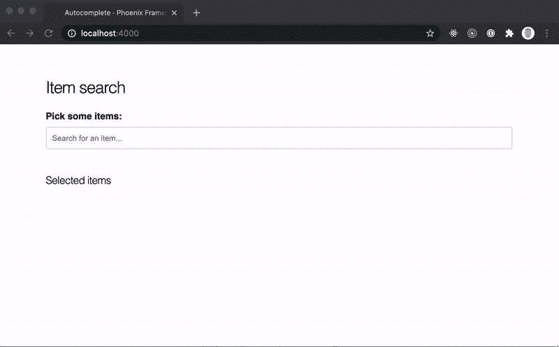
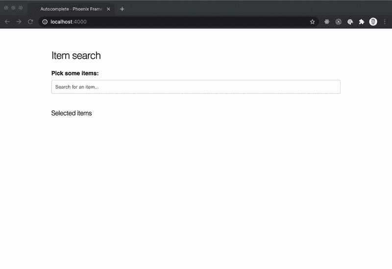

# 使用 Phoenix LiveView 和 Alpine.js 构建高性能的自动完成功能

> 原文：<https://blog.devgenius.io/build-a-performat-autocomplete-using-phoenix-liveview-and-alpine-js-8bcbbed17ba7?source=collection_archive---------1----------------------->

照片由[内特·格兰特](https://unsplash.com/@nateggrant?utm_source=medium&utm_medium=referral)在 [Unsplash](https://unsplash.com?utm_source=medium&utm_medium=referral) 拍摄

人们可能会认为创建一个自动完成(或提前键入)字段已经解决了无数次了。是的，有很多关于 React、Vue、Angular 或其他现代前端框架的教程。此外，在 Phoenix LiveView 中也有一些这样的处理方法:

*   [将 React 换成 Phoenix LiveView](https://medium.com/qixxit-development/swapping-react-for-phoenix-liveview-db6581f27a14)
*   凤凰号的创造者克里斯·麦考德亲自开发的交互式实时应用。
*   甚至在官方[凤凰 _ 直播 _ 查看 _ 实例回购](https://github.com/chrismccord/phoenix_live_view_example/blob/master/lib/demo_web/live/search_live.ex)。

可能还有更多，但是我到目前为止发现的所有例子都使用了 HTML `datalist`元素。它得到了广泛的支持，对于简单的用例来说很好，但是一旦你想以某种方式设计它来显示额外的上下文数据(例如图像)，你将会遇到困难。

因此，我们现在要构建自己的自动完成功能。我们的自动完成功能将从某种游戏物品数据库中搜索物品。我们使用 Phonix LiveView 和 Alpine.js 来避免不必要的服务器往返。这将提供一个更好的整体 UX，并使自动完成更快。

这就是最终的结果。最好的事情是，整个解决方案仅在 **140 LOC** 左右(这很好，不是吗？).

我们惊人的自动完成🎉

如果你很急，也可以直接从 GitHub 抓取[完整代码。](https://github.com/benvp/liveview_autocomplete)

# 让我们(最终)建造它。

我希望你知道如何设置一个新的 Phoenix LiveView 项目，所以我不会指导你。但是在我们真正开始黑客之前，我们必须做一些漂亮的设置。

[Alpine.js](https://github.com/alpinejs/alpine) 是一个 JavaScript 依赖，我们将需要它来处理一些客户端的东西，而不需要服务器往返。所以让我们先安装它。

要让 Phoenix 与 Alpine.js 很好地协同工作，还需要做一件事。导入 Alpine.js 并确保它可以跟踪 DOM 元素，即使 Phoenix LiveView 确实移动了它们。转到您的`assets/js/app.js`并添加以下内容:

# 创造一些有用的东西。

既然我们已经想好了设置的东西，让我们创建一个模块作为我们的小物品数据库。把这个放进`lib/autocomplete/items.ex`

现在我们有了一个小小的物品数据库，我们可以获取所有物品或单个物品。

为实际的自动完成创建一个 LiveView 模块和一个`leex`模板。我喜欢在这里将模板与实际的业务逻辑分开，但是您当然可以将 HTML 添加到 LiveView 模块内的`render`函数中。

`lib/autocomplete_web/live/item_search_live.ex`和`lib/autocomplete_web/live_item_search_live.html.leex`

在向这些模块添加代码之前，将路由器指向它。

让我们用它的初始状态来设置 LiveView 模块。

这将确保我们用一些初始数据初始化我们的页面。在生产应用程序中，在初始渲染时只获取一小部分项目，或者推迟到用户聚焦该字段时，这可能是有意义的。但是让我们大胆一点，把所有的物品都拿来*。*

仍然缺少`leex`模板。我们在`form`标签中使用了一个基本的`input`字段。建议将显示在一个无序列表`ul`中，每个条目由一个`li`元素表示(我知道，条目可能应该是一个可访问性按钮，但是我们不这样做😜).

建议列表应该只在用户聚焦字段时显示，并且如果我们有任何基于搜索词的结果。

我将省略这篇文章中的 CSS，因为它只是样板文件。你可以在这里查找 CSS 类[。](https://github.com/benvp/liveview_autocomplete/blob/master/assets/css/autocomplete.scss)

遗憾的是 GitHub Gist 不支持 LEEx ️😢

该模板混合了 Alpine.js 代码和嵌入的 Elixir。我们不想跟踪服务器上弹出建议的打开/关闭状态。这由 alpine 使用`autocomplete`函数来处理。我们使用 autocomplete 容器上的`x-data="autocomplete()"`属性来绑定它。我们希望当用户点击我们的自动完成字段之外的任何地方时关闭弹出窗口——这就是`@click.away="close"`所做的。

进一步向下移动，当有任何建议可用时，`suggestions`容器将被呈现(我们之前在`mount`中设置了这个)。它还通过`x-show="isOpen"`控制能见度。

然后，我们使用`for`理解来迭代所有建议，以显示列表中的所有建议。LiveView 要求我们给每个元素分配一个`id`，这样它就可以根据服务器所做的更改来引用它。

为了使项目可选，我们需要添加一些 LiveView 事件属性。那就是`phx-change="suggest"`和`phx-click="select"`了。为了防止表单提交(例如，当用户点击回车键时)，我们还需要通过添加`phx-submit="submit"`来处理提交事件。

容器的第二部分显示所有选中的项目，应该是不言自明的。

为了处理服务器上的事件，我们在`AutocompleteLive`模块中添加了相应的`handle_event`函数。

`handle_event`函数模式匹配搜索字符串，该字符串是通过我们之前添加的`phx_change`事件发送的。然后，它从`Items`模块获取所有项目，并使用`suggest`函数过滤结果。`suggest`函数执行简单的不区分大小写的搜索。

接下来，我们应该处理`select`事件。

同样，我们对参数进行模式匹配(在本例中为`id`)并从`Items`模块中获取所选的项目。为了填充所有选定项目的列表，我们将新项目重新扩展到现有选定项目的列表中。此外，我们通过调用`Enum.uniq_by`来确保没有添加重复项。

我们不希望`suggestions`包含任何选定的项目。因此，我们创建了一个`filter_selected/2`函数，它从第二个参数中包含的给定的`items`中删除任何现有的项目——基于它的`id`。

如前所述，需要处理`submit`事件，以防止用户点击 *Enter* 键时的默认提交行为。这就像添加一个`handle_event`回调并简单地返回套接字一样简单。

就是这样。我们现在应该有一个工作原型，允许我们搜索项目并通过单击选择它们。厉害！🎉

…但是它还不是很漂亮，不是吗？我们仍有可以改进的地方:

*   当用户用鼠标悬停时显示适当的突出显示
*   通过*向上-* 和*向下箭头*键导航
*   点击*输入*键选择一个项目

这就是我们接下来要做的。

# 美化环境—改善 UX。

让我们先从最简单的事情开始:当用户将鼠标悬停在上面时，显示一个适当的*高亮。*

我们希望在客户端直接处理选择，而不是在服务器上，因为这是一个纯粹的客户端的事情。为了在以后实现键盘导航，我们不能依赖 CSS 类，必须管理我们自己的悬停/焦点状态。

添加鼠标悬停焦点非常简单:

通过在我们的`autocomplete`函数上添加一个`focus`属性，我们可以依靠它将相应的类应用到建议项。一旦鼠标移动到建议上，`@mouseenter`属性将负责设置正确的焦点。

很好。现在我们要添加键盘支持。

添加键盘支持是通过向`autocomplete`函数添加三个用于管理焦点状态的新函数来实现的。

**scrollTo(idx)** :使用 Alpin.js `$refs`对象滚动到给定的索引。如果 ref 确实存在，它将调用元素上的`scrollIntoView(false)`。这将把聚焦的项目滚动到视图中，而没有任何动画。

**focusNext():** 如果建议框可见且下一个元素索引小于建议总数，则将焦点设置到下一个元素，并将其滚动到视图中。

**focusPrev():** 如果前一个索引不小于 0，则将焦点设置到前一个元素，并将其滚动到视图中。

然后我们用两个事件属性`arrow-up`和`arrow-down`连接自动完成容器`div`。

接下来:点击*选择当前建议，输入*:

那也简单。我唯一不百分之百满意的是，我们需要依赖一个`$ref`并手动触发建议的点击事件。我还没找到任何官方 api。它目前只在一个[钩子](https://hexdocs.pm/phoenix_live_view/js-interop.html#client-hooks)的范围内被支持，但是这似乎让事情变得更复杂了。也许会有一个公共 api 把事件推到 hook 范围之外的服务器上。目前，这是一个可以接受的变通办法。

如果你有更好的想法，我会很高兴你能在 twitter [@benvp_](https://twitter.com/benvp_) 上发表评论或给我发消息。

**就这样。我们成功了！我们设法在大约 *140 LOC* 中创建了一个带有自定义建议列表的全功能自动完成功能，包括服务器端代码。**

老实说，我认为这是一个很大的成就，如果你将它与使用客户端框架(如 React)和单独的 API 来实现它的努力相比较的话。如果您进一步考虑验证，这将节省大量时间。我对 LiveView 和 Elixir 的未来感到兴奋。

干杯，本。