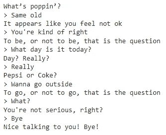

# 用 Python 构建一个聊天应用程序

> 原文：<https://blog.devgenius.io/build-a-phatic-dialogue-small-talk-app-with-python-840ef42e3727?source=collection_archive---------9----------------------->

# 介绍

寒暄对话是两个人之间毫无意义的谈话，通常被称为闲聊。在这篇文章中，我们将创建一个应用程序，以一种友好的方式响应用户的输入。

我们将使用一些基本的 NLP 工具来提取用户句子的核心词汇成分。这些构件将被嵌入到我们自己的反应模式中。

# 先决条件

使用以下命令安装 spacy NLP 工具库和 en_core_web_sm 英语管道:

# 导入和全局变量

下一步是导入必要的库并初始化全局变量。

虽然 **spacy** 为我们提供了词法分析工具，但 **textblob** 是分析文本情感极性的绝佳工具。它的伟大之处在于它甚至可以和独立的单词一起使用。

现在，让我们深入编码。

# 名词

第一个响应模式的想法是从用户输入中提取名词和专有名词，并将它们与我们准备好的短语连接起来。这种技术叫做反射或**镜像**。

get_nouns()方法返回文章中的名词和专有名词的列表。

# 动词

> 做**是**，还是不做**是**，这是个问题。

《哈姆雷特》中的这句名言包含了一个助动词 ***be*** ，，但是我们可以用任何动词来代替，听起来就像《哈姆雷特》一样新奇。

在 get_verb_lemmas()中，我们提取动词和助动词，并返回一个动词 lemmas 列表(裸不定式)。

# 形容词

每个形容词都有积极、消极或中性的情绪。一个绝对积极的形容词的情感极性接近 1，而一个绝对消极的形容词-1。比如*优秀的* (0.85)，自夸的*(-0.78)。*

给定形容词的情感极性值(从-1 到 1 的连续范围)，我们将决定告诉用户他或她的感受。

我们现在已经准备好把它们放在一起。

# 驱动程序

在处理用户输入的无限循环中有四个主要部分。

在第一部分，用户被提示输入他们的文本。然后检查是否该说再见了。

第二部分是关于分析用户的输入。

第三部分的三个条件语句检查是否找到了动词、名词或形容词。如果是，它们将被处理，产生的短语将被添加到候选响应列表中。

在最后一部分，我们检查 response_candidates 列表中是否有任何元素。如果没有，它充满了虚假的短语。

下面是驱动函数的完整代码:

# 对话示例

用户提示以>开头

# 结论

本文讨论了一些基本的 NLP 概念，并建议如何将它们整合到一个 phatic dialogue 应用程序中。

*本文代码笔记本* [*此处*](https://github.com/Vice10/ds_notebooks/blob/main/phatic_dialogue.ipynb) *。*