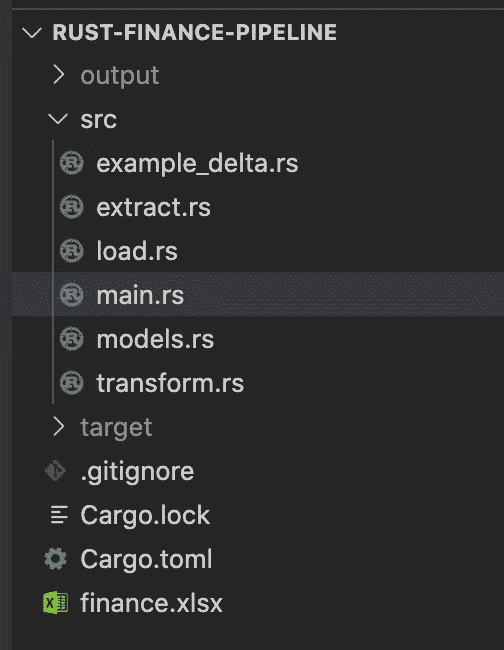
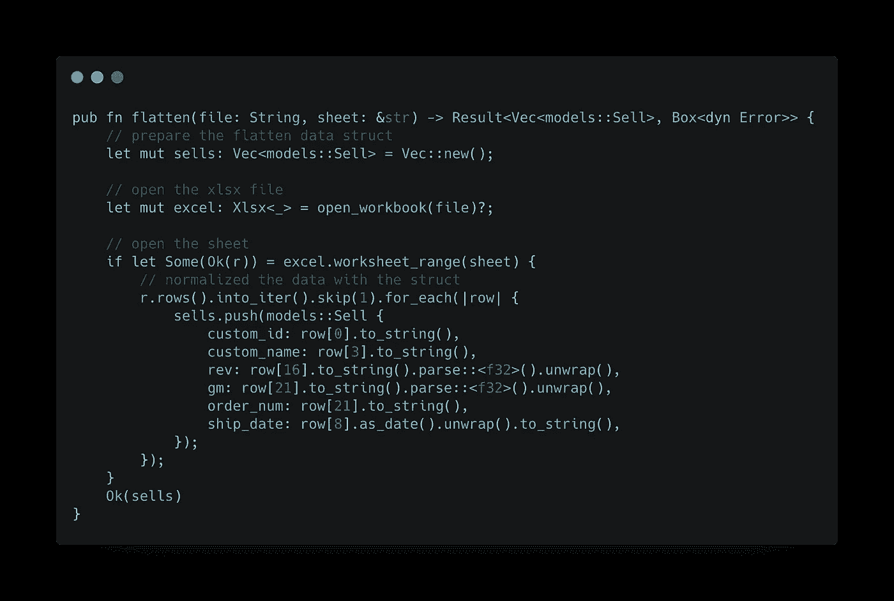
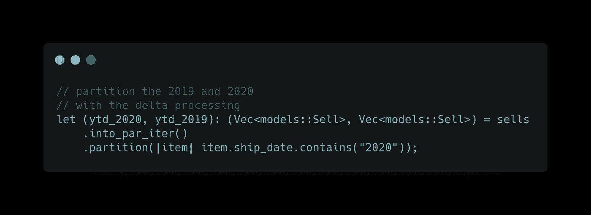
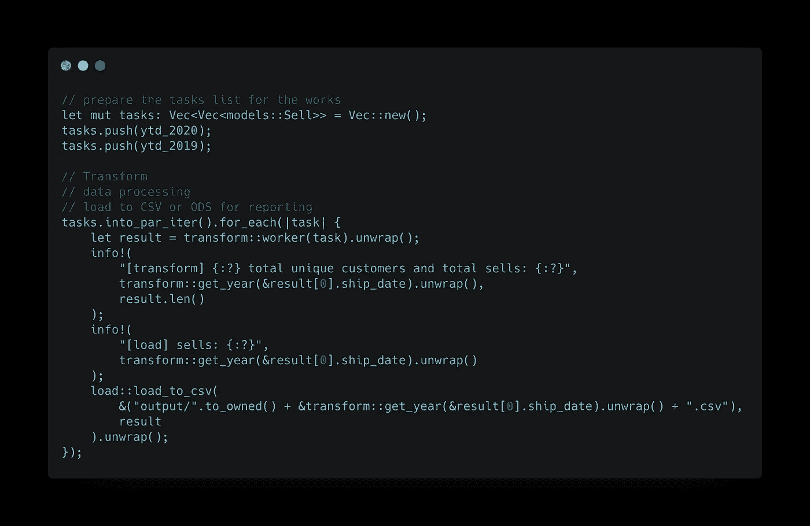
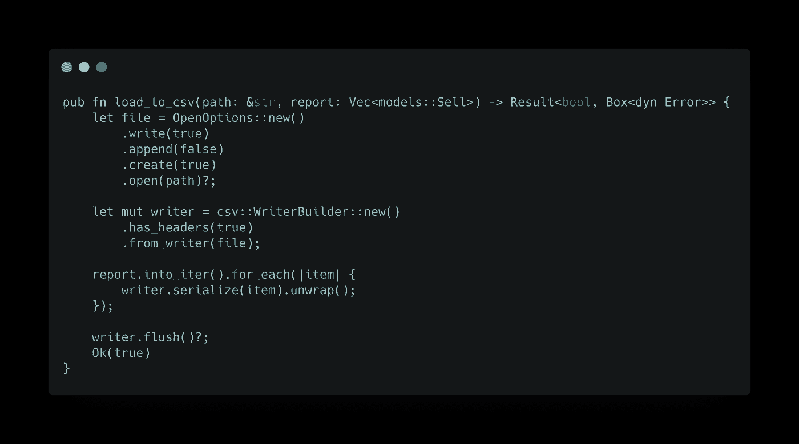
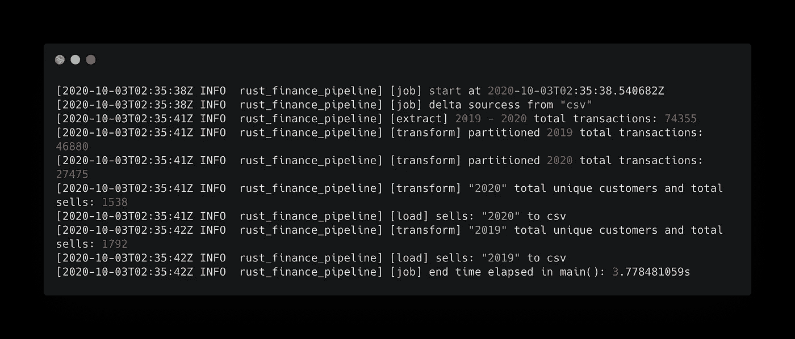

# 用 Rust 构建真实世界的财务报告管道

> 原文：<https://blog.devgenius.io/build-a-real-world-finance-reporting-pipeline-with-rust-6b3ce3f49b3?source=collection_archive---------2----------------------->

以更低的成本开始您公司的大数据之旅

***免责声明:*** *我在媒体上写的文章仅相对于我个人的学习和观点。不会代表或涉及我以前或现在的职位和公司。*

人员、技术和流程是衡量公司 IT 成熟度的最重要指标。我总是在它周围添加一个重要的上下文:

> 代价是什么？

照片由 [Marek Studzinski](https://unsplash.com/@jccards?utm_source=medium&utm_medium=referral) 在 [Unsplash](https://unsplash.com?utm_source=medium&utm_medium=referral) 拍摄

不同的公司会有不同的信息技术基础设施设置和数据策略。无论是小型初创公司、中型公司还是大型国际公司，最重要的是，如何利用当前的 it 设置，获得数据的最大优势，并利用数据讲述故事或做出决策。

> ROI(投资回报率)是关键。

如果你记得我以前的一篇文章(链接如下)，我分享了一些关于公司如何开始大数据之旅的想法。

今天我将重点关注“#5 *挑选一个业务部门，建立一个端到端的数据管道。*

 [## 公司转向大数据，从哪里开始？

### 大数据，这样一个在市场上炙手可热的关键词，最近在 digitaljourna.com 显示了一篇关于大数据的新闻稿…

medium.com。](https://medium.com/@jayhuang75/company-switch-to-big-data-where-to-start-3f799906012d) 

## 公司 A 用例

A 公司是一家中型医疗设备销售公司。它有标准的组织，如财务，It，销售，营销，人力资源，客户服务，物流等。

由于新冠肺炎的影响，首席财务官希望查看当前销售额与 2019 年的对比。

由 [Markus Spiske](https://unsplash.com/@markusspiske?utm_source=medium&utm_medium=referral) 在 [Unsplash](https://unsplash.com?utm_source=medium&utm_medium=referral) 上拍摄的照片

首席财务官有两种方法。

1.  请求信息技术部门提取数据到共享驱动器；财务团队将处理电子表格(又名 excel)并准备数据透视表。
2.  要求 it 部门与财务团队一起建立数据管道，以标准化未来报告的输出。

通常，我们会排在第一位，我们称之为 EUC(终端用户计算)。原因是:有时信息技术成本太高——基础设施成本、开发成本、维护成本等。

很熟悉的母鸡？EUC 面临的挑战是标准化、效率和成本。就成本而言，想象一下财务分析维护电子表格并确保数据完整性所需的时间(成本)？

> 在这个阶段，关键是如何以较低的成本构建数据管道。

让我们休息一下，重新思考一下需求:

1.  从数据库中提取销售数据。
2.  转换和处理数据。
3.  加载到最终目标系统。
4.  在 Excel 中显示

真的高层，不想在这里先把事情复杂化。

让我们在这里也做一些假设来维持成本:

1.  利用当前的 IT 基础架构设置。
2.  没有云需要第一个版本。但是需要具备适应未来云需求的能力。(S3/蔚蓝 ADLS/GCS)，集装箱等。

让我们开始进一步的分析。

1.  使用所需的选项卡读取 extract xlsx 文件。
2.  基于示例 xlsx 分析，其中包含 2019 年和 2020 年，所有销售，每个行项目。
3.  而 CFO 需要的只是每个独特客户每年的总购买量。
4.  每年输出一个 csv 文件。

## 编码部分

让我们保持代码结构如下。

代码结构

这种结构的主要优点是:

1.  易于维护。
2.  易于扩展。
3.  (简单点，笨蛋)

读取 excel 文件

分区 2020 和 2019

处理转换

这里学到的一个关键点是使用 rayon 库，它使用相同的迭代器实现模式完全支持数据并行，完全并发安全。

最后，加载到 CSV

让我们运行它

## 降低成本

在目前的实施中，成本是微薄的。

1.  编译后的二进制代码是唯一的 5K，可以很容易地在容器中进行容器化，用于未来的云部署。
2.  易于部署到当前基础架构。
3.  我们需要大数据吗？号码

## 这个可以缩放吗？

我们很快肯定会采用云解决方案。我们可以利用云存储，Kubernetes 计算。看我其他关于这个的文章。

 [## 使用 Rust 处理 14 GB 文件—第 3 部分— Azure 堆栈

### 周末编码和写作

medium.com](https://medium.com/dev-genius/processing-14-gb-files-with-rust-part-3-azure-stacks-13dcf9dde014)  [## 使用 Go 和 GCP 堆栈构建一个简单的 Lambda 架构数据管道。

### 周末构建和学习—第 2 部分

medium.com。](https://medium.com/analytics-vidhya/build-a-simple-lambda-architecture-data-pipeline-by-using-go-and-gcp-stacks-ea5ca7aa8a99) 

## 结束语

在 [Unsplash](https://unsplash.com?utm_source=medium&utm_medium=referral) 上 [NeONBRAND](https://unsplash.com/@neonbrand?utm_source=medium&utm_medium=referral) 拍摄的照片

公司数据战略成功的关键不在于花哨的工具、技术堆栈或现代基础设施。这一切都是关于如何根据当前的环境和愿景来确定您的业务需求。逐步建立基础设施(内部、混合或全云)，建立问题和解决方案文化，并牢记可扩展性，这将使公司建立一个坚实的数据基础。

这星期就这些了。更多周末代码请看下面我的其他文章，你可能会感兴趣。

 [## 魏黄-中号

### 在媒介上阅读黄炜的作品。我喜欢学习。学会成功。Linkedin…

medium.com](https://medium.com/@jayhuang75)