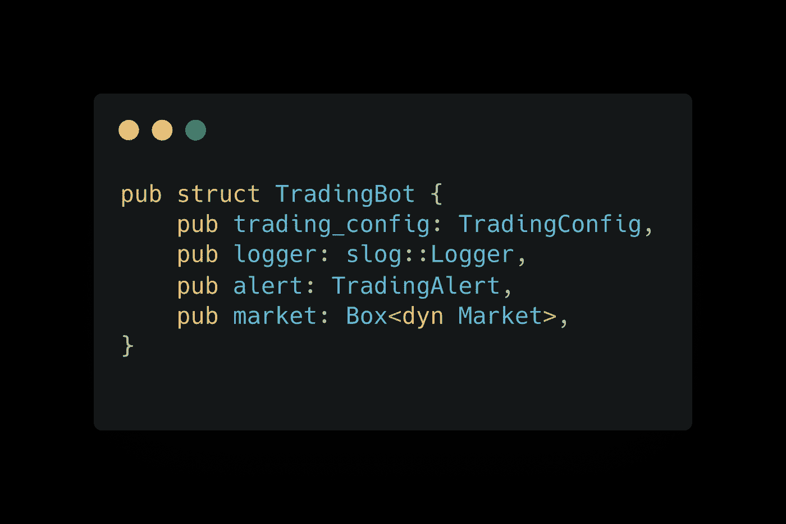

# 周末用 Rust 构建一个可伸缩的交易机器人——第 2 部分

> 原文：<https://blog.devgenius.io/build-a-scalable-trading-bot-with-rust-over-the-weekend-part-2-bb7d703eebe7?source=collection_archive---------2----------------------->

## Bot 在行动，比特币基地专业集成

我已经开始我的写作之旅快 3 年了。你们的支持是让我不断前进，写出更多有趣的学习和分享的最重要动力。

 [## 用我的推荐链接加入媒体-黄伟

### 作为一个媒体会员，你的会员费的一部分会给你阅读的作家，你可以完全接触到每一个故事…

jayhuang75.medium.com](https://jayhuang75.medium.com/membership) 

去年 11 月左右。我写了第一部分，主要关注应用程序设计的可伸缩性。

 [## 周末用 Rust 构建一个可扩展的交易机器人

### 周末建设和学习。

medium.com。](https://medium.com/swlh/build-a-scalable-trading-bot-with-rust-over-the-weekend-9fd781940360) 

很长一段时间后，被家庭、孩子和新的家庭成员(我们的小狗)占据，当然还有工作，我决定开始第二部分的旅程。

在第 2 部分中，我将开始集成一个交易市场，并进行一些交易交互。对于额外的部分，我将构建警报/通知功能，并将其作为一个工人部署到 Heroku。

## 为什么是比特币？为什么是比特币基地？

在我们开始构建之前，我们需要定义我们的构建目标，我们希望通过使用我们的交易机器人来交易什么市场，以及我们将在哪里交易。

过去几年，尤其是去年，比特币市场得到了提振。

主要驱动因素将是全球正在发生的**印钞**活动。通货膨胀是目前新闻中的重要话题之一。等等，你为什么谈论经济？你可能会问。我想假设通货膨胀会带来市场对房地产或股票交易所的投资，这导致比特币市场是一个理想的着陆点；看上图。

然而，我想再次强调我的**免责声明**，我不是经济学家，也不是财务顾问，所以我的关注点和动机是:

1.  了解交易应用程序的构建。
2.  学习交易知识。
3.  尝试找出交易应用程序的通用模式，以及每个设计的可伸缩性。
4.  学习比特币，coinbase 交易。

## 比特币基地

现在我们知道我们将交易什么，下一步将是在哪里交易。关键标准之一是 API。如果你还记得我的第一部分，最符合逻辑的部分已经做了；现在最需要的是 API 与目标市场的整合。

基于 reach 和比较，我最终决定使用比特币基地 **Pro** 。比特币基地和比特币基地 Pro 都有 API 集成；然而，我认为比特币基地 **Pro** 更适合我的高级交易与 API 集成的用例。然而，由于我们的应用程序在设计上具有可伸缩性，因此很容易切换到不同的市场，因为我们使用的是**界面/策略模式**。

# 让我们编码

我们应该如何构建我们的代码？首先，我是单一责任原则的忠实拥护者，这也适用于管理领域。我写了一篇关于如何使用设计原则来管理团队的文章。

 [## 软件设计模式与团队管理

### 共同点

medium.com](https://medium.com/dev-genius/software-design-pattern-and-team-management-3c0f4f71e42d) 

让我们继续前进。我们有交易机器人的关键实现，即交易部分，因此我们通过功能化组件、SDK 和通知对其进行分离是有意义的。

代码结构—作者截图

SDK 将负责 coinbase 集成，而 Alert 将负责通知部分 TBD (SMS 或 Slack)。

## SDK，比特币基地。

比特币基地产品为您的集成需求提供了优秀的文档。

 [## 比特币基地专业 API 参考

### 欢迎来到比特币基地专业交易者和开发者文档。这些文档概述了 exchange 功能、市场…

docs.pro.coinbase.com](https://docs.pro.coinbase.com/) 

到目前为止，我们没有太多的用例，我们将只关注帐户、产品和订单。

让我们准备比特币基地 SDK 客户端。你可能会问为什么是 SDK，为什么直接调用比特币基地 Prod API。是的，但是，从根本上说:

> SDK 通常是一套软件开发工具，允许为特定平台创建应用程序。SDK 可以包括一个或多个 API 以及编程工具和文档

这里我可能不需要所有的 API 调用，所以采用 SDK 方法进行集成规模和代码维护更有意义。然而，underly 仍然是与比特币基地产品 API 的集成。

代码结构如下:

比特币基地产品 SDK 结构—作者截图

比特币基地产品客户端—作者截图

初始化将是:

比特币基地产品客户端—作者截图

该主要职责是与比特币基地产品 API 进行交互，具体如下:

比特币基地产品客户端主要功能—作者截图

正如我在上一篇第 1 部分中所阐述的，我们使用的是策略模式，这对于我们的日常操作、代码维护和新特性增强来说都很容易。

通过继承市场特性，插入战略实施

市场特征—作者截图

比特币基地实施—作者截图

## 通知警报

我们有机器人可以根据我们建立的模型或规则进行自动交易。当一个动作发生时，比如卖出、买入或者失败，收到通知是很好的。

在软件开发/构建世界中，构建一次，使用多个地方；我们的目标状态提出了 libs 概念。根据项目用例，我们可以通过配置使用 libs/function 来满足功能需求。

如果您关注我，在我以前的一篇文章中，我们已经构建了通知功能，可以在多伦多的安大略发送 covid 号。

 [## 建立一个短信警报系统，为加拿大新冠肺炎案件在周末与铁锈和零成本

### 周末建设和学习

towardsdatascience.com](https://towardsdatascience.com/build-an-sms-alert-system-for-canada-covid-19-cases-over-the-weekend-with-rust-and-zero-cost-235bb59ec5d) 

我们有一个现成的警报库用于警报功能；在上面的用例中，我们将 Twilio 用于消息警报；然而，在今天的用例中，我想在将来使用 Slack Alert 来增强当前 Alert Libs 用例的覆盖率。

libs 结构如下所示。

警报库结构—作者截图

Slack 提供了一个简单的 webhook 集成；我们需要将消息发送给 alert 实现，并为您的 slack 应用程序调用 webhook。

宽松警告代码片段—作者截图

正如您在示例时差通知中看到的那样

Trading bot slack alert 正在运行—作者截图

其余的将被部署到 Heroku 或者 ECS。

## 最终想法

要构建一个应用或软件，我们需要关注可重用性(libs，SDK 等。)和可扩展性；如果您有一个业务逻辑，并且希望在不同的上下文中应用它，那么 strategy 模式非常适合。

这是一个关于交易机器人实现的高级演示，如果你想了解更多的细节实现，比如 Slack webhook 的实现，请在下面留下你的评论，我会为那部分写另一篇文章。

感谢您的阅读。

> 加入 Coinmonks [电报频道](https://t.me/coincodecap)和 [Youtube 频道](https://www.youtube.com/c/coinmonks/videos)了解加密交易和投资

## 另外，阅读

 [## 最佳加密交易所| 2021 年十大加密货币交易所

### ICON _ PLACEHOLDEREstimated 预计阅读时间:28 分钟加密货币交易所的加密交易需要知识…

blog.coincodecap.com](https://blog.coincodecap.com/crypto-exchange)  [## 2021 年 10 大最佳加密贷款平台| CoinCodeCap

### 当谈到加密货币贷款时，大量因素等同于良好的收入状况。此外，借款的一部分…

blog.coincodecap.com](https://blog.coincodecap.com/crypto-lending)  [## 2021 年最佳免费加密交易机器人

### 2021 年币安、比特币基地、库币和其他密码交易所的最佳密码交易机器人。四进制，位间隙…

medium.com](https://medium.com/coinmonks/crypto-trading-bot-c2ffce8acb2a)  [## 最佳 4 个加密交易信号电报通道

### 这是乏味的找到正确的加密交易信号提供商。因此，在本文中，我们将讨论最好的…

medium.com](https://medium.com/coinmonks/best-crypto-signals-telegram-5785cdbc4b2b)  [## BlockFi 评论 2021:利弊和利率| CoinCodeCap

### 今天，我们提出了一个全面的 BlockFi 评论，这是一个成立于 2017 年的加密贷款平台，拥有其…

blog.coincodecap.com](https://blog.coincodecap.com/blockfi-review)  [## 如何在印度购买比特币？2021 年购买比特币的 7 款最佳应用[手机版]

### 如何使用移动应用程序购买比特币印度

medium.com](https://medium.com/coinmonks/buy-bitcoin-in-india-feb50ddfef94)  [## 加密税务软件——五大最佳比特币税务计算器[2021]

### 不管你是刚接触加密还是已经在这个领域呆了一段时间，你都需要交税。

medium.com](https://medium.com/coinmonks/best-crypto-tax-tool-for-my-money-72d4b430816b)  [## 存储比特币的最佳加密硬件钱包[2021] | CoinCodeCap

### 保管您的数字资产很容易，但找到正确的存储方式却是一项繁琐的任务。在线钱包有一个风险…

blog.coincodecap.com](https://blog.coincodecap.com/best-hardware-wallet-bitcoin)