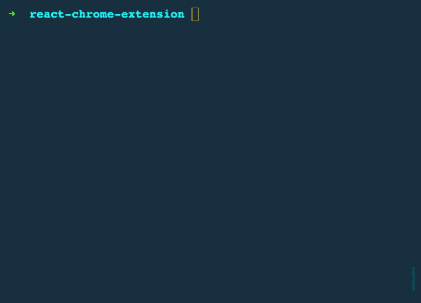
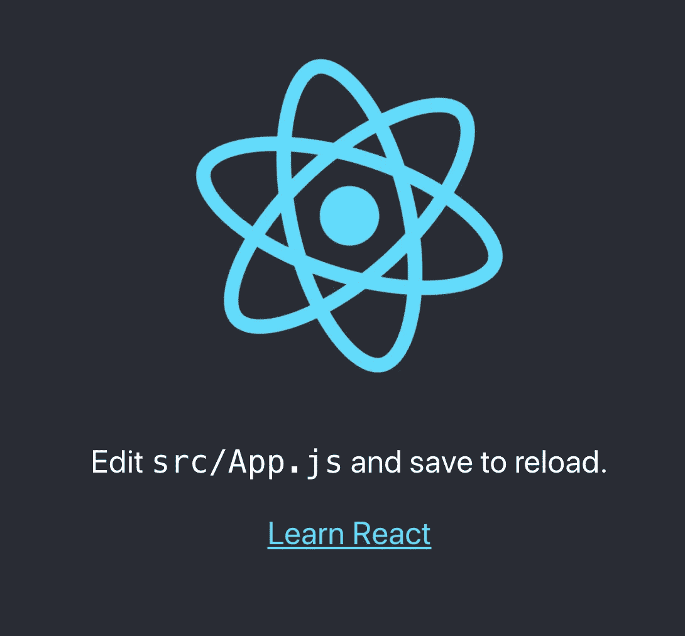
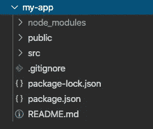
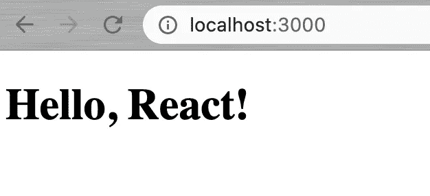
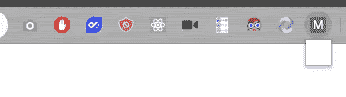
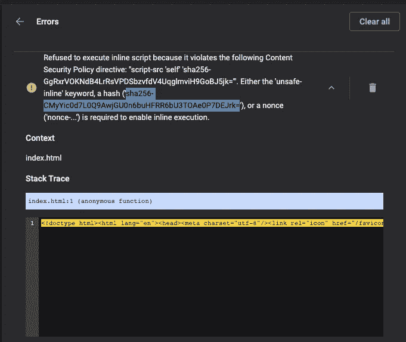
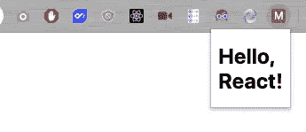

# 用 React 构建一个简单的 Google Chrome 扩展

> 原文：<https://blog.devgenius.io/build-a-simple-google-chrome-extension-with-react-53a0b79493bb?source=collection_archive---------7----------------------->


照片由[古伊列梅·赛洛斯](https://unsplash.com/@gui_vasconcelos?utm_source=medium&utm_medium=referral)在 [Unsplash](https://unsplash.com?utm_source=medium&utm_medium=referral) 上拍摄

## 先决条件

在我们开始之前，您应该熟悉一些东西。

基本熟悉 HTML 和 CSS
基本了解 Javascript
基本了解创建 Google Chrome 扩展
基本了解 DOM

## 目标

了解如何使用 React 构建 Chrome 扩展

# 设置和安装

**先决条件:**

安装节点[。您机器上的](https://nodejs.org/en/download/) js 和 [npm](https://www.npmjs.com/)

创建 React 应用，这是一个预配置了构建 React 应用所需的一切的环境。

```
npx create-react-app my-app
cd my-app
npm start
```



一旦你运行这些命令。在浏览器中，一个新窗口将出现在 localhost:3000



看看您的项目结构，您应该会看到类似下图的内容:



首先，让我们继续从`/src`目录中删除所有文件。

相反，让我们在您的`/src`目录中创建文件`index.js`。

现在在`index.js`中，让导入反应，反应

让我们创建您的应用程序组件，

最后，让我们把`App`渲染到根部

运行`npm run start`

现在，如果您返回到`localhost:3000`，您应该会看到以下内容:



# 谷歌浏览器扩展

Chrome 扩展由其清单定义。导航至`public/manifest.json`。在前面的步骤中运行`npm run start`之后，您应该会看到为您创建的清单。

## Manifest.json

让我们继续，从`manifest.json`文件中删除所有的代码。在`manifest.json`文件中，用下面的代码替换旧代码

这个 JSON 文件中的大多数字段都是不言自明的。我们将专门为谷歌浏览器添加三个字段。这些是:

*   `manifest_version`告诉 Chrome 你正在使用哪个版本的清单
*   将图标加载到地址栏右侧的谷歌 Chrome 主工具栏中。除了图标，浏览器还可以有工具提示、徽章和弹出窗口
*   `permissions`限制扩展的功能区域。`activeTab`允许我们访问最前面的选项卡。

## 有关 Google Chrome 扩展清单文件的更多信息。在[扩展清单](https://developer.chrome.com/extensions/manifest)上查看谷歌的文档。

你的`manifest.json`现在应该这样了

# 连接到 Chrome:

1.  在你的**根目录下运行`npm run build`**
2.  在浏览器中转至***chrome://extensions***
3.  确保右上角的 ***开发者模式*** 复选框被选中:
4.  点击 ***加载解压*** 弹出文件选择对话框&选择你的 ***构建*** 文件夹

## 白盒错误疑难解答



*   在浏览器中导航回***chrome://extensions***
*   在“我的分机”下，点击“错误”按钮



*   复制 sha256 密钥。这是我强调的地方。
*   导航到您的`manifest.json`文件并插入以下代码:
*   `"content_security_policy": "script-src 'self' 'sha256-...INSERT COPIED SHA256 HERE'; object-src 'self'"`

*   回到你的终端，输入`npm run build`
*   接下来导航到***chrome://extensions***
*   在你的 Chrome 扩展下。单击刷新图标
*   现在您应该看到您的扩展弹出
*   注意:点击“错误”,然后点击“全部清除”,清除之前的错误

恭喜你有了你的第一个 Chrome React 扩展！



# 摘要

在这篇文章中，我向你展示了如何使用 React 作为视图引擎来构建一个 Chrome 扩展。Chrome 扩展为开发者提供了许多改变浏览体验的方法。