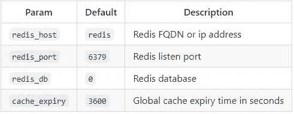

# 使用 BottlePy 构建一个简单的 web 应用程序

> 原文：<https://blog.devgenius.io/build-a-simple-web-app-using-bottlepy-53a9eb238e0a?source=collection_archive---------9----------------------->

使用 BottlePy 构建一个支持 SQLAlchemy 和 Redis 的简单 web 应用程序


# 要求

要使用这个环境，你需要安装 [Docker](https://docs.docker.com/get-docker/) 和 [Docker compose](https://docs.docker.com/compose/install/) 。

# 应用程序堆栈

后端:

*   [瓶瓶罐罐](https://bottlepy.org/docs/dev/)
*   [SQLAlchemy](https://www.sqlalchemy.org/)

前端:

*   [自举 5](https://getbootstrap.com/)
*   [jQuery](https://jquery.com/)

数据库:

*   [PostgreSQL](https://www.postgresql.org/)
*   [Redis](https://redis.io/)

web 服务器:

*   [Nginx](https://www.nginx.com/) —仅生产环境。

# 使用的数据

为了使用这个示例应用程序，我们需要导入一些示例数据。该示例应用程序使用了在[archive.org](https://archive.org/details/stackexchange)上可用的“堆栈交换数据转储”。

本网站使用的所有数据都在 [cc-by-sa 4.0](https://creativecommons.org/licenses/by-sa/4.0/) 许可下。

# 设置环境

首先克隆[这个](https://github.com/garutilorenzo/simple-bottlepy-application)库

现在我们已经准备好设置我们的环境了。出于开发目的，链接 docker-compose-dev . yml do docker-compose . yml

```
ln -s docker-compose-dev.yml docker-compose.yml
```

对于生产环境:

```
ln -s docker-compose-prod.yml docker-compose.yml
```

开发环境和生产环境之间的区别在于:


现在我们可以下载一些样本数据。

# 下载样本数据

要 dwonload 一些示例数据运行:

```
./download_samples.sh
```

默认情况下，将下载带有“meta”属性的归档文件。如果您想要更多的数据，请从档案名称中删除 download_samples.sh 'meta'。

小数据:

```
for sample in workplace.meta.stackexchange.com.7z unix.meta.stackexchange.com.7z
```

大数据:

```
for sample in workplace.stackexchange.com.7z unix.stackexchange.com.7z
```

**注意**在本例中，并非所有的 stackexchange 站点都已导入。选择要下载的归档文件后，调整 src/schema/下的 network.py 模式

```
class Sites(enum.Enum):
    vi = 'vi.stackexchange.com'
    workplace = 'workplace.stackexchange.com'
    wordpress = 'wordpress.stackexchange.com'
    unix = 'unix.stackexchange.com'
    tex = 'tex.stackexchange.com'
```

下载数据后，我们可以导入数据:

```
docker-compose run --rm bottle bashweb@4edf053b7e4f:~/src$  python init_db.py # <- Initialize DB
web@4edf053b7e4f:~/src$  python import_data.py # <- Import sample data
```

现在，对于您下载的每个数据样本(如 tex、unix、vi ),将启动一个 python 子流程，并按顺序导入:

*   所有的标签
*   所有用户
*   所有的帖子
*   所有后历史事件

一旦导入完成，我们就可以开始我们的环境了

# 启动环境

填充了数据库后，我们现在可以启动 web 应用程序了:

```
docker-compose up -dCreating network "bottle-exchange_default" with the default driver
Creating postgres ... done
Creating redis    ... done
Creating bottle   ... done
```

该应用程序将在 [http://localhost:8080](http://localhost:8080) 提供给开发人员，在 [http://localhost](http://localhost) 提供给生产人员

# 应用概述

# 索引

带有搜索表单的主页。在“Network”select 上的每次更改中,“Tags”select 由/API/autocomplete/form/get _ Tags(POST)上的 ajax 调用填充(有关更多详细信息，请参见 src/bottle/static/asset/js/custom . js)。

POST 调用通过随机硬编码字符串进行验证(参见 src/bottle/app.py，api_get_tags)

带有分页导航的所有可用标签列表。单击标签名称，应用程序将搜索与您选择的标签匹配的所有问题，单击站点名称，应用程序将搜索与您选择的标签和站点匹配的所有问题。

# 用户

带有分页导航的所有可用用户的表视图。

点击用户名，我们进入用户的详细信息页面。在详细的用户页面，我们看到:向上投票，查看，向下投票。如果用户填充了“关于我”字段，我们会看到一个按钮，它触发了一个带有“关于我”详细信息的模式。如果用户问或回答了某个问题，我们会在“帖子”部分看到一个问题列表。

# 邮件

带有分页导航的所有帖子的列表

# API/REST 端点

这个应用程序公开了一个 api/rest route: /api/get/tags。您可以通过 POST 调用查询这个路由，您必须使用 json 有效负载进行调用:

```
curl --header "Content-Type: application/json" \
  --request POST \
  --data '{"auth_key":"dd4d5ff1c13!28356236c402d7ada.aed8b797ebd299b942291bc66,f804492be2009f14"}' \
  [http://localhost:8080/api/get/tags](http://localhost:8080/api/get/tags) | jq{
  "data": [
    {
      "clean_name": "html5",
      "created_time": "2021-12-29 11:33:06.517152+00:00",
      "id": "1",
      "name": "html5",
      "network_sites": "Sites.wordpress",
      "questions": "91",
      "tag_id": "2",
      "updated_time": "None"
    },
    ...
    ],
  "errors": [],
  "items": 5431,
  "last_page": 27
}
```

auth_key 硬编码在 src/bottle/app.py 中

# 应用程序配置

应用程序的配置由 load_config 模块(src/load_config.py)加载。

该模块将在以下位置加载一个. yml 文件:

```
/app/src/<BOTTLE_APP_NAME>/config/<BOTTLE_APP_ENVIRONMENT>
```

*瓶子应用名称*和*瓶子应用环境*是环境变量。

BOTTLE_APP_NAME 是我们的 BOTTLE 应用程序所在的路径名，在本例中是 *bottle* 。BOTTLE_APP_ENVIRONMENT 值是 prod 或 env。

一个示例配置是:

```
---
enable_debug: True
enable_reloader: True
http_port: 8080
pgsql_username: "bottle"
pgsql_password: "b0tTl3_Be#"
pgsql_db: "bottle_exchange"
pgsql_host: "pgsql"
pgsql_port: 5432
create_db_schema: True
default_result_limit: 50
```

# 数据库配置

数据库配置在 src/schema 模块下定义。

base.py 文件包含引擎配置:

```
import load_config # <- See App configurationfrom sqlalchemy import create_engine
from sqlalchemy.ext.declarative import declarative_base
from sqlalchemy.orm import sessionmakermain_config = load_config.load_config()
conn_string = 'postgresql+psycopg2://{pgsql_username}:{pgsql_password}@{pgsql_host}:{pgsql_port}/{pgsql_db}'.format(**main_config)engine = create_engine(conn_string, pool_size=80, pool_recycle=60)
Session = sessionmaker(bind=engine)Base = declarative_base()
```

所有的表都在 schema 下的一个单独的文件中定义:


# SQLAlchemy 插件

在这个例子中，应用程序被使用并安装了一个 SQLAlchemy 插件(src/bottle/bottle_sa.py)。此插件用于处理 SQLAlchemy 会话:

```
from schema.base import Base, engine # <- Base and engine are defined in the schema module, see "DB configuration"
from bottle_sa import SQLAlchemyPlugin
import load_configmain_config = load_config.load_config()# Main Bottle app/application
app = application = Bottle()# DB Plugin
saPlugin = SQLAlchemyPlugin(
    engine=engine, metadata=Base.metadata, 
    create=main_config['create_db_schema'], 
    config=main_config,
)
application.install(saPlugin)
```

此插件为 src/bottle/app.py 中定义的每个函数传递一个额外的参数。默认情况下，此参数为“db ”,但可以通过在 SQLAlchemyPlugin init 中传递额外的参数“keyword”来更改。

因此，函数示例如下:

```
[@app](http://twitter.com/app).route('/docs')
[@view](http://twitter.com/view)('docs')
def index(db): # <- db is our SQLAlchemy session
    return dict(page_name='docs')
```

# Redis 缓存

在这个示例应用程序中，我们使用 redis 来缓存一些页面。如果您有以下情况，缓存“方法”非常有用:

*   很少更新的网站
*   慢吞吞的页面/路线
*   你必须减少数据库的负载

RedisCache 在 src/bottle/bottle_cache.py 中定义，这是一个用法示例:

```
from bottle_cache import RedisCache# Cache
cache = RedisCache()[@app](http://twitter.com/app).route('/tags')
[@app](http://twitter.com/app).route('/tags/<page_nr:int>')
[@cache](http://twitter.com/cache).cached()
[@view](http://twitter.com/view)('tags')
def get_tags(db, page_nr=1):
    do_something()
    return something
```

您可以使用额外的参数 config 初始化 RedisCache 类:

```
config = {'redis_host': '<redis_hostname'>, 'redis_port': 6379, 'redis_db': 0, 'cache_expiry': 86400}
cache = RedisCache(config=config)
```

默认情况下，配置为:



@cached decorator 可以接受一些参数:


# 缓存 json 请求

json 缓存的一个例子是:

```
[@app](http://twitter.com/app).route('/api/get/tags', method='POST')
[@cache](http://twitter.com/cache).cached(content_type='application/json')
def api_get_tags(db):
    do_something()
    return something
```

要使缓存失效，请将 invalidate_cache 键作为查询参数，或者在进行 POST 调用时在请求体中传递

# 跳过/绕过缓存

要跳过或绕过缓存，请将 **skip_cache** 键作为查询参数，或者在进行 POST 调用时在请求体中传递

# 数据导出

要备份 PgSQL 数据，请运行 dump_db.sh

```
./dump_db.sh
```

转储文件将被放在这个存储库的根目录下，文件将被命名为 dump.sql.gz(Gzipped 格式)

# 数据导入

要导入现有数据库，请取消 docker-compose.yml 中以下行的注释:

```
volumes:
    - type: volume
      source: postgres
      target: /var/lib/postgresql/data
    - ./sql:/docker-entrypoint-initdb.d # <- uncomment this line
```

并将 gzip 或纯文本格式的转储文件放在 sql/(首先创建目录)下

# 停止环境

要停止环境运行

```
docker-compose downStopping bottle   ... done
Stopping postgres ... done
Stopping redis    ... done
Removing bottle   ... done
Removing postgres ... done
Removing redis    ... done
Removing network bottle-exchange_default
```

为了清理所有的数据(pgsql 数据)，将额外的参数“-v”传递给 docker-compose down。使用此参数，pgsql 卷将被删除。

*原载于 2021 年 12 月 29 日*[*https://garutilorenzo . github . io*](https://garutilorenzo.github.io/build-simple-web-app-using-bottle/)*。*