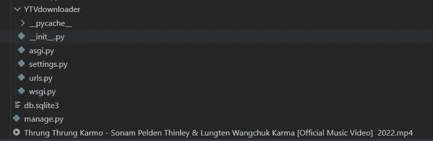

# 使用 Python 和 Django 构建一个简单的 YouTube 视频下载器

> 原文：<https://blog.devgenius.io/build-a-simple-youtube-video-downloader-using-python-and-django-2fae4f00f5d3?source=collection_archive---------3----------------------->


本教程将向您展示如何创建一个下载 YouTube 视频的简单应用程序。我们可以用几行 Python 代码、基本的 HTML 和 Django 来实现这一点。

我们需要什么？

**pytube:** 我们将使用 pytube 库。pytube’([pytube.io/en/latest](https://pytube.io/en/latest/))是一个轻量级的、无依赖的 Pythonic 库(和命令行实用程序)，用于下载 YouTube 视频。

**姜戈:**姜戈([djangoproject.com](https://www.djangoproject.com/))是一个鼓励快速开发和简洁、实用设计的高级 Python web 框架。由经验丰富的开发人员构建，它解决了很多 web 开发的麻烦，所以您可以专注于编写您的应用程序，而无需重新发明轮子。它是免费和开放源码的。

**项目设置:**

要将库安装在单独的文件夹中，请创建一个虚拟环境。

```
$ py -3 -m venv env
```

现在激活环境:

```
$ .\env\Scripts\activate
```

(此项目在 Windows 机器上完成)

我们现在可以在环境中安装库。

```
$ pip install django
$ pip install pytube
```

我们现在可以开始创建我们的项目了。

1/是时候创建我们的项目了。要创建项目，请运行以下命令。它将创建一个名为“YTVdownloader”的项目

```
$ django-admin startproject YTVdownloader$ cd YTVdownloader
```

2/让我们在项目中创建视频下载器应用程序。

```
$ python manage.py startapp YTVapp
```

我们需要在[设置中的 INSTALLED_APPS 列表中添加我们的应用程序。py](http://settings.py)

```
INSTALLED_APPS = [
    'django.contrib.admin',
    'django.contrib.auth',
    'django.contrib.contenttypes',
    'django.contrib.sessions',
    'django.contrib.messages',
    'django.contrib.staticfiles',
    'YTVapp',  # our app
]
```

3/转到[视图，点击](http://views.py)。创建一个接收视频链接并从该链接下载视频的功能。我们需要从 pytube 导入 YouTube 功能。

```
from django.shortcuts import render
from pytube import YouTube

def index(request):

    try:

        # check request.method is post or not
        if request.method == 'POST':
            try:
                # get link from the html form
                link = request.POST['link']
                video = YouTube(link)

                # set video resolution
                stream = video.streams.get_lowest_resolution()

                # download the video 
                stream.download()

                # render HTML page
                return render(request, 'index.html', {'msg':'Video downloaded'})
            except:
                return render(request, 'index.html', {'msg':'Video not downloaded'})
        return render(request, 'index.html', {'msg':''})
    except:
        return render(request, "index.html", {"msg":"Sorry something went wrong!"})
```

4/为了定义如何向用户显示，我们需要一个 HTML 文件。

首先，在“YTVapp”中创建一个“模板”文件夹。

在模板文件夹中，我们将创建“index.html”文件，用户可以在其中输入 YouTube 的 url 来下载视频。为此，我们将使用 Django 的 POST 方法，使用 csrf 令牌进行安全保护。

```
<!DOCTYPE html>
<html>

<head>
    <style>
        .container {
            text-align: center;
        }

        .form {
            width: 100%;
        }
    </style>
</head>

<body>

    <div class="container">
        <h1>Youtube video downloader</h1>

        <p>{{msg}}</p>

        <form action="" method="post" class="form">
            

            <label for="link">Enter URL: </label>
            <input type="text" id="link" name="link"><br><br>
            <input type="submit" value="Download">
        </form>
    </div>

</body>

</html>
```

5/现在我们将定义路径或将 URL 映射到[URL 中的视图。py](http://urls.py)

```
from django.contrib import admin
from django.urls import path
from YTVapp import views

urlpatterns = [
    path('', views.index, name='index'),
    path('admin/', admin.site.urls),

]
```

6/我们都准备好运行我们的项目了:在命令行中键入:

```
$ python manage.py runserver
```

前往 [localhost:8000/youtube](http://localhost:8000/youtube) 查看我们的 youtube 视频下载器。

当您点击下载按钮时，视频将被下载到您的 Django 项目目录中。



[GitHub](https://github.com/Ugyenwangdi/YouTubeVideoDownloader) 中的代码

*原发布于*[*https://wulfi . hash node . dev*](https://wulfi.hashnode.dev/build-a-simple-youtube-video-downloader-using-python-and-django)*。*