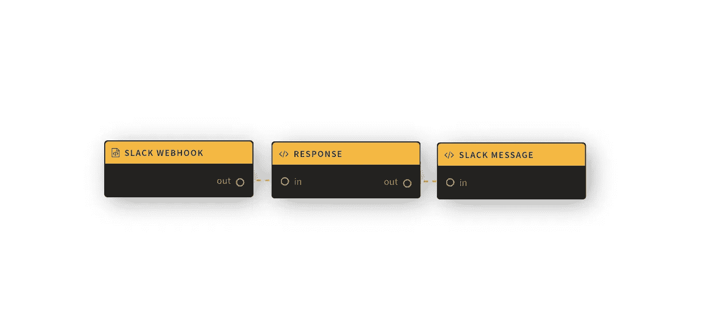

# 用无服务器在几分钟内构建一个 Slack 应用程序

> 原文：<https://blog.devgenius.io/build-a-slack-app-with-serverless-in-a-few-minutes-9f0ca44d9a80?source=collection_archive---------8----------------------->

Slack 是学习如何使用事件驱动的后端“无服务器”应用程序的好方法。当您使用无服务器时，您只需通过应用程序为每秒需要处理的事件数量付费，而不是启动服务器并等待这些事件。

虽然 Lolo 的工作方式有点不同，但她遵循这个概念，所以在你必须每秒处理几千个以上的事件之前，你不会付出任何代价。这是非常划算的。

我们将构建一个 HTTP 回调函数，作为我们的 Webhook，由 Slack 通过它们的 Slash 命令触发。这个想法是让你做一些更复杂的事情，但这让你知道它有多简单。我们将打乒乓球。请看下面我们的工作流程。

这些节点中的代码仅仅是自定义的 Node.js，除了 Lolo 为其用户预先构建的 HTTP 触发器。

简单解释一下我们的 Lolo 工作流程。

1.  我们首先在菜单面板中添加一个 HTTP 触发器，它将作为我们的 Webhook。
2.  然后，我们将在响应节点中发回一个状态代码为 200 的响应。这是为了确保我们迅速向 Slack 发回确认。
3.  最后，我们将发送一个 HTTP post 请求，其中包含从收到的有效负载中提取的 response_url。

结果将是 Slack 中的一个 **/ping** 斜线命令将以 **pong 响应。**

你需要一个 Slack 工作空间的管理员权限来设置你的 Slack 应用，然后是一个免费的 Lolo [账户。](https://developer.lolo.company/)

# 设置您的 Lolo 应用程序和 Webhook

我们需要 Slack 的请求 URL，这样当有人使用命令/ping 时，Slack 可以向我们发送一个事件。因此，我们将首先设置我们的 [Lolo 应用](https://developer.lolo.company/)。

在 Lolo 中创建新的应用程序，并在菜单面板中添加 HTTP 触发器。一旦它出现在您的图表中，请双击它，以便您可以配置它。

我们将通过**参数**选项卡将其设置为 POST 请求，并将端点设置为 **/slack** 。您也可以将该节点重命名为 Slack Webhook，但这是可选的。设置路径后，复制为您设置的外部 URL。

我们现在已经设置了触发这个应用程序的触发器。您可以保存您的应用程序，但还不需要运行它。

# 设置你的 Slack 应用

通过[api.slack.com](https://api.slack.com/)设置新应用。你想怎么叫都行。您将需要对要安装它的 Slack 工作区的管理员访问权限。

创建应用程序后，进入**斜杠命令**，在那里你将设置一个新命令。使用你刚刚从 Lolo 应用程序中复制的 URL。

记住也要将应用程序安装到您的工作区。导航到**基本设置**让你的 Slack 应用程序这样做。每当您添加斜杠命令时，您都需要将应用程序重新安装到您的工作区。

# 响应 HTTP 调用

Slack 命令期望在 3 秒内得到响应，所以当对您的 URL 进行 HTTP 调用时，要做的第一件事是在 Lolo 应用程序中发出一个带有 200 状态代码的响应。

Slack 将向我们发送带有有效负载对象的数据，我们可以用它来响应。也就是说，我们不直接响应斜杠命令，我们只提取 response_url，以便稍后可以通过 POST 请求发送回对消息的响应。这也允许你在回答之前做更多的处理。

首先，在 Lolo 应用程序中创建一个新函数，并将下面的代码添加到它的处理程序中。

通过像处理 route(ev.body)一样将 Slack 有效负载数据路由到下一个函数，我们可以在下一个节点/函数中提取 response_url。这个 Slack 应用程序只做两件事，所以我们不需要从有效负载中提取太多，但是当你构建更丰富的 Slack 应用程序时，你会想要提取更多关于命令的信息，而不仅仅是 response_url，因此我们将路由整个有效负载。

创建一个新函数，更改它的代码，将它连接到 Slack Webhook HTTP 触发器。

记住还要将 HTTP 触发器与您创建的新函数连接起来。需要连接到这些节点，以使代码能够在 exports.handler 中运行。

**保存**和**运行**你的应用程序。

如果你已经将应用程序安装到你的 Slack 工作区，你现在可以测试你在 Slack 中设置的命令。它不会给你任何反馈，但只要它没有给你一个错误，你就知道它在工作。

# 向时差发送回复

我们需要做的最后一件事是使用 response_url 向 Slack 发回一个 HTTP POST 请求，并附上我们对命令的回答。因此，我们可以看到对/ping 命令的 pong 响应。

在 Lolo 图中创建另一个新函数，并添加下面的代码。

我们还需要添加 **node-fetch@2.0** 作为依赖项，以便能够在我们的代码中使用它。在 Lolo 中导航到应用程序的**设置**中的**模块**，并简单地将其添加到那里。它将在您保存并运行应用程序时安装。

创建一个新函数，更改它的代码，重命名它，添加 node-fetch@2.0 作为依赖项，连接节点，然后保存并运行您的应用程序。

总而言之，如果您已经添加了新的函数，在它的处理程序中添加了上面的代码，在您的模块中添加了 **node-fetch@2.0** 并连接了所有的节点，您就可以**保存**并**再次运行**您的应用程序。

请注意，现在部署可能需要一分钟，因为我们已经安装了依赖项。在日志中查找**监听端口 4000** 以查看它是否已成功部署。你可以来回换标签，我们都这样。

# 测试你的 Slack 应用

打开你的松弛，然后再次尝试你的斜线命令。我已经设置了/ping，我的响应将是 pong。看看下面这个是什么样子的。

在 Lolo 中查找 listen port 4000 以查看您的应用程序是否已成功部署。然后在 Slack 中测试你的 slash 命令。

在这里，您可以在消息中使用 Slack 操作，然后在用户与有效负载事件交互时从有效负载事件中提取值，从而向它添加内容。请参阅 slack 的块套件生成器，以获取有关创建 Slack 消息的帮助。

# Youtube 视频教程

如果你想通过视频教程学习，请查看下面的视频。

❤️·洛洛