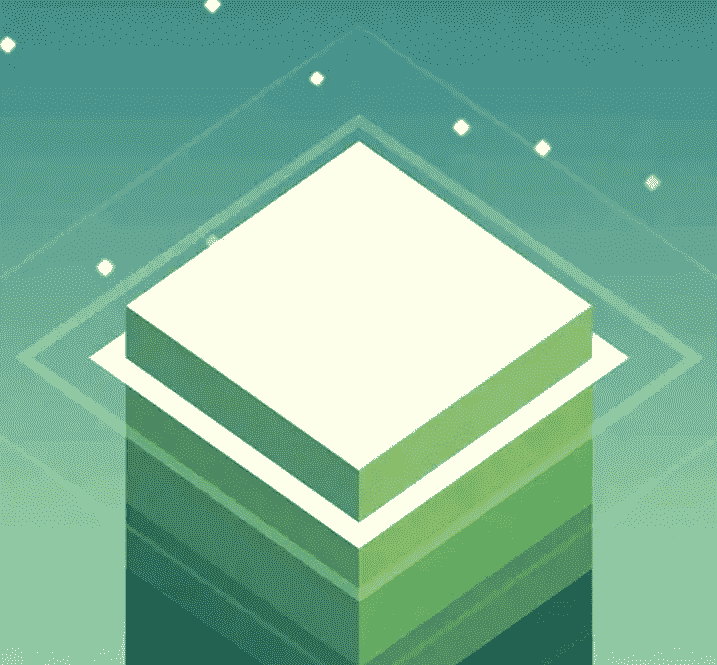
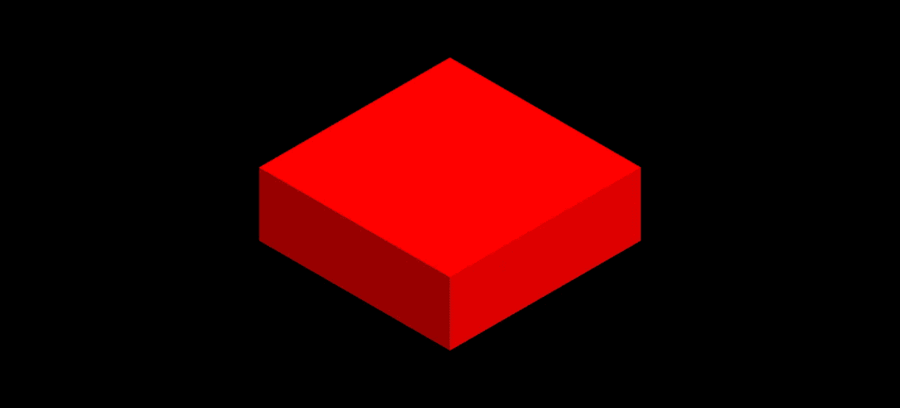
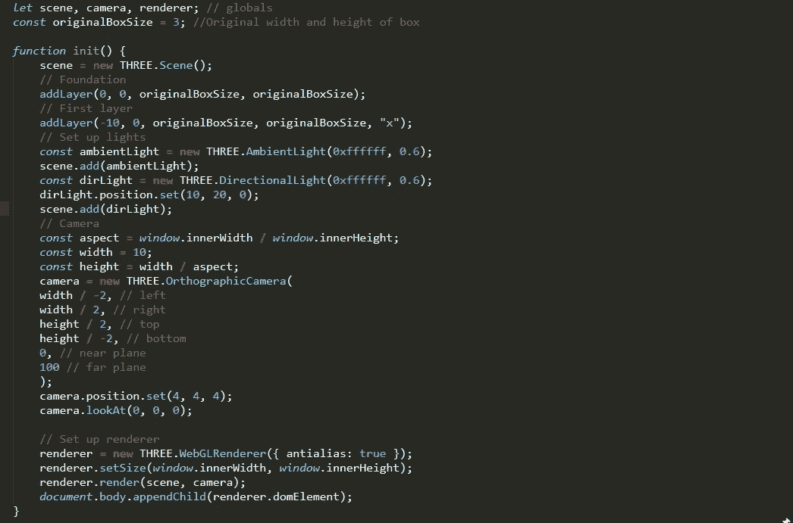
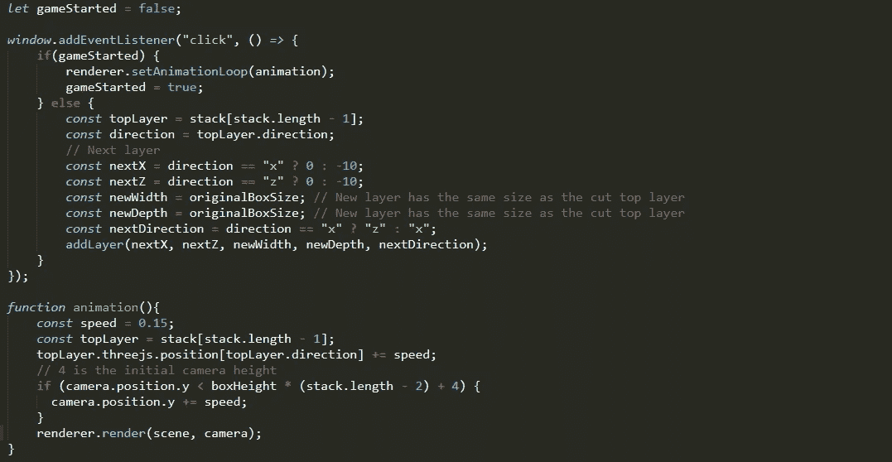
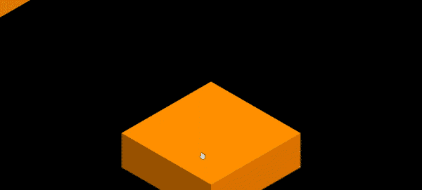
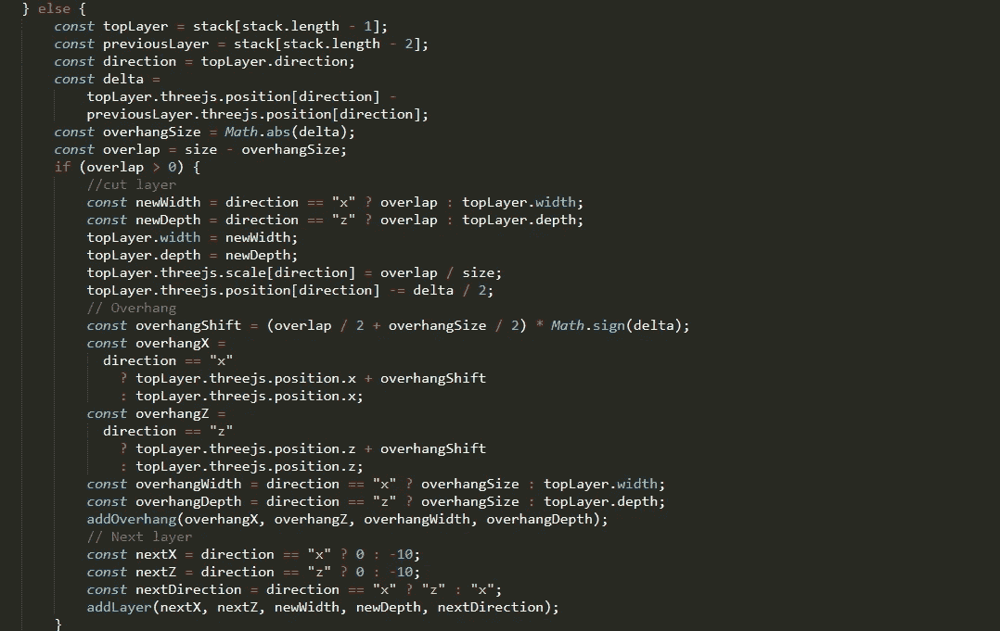
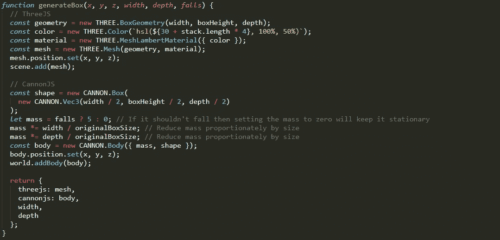
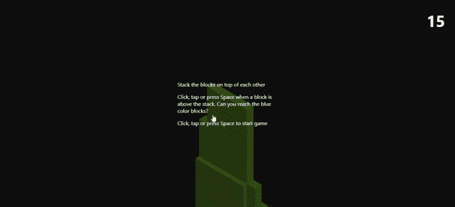

# 使用 three.js 构建一个堆栈游戏

> 原文：<https://blog.devgenius.io/build-a-stack-game-using-three-js-ea4d09963a62?source=collection_archive---------0----------------------->

## 使用 three.js 从头开始制作 3D 游戏。



[堆栈](https://play.google.com/store/apps/details?id=com.ketchapp.stack&hl=en_IN&gl=US)

js 是一个跨浏览器的 JavaScript 库，它有助于创建和显示动画 3D 图形。它在引擎盖下使用 WebGL。

我们要用物理创造 3D 游戏。我们将使用 Three.js 来生成 3D 图形，使用 Cannon.js 来模拟物理。

这篇文章主要是为初学者写的。

# 1.用盒子设置场景

首先，我们创建一个 3D 场景。然后，我们将使用一个盒子的几何形状，并设置宽度，高度，深度的方块。初始化材质选项，我们使用 MeshLamberMaterial，因为它关心灯光。定位网格后，添加到场景中。

```
// Scene
scene = new THREE.Scene();// Add a cube to the scene
const geometry = new THREE.BoxGeometry(3, 1, 3);
const material = new THREE.MeshLambertMaterial({ color: 0xff0000 });
const mesh = new THREE.Mesh(geometry, material);
mesh.position.set(0, 0, 0);
scene.add(mesh);
```

# 2.添加灯光

我们有两种灯光——环境光和平行光。环境光从每个方向照射都有基色和强度。平行光从我们初始化的给定位置发出。

```
// Set up lights
const ambientLight = new THREE.AmbientLight(0xffffff, 0.6);
scene.add(ambientLight);const dirLight = new THREE.DirectionalLight(0xffffff, 0.6);
dirLight.position.set(10, 20, 0);
scene.add(dirLight);
```

# 3.摄像机位置

我们将使用正投影。在这个投影中，无论物体离摄像机多远，它看起来都一样大，而且不会扭曲几何形状。

```
// Camera
const aspect = window.innerWidth / window.innerHeight;
const width = 10;
const height = width / aspect;camera = new THREE.OrthographicCamera(
width / -2, // left
width / 2, // right
height / 2, // top
height / -2, // bottom
0, // near plane
100 // far plane
);camera.position.set(4, 4, 4);
camera.lookAt(0, 0, 0);
```

# 4.渲染器

它会将我们的场景渲染到浏览器中。我们正在使用 WebGL 渲染器，它会渲染一切。

```
// Set up renderer
renderer = new THREE.WebGLRenderer({ antialias: true });
renderer.setSize(window.innerWidth, window.innerHeight);
renderer.render(scene, camera);document.body.appendChild(renderer.domElement);
```



作者图片

# 5.设置游戏

现在，我们已经重新构造了代码，并使一些周围的对象成为全局的。让我们制作场景、相机和渲染器全局对象，这样我们就可以在游戏中使用它来实现其他功能。

我们创造了游戏的基础，现在又增加了新的层面。每当我们添加一个新的层时，我们就调用基本函数。我们只需要盒子的 x & z 位置，我们用这个函数计算 y 位置。



重构的基本代码

为了添加新层，我们创建了一个简单的 JavaScript 函数，用于将新层添加到堆栈中。

```
let stack=[];
const boxHeight = 1; //Height of each layerfunction addLayer(x, z, width, depth, direction) {
  const y = boxHeight * stack.length; // Add the new box one layer higher
  const layer = generateBox(x, y, z, width, depth, false);
  layer.direction = direction;
  stack.push(layer);
}
```

还有一个生成框的功能。我们让它们成为独立函数，因为随着游戏的进行，我们需要不同大小的盒子，而且我们每次只调用一个函数。

```
function generateBox(x, y, z, width, depth, falls) {
  // ThreeJS
  const geometry = new THREE.BoxGeometry(width, boxHeight, depth);
  const color = new THREE.Color(`hsl(${30 + stack.length * 4}, 100%, 50%)`);
  const material = new THREE.MeshLambertMaterial({ color });
  const mesh = new THREE.Mesh(geometry, material);
  mesh.position.set(x, y, z);
  scene.add(mesh);return {
    threejs: mesh,
    width,
    depth
  };
}
```

# 6.事件处理和动画

添加一个新的全局对象来指示游戏是否开始。然后，添加一个点击监听器，它将做两件不同的事情。如果游戏已经开始，它将开始游戏，如果游戏正在进行，它将停止移动盒子并添加新层。

在动画函数中，我们选择顶层堆栈项目，并从 addlayer 函数中得知其方向。然后我们改变它的摄像机位置。



事件和动画功能



作者图片

# 7.分割盒子

现在，我们将做一些计算，看看移动的盒子是否与下面的盒子重叠。如果它重叠，我们分成 2 块。哪一部分突出物会散架。

我们将挑选前两个顶级堆栈项目并进行比较。然后我们计算网格的增量值，并从它的大小中减去。它将给出悬垂面积的大小。



在 eventListener 中添加了突出代码

```
let overhangs = [];
function addOverhang(x, z, width, depth) {
  const y = boxHeight * (stack.length - 1); // Add the new box one the same layer
  const overhang = generateBox(x, y, z, width, depth, true);
  overhangs.push(overhang);
}
```

# 8.添加 Cannon.js

js 是一个独立的库，它模拟物理而不是视觉。它会更新位置和方向，然后 three.js 会对其进行渲染。

在 cannon.js 中设置重力

```
// Initialize CannonJS
  world = new CANNON.World();
  world.gravity.set(0, -10, 0); // Gravity pulls things down
  world.broadphase = new CANNON.NaiveBroadphase();
  world.solver.iterations = 40;
```

正在移动的盒子和那些在堆栈顶部的盒子没有质量，我们控制它们。

落下来的悬垂部分有质量，Cannon.js 移动它们。

创建了两个长方体—一个有质量(cannon.js 长方体)和一个没有质量(three.js 长方体)



添加了 cannon.js

每当我们改变一些东西时，我们需要保持 cannon.js 同步。



作者图片

你可以按照完整的源代码更好地理解，这里是 [GitHub repo](https://github.com/Vikalp2502/Stack-Game) 。