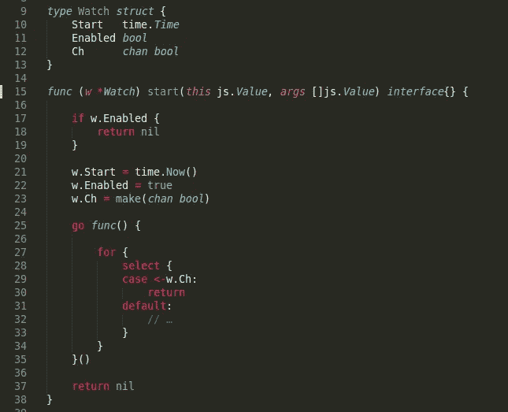
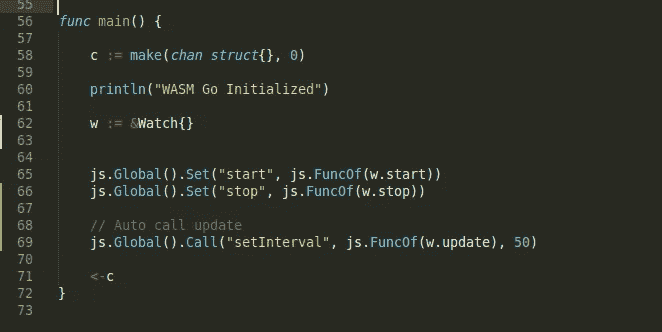
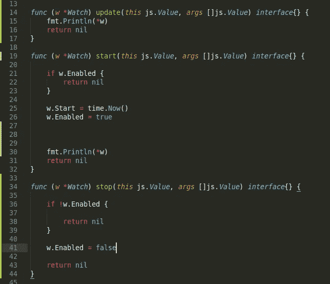
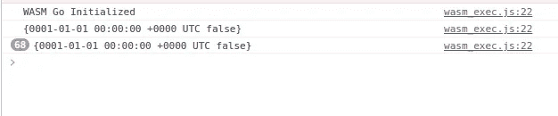
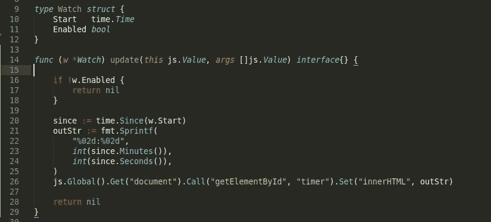

# 用 Go WASM 建立一个计时器

> 原文：<https://blog.devgenius.io/build-a-timer-with-go-wasm-bfcf5d964b08?source=collection_archive---------5----------------------->

照片由 [Pankaj Patel](https://unsplash.com/@pankajpatel?utm_source=medium&utm_medium=referral) 在 [Unsplash](https://unsplash.com?utm_source=medium&utm_medium=referral) 上拍摄

在与 WASM 一起构建了我的第一个程序后，我想看看 Goroutines 能做些什么。我想到的用例是构建一个计时器，一个由 Goroutine 管理的计时器。在这篇文章中，我将详细介绍我尝试用 WASM 构建一个计时器。我选择构建一个计时器，因为我想构建一个具有状态管理的程序。我还想展示 Go 如何简化定时器的编写。我将跳过 WASM 设置步骤，直接开始编写程序的 Go 代码。

# 基本组件

计时器虽然简单，但需要某种形式的状态管理。这是跟踪开始时间和当前时间之间的持续时间所必需的。为了添加状态，我将定义一个结构类型。该结构将存储开始时间以及其他有用的信息。我将定义 struct 方法来操纵状态，这是为了防止需要任何全局变量。下面是结构定义:

我的自定义结构类型将有一个名为`start`的方法。正如您所知，该方法将启动一个 Go 例程，并通过存储的通道监听退出信号。`start`的函数签名与`js.Func`的匹配，我这样做是为了以后可以将 struct 方法设置为浏览器函数。下一步是在我的浏览器上测试它。

# 和 WASM 一起去

我编译了二进制文件，并将其加载到我的浏览器上。我很兴奋能在浏览器上测试 Goroutines。Goroutine 独立刷新 HTML 值的想法很棒。我从浏览器窗口调用功能`start`，然后……控制台死机了。Goroutine 阻止了我的 chrome 控制台上的任何执行。然而，我不会放弃和 WASM 一起制作计时器。我利用我作为 web 开发人员的经验来绕过这个限制。我问自己，如果浏览器可以调用刷新功能会怎么样？这将是理想的浏览器与`setInterval`，我可以使用`setInterval`来设置一个理论上的刷新率。`setInterval`是非线程阻塞的，这使得它成为替代 Goroutines 的理想选择。最棒的是，我可以使用一个函数，而不用将它暴露给浏览器。下面是我的计时器的主要功能:

在最后一行，我调用 setInterval 来每 50 毫秒调用一次方法更新。setInterval 将负责线程管理，而不是 Goroutines。在我不使用 Goroutines 更新状态之后，是时候更新代码来使用 setInterval 管理状态了。下面是类型`Watch`将如何实现:

Goroutine 已从方法`start`中移除。新的设置将依靠浏览器来请求更新。这是最佳选择，因为 Javascript 在异步执行时性能更好。它还能让浏览器以自己的速度刷新。如果程序规定了刷新率，浏览器就会死机。下面是 Chrome 控制台上的方法更新:

更新被调用了 68 次。

# 刷新率

我希望这个程序能够更新网页的 HTML。Go 的`fmt`包有很棒的字符串格式化功能。我希望计时器显示 1 位数的值为 2 位数的值。例如，如果计时器有 1 秒，我希望它显示为 01。这将使计时器看起来比数字手表更熟悉。下面是修改后的更新方法:

这里传递的字符串格式是`%02d`，这是将我的 1 位数变成 2 位数的格式。如果计时器尚未启动，该方法将提前返回。该函数还将设置一个 ID 为 timer 的 HTML 元素的 innerHTML。因此，要在网页上显示程序的输出，我们需要一个 ID 为 timer 的元素。下面是一个运行中的定时器的 GIF 图，带有期望的行为:

# 结论

我学到的一件事是，要建立一个成功的 WASM 程序，必须了解浏览器的生命周期。在写这篇文章之前，我想到可以使用一个 Go 例程来跟踪计时器状态。虽然这对于其他的建造目标是可能的，但是对于 WASM 来说并不合适。这些是在浏览器虚拟机中运行代码的限制，WASM 在所述虚拟机中执行。也就是说，使用 Go 来格式化将显示给浏览器的字符串数据，以及使用`time`包来测量时间是很好的。我知道这是一个简单的例子，但是我想说明的是如何实现浏览器友好的代码。以及如何有效地管理和显示程序的状态。您可以在下面的源代码部分找到完整程序的链接。

# 来源

 [## medium _ examples/wasmtimer at main cheikh shift/medium _ examples

### 中型文章的代码示例。在 GitHub 上创建一个帐户，为 cheikhshift/medium_examples 开发做贡献。

github.com](https://github.com/cheikhshift/medium_examples/tree/main/wasmtimer)