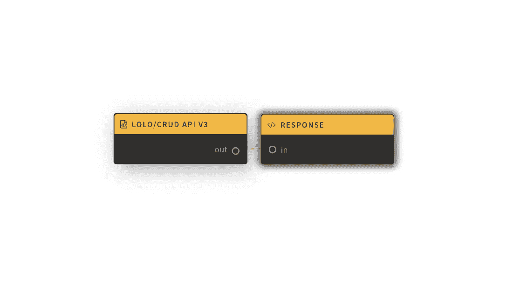
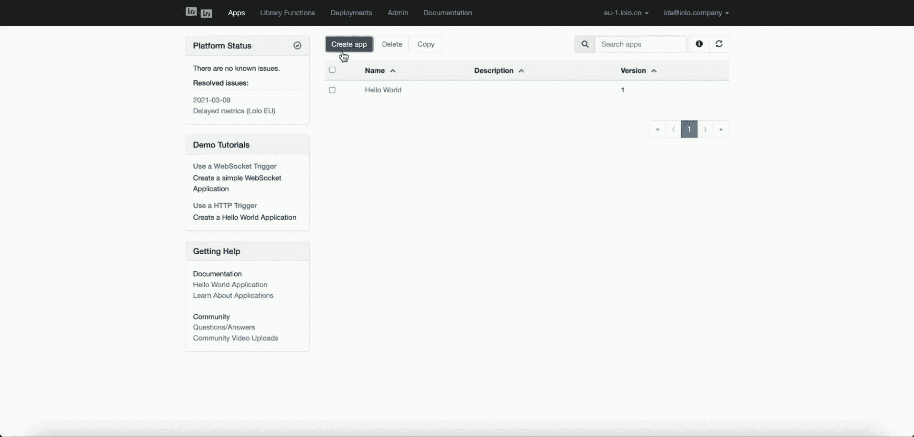
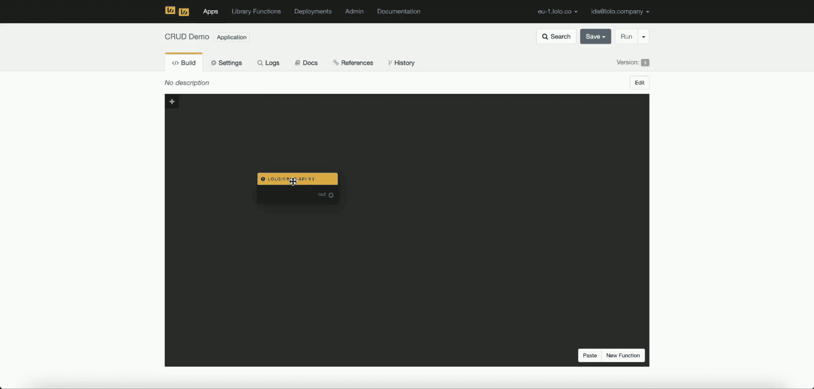
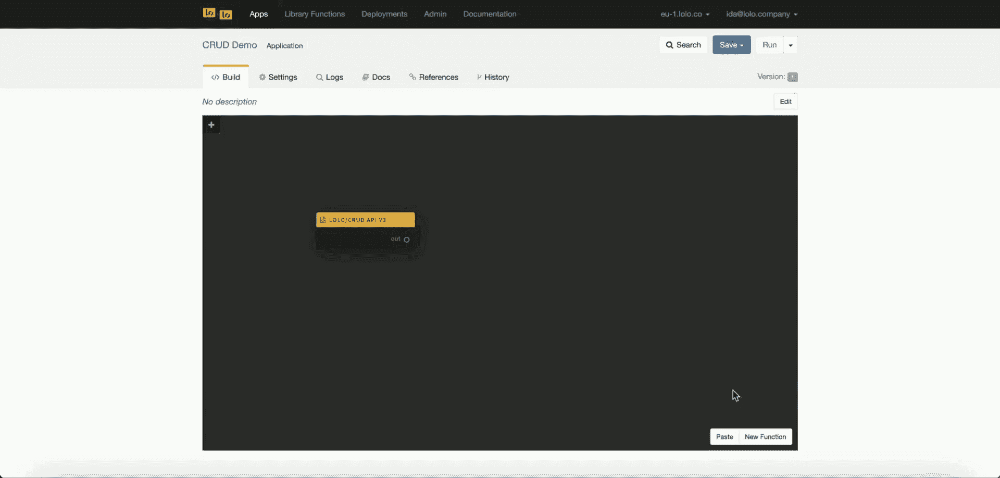
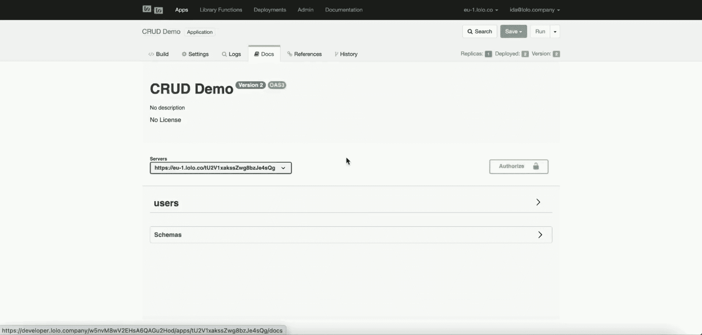

# 用 Lolo 的库函数构建一个可视化的无服务器 CRUD API

> 原文：<https://blog.devgenius.io/build-a-visual-serverless-crud-api-in-3-minutes-with-lolos-library-function-befbe538b815?source=collection_archive---------17----------------------->

Lolo Code 是一个无服务器平台，能够通过使用库函数重用代码。库函数是模板函数，用户可以利用它快速构建无服务器应用程序。

任何人都可以创建自己的库函数，但这个 CRUD API v3 是由团队创建的。有了它，你将能够在几分钟内构建一个无服务器的 CRUD API，而不需要外部数据库。你可以用它来免费处理每秒成千上万的请求。

我们的工作流程非常简单。触发器是 Lolo/CRUD API v3，然后响应是我们的编码响应。

因为已经在 CRUD API v3 库函数中为您构建了代码，所以这个应用程序只需要很少的代码。Lolo/CRUD API V3 设置您的方法(GET、POST、PUT、PATCH 和 DELETE)和数据库。使用 emit()从响应节点发回响应。请参见上面的工作流程图。

如果这对你来说是 jibberish，不要担心。只需按照下面的步骤在几分钟内启动并运行。

# 创建新的应用程序

在您的 [Lolo 账户](https://developer.lolo.company/)中创建一个新的应用程序。

当你完成的时候。单击图表左侧的加号(+)。在这里你可以使用一些库函数。点击添加 **lolo/CRUD API v3** 功能。

创建一个新的应用程序，并添加 lolo/CRUD API v3 库函数。

# 配置 CRUD 功能

由于大部分代码已经为我们创建好了，我们只需要通过 parameters 选项卡来配置它。

双击此功能进行配置。您必须设置**资源**的名称，但是其他的都是可选的。

导航至 lolo/CRUD API v3 函数进行配置。请确保设置了资源名称。

将什么名称设置为资源取决于您自己。如果**用户**被设置为资源，那么查找所有条目的 GET 端点将是[https://eu-1.lolo.co/:appId/users](https://eu-1.lolo.co/:appId/users)。一旦保存并部署，请在应用程序的 **Docs** 选项卡中查看所有 API 端点。

您还可以找到一些选项，比如设置 JSON 模式、删除操作、添加身份验证和授权。但是现在让我们把这些空着。

# 发回回复

现在我们需要通过点击图表右下角的**新功能**来创建一个新功能。

当一个 http 端点在 CRUD API v3 触发器中被触发时，它将为您提供一个事件对象，其中包含响应请求所需的所有数据。我们需要确保发回正确的数据。因此，我们需要在新的自定义函数中添加一些代码，以使这个库函数正常工作。

这里我们唯一需要的是发回已经为我们准备好的 **ev.response** 。就像下面的代码一样。

请参见下面的演示，了解如何导航到您创建的新函数，并粘贴到您在上面看到的代码块中。

创建一个新函数，然后将之前的响应粘贴到它的代码处理程序中。

# 连接节点

记住，通过将 lolo/CRUD API v3 的 out 端口拖到新函数的 in 端口，将两个节点连接在一起，这样当调用端点时，数据可以从一个节点流到另一个节点。

# 部署应用程序

保存并运行应用程序。

现在，我们等待一两分钟来部署这个应用程序。它的依赖性会降低部署速度，所以如果它不能马上工作，也不要担心。

当一两分钟过去后，在**日志**中查找端口 4000 上的**监听。这意味着它已经被部署，您可以开始使用它。**

# 尝试您的端点

导航到 Docs 以找到您的 API 文档，从而找到您的 API 端点。如果您没有先保存和部署，这些将不可见。请记住，这不是一个模拟环境。

我们在没有 JSON 模式的情况下对此进行了配置，因此当您尝试 POST 端点时，可以在这里设置您想要的 JSON 数据。

使用应用程序尝试在 API 文档中为您设置的 API 端点。

# 观看完整的 YouTube 教程

如果事情进展太快，而你在某个地方停滞不前，请遵循这个完整的教程，学习如何使用 **lolo/CRUD API v3** 。

# 附加选项

到目前为止，我们已经创建了一个完全成熟的 CRUD API 供您使用。

但是，您可能希望添加一个 JSON 模式以及身份验证。这可以通过返回到 **lolo/CRUD API v3** 节点并进一步配置来实现。

# 添加 JSON 模式

要添加 JSON 模式，导航回 Lolo 图并再次打开 lolo/CRUD API v3 函数。导航至参数选项卡。在**资源**输入下，您可以选择添加一个 JSON 模式。

如果你需要帮助来设置你的 JSON 对象，去这个[站点](https://bjdash.github.io/JSON-Schema-Builder/)找一个 JSON 构建器。

一旦设置好模式，你可以简单地复制并粘贴对象，并将其插入 **lolo/CRUD API v3** 库函数中的 Set JSON 模式下。

保存并再次运行您的应用程序。

等待一分钟左右，直到您在日志中看到确认。用正确的 JSON 结构来测试您的 API。

请观看下面的视频，一步步了解我们是如何做到这一点的。

# 添加身份验证和授权

这最后一部分是使用 [Lolo 认证](https://docs.lolo.company/docs/lolo-authentication)。

要添加 Lolo Auth，导航回你的 Lolo 图并再次打开 **lolo/CRUD API v3** 函数。导航至参数选项卡。向下滚动到页面底部，您可以看到认证，选择 Lolo API 认证。我们正在努力在未来提供更多的认证提供商，但现在你只能选择 Lolo 认证。

如果您从这里保存并运行您的应用程序，如果在头文件中没有 Lolo-Api-Key，您将无法调用 API。

要找到一个 API 密匙，导航到你的 Lolo 账户的**管理**部分，然后到 **API 密匙**创建一个新的密匙，该密匙将被设置到你的账户。

然而，任何拥有 Lolo API 密钥的人都可以访问这个 API。如果你只是想让一些 Lolo 账户访问这个 API，比如只有你自己，请添加应该被授权访问的账户的电子邮件。可以，在授权下的输入里输入自己的 Lolo 邮箱。

要跟随我们一步一步地学习，请看看下面的教程。

就这样吧。

任何人都可以创建这些库函数。尽管您需要导出和导入它们来与其他人共享。如果你有什么想公开的东西，请告诉我们，我们会仔细检查的。

希望你能顺利完成，如果不能，请告诉我们你的反馈。

❤️·洛洛