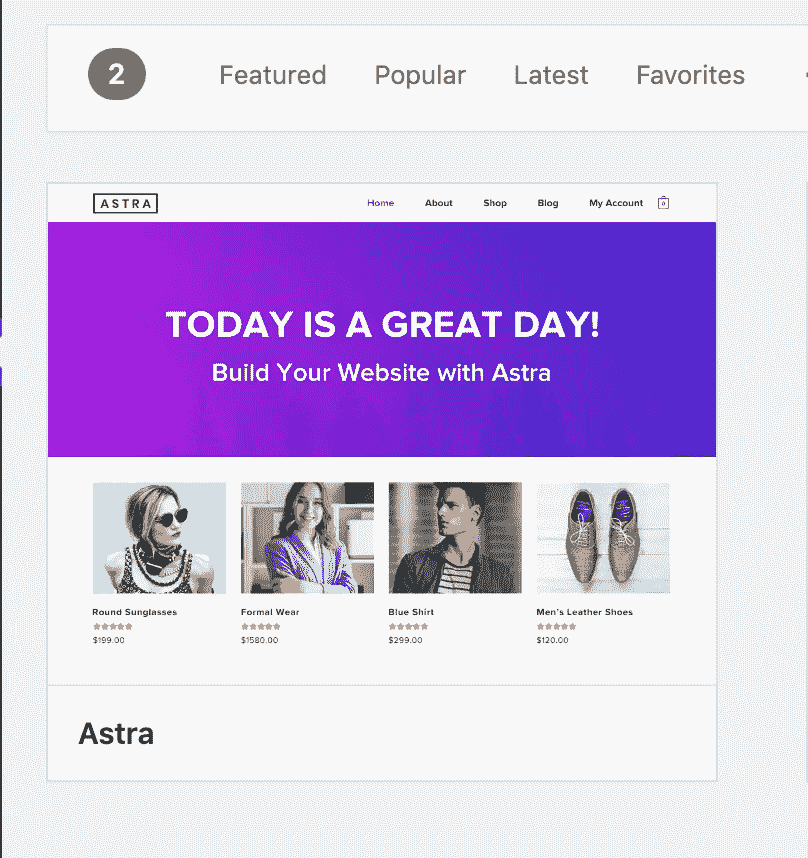
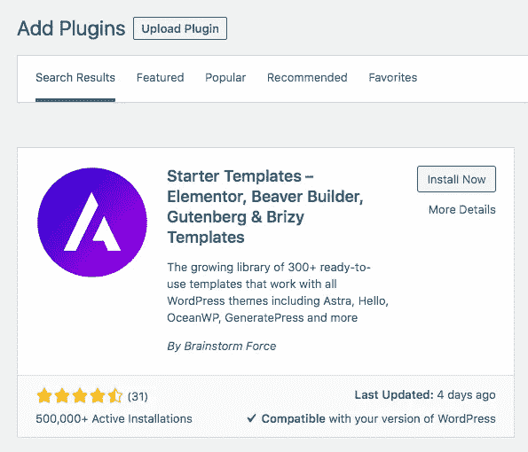
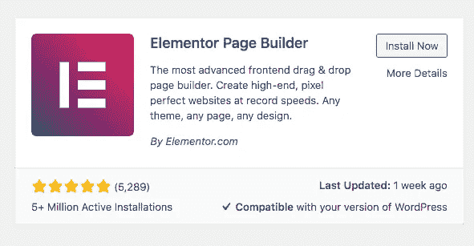
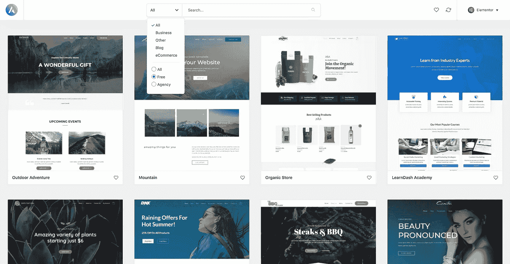
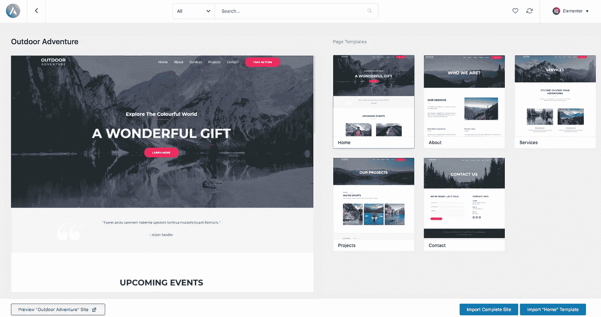
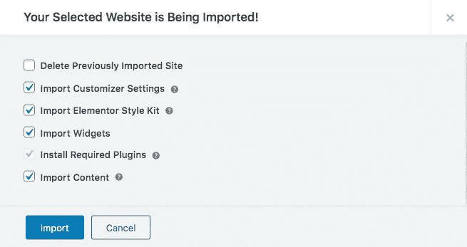
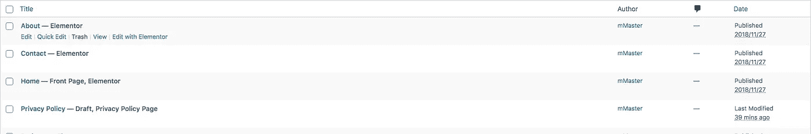

# 在 30 分钟(或更少)内建立一个网站。

> 原文：<https://blog.devgenius.io/build-a-website-in-less-than-30-minutes-390546e7ade6?source=collection_archive---------29----------------------->

由[加布里埃尔·博德里](https://unsplash.com/@gbeaudry?utm_source=medium&utm_medium=referral)在 [Unsplash](https://unsplash.com?utm_source=medium&utm_medium=referral) 拍摄的照片

> 这篇文章假设你已经连接了一个服务器和域名。
> 还没有？进入[我的另一篇文章](https://medium.com/@mayasavir/getting-started-with-domain-and-hosting-for-your-website-9b819c974fd8)解释如何获得域名和虚拟主机。

随着 WordPress 平台的发展，创建一个基本的网站变得非常容易。你所需要的只是一个服务器、域和 WordPress。在本指南中，你将看到如何使用 WordPress 在 30 分钟(或更少)内建立你的网站。

> 现在，每个服务器都给你从 cPanel 安装 WordPress 的选项。如果你不知道如何做，你可以联系客户支持，他们会帮助你。

## 什么是 WordPress

WordPress 是一个免费的内容管理系统(简称 CMS)。这是一个创建和管理网站的强大工具。博客、商业网站、个人网站和电子商务商店都可以从使用 WordPress 中受益，如果你想要的只是一个为你的服务/代理/公司/产品服务的基本网站，你不再需要知道如何编码。

在本指南中，我们将为一家旅行社建立一个网站。

你首先需要的是一个主题。一个主题基本上就是网站的设计和布局。WordPress 有一个默认的主题，看起来不错，但是我想我们都同意我们可以有一个更好的。

通过在网上搜索一个主题，你会有超过百万的搜索结果，有些是免费的，有些是需要购买的。我喜欢使用和开始一个免费的，基本的，好看的主题。

> 我们可以用[阿斯特拉](https://wpastra.com/ready-websites/?type=free&page-builder=elementor?bsf=5326)。Astra 的主题速度快，重量轻，易于使用，设计良好，并且与[元素或](https://elementor.com/?ref=13682)元素完美配合(我们稍后会谈到)。

## 我如何安装一个 Astra 主题？

你需要做的第一件事是进入你的 WordPress 管理面板的`themes->appearance`部分。一旦出现，点击`Add new`，搜索“Astra”并安装。安装完成后，点击`Activate`。

阿斯特拉主题

此时，你的网站使用默认的 Astra 主题。这不是我们的目标。为了使用 Astra 提供给我们的一个模板，我们需要安装一个插件。

我们转到`plugins`部分，点击`Add new`。在搜索框中，我们可以输入`starter template`，安装并激活插件。

Astra 入门模板

接下来的事情，我们就去`Appereance -> starter template`。在新的屏幕上，我们需要选择希望用于模板的页面生成器。
我认为现在是我们停下来简要解释一下**什么是页面生成器以及为什么我们会选择** [**元素或者**](https://elementor.com/?ref=13682) 的好时机。

## 元素或页面生成器

页面生成器是一种工具，通过为您提供预先构建的元素，您可以按照自己想要的任何方式进行排列，使您能够在创纪录的时间内整合网站。他们中的大多数使用拖放功能，最好的部分是，你将需要零编码技能来设计一个页面生成器。

Elementor 是最受欢迎的 WordPress 页面生成器之一，下载量超过 500 万次(在撰写本文时)。这是一个可视化的拖放编辑器，可以让你很快建立一个网站。任何人都可以很快学会它的界面，并开始用这个插件创建漂亮的页面。

> 对于刚刚起步的小企业来说，Elementor 的精简版是一个不错的选择。

[Elementor](https://elementor.com/?ref=13682) 有免费的精简版，但你也可以选择[它的高级替代品](https://elementor.com/?ref=2134)(49 美元起)和附加功能。

元素者

**让我们回到构建我们的网站** 在需要选择页面构建器的页面上，让我们选择 Elementor。在下一页，我们将拥有 Astra 提供的所有基于 Elementor 的模板。我们可以根据类别和价格进行筛选。

Astra 让你能够点击任何模板，并查看使用该模板后的页面外观。要检查它，只需点击任何模板。

正如我之前提到的，我的网站是一家旅行社的。所以我打算选择`Outdoor Adventure`模板。

现在我们可以点击`Import complete site`。它会要求您批准导入必要的插件/小部件/工具包，然后点击`Import.` 它将需要几分钟的时间来导入和安装。

> 你可能已经注意到，它将进口`Elemntor Style Kit`和其他一些`Required plugins`。其中一个是元素人。

导入完成后，我们可以看到我们的新网站。

**我们有一个生动、美观、实用的网站。**

## 编辑内容

你一定已经注意到一些内容是在平原胡言乱语，所以我们需要做的最后一件事是编辑网站内容。

在管理面板上，我们可以去`pages`部分。在这个页面上，你会看到 Astra 为我们创建的所有新页面。要编辑页面，将鼠标悬停在特定页面上并选择`Edit with Elementor`

让我们从`About us`页开始。

欢迎来到元素世界！
与[元素一起工作或者](https://elementor.com/?ref=13682)配得上自己的岗位。现在，让我们只关注改变 `About us`页面上的`our mission` 部分。

它唯一需要我们做的就是简单地点击你想要编辑的内容，一个文本编辑器将在左边打开，你可以编辑内容。
完成编辑后，点击页面底部右侧的`update`。请访问您的网站，查看更新的内容。

> 您可以用同样的方式编辑任何其他页面和任何其他元素(图片/标题/背景图像)。

## 结论

显然，我们还可以改变其他的东西，我们可以在我们的网站上添加更多的选项。但是现在，我们有一个网站，我们可以发布并展示给我们的客户。
1。安装主题
2。安装并选择一个启动模板
3。编辑内容

*   *披露——此帖子包含附属链接*