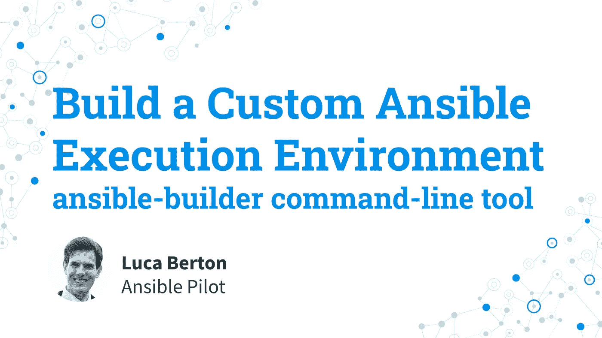

# 构建定制的 Ansible 执行环境— ansible-builder 命令行工具

> 原文：<https://blog.devgenius.io/build-an-ansible-execution-environment-ansible-builder-command-line-tool-b05e35f402e8?source=collection_archive---------1----------------------->

## 如何使用 ansible-builder 命令行工具来构建自定义“my _ ee”ansi ble 执行环境，指定一些自定义系统(git)、Python (boto)和集合(community.aws)依赖项。

# 如何构建自定义的 Ansible 执行环境？

使用 Ansible 执行环境是维护 Ansible 集合的最新 Python 依赖性而不干扰 Linux 系统的最新技术。是 Python 虚拟环境的进化。

这种初始配置有时对一些不可靠的用户来说是一个障碍。

我是卢卡·伯尔顿，欢迎来到今天的《神秘飞行员》节目。

# 可行的执行环境

*   可行的执行环境
*   `ansible-builder`命令行工具
*   `ansible-runner`命令行工具

我们来谈谈 Ansible 的执行环境。

Ansible 执行环境是可用作 Ansible 控制节点的容器映像。

这是 Red Hat 为简化自动化过程而开发的最新技术。

主要优势是使用容器技术创建可移植自动化运行时的开发和生产映像的标准环境。

这项技术取代了手动 Python 虚拟环境、Ansible 模块依赖和 bubblewrap。

有经验的用户可能对管理定制 Python 虚拟环境和 Ansible 模块依赖关系的许多挑战都很熟悉。Ansible Automation Platform 的企业用户熟悉在 bubblewrap 下限制执行作业，以便隔离进程

创建由 Ansible Builder 工具执行。

Ansible Builder 生成一个目录，作为容器映像构建的构建上下文，其中包含``Containerfile`',以及需要添加到映像中的任何其他文件。

另一方面，执行由 Ansible Runner 工具执行。

Ansible Runner 使您能够在当前机器上将执行环境作为容器运行。这基本上就是确保内容按预期运行。

# 链接

*   [https://www.ansible.com/products/execution-environments](https://www.ansible.com/products/execution-environments)
*   [https://docs . ansi ble . com/automation-controller/latest/html/user guide/execution _ environments . html](https://docs.ansible.com/automation-controller/latest/html/userguide/execution_environments.html)

# 演示

使用 ansible-builder 工具
构建一个 Ansible 执行环境-执行环境名称: *my_ee*
-系统依赖:git
- Python 依赖 boto3
-集合依赖:community.aws

如何使用 ansible-builder 工具构建一个 Ansible 执行环境？

我将向您展示如何使用指定一些定制系统、Python 和集合依赖的`ansible-builder`工具来构建一个定制的“`my_ee`”ansi ble 执行环境。

例如，让我们构建一个名为“`my_ee`”的定制的可执行环境，其中包含系统需求“`git`”、Python 库“`boto3`”和 Amazon 集合“`community.aws`”。

# 密码

*   执行环境. yml

```
---
version: 1
dependencies:
  galaxy: requirements.yml
  python: requirements.txt
  system: bindep.txt
additional_build_steps:
  prepend: |
        RUN pip3 install --upgrade pip setuptools
  append:
    - RUN ls -al /
```

*   要求. yml

```
---
collections:
  - name: community.aws
requirements.txtbotocore>=1.18.0
boto3>=1.15.0
boto>=2.49.0
```

*   bindep.txt

```
git [platform:rpm]
git [platform:dpkg]
```

# 执行

```
$ ansible-builder build -t my_ee -v 3
Running command:
  podman build -f context/Containerfile -t my_ee context
Complete! The build context can be found at: /home/devops/ee/context
```

当 ansible-builder 工具未安装时，您应该通过 DNF 命令安装它:

```
[root@demo ee]# dnf install ansible-runner
```

该工具需要访问您的 Red Hat Ansible Automation 订阅提供的 Red Hat 容器注册表(Red Hat Portal 的用户名和密码)。

```
$ podman login registry.redhat.io
```

一个成功的构建会产生下面的`context/Containerfile`:

```
ARG *EE_BASE_IMAGE*=registry.redhat.io/ansible-automation-platform-22/ee-minimal-rhel8:latest
ARG *EE_BUILDER_IMAGE*=registry.redhat.io/ansible-automation-platform-22/ansible-builder-rhel8:latest
FROM *$EE_BASE_IMAGE* as galaxy
ARG *ANSIBLE_GALAXY_CLI_COLLECTION_OPTS*=
USER root
ADD _build /build
WORKDIR /build
RUN ansible-galaxy role install -r requirements.yml --roles-path "/usr/share/ansible/roles"
RUN *ANSIBLE_GALAXY_DISABLE_GPG_VERIFY*=1 ansible-galaxy collection install *$ANSIBLE_GALAXY_CLI_COLLECTION_OPTS* -r requirements.yml --collections-path "/usr/share/ansible/collections"
FROM *$EE_BUILDER_IMAGE* as builder
COPY --from=galaxy /usr/share/ansible /usr/share/ansible
ADD _build/requirements.txt requirements.txt
ADD _build/bindep.txt bindep.txt
RUN ansible-builder introspect --sanitize --user-pip=requirements.txt --user-bindep=bindep.txt --write-bindep=/tmp/src/bindep.txt --write-pip=/tmp/src/requirements.txt
RUN assemble
FROM *$EE_BASE_IMAGE*
USER root
RUN pip3 install --upgrade pip setuptools
COPY --from=galaxy /usr/share/ansible /usr/share/ansible
COPY --from=builder /output/ /output/
RUN /output/install-from-bindep && rm -rf /output/wheels
RUN ls -la /
```

[](https://github.com/lucab85/ansible-pilot) [## GitHub-lucab 85/ansi ble-Pilot:ansi ble Pilot YouTube 频道代码库

### 此时您不能执行该操作。您已使用另一个标签页或窗口登录。您已在另一个选项卡中注销，或者…

github.com](https://github.com/lucab85/ansible-pilot) 

# 概述

现在您知道了如何使用带有定制系统、Python 和 Ansible 集合的`ansible-builder`命令行工具来构建 Ansible 执行环境。

我希望你喜欢读这篇文章。如果你愿意支持我成为一名作家，可以考虑注册[成为](https://ansiblepilot.medium.com/membership)的媒体成员。每月只需 5 美元，你就可以无限制地使用 Medium。

订阅 [YouTube 频道](https://www.youtube.com/channel/UC5MNbTYRHSCu9vAki3z9SmA)、 [Medium](https://ansiblepilot.medium.com/) 、 [Substack](https://ansiblepilot.substack.com/) 和[网站](https://www.ansiblepilot.com/)，不要错过 Ansible Pilot 的下一集。

# Ansible 的最佳资源

# 视频课程

*   [在 200 多个示例中学习 Ansible Automation&实践课程:通过一些关于如何使用最常见模块的真实示例和 ansi ble 剧本来学习 ansi ble](https://www.udemy.com/course/ansible-by-examples-devops/?referralCode=8E065F6D6F8622A3DEC8)

# 书

*   [可通过示例回答:200 多个针对 Linux 和 Windows 系统管理员和开发人员的自动化示例](https://leanpub.com/ansiblebyexamples)
*   [适用于 Windows 的示例:针对 Windows 系统管理员和开发人员的 30 多个自动化示例](https://leanpub.com/ansibleforwindowsbyexamples)
*   [ansi ble For Linux by Examples:100 多个针对 Linux 系统管理员和开发人员的自动化示例](https://leanpub.com/ansibleforlinuxbyexamples)
*   [Ansible Linux 文件系统示例:30 多个针对现代 IT 基础设施的 Linux 文件和目录操作自动化示例](https://leanpub.com/linuxfileanddirectorybyansibleexamples)
*   [通过示例负责容器和 Kubernetes:10 多个自动化示例来自动化容器、Kubernetes 和 OpenShift](https://leanpub.com/ansible-for-kubernetes-by-examples)
*   [负责安全示例:100 多个自动化示例，用于自动化现代 IT 基础设施的安全和验证合规性](https://leanpub.com/ansibleforsecuritybyexamples)
*   [可行的技巧和窍门:10 多个可行的例子来节省时间和自动化更多的任务](https://leanpub.com/ansible-tips-and-tricks)
*   [Ansible Linux 用户&按示例分组:20 多个关于现代 IT 基础设施的 Linux 用户和分组操作的自动化示例](https://leanpub.com/ansiblelinuxusersandgroupsbyexamples)
*   [ansi ble For VMware by Examples:10 多个自动化您的 VMware 基础架构的示例(Ansible by Examples)](https://leanpub.com/ansible-for-vmware-by-examples)
*   [Ansible For PostgreSQL by Examples:10 多个自动化 PostgreSQL 数据库的示例](https://leanpub.com/ansible-for-postgresql-by-examples)
*   [ansi ble For Amazon Web Services AWS By Examples:10 多个自动化 AWS 现代基础设施的示例](https://leanpub.com/ansible-for-aws-by-examples)

# 捐赠

[](https://patreon.com/lucaberton) [## 卢卡·伯尔顿正在为 Ansible | Patreon 创建软件开源

### 今天就成为卢卡·伯尔顿的赞助人:获得世界上最大会员的独家内容和体验…

patreon.com](https://patreon.com/lucaberton) [](https://github.com/sponsors/lucab85) [## GitHub 赞助商上的赞助商@lucab85

### 我是一个活跃的开源贡献者，参与到了 Ansible 社区中，尽管我到处都是。@lucab85 的…

github.com](https://github.com/sponsors/lucab85) 