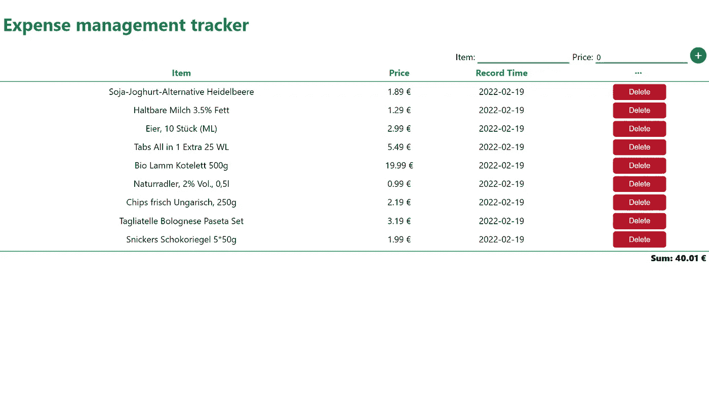
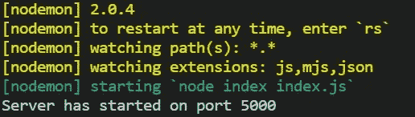
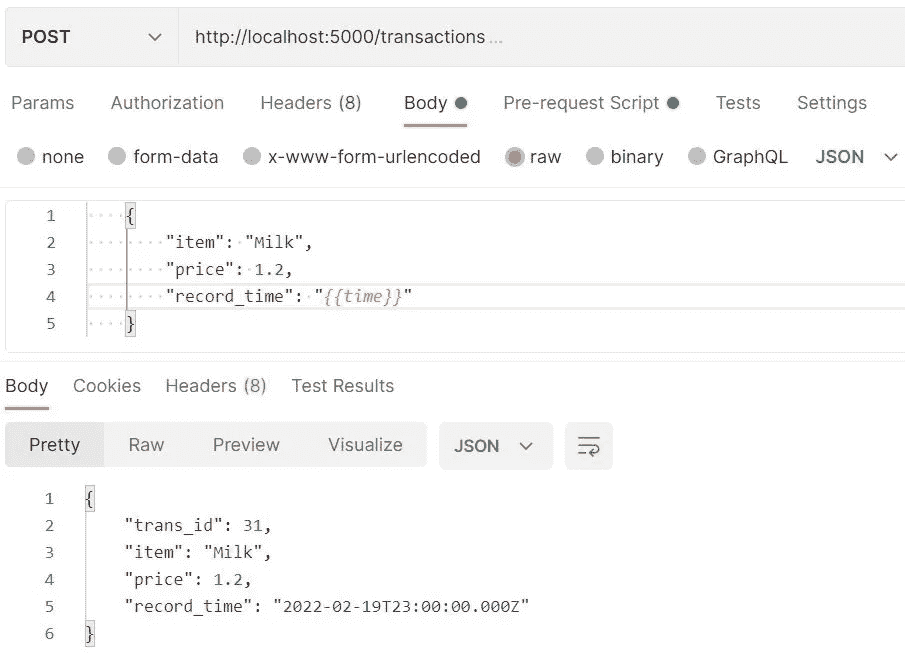

# 通过 PERN stack 建立一个费用管理跟踪器

> 原文：<https://blog.devgenius.io/build-an-expense-management-tracker-by-pern-stack-af92ac0e2828?source=collection_archive---------6----------------------->



本文给出了一个如何使用 PERN (PostgreSQL，Express，React，Node)栈构建 web 应用程序的例子。它使用费用管理跟踪器来解释每一步。Postman 可以用来测试 Restful APIs。CSS 文件留给您来实现。此外，您可以添加更多的功能，如添加类别，显示不同类别的费用图表，显示不同时期的费用等。

# 计算机网络服务器

创建一个包含前端和后端文件的文件夹。我只是给它起了个名字叫“挥金如土”。在“spendbook”文件夹中，为后端部分创建一个名为“server”的新文件夹。打开终端并指向“服务器”文件夹。然后使用默认设置运行`npm init -y`。

我只是假设您已经安装了 PostgreSQL，并且记得您的密码。如果你问我密码忘记了怎么办，好吧，网上有解决方案，但我只是重新安装了它。🤣

让我们首先创建一个 PostgreSQL 数据库和一个表。打开终端，运行`psql -U postgres`，输入密码。然后创建一个名为 pern_transactions 的数据库由`CREATE DATABASE pern_transactions;`也，我想为开发创建一个用户测试。所以运行`CREATE USER test WITH PASSWORD ‘password’;`授予用户测试权限很重要。`GRANT ALL PRIVILEGES ON ALL TABLES IN SCHEMA public TO test; GRANT USAGE, SELECT ON ALL SEQUENCES IN SCHEMA public TO test;`如果你在数据库中创建一个模式会更好，但我只是为这个演示懒惰。😁现在，我们可以通过以下方式在数据库中创建一个名为 transactions 的表

```
CREATE TABLE transactions(trans_id SERIAL PRIMARY KEY,item VARCHAR,price DOUBLE PRECISION,record_time DATE);
```

还需要一些 npm 库，所以运行`npm i express pg cors`。"`Express`是一个最小且灵活的 Node.js web 应用程序框架，为 web 和移动应用程序提供了一组健壮的特性"[1]。当我用 Node.js 编写后端代码时，它是我的救命稻草。`[pg](https://node-postgres.com/)`库由 [Brian C](https://github.com/brianc) 维护。我们将使用它将 Node.js 连接到 PostgreSQL。`Cors`一个 node.js 包，用于提供一个[Connect](http://www.senchalabs.org/connect/)/[Express](http://expressjs.com/)中间件，该中间件可用于使 [CORS](http://en.wikipedia.org/wiki/Cross-origin_resource_sharing) 具有各种选项【2】。与跨来源资源共享相关的问题在前端工作面试中很常见。你可以查看[这里的](https://www.toptal.com/web/interview-questions)获得一个简要的想法。对于开发，我还使用`nodemon`来“当检测到目录中的文件更改时，自动重启节点应用程序”[3]。

我们现在可以开始编写 Node.js 代码了。🎈

首先，在“服务器”文件夹中创建一个“db.js”文件。这里将使用数据库和表信息。

创建一个“index.js”文件。“require”包含这些包，我们用`const app = express()`实例化 Express。关于这个命令的一些有趣的讨论可以在这里找到[。然后通过调用`app.use(cors())`启用 CORS。`app.use(express.json())`被调用来识别 JSON 格式的传入请求。稍后我们将在注释路径下实现代码。](https://stackoverflow.com/questions/27599614/var-express-requireexpress-var-app-express-what-is-express-is-it#:~:text=%3D%3E%20Requires%20the%20Express%20module%20just,an%20object%20of%20a%20class.)

现在，我们可以通过运行`nodemon index.js`在端口 5000 上启动服务器。终端应该显示如下图所示的内容。



在这个演示中，我想举例说明如何添加一个新的事务，获取所有事务和删除一个事务。你可以尝试实现更多的功能，比如自己更新一个事务。

Post 用于向数据库中添加新数据。注意`async`和`await`关键字，因为 node.js 正在与外部 PostgreSQL 数据库交互。解构请求体中的数据。使用 SQL 命令通过`pool.query()`与数据库交互，其中$1、$2 和$3 对应于`[item, price, record_time]`中的参数。`RETURNING *`用于获取关于结果的有用信息，结果可以通过`res.json()`显示。

使用 Postman 测试 Restful API 很方便。要在 Postman 中将当前时间传递到请求正文中，可以在“预请求脚本”中添加以下代码:`**var** time = **new** Date(); postman.setEnvironmentVariable(“time”, time.toISOString());`



获得所有交易很容易。

要删除交易，需要相应的 id。所以在路由中，写`:id`，通过解构`req.params`得到 id。

现在，我们完成了后端部分。🎈

# 客户

重定向至“spendbook”文件夹并运行`npx create-reate-app client`。直接进入客户端文件夹并运行`npm i axios`。我们会用 axios 写 Promise。在 src 文件夹中，删除一些文件和相关的导入语句。src 文件夹中只会用到四个文件:index.css，index.js，App.css，App.js。

清理 App.js 文件，导入必要的包。用`useState`初始化`allTransactions`、`item` 和`price` 参数及其方法。`item` 和`price`用于增加新交易。使用 useEffect 在第一层加载页面时渲染页面，并通过检测`allTransactions`的依赖关系的变化来重新渲染页面。

让我们来实现`getAllTrans()`。演示现在是本地开发的，所以基路径是“http://localhost”，后端运行在端口 5000 上。通过调用`setAllTransactions(res.data)`重新分配所有事务的值。

我们用一个表格来显示所有的交易。我们首先需要检查`allTransactions` 是否不为空，这就是为什么那个参数后面有一个问号。如果它不为空并且其中包含所有元素，那么用`map()`迭代它。我们只对日期感兴趣，为了使它可读，`record_time` 字符串被拆分。在每个事务的旁边，有一个删除按钮，trans_id 被传递给`handleDelete()`。

然后我们可以实现`handleDelete()`功能。按照 Restful API 的设计，`id`在`req.params`中传输。

现在，我们可以设计添加新交易的功能。首先，我们创建一个表单。它包含两个输入和一个按钮。通过检测输入的变化来设置项目和价格的值，即`onChange={(e) => SetItem/SetPrice(e.target.value)}`。

同样，表单监听`onSubmit`事件。`handleSubmit`功能实现如下。由于项目和价格在表特性中具有相同的名称，所以我们可以将`item=item`简化为`item`。

无论添加新事务成功与否，都应该清除输入。您也可以仅在提交成功时清除它们。

现在大部分功能都实现了。我添加了一个函数来计算所有事务的总和，并将其显示在事务表下。

您可以编写 CSS 文件并为费用跟踪器设计自己的样式。现在，我们可以说，我们完成了！🎉🎉 🎉

# 参考

[1][https://expressjs.com/](https://expressjs.com/)

[https://www.npmjs.com/package/cors](https://www.npmjs.com/package/cors)

[3][https://www.npmjs.com/package/nodemon](https://www.npmjs.com/package/nodemon)

[https://www.npmjs.com/package/axios](https://www.npmjs.com/package/axios)