# 利用 Next.js、Cosmic 和 Stripe 集成构建 uNFT 市场

> 原文：<https://blog.devgenius.io/build-an-unft-marketplace-with-next-js-cosmic-and-stripe-integration-9fdfc872c1e8?source=collection_archive---------13----------------------->

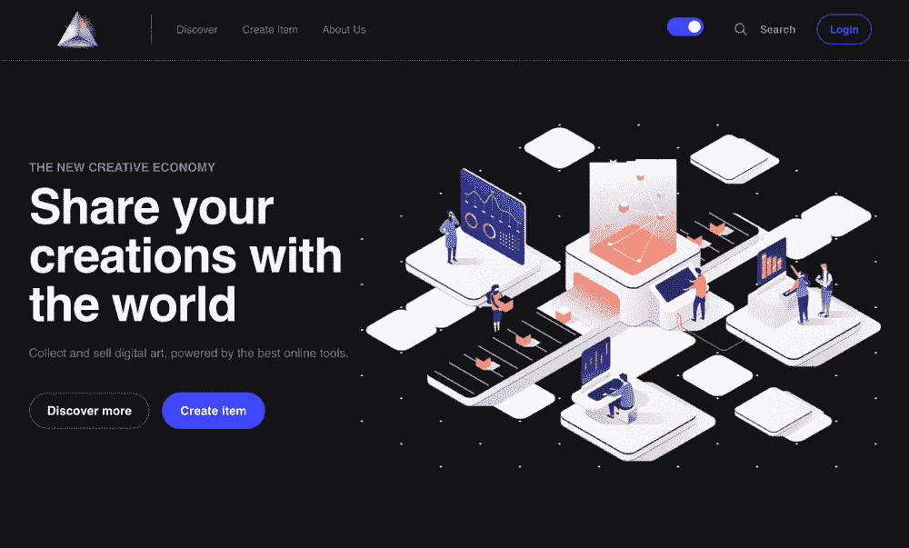

在本教程中，我将向您展示如何使用 Next.js、Cosmic 和 Stripe 构建一个市场应用程序。完成后，您将具备使用这些强大工具构建自己项目的基础。让我们开始吧。

额外的功能包括部署到 [Vercel](https://vercel.com/) ，黑暗和光明模式，并使用 [Lighthouse](https://www.searchmetrics.com/glossary/google-lighthouse/) 来衡量网站的[核心 web 生命指标](https://web.dev/vitals/)的性能，这大大增加了用户的体验和[网站在 SEO 搜索结果中的可见性](https://nextjs.org/learn/seo/introduction-to-seo/webcrawlers)(该应用的 Lighthouse 得分如下所示)。

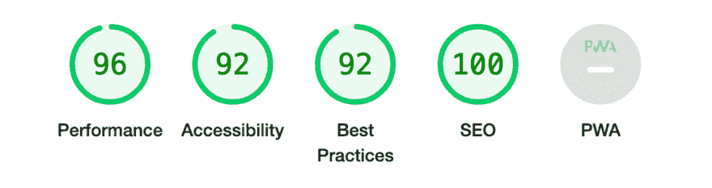

亲们，如果喜欢请 [**在**](https://www.producthunt.com/posts/unft-marketplace) **[**品猎**](https://www.producthunt.com/posts/unft-marketplace) 中向上投** 。

## 我们将使用的工具

*   [Next.js](https://nextjs.org/) —可扩展的高性能 **React.js** 现代 web 开发框架。提供大量现成的功能，如混合渲染、路由预取、自动图像优化和国际化。
*   [Cosmic](https://www.cosmicjs.com/) —快速、全面管理的 [headless CMS](https://www.cosmicjs.com/headless-cms) ，使我们能够快速管理和创建网站内容，包括 UGC(用户生成的内容)。
*   [Stripe](https://stripe.com/) —支付基础设施，提供 API 工具以接收一次性和订阅支付。

## TL；速度三角形定位法(dead reckoning)

[查看代码](https://github.com/cosmicjs/unft-marketplace)
[查看现场演示](https://unft-marketplace-cosmicjs.vercel.app/)
[安装 app 模板](https://www.cosmicjs.com/apps/unft-marketplace)

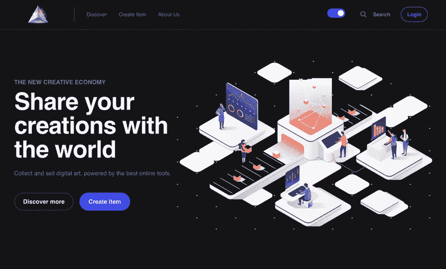

## 首先，我们需要提供架构和设计

> 设计从根本上讲就是把东西拆开，然后再组装起来。把东西分成可以组合的东西，这就是设计。— [里奇希基](https://www.infoq.com/presentations/Design-Composition-Performance/)。

## [MVC](https://www.freecodecamp.org/news/the-model-view-controller-pattern-mvc-architecture-and-frameworks-explained/) 代表模型-视图-控制器软件设计模式

以下是每个组件的含义:

*   **模型**:包含所有数据逻辑的后端。 [Cosmic](https://docs.cosmicjs.com/#use-cases) 对象类型( **Multiple 或 Singleton** )帮助我们创建动态的、可伸缩的数据结构，它们转换的本质独立于外部世界。
*   **视图(UI)** :前端或图形用户界面(GUI)。对于它，我们使用 React，它被描述为 MVC 中的“**V”**层。
*   **控制器**:应用程序的大脑控制数据如何显示。我们使用 React 的上下文 API 将状态从呈现视图中分离出来，并促进业务逻辑的重用。

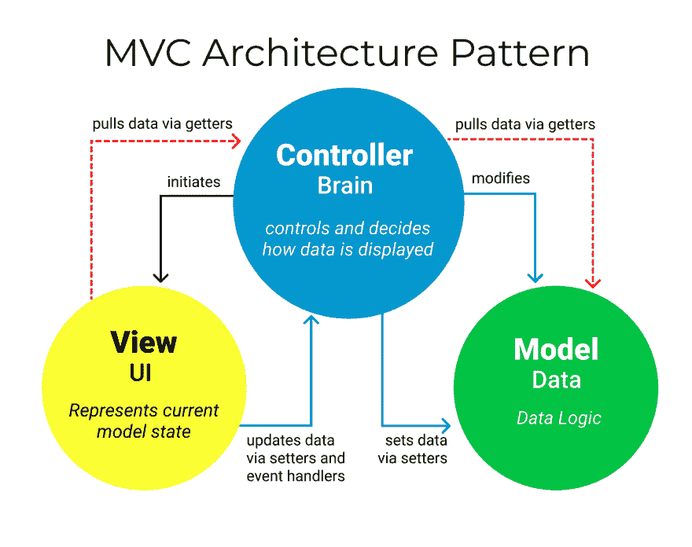

MVC 模式用于现代 web 应用程序，因为它允许应用程序可伸缩、可维护且易于扩展。

## 使用 Next.js 设置项目

**Next.js** 着手改善两件事:**开发者和用户体验**并且是一个完整的工具包来构建超快的反应应用。Next.js 提供了一种抽象，可以解决最常见、最普通、最复杂的任务，比如路由、内部化和图像优化。默认情况下，Next.js 会预先呈现每个页面。这意味着 Next.js *提前为每个页面生成 HTML*，而不是由客户端 JavaScript 来完成。预渲染可以带来更好的性能和 SEO。
Next.js 有[预渲染](https://nextjs.org/learn/basics/data-fetching/two-forms)两种形式: [**静态生成**](https://nextjs.org/docs/basic-features/pages#static-generation-recommended)**【SSG】**[**服务器端渲染**](https://nextjs.org/docs/basic-features/pages#server-side-rendering) **(SSR)** 。

*   [**静态生成**](https://nextjs.org/docs/basic-features/pages#static-generation-recommended) 是在**构建时间**生成 HTML 的预渲染方法。预渲染的 HTML 然后在每个请求中被*重用*。
*   [**服务器端渲染**](https://nextjs.org/docs/basic-features/pages#server-side-rendering) 是针对**每个请求**生成 HTML 的预渲染方法。

在我们的项目中，我们使用 [**服务器端渲染**](https://nextjs.org/docs/basic-features/pages#server-side-rendering) 来处理动态数据和总是最新的预渲染页面。

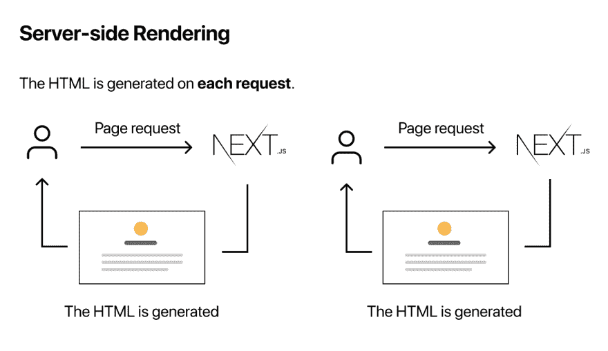

首先，我们将创建一个包含工具和配置的 [Next.js](https://nextjs.org/docs) 应用程序。对于本教程，您将需要 [Node.js](https://nodejs.org/en/) 12.22.0 或更高版本。打开终端，粘贴或键入

```
npx create-next-app@latest unft-marketplace 
#or 
yarn create next-app unft-marketplace
```

进入新目录，使用包管理器如`npm`、`yarn`或`pnpm`安装依赖项，然后在开发模式下启动应用程序:

```
cd unft-marketplace 
npm install cosmicjs stripe @stripe/stripe-js sass 
npm run dev 
# or 
yarn dev
```

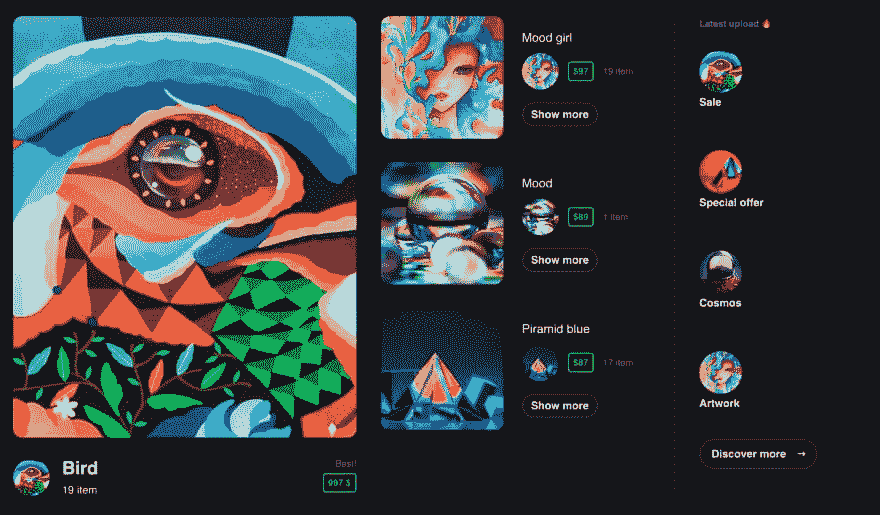

要使用模板 UI，您需要在 [GitHub](https://github.com/cosmicjs/unft-marketplace) 上克隆它。打开终端，粘贴或键入此代码以安装所有依赖项，然后运行它。

```
git clone https://github.com/cosmicjs/unft-marketplace 
cd unft-marketplace 
npm install 
#or 
yarn install npm run dev 
#or 
yarn dev
```

在浏览器中打开 [http://localhost:3000](http://localhost:3000/) 查看禁欲者主页。

## 使用 Next.js 管理应用编程接口密钥/秘密

当使用 API 密钥和秘密时，我们需要确保我们将它们保密并且不受版本控制，同时方便地将它们作为`.env`变量使用。您需要在项目的根目录下创建一个. env 文件。登录[宇宙](https://app.cosmicjs.com/)，从`Bucket Settings > API Access`取以下值:

```
NEXT_PUBLIC_COSMIC_BUCKET_SLUG=your_cosmic_slug
NEXT_PUBLIC_COSMIC_READ_KEY=your_cosmic_read_key
COSMIC_WRITE_KEY=your_cosmic_write_keyNEXT_PUBLIC_STRIPE_PUBLISHABLE_KEY=your_stripe_key
STRIPE_SECRET_KEY=your_stripe_secret_key
```

前缀`NEXT_PUBLIC_`自动向浏览器公开这个变量。Next.js 将在构建/呈现时将这些值插入到公开可见的源代码中。因此，请确保不要将此前缀用于秘密值！以同样的方式登录到[条纹](https://dashboard.stripe.com/login)和**的开发者**部分拿走你的钥匙。

前缀`NEXT_PUBLIC_`自动向浏览器公开这个变量。Next.js 将在构建/呈现时将这些值插入到公开可见的源代码中。因此，请确保不要将此前缀用于秘密值！以同样的方式登录到[条纹](https://dashboard.stripe.com/login)和**开发者**部分拿走你的钥匙。

## Next.js API 路由

Next.js [API 路由](https://nextjs.org/docs/api-routes/introduction)以在 Next.js 应用内创建 API 端点。它们将被部署为**无服务器功能**(也称为**T21)。在我们的例子中，为了通过参数过滤宇宙内容，我们将在`pages/api`目录中创建一个名为`filter.js`的文件，其格式如下:**

Next.js [API 路由](https://nextjs.org/docs/api-routes/introduction)以在 Next.js 应用内创建 API 端点。它们将被部署为**无服务器功能**(也称为 **Lambdas** )。在我们的例子中，为了通过参数过滤宇宙内容，我们将在`pages/api`目录中创建一个名为`filter.js`的文件，其格式如下:

注意`req`是 [http 的一个实例。IncomingMessage](https://nodejs.org/api/http.html#http_class_http_incomingmessage) ，加上一些预建的[中间件](https://nextjs.org/docs/api-routes/api-middlewares)和`res`就是 [http 的一个实例。ServerResponse](https://nodejs.org/api/http.html#http_class_http_serverresponse) ，加上一些[辅助函数](https://nextjs.org/docs/api-routes/response-helpers)。


# 宇宙特征概述和集成

Cosmic 是一个很棒的无头 CMS，它使我们能够在一个方便的托管仪表板中建模、管理和存储我们的内容和媒体，然后使用可用的 API 工具获取我们的内容。API 提供了现成的搜索和过滤功能，这使得在我们的应用程序中构建搜索和过滤功能变得很容易。 **Cosmic 为创建互动、独立和动态的网站提供完整的现代功能和特性**。

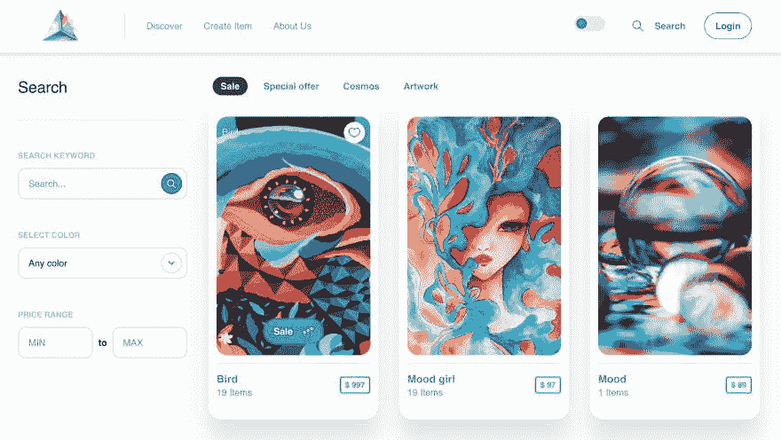

**可定制的 API** —从管理仪表板为 API 构建模式、模型和控制器。为了方便起见，Cosmic 提供了 REST 和 graph QL API。
**Webhooks** —在任何需要的地方回拨，获得开箱即用的功能。
[**查询**](https://docs.cosmicjs.com/examples/basic-queries) —允许您通过**搜索、过滤和排序**找到您数据中的正确资产。您可以使用一些[高级查询](https://docs.cosmicjs.com/examples/advanced-queries)来创建更精细的搜索功能。
[**添加媒体和对象**](https://docs.cosmicjs.com/examples/add-media) —您可以使用 Cosmic API 在应用程序中启用用户生成的内容。用户可以在您定义的数据模型中上传和创建交互式内容。Cosmic 不仅是一个完全托管的内容管理系统，而且 API 还可以用于创建用户生成的内容体验。

## 宇宙入门

第一步是创建一个[免费宇宙账户](https://app.cosmicjs.com/signup)到[宇宙仪表盘](https://app.cosmicjs.com/signup)和一个新项目。让我们选择“从头开始”选项。

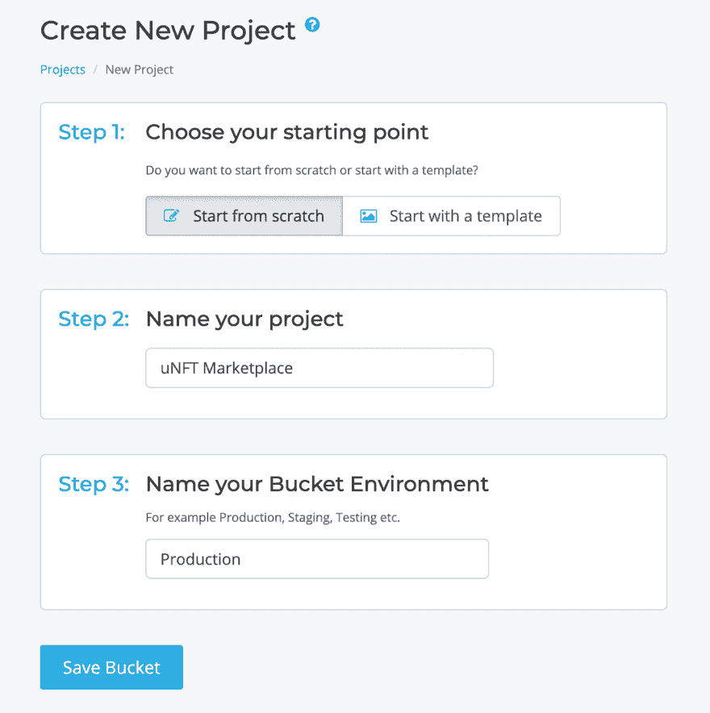

[宇宙](https://docs.cosmicjs.com/#use-cases)对象类型(**多个或单个**)帮助我们创建动态的、可伸缩的、可重用的数据结构和内容模型。创建模型部分，从零开始很容易，定义了“内容模型”中的“元字段”。对于跨多个对象使用的可重用模型，选择**多对象类型**。对于我们的项目，我们将创建一个可重用的**产品**对象类型**模型**，使用**多个**对象与**类别**的关系。这将使我们能够将**产品**添加到**类别**或从中删除，并能够按类别进行搜索和过滤。

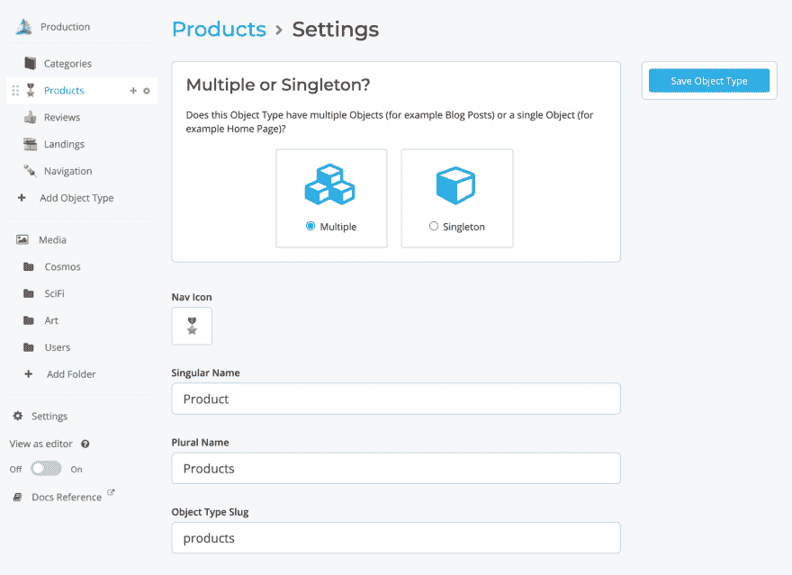

在为我们的产品创建内容模型之后，您可以开始从仪表板添加产品，如下所示:

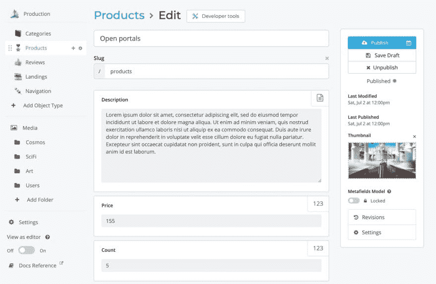

您可以通过按照以下模式设计创建对象类型来定义其他内容模型:

*   唯一模型的单例，
*   可重用模型的倍数。

使用 Cosmic [查询](https://docs.cosmicjs.com/examples/basic-queries)，您可以根据**搜索、过滤和排序**标准快速找到特定内容。


## 用户生成的内容

使用 Cosmic 功能向 [**添加媒体和对象**](https://docs.cosmicjs.com/examples/add-media) **、**登录的用户可以上传和创建他们自己的表单提交的内容。对于我们的用例，用户可以创建新的**产品**添加到市场上销售。

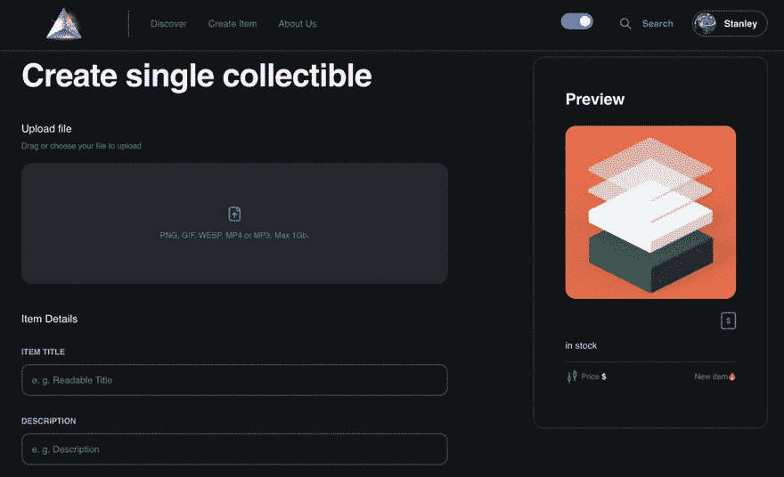

将文件和动态内容上传到 Next.js 需要 API 路由，因为我们需要将密钥安全地存储在服务器端环境变量中。下面简单介绍一下如何用 React 和 [Next.js API routes](https://nextjs.org/docs/api-routes/introduction) 使用`formidable`、`fs`和 [Cosmic](https://docs.cosmicjs.com/examples/add-media) `bucket.addMedia`方法上传文件。

## 条带概述和集成

[**Stripe**](https://stripe.com/docs/checkout/quickstart) 提供了一种在你的应用中捕捉支付的方式。就像 Cosmic 为内容基础设施做了所有繁重的工作一样，Stripe 提供电子商务基础设施和工具，为您的客户构建愉快的支付体验，而不考虑所销售的服务或产品。

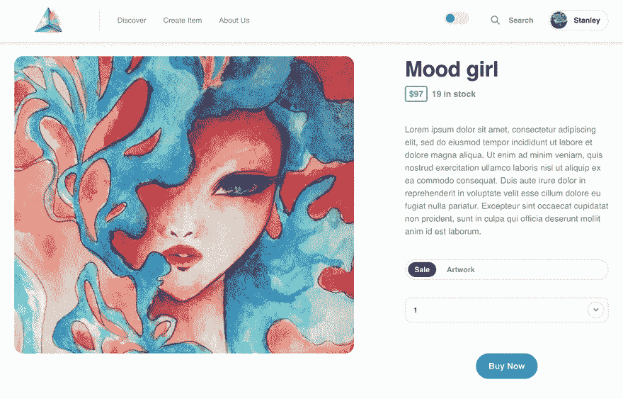

由于 [PCI 合规要求](https://stripe.com/docs/security)，Stripe.js 库必须从 Stripe 的服务器加载。这在使用服务器端渲染的应用程序时产生了挑战，因为窗口对象在服务器上不可用。为了帮助我们管理这种复杂性，Stripe 提供了一个[加载包装器](https://github.com/stripe/stripe-js)，允许像 es 模块一样导入 Stripe.js:

Stripe.js 是作为`import '@stripe/stripe-js'`语句的副作用加载的。

**创建条带检出会话**

在您的服务器上添加一个端点，创建一个 [**结帐会话**](https://stripe.com/docs/api/checkout/sessions) 。结帐会话控制您的客户在付款页面上看到的内容，如行项目、订单金额和货币以及可接受的付款方式。此外，您可以直接在 [**条纹仪表盘**](https://dashboard.stripe.com/settings/payment_methods) 中启用或禁用支付方式。

## 后续步骤

虽然这个 marketplace 应用程序主要是为了了解这些现代解决方案的概念验证，但它是一个很好的基础。有可能添加新功能，例如:

1.  显示订单的用户帐户页面
2.  展示购买的 jpegs 图片的用户资料页面
3.  评论系统捕捉评论和对话
4.  用于购物的比特币/闪电期权

# 结论

我希望您喜欢这篇教程，它探索了如何使用强大的 API 优先工具来构建一个全功能的 marketplace 应用程序。这个动态的、功能性的、可定制的、完全集成的 uNFT 市场由 **Next.js、** **Cosmic 和 Stripe** 提供支持，也可以为其他类型的企业定制。请随意使用代码，并按照您喜欢的方式使用它！