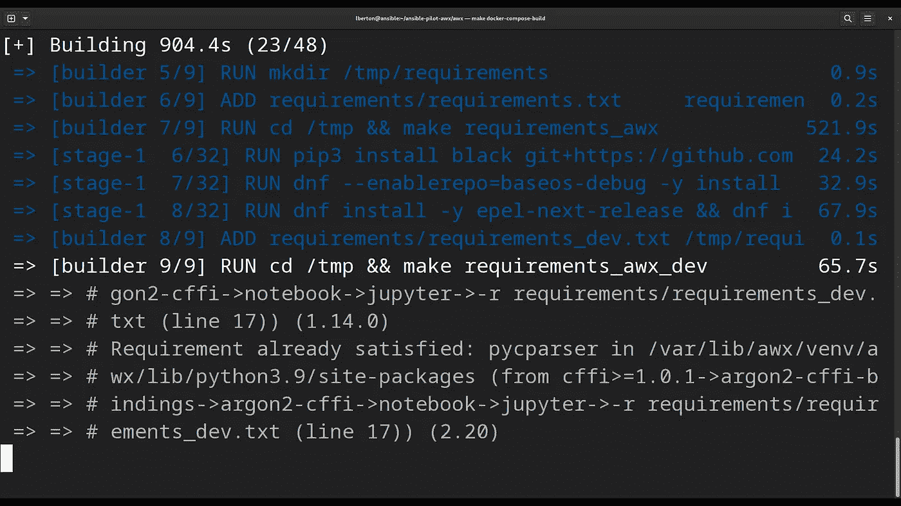

# 在码头集装箱中建造 AWX——AWX

> 原文：<https://blog.devgenius.io/build-ansible-awx-in-docker-containers-ansible-awx-aeefc7dcacfe?source=collection_archive---------3----------------------->

## 如何在最新的 Fedora 中的 Docker 容器中构建可扩展的 AWX，并考虑到初步的需求。

# 如何在 Docker 容器中构建可扩展的 AWX？

AWX 是 Ansible 自动化控制器的开源上游项目，包含在 Ansible 自动化平台(以前的 Ansible Tower)中。
在 Docker 容器中运行，以使用现代的 web-UI 和 API 接口。仅向有经验的用户和开发人员推荐在 Docker 容器中运行。
我是卢卡·伯尔顿，欢迎来到今天的《神秘飞行员》节目。

# Ansible AWX

Ansible AWX 仅支持 **x86_64** 操作系统:

*   Fedora(维护版本)
*   LTS 的 Ubuntu(20.04 或 22.04)
*   红帽企业版 Linux 8+，CentOS Stream 8+
*   macOS 11

Ansible AWX 是 Ansible Automation Controller(以前的 Ansible Tower)的上游项目，它提供了一个现代化的 web-UI 和 API 界面来管理贵组织中团队之间的 Ansible 剧本、库存、凭证和保管库。

在本地 Docker 容器中运行 AWX 允许您测试 AWX web-UI 和 API 来轻松管理 Ansible Playbook 的执行。AWX 在 Docker 上运行仅用于测试或开发；从版本 18.0 开始，首选方式是通过 AWX 运算符。这种初始配置有时对一些 Ansible AWX 用户来说是一个障碍。Ansible AWX 仅支持 x86_64 操作系统:

- Fedora(保留版本)

-LTS 乌班图(20.04 或 22.04)

- Red Hat Enterprise Linux 8+，CentOS Stream 8+

- macOS 11

# 链接

*   [https://github.com/ansible/awx/blob/devel/INSTALL.md](https://github.com/ansible/awx/blob/devel/INSTALL.md)

# 演示

如何在 Docker 容器中构建可解析的 AWX？

我将向您展示如何使用 Docker 容器和最新的受体图像在最新的 Fedora 中构建最新的 Ansible AWX。

必须安装附加软件:

- OpenSSL 库

- Ansible

-码头工人

请注意，要在目标系统中安装最新的 Docker 技术，必须启动 Docker 服务，并将当前用户添加到`docker`组中。此外，为了成功安装，必须安装最新的 [docker-compose](https://pypi.org/project/docker-compose/) Python 模块。

如何构建 Ansible AWX 基本容器映像并下载最新的 Ansible 接受器映像。

1.  克隆最新的稳定标签 Ansible AWX 仓库

`git clone -b x.y.z [https://github.com/ansible/awx.git](https://github.com/ansible/awx.git)`

将`x.y.z`替换为[最新发布版本号](https://github.com/ansible/awx/releases/latest)(例如 21.5.0)。

1.  配置清单(可选)

您可以定制`inventory`参数`pg_password`、`broadcast_websocket_secret`、`secret_key`，以及部署所需的任何其他设置。

1.  基于 AWX 的容器图像

*   构建 AWX 基本容器映像。

```
$ make docker-compose-build
```

该命令构建 AWX 基本容器映像(需要一段时间并连接到互联网以下载依赖项、包和库)。

成功执行`docker images`命令后，你会看到一个新的`ansible/awx_devel`图像:

```
[lberton@ansible awx]$ docker images
REPOSITORY                  TAG       IMAGE ID       CREATED         SIZE
ghcr.io/ansible/awx_devel   HEAD      4d593fc25fc2   21 hours ago    1.8GB
```

2.感受器图像

*   下载受体图像

该过程还从接收器下载最新的`devel`图像。使用`docker images`命令验证接收器图像已成功下载:

```
[lberton@ansible awx]$ docker images
REPOSITORY                  TAG       IMAGE ID       CREATED         SIZE
quay.io/ansible/receptor    devel     981db0fc0f90   7 days ago      233MB
```

成功构建以没有任何错误的提示结束。

# 概述

现在您知道了如何在 Docker 容器中构建可解析的 AWX。

我希望你喜欢读这篇文章。如果你愿意支持我成为一名作家，可以考虑注册[成为](https://ansiblepilot.medium.com/membership)的媒体成员。每月只要 5 美元，你就可以无限制地使用 Medium。

订阅 [YouTube 频道](https://www.youtube.com/channel/UC5MNbTYRHSCu9vAki3z9SmA)、 [Medium](https://ansiblepilot.medium.com/) 、 [Substack](https://ansiblepilot.substack.com/) 和[网站](https://www.ansiblepilot.com/)，不要错过 Ansible Pilot 的下一集。

# Ansible 的最佳资源

## 视频课程

*   [通过 200 多个示例学习 Ansible Automation&实践课程:通过一些真实的例子学习 Ansible，了解如何使用最常见的模块和 ansi ble 剧本](https://click.linksynergy.com/deeplink?id=euGmLrdj*Ec&mid=39197&murl=https%3A%2F%2Fwww.udemy.com%2Fcourse%2Fansible-by-examples-devops%2F%3FreferralCode%3D8E065F6D6F8622A3DEC8)。

## 书

*   [ansi ble For VMware by Examples:VMware 基础架构自动化分步指南](https://www.amazon.com/Ansible-VMware-Examples-Step-Step/dp/1484288785/)
*   [可通过示例回答:针对 Linux 和 Windows 系统管理员和开发人员的 200 多个自动化示例](https://leanpub.com/ansiblebyexamples)
*   [负责 Windows 示例:50 多个针对 Windows 系统管理员和开发人员的自动化示例](https://leanpub.com/ansibleforwindowsbyexamples)
*   [ansi ble For Linux by Examples:100 多个针对 Linux 系统管理员和开发人员的自动化示例](https://leanpub.com/ansibleforlinuxbyexamples)
*   [Ansible Linux 文件系统示例:40 多个针对现代 IT 基础设施的 Linux 文件和目录操作自动化示例](https://leanpub.com/linuxfileanddirectorybyansibleexamples)
*   [通过示例负责容器和 Kubernetes:20 多个自动化示例来自动化容器、Kubernetes 和 OpenShift](https://leanpub.com/ansible-for-kubernetes-by-examples)
*   [负责安全示例:100 多个自动化示例，用于自动化现代 IT 基础设施的安全和验证合规性](https://leanpub.com/ansibleforsecuritybyexamples)
*   [可行的技巧和窍门:10 多个可行的例子来节省时间和自动化更多的任务](https://leanpub.com/ansible-tips-and-tricks)
*   [Ansible Linux 用户&按示例分组:20 多个关于现代 IT 基础设施的 Linux 用户和分组操作的自动化示例](https://leanpub.com/ansiblelinuxusersandgroupsbyexamples)
*   [Ansible For PostgreSQL by Examples:10 多个自动化 PostgreSQL 数据库的示例](https://leanpub.com/ansible-for-postgresql-by-examples)
*   [ansi ble For Amazon Web Services AWS By Examples:10 多个自动化 AWS 现代基础设施的示例](https://leanpub.com/ansible-for-aws-by-examples)

# 捐赠

[](https://patreon.com/lucaberton) [## 卢卡·伯尔顿正在为 Ansible | Patreon 创建软件开源

### 今天就成为卢卡·伯尔顿的赞助人:获得世界上最大会员的独家内容和体验…

patreon.com](https://patreon.com/lucaberton) [](https://github.com/sponsors/lucab85) [## GitHub 赞助商上的赞助商@lucab85

### 我是一个活跃的开源贡献者，参与到了 Ansible 社区中，尽管我到处都是。@lucab85 的…

github.com](https://github.com/sponsors/lucab85) 