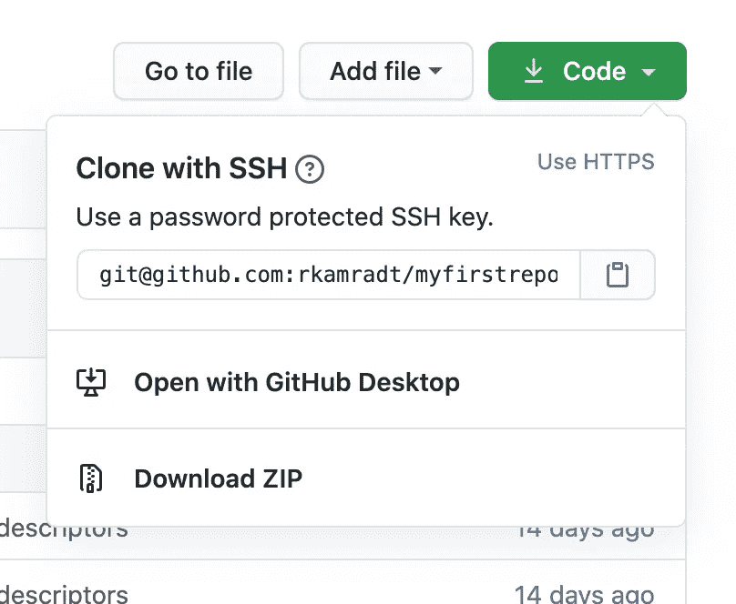

# 为绝对初学者构建自动化(第 1 部分)

> 原文：<https://blog.devgenius.io/build-automation-for-absolute-beginners-part-1-73ecf15ebd72?source=collection_archive---------23----------------------->

## 自动化应用程序构建、测试和部署


这是我为绝对初学者系列的第三篇。它从面向绝对初学者的[应用程序编程](https://medium.com/dev-genius/application-programming-for-absolute-beginners-bf2a035efdf6)开始，目标是通过使用更少的行话和一步一步地安装应用程序编程所需的最少软件，让人们快速入门。

本系列的下一篇文章，[面向绝对初学者的应用程序容器](https://medium.com/dev-genius/application-containers-for-absolute-beginners-253a61bb6e39)采用了同样的逐步安装方法，并在我们学习部署应用程序时详细解释了这些内容。最终，我们能够将它们部署到 Kubernetes 集群(运行在笔记本电脑上)，这仍然让一些经验丰富的开发人员望而生畏。所以如果你做到了，恭喜你！

在本文中，我们将通过部署和设置旨在自动化构建软件过程的软件来构建它。人们使用许多花哨的术语来描述这种活动，管道、CI/CD、DevOps，但它真正包含的是将程序从变更请求到生产的过程自动化。我有信心，通过使用一步一步的方法，即使是绝对的初学者也可以学习这种软件开发的高级方法。虽然公司不喜欢雇用初级程序员，但他们可能会给你一个机会，让你使用我将在本文中讨论的工具成为测试开发人员或开发人员。如果没有别的事，你将可以使用一些非常酷的(我认为)工具。

对于本文，我假设您已经阅读了前两篇文章并编写了代码。您应该知道如何在我们安装的 Atom 编辑器中查看和编辑代码，并且应该知道如何与 Git 和 GitHub 进行交互。您的笔记本电脑还应该安装有家酿和 Docker 桌面，并启用 Kubernetes。如果你不清楚我在说什么，回到前两篇文章，并刷新你的记忆。

为了自动化我们的流程，我们将使用一个可靠的应用程序 Jenkins。这不是最新的，也不能说是最棒的，但在更大的工作场所非常普遍。因此，让我们将它部署到您的系统上，这样您就可以获得一些实践经验。

在我的上一篇文章中，我们安装了 Docker Desktop 并增加了默认的资源。如果你给 Docker 桌面的资源不足，这就是事情可能开始变慢的地方。我把给 Docker 的内存提升到了 8g，但是如果魔兽世界开始变慢，我可能会恢复。我有我的优先权。要调整您的资源，请单击右上角工具栏中的 Docker 桌面图标，选择首选项，然后选择资源/高级。

我在这篇文章中的目标之一是让你不必在你的笔记本电脑上安装很多软件。其中一部分是在容器中运行。所以在我以前的文章《绝对初学者的应用程序容器》中，我们在一个容器中安装了 MongoDB，并很快删除了它。我们将对 Jenkins 做同样的事情，除了我们将为 Kubernetes 使用一个名为 [Helm](https://helm.sh/) 的“包管理器”。这使得需要在 Kubernetes 中创建依赖项或其他工件的应用程序可以捆绑到一个名为 Helm Chart 的项目中。要明确的是，虽然我们可以部署没有头盔的詹金斯，但我觉得这样更容易，特别是因为我们没有微调它。

由于我们已经在之前的文章中安装了 Homebrew，我们可以使用这个命令来安装 helm:

```
brew install helm
helm version # should give a number >= v3.2.4
```

Helm 对 Helm 图表的存储库进行操作，有点像 DockerHub 是一个预建图像的存储库。我们将从 Google APIs 获取舵图表库，并从那里部署 Jenkins

```
helm repo add jenkins https://charts.jenkins.io
helm repo update
helm install jenkins jenkins/jenkins
```

使用 Helm 的好处是，如果你的 Jenkins 部署完全混乱，你可以运行`helm uninstall jenkins`并重新安装。

安装的一部分是为您创建一个随机的`admin`密码，您可以用这个命令访问它:

```
printf $(kubectl get secret --namespace default jenkins \
   -o jsonpath="{.data.jenkins-admin-password}" | \
   base64 --decode);echo
```

保存该值，以备我们需要登录时使用。

使用以下命令查看正在运行的服务:

```
randalkamradt@Fuji blackbook % kubectl get service
NAME            TYPE        CLUSTER-IP     EXTERNAL-IP   PORT(S)     AGE
jenkins         ClusterIP   10.99.0.184    <none>        8080/TCP    2m38s
jenkins-agent   ClusterIP   10.102.3.147   <none>        50000/TCP   2m38s
kubernetes      ClusterIP   10.96.0.1      <none>        443/TCP     14d
```

我们可以看到 Jenkins 服务的类型是 ClusterIP，没有外部 IP。我们需要改变这种情况。幸运的是，我们可以编辑一个正在运行的服务。但首先，我们需要设置标准编辑器，因为否则你将被介绍给宇宙中最讨厌的编辑器，`vi`(对不起 vi 粉丝，你的数量远远超过)。让我们将您的编辑器设置为更熟悉的东西，我们在应用程序编程中为绝对初学者安装的 Atom 编辑器。

```
export KUBE_EDITOR="atom --wait"
```

事实上，我们应该将它添加到您的`~/.bash_profile`中，这样您的终端将总是以`KUBE_EDITOR`值集开始。`~/.bash_profile`是每当你打开一个新的终端窗口时终端将运行的脚本。要添加新值，请运行以下命令:

```
echo 'export KUBE_EDITOR="atom --wait"' >> ~/.bash_profile
```

这是一种在文件末尾添加内容的奇特的脚本方式。现在，您的编辑器将始终被设置。(提示，如果你设置了`EDITOR`而不是`KUBE_EDITOR`，更多的程序会在需要打开编辑器时使用这个值)

现在我们可以安全地编辑服务描述了

```
kubectl edit service jenkins
```


显示的最后一行`spec.type`应从 ClusterIP 更改为`LoadBalancer`。关闭 Atom，再次运行`kubectl get services`，应该会看到一个`localhost`的外部 IP。因为 Docker 桌面的负载平衡器总是`localhost`，你必须确保端口不会干扰。在这种情况下，我没有在端口 8080 上运行其他服务，但是如果我运行了，我必须再次编辑该服务，并将 spec.ports.port(而不是 spec.ports.targetPort)设置为某个未使用的端口号。

在我们继续之前，我想为`localhost`造一个同义词，这样我就可以统一访问 Jenkin(在 Kubernetes 内部，它认为它运行在一个名为`jenkins`的主机上)。为此，您需要编辑一个名为`/etc/hosts`的受保护文件。从终端运行`atom /etc/hosts`在 Atom 中调出文件。将`127.0.0.1 localhost`改为`127.0.0.1 localhost jenkins`当您试图保存该文件时，系统会提示您输入密码。

现在我们可以浏览到 [http://jenkins:8080](http://localhost:8080) 并看到登录屏幕。使用用户名`admin`和您之前保存的密码登录。您应该会看到类似这样的内容:


它希望我们创造一份工作。在我们的例子中，工作是一系列的步骤，旨在获取原始源代码，构建它，测试它，并部署它。我们称之为管道，因为一个步骤的输出应该是下一个步骤的输入，尽管这并不完全正确。对于 Jenkins，编写这些步骤的标准语言是 Groovy，这些步骤所在的默认文件称为`Jenkinsfile`。

通常，我会将构建步骤从源代码本身中分离出来，所以我会将它放在自己的存储库中。但是为了简单起见，我将把它直接添加到我们的代码库中。在本系列的前几篇文章中，我使用[https://github.com/rkamradt/myfirstrepository](https://github.com/rkamradt/myfirstrepository)作为回购，所以我将在这里添加它。如果您遵循了本系列，您的笔记本电脑上应该还有它。如果没有，你可以把它“叉”进你自己的 GitHub 账户。要分叉它，点击“分叉”按钮，并选择你的 GitHub 帐户，如果它要求。然后，您可以将新创建的存储库“克隆”到您的笔记本电脑上。如果你感到困惑，请参考我以前的文章。但是它*必须*出现在你的账户下的 GitHub 上，因为我们的自动化会期望这样。

一旦存储库出现在您的笔记本电脑上，打开 Atom，添加`myfirstrepository`作为项目文件夹，这样您的屏幕看起来就像这样:


现在右击`myfirstrepostiory`文件夹，选择“新建文件”。输入`Jenkinsfile`作为名字。现在添加以下内容:

```
pipeline {
  agent any
  stages {
    stage('Build') {
      steps {
          echo 'Building'
      }
    }
    stage('Test') {
      steps {
          echo 'Testing'
      }
    }
    stage('Deploy') {
      steps {
          echo 'Deploying' 
      }
    }
  }
}
```

这个脚本实际上什么也不做，只是打印出它应该在日志中做的事情。我们稍后将添加真实的动作。现在我们必须致力于 Git，并“推”到 GitHub

在本系列的第一篇文章中，我们使用 Atom 的特性将更改提交并推回到 GitHub。虽然您仍然可以使用所描述的过程，但是我们需要能够解决一个我一直在拖延的问题。可怕的公钥/私钥。

公钥/私钥是我们在计算机或应用程序之间建立信任的方式。要点是，我们可以将我们的公钥分发给任何人，然后当我们向他们发送一些数据时，我们可以用我们的私钥加密或“签名”，只有公钥才能解码。这本身并不是一种加密手段，因为任何人都可以得到我们的公钥，所以任何人都可以解码它。它唯一做的事情是表明数据来自我们，因为我们是唯一拥有签名数据的私钥的人。私钥就像我们的签名，我们用它来证明某些东西是我们的。

让我们制作一个公钥/私钥。首先，我们可以检查我们是否已经有了一个，其他应用程序可能已经为我们做了一个。默认情况下，它们在`~/.ssh`目录中，名为 id_rsa(私钥)和 id_rsa.pub(公钥),所以如果它们在那里，就用`ls ~/.ssh`列出那个目录，太好了。如果没有，我们必须创建它们。那里可能有其他文件，但我们不会仔细检查。

要创建密钥对，请使用以下命令:

```
ssh-keygen -t rsa
```

你会被要求输入密码，如果你愿意，你可以输入一个，但我通常不会。密码短语只是额外的保险，以防有人得到你的私钥，他们需要密码短语来伪造你的签名。不管是哪种方式，千万不要让任何人拥有你的私钥，这就是为什么它被称为私有。

现在再次运行`ls ~/.ssh`，您应该会看到这两个文件。我们想对这些文件做的是给 GitHub 你的公钥，这样我们可以签署任何推送请求，GitHub 自动知道它来自你。如果你要做任何可能与 GitHub 交互的自动化操作，你不会想要不断地输入你的密码。所以让我们给它你的公钥。回到终端，运行以下命令:

```
cat ~/.ssh/id_rsa.pub
```

这将打印出您的公钥(确保您使用的是`.pub`扩展名，否则您可能会意外使用您的私钥)。现在，您可以通过高亮显示它并按下 Command-c 键(或从编辑菜单中拷贝)来直接从终端拷贝它。不要担心格式。它应该以 ssh-rsa 开头，以电子邮件地址结尾。

回到 GitHub，点击右上角的图标，选择“设置”，然后选择“SSH 和 GPG 密钥”标签，点击“新建 SSH 密钥”按钮。


将您的公钥粘贴到“密钥”文本框中，并在标题框中添加描述。你应该为你用来开发的每台计算机准备一把钥匙，这就是标题的用处，这样你就知道哪把钥匙配哪台计算机了。

现在 GitHub 将允许我们推送到我们自己的仓库。我们现在可以使用以下命令提交和推送代码:

```
git add . # this stages the changes
git commit -m "my changes" # this commits to the local repo
git push # this pushes your commits to github
```

回到你的 GitHub 库，你应该会看到新的`Jenkinsfile`。

回到我们的本地 Jenkins (http://localhost:8080)，我们应该看到它提示我们“创建一个作业”。继续并点击它开始。它会提示您输入一个名称，我选择了`myfirstrepository`来匹配存储库名称。然后，我选择管道作为类型，并单击确定。在下一个屏幕上，单击“管道”选项卡，为定义选择“来自 SCM 的管道脚本”,为 SCM 选择“Git”。对于资源库的 URL，您可以返回 GitHub，找到您的资源库。单击“代码”按钮，您应该会看到类似如下的下拉列表:



单击剪贴板图标，将存储库的 SSH URL 放入剪贴板，然后可以将其粘贴回本地 Jenkins 的“存储库 URL”框中:


现在满屏都是一堆红色，因为 GitHub 不信任 Jenkins。在凭证旁边，有一个“添加”按钮，点击它，然后选择詹金斯。将弹出一个对话框，您可以将“种类”更改为“带私钥的 SSH 用户名”


还记得我告诉过你，你生成的公钥/私钥永远不要共享私钥吗？嗯，我们将与詹金斯分享它，这样詹金斯就可以代表你工作。我们这样做只是因为这是你自己的詹金斯的私人实例。我们不希望在 Jenkins 的工作实例或网络上的任何地方这样做。回到终端，运行以下命令:

```
cat ~/.ssh/id_rsa
```

注意这次没有`.pub`延期。这是显示您的私钥。选择输出并复制它。回到 Jenkins，单击名为“直接输入”的单选按钮，然后单击“添加”按钮，将您的私钥粘贴到文本框中。给它一个容易记忆的 ID，如果你喜欢的话，可以给它一个描述，并在你生成密钥对的计算机上使用你的用户名。最后，单击添加按钮。

为什么这样可以？我之前说过，在任何情况下，你都不应该把你的私钥给任何人。我们需要詹金斯代表你行事，这就是我们在这个特殊案件中的做法。因为 Jenkins 在 Kubernetes 内部运行，所以它不能访问您笔记本电脑上的任何资源。所以，因为它不能访问你的私钥，我们必须复制它。您在笔记本电脑上运行的其他应用程序，如 Git，将可以访问`~/.ssh`目录。但是请记住，永远不要与任何不在您的笔记本电脑上运行的应用程序共享您的私钥，包括 Jenkins 的其他实例。

现在我们发现自己又回到了 Jenkins 屏幕，仍然显示红色错误信息。您必须选择“凭据”下拉列表，并选择您刚刚创建的项目。


红色的错误信息消失了，这意味着 GitHub 现在认为你的 Jenkins 实例就是你。点击“保存”按钮。您现在应该会看到新的管道页面


单击“立即构建”按钮开始构建。再过几秒/几分钟，管道就应该完成了:


在“构建历史”区域，单击“#1”查看首次构建的详细信息。在那里，您可以单击“Show Console”来查看构建的输出。


当您需要对构建进行故障排除时，这就是您要去的地方。如果你向下滚动，你会看到一个非常令人愉快的“成功”。

刚刚发生了什么？詹金斯的工作是管理工作。通常，它会在 Jenkins 运行的主机上运行它们。但是在这种情况下，我们设置 Jenkins 在一个由 Kubernetes 控制的容器中运行每个作业。如果我们直接在 Jenkins 主机上运行作业，我们将需要安装构建所需的任何软件；编译器、翻译器、依赖处理器等。我们可以通过在容器中完成构建来绕过这一切，现在 Jenkins 主机只需要安装 Kubernetes。由于 Jenkins 在 Kubernetes 上运行，它可以访问 Kubernetes 提供的所有内容。

运行作业的映像实例或“pod”有一个映像，其中只有 JNLP 在与 main Jenkins 对话。为了让我们做的不仅仅是打印东西，我们需要增强它来使用任何需要的图像来执行想要的动作。我们将在本文的第 2 部分中讨论这个问题，在那里我们将实际构建、测试和部署服务。

这篇文章的标题是为绝对初学者构建自动化，而不是为傻瓜构建自动化。这里有很多详细的说明，如果你顺利地做到了这一步，你应该祝贺自己。当我试图弄清楚这些事情的时候，它会让我头昏脑胀，所以如果你读这篇文章的时候有点眩晕，你并不孤单。我希望在本文的第 2 部分看到您，我们将把所有这些准备工作付诸实施！

本文的代码:

[](https://github.com/rkamradt/myfirstrepository/tree/v0.1) [## rkamradt/myfirstrepository

### 我的第一个仓库。通过在 GitHub 上创建一个帐户，为 rkamradt/myfirstrepository 开发做出贡献。

github.com](https://github.com/rkamradt/myfirstrepository/tree/v0.1) 

参考的其他文章:

[](https://medium.com/dev-genius/application-programming-for-absolute-beginners-bf2a035efdf6) [## 绝对初学者的应用程序设计

### 如何将您的普通 Mac 笔记本电脑变成一个疯狂的开发怪物

medium.com](https://medium.com/dev-genius/application-programming-for-absolute-beginners-bf2a035efdf6) [](https://medium.com/dev-genius/application-containers-for-absolute-beginners-253a61bb6e39) [## 绝对初学者的应用程序容器

### 为真实世界准备您的应用程序

medium.com](https://medium.com/dev-genius/application-containers-for-absolute-beginners-253a61bb6e39)