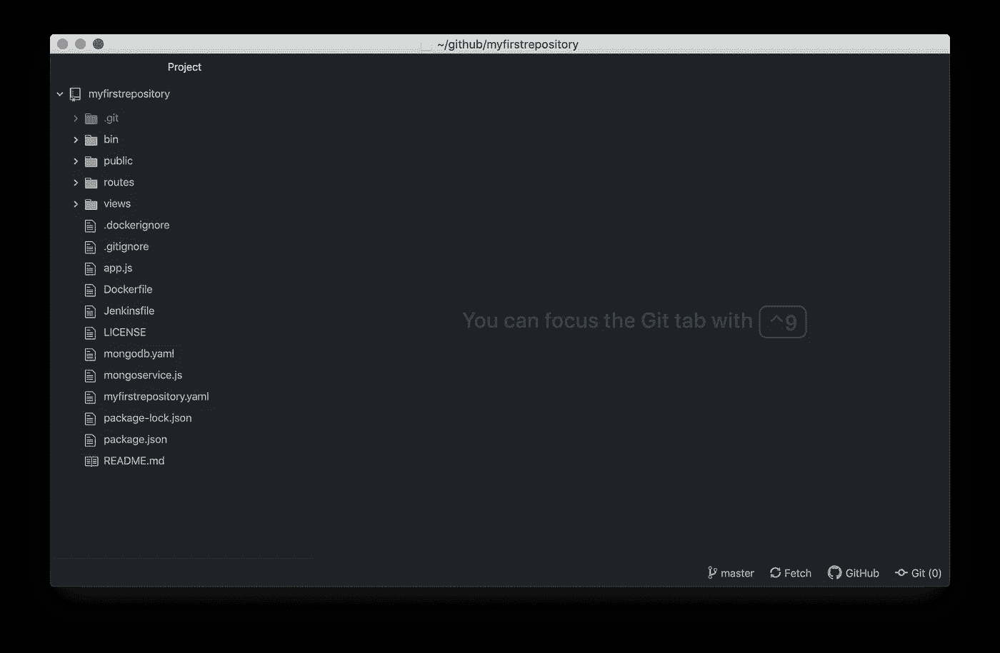
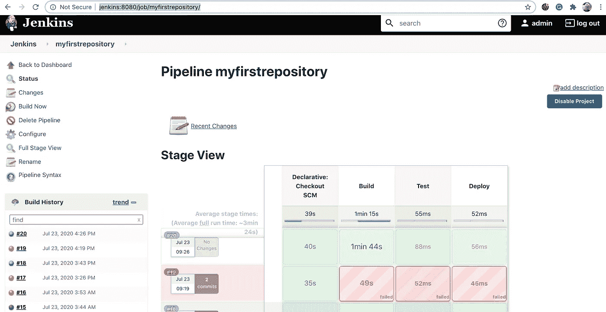

# 为绝对初学者构建自动化(第 2 部分)

> 原文：<https://blog.devgenius.io/build-automation-for-absolute-beginners-part-2-244551a4168a?source=collection_archive---------11----------------------->

## 一键构建、测试和部署应用程序。


图片由来自 [Pixabay](https://pixabay.com/?utm_source=link-attribution&utm_medium=referral&utm_campaign=image&utm_content=4287422) 的 [wichan yodsawai](https://pixabay.com/users/12831137-12831137/?utm_source=link-attribution&utm_medium=referral&utm_campaign=image&utm_content=4287422) 提供

这是我的绝对初学者系列的最后一篇，但它将分为四个部分；设置、构建、测试和部署。我们从构建一个简单的应用程序开始，将其容器化，现在我们将自动执行从推动代码更改到应用程序在完成状态可用之间的所有过程。在上一篇文章中，我们在运行于您的笔记本电脑上的 Kubernetes 实例中设置了 Jenkins。在本文中，我们将重新构建一个容器，然后自动化这一步。在随后的文章中，我们将着眼于测试，我们将更深入地了解部署某些东西意味着什么。

为了从本文中获得最大收益，您应该已经阅读了之前的所有文章，从[面向绝对初学者的应用程序编程](https://medium.com/dev-genius/application-programming-for-absolute-beginners-bf2a035efdf6)，到[面向绝对初学者的构建自动化(第 1 部分)](https://medium.com/dev-genius/build-automation-for-absolute-beginners-part-1-73ecf15ebd72)(参见本文底部的完整列表)。

当我说这是针对绝对初学者的时候，那并不是指任何人。但并不需要大家在谈论软件开发时总会想到的技巧。你不需要高水平的数学技能、抽象逻辑或夏洛克·福尔摩斯级别的推理能力(尽管你仍然可以抽烟斗，戴顶滑稽的帽子)。你最需要的是一个像样的记忆(这么…多…命令)，坚持，和耐心。在大多数情况下，坚持和耐心至少和解决问题的技巧一样重要。正如托马斯·爱迪生所说:“我们最大的弱点在于放弃。成功最可靠的方法就是再试一次。”

这个系列的另一个独特之处是，唯一的硬件要求是一台 Mac 笔记本电脑。我选择 Mac 是因为我使用 Mac，所以我能更好地给出安装和运行这个项目所需的应用程序的更精确的说明。此外，根据我的经验，在专业环境中，大多数人使用 MAC 作为开发的标准平台。你也许可以使用 Windows 笔记本电脑，但你可能需要对它进行不同的设置。

本系列的目标之一是只安装最少的软件就能让您正常运行。到目前为止，我们安装了 GitHub 桌面、Atom 编辑器、Brew 包管理器、Node.js JavaScript 语言、Docker 桌面和 Helm。其他一切都是作为容器运行的，因此很容易移除。如果你决定编程适合你，你可能想尝试不同的语言，如 Go、Python 或 Java。我们安装的软件可以很好地与每一种语言兼容，尽管如果你想专注于一种语言，一个针对这种语言的编辑器会很有帮助。

开始之前还有最后一件事。我们将在我们的笔记本电脑上运行构建自动化，但只有这样我们才能获得使用工具的实践经验，而不需要我们自己的 IT 部门或云服务器的费用。在正常的工作场所中，构建自动化将在本地或云中运行的服务器上执行。构建自动化是协作过程的一部分，团队使用它来确保每个人的变更都在一起工作。因此，它们不属于任何一个人的笔记本电脑。但是对于实践和构建自动化的实验来说，在你的笔记本电脑上运行所有的东西是完美的沙箱，因为它不会影响其他人。

我们要解决的第一件事是构建能够运行的软件。虽然 JavaScript 如其名，是一种脚本语言，不需要编译，但我们仍然希望创建一个图像。在以前的文章中，我们已经用几个 shell 脚本实现了这一点。现在我们将在上一篇文章[为绝对初学者构建自动化(第 1 部分)](https://medium.com/dev-genius/build-automation-for-absolute-beginners-part-1-73ecf15ebd72)中设置的 Jenkins 实例中构建它。只有一个问题，而且是一个偷偷摸摸的问题。我们使用 Docker 命令来构建映像，Docker 在我们运行 Jenkins 构建器的 Kubernetes 中运行得不好。这是该行业目前面临的一个现实问题，有一些解决方案。

为了解决这个问题，我们将使用一个叫做 [Kaniko](https://github.com/GoogleContainerTools/kaniko) 的应用程序。Kaniko 可以在不使用 Docker 的情况下构建映像，因此它可以在容器内部运行。要在 Jenkins 内部运行它，我们需要一个带有 Kaniko 图像的 Kubernetes pod，我们还需要正确执行它的步骤。我们可以在 Jenkins 配置中添加 Kaniko pod，但是这样它就不会在版本控制中，如果我们想要重建 Jenkins 实例，这将是另一件需要记住的事情。幸运的是，Jenkins 可以访问我们构建可用的所有文件，所以我们只需要将它添加到我们的源代码树中。我再次提醒不要在应用程序存储库中存储与构建相关的组件，但是为了简单起见，我们将在这里这样做。

假设您已经阅读了本系列，那么您的笔记本电脑上应该已经有了存储库 [myfirstrepository](https://github.com/rkamradt/myfirstrepository/tree/v0.1) ，您可以使用 Atom 将它添加为项目目录。请注意，我上面给出的链接是针对在我们将要进行的任何更改之前标记的版本的(您会在文章的底部找到标记有我们将要进行的所有更改的存储库链接)。你的窗口应该是这样的:



右键点击`myfirstrepository`，添加一个名为`kaniko-pod.yaml`的文件。然后可以添加以下内容:

现在我们可以在上一篇文章中创建的`Jenkinsfile`中利用它。

但是首先，请注意体积字段。那些是什么？因为我们正在推送到 DockerHub，所以我们需要默认存储在`~/.docker/config.yaml`文件中的凭证。我们需要将该文件添加到 Kubernetes 容器中，以便 Kaniko 拥有推送 DockerHub 所需的凭证。Kubernetes 容器被很好地隔离，不能访问其他容器或主机。

为了将它添加到 Kubernetes，我们将创建一个“ConfigMap ”,这是一个 Kubernetes 实体，旨在提供跨 pod 的通用配置。在许多情况下，配置映射是作为一组环境变量来访问的。但是，您也可以将它作为“卷”来“挂载”,它看起来只是容器文件系统中的一个文件。我们将用适当的 DockerHub 凭证创建一个`config.json`文件。用以下内容创建一个名为`create-configmap.yaml`的文件:

```
export CREDS=`echo -n "${DOCKERHUB_USER}:${DOCKERHUB_PASSWORD}" \
     | base64`
echo credentials = $CREDScat <<EOF | kubectl apply -f -
apiVersion: v1
kind: ConfigMap
metadata:
  name: docker-config
data:
  config.json: "\
  {\"auths\": \
    {\"[https://index.docker.io/v1/\](https://index.docker.io/v1/\)": \
      {\"auth\": \"$CREDS\"\
    }\
  }\
}"
EOF
```

这个脚本是创建 Kubernetes 对象的一种有趣的内联方式，在本例中是一个 ConfigMap。控件来保存它。要运行它，首先，我们必须将环境变量`DOCKERHUB_USER`和`DOCKERHUB_PASSWORD`设置为您的 DockerHub 用户和密码。我们还必须使脚本可执行。以下是步骤:

```
chmod +x create-configmap
export DOCKERHUB_USER=<your dockerhub username>
export DOCKERHUB_PASSWORD=<your dockerhub password>
./create-configmap
```

`chmod`命令改变文件“模式”，在这种情况下，用`+x`标志使其可运行。在脚本名`create-configmap`前需要`./`的原因是命令提示符不会在没有指定路径的情况下运行脚本。`.`路径是当前目录的简写。

现在我们可以修改`Jenkinsfile`的第一步，如下所示:

现在我们可以将更改提交并推回 GitHub，然后在我们的 Jenkins 实例中运行它。先用 Control-s 保存 Atom 中的文件。以下是提交和推送的命令:

```
git add .
git commit -m "added build stage"
git push
```

回到我们在上一篇文章中创建的 Jenkins 实例([http://Jenkins:8080/job/myfirstrepository/](http://jenkins:8080/job/myfirstrepository/))，我们可以按‘Build Now’按钮来启动作业。完成后，您的屏幕应该是这样的:



顶部的管道都是绿色的，所以这意味着它进行得很顺利。注意在我做对之前所有的红色(失败)尝试！如果第一次(或第 19 次)不顺利，不要放弃。这很好地提醒了我们，做一名软件开发人员需要耐心和毅力。

我们的下一篇文章将是关于测试我们刚刚构建的应用程序。我们将构建一个非常简单的测试，并像构建应用程序本身一样构建它。然后我们可以使用 Kubernetes 在一个非常接近生产环境的环境中运行测试。

谢谢你一直支持我。让一切自动化并不容易，但是构建自动化最终会为您节省无数的时间，所以它几乎总是一个好的投资。软件开发不是一件容易的工作，但这就是为什么一旦你掌握了它，你将是高需求。

本文中使用的存储库:

[](https://github.com/rkamradt/myfirstrepository/tree/v0.2) [## rkamradt/myfirstrepository

### 我的第一个仓库。通过在 GitHub 上创建一个帐户，为 rkamradt/myfirstrepository 开发做出贡献。

github.com](https://github.com/rkamradt/myfirstrepository/tree/v0.2) 

提到的其他文章:

[](https://medium.com/dev-genius/application-programming-for-absolute-beginners-bf2a035efdf6) [## 绝对初学者的应用程序设计

### 如何将您的普通 Mac 笔记本电脑变成一个疯狂的开发怪物

medium.com](https://medium.com/dev-genius/application-programming-for-absolute-beginners-bf2a035efdf6) [](https://medium.com/dev-genius/application-containers-for-absolute-beginners-253a61bb6e39) [## 绝对初学者的应用程序容器

### 为真实世界准备您的应用程序

medium.com](https://medium.com/dev-genius/application-containers-for-absolute-beginners-253a61bb6e39) [](https://medium.com/dev-genius/build-automation-for-absolute-beginners-part-1-73ecf15ebd72) [## 为绝对初学者构建自动化(第 1 部分)

### 自动化应用程序构建、测试和部署

medium.com](https://medium.com/dev-genius/build-automation-for-absolute-beginners-part-1-73ecf15ebd72)