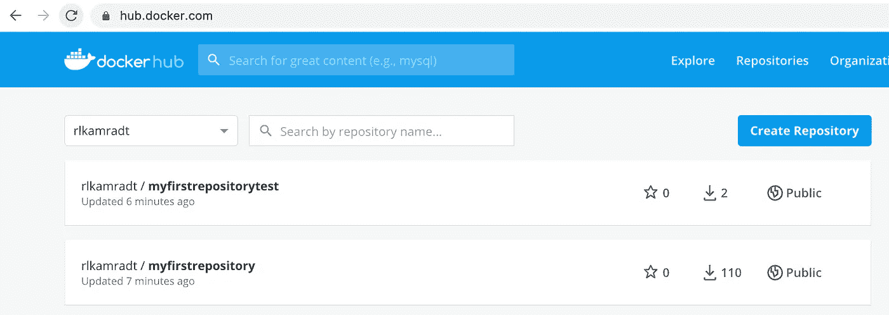
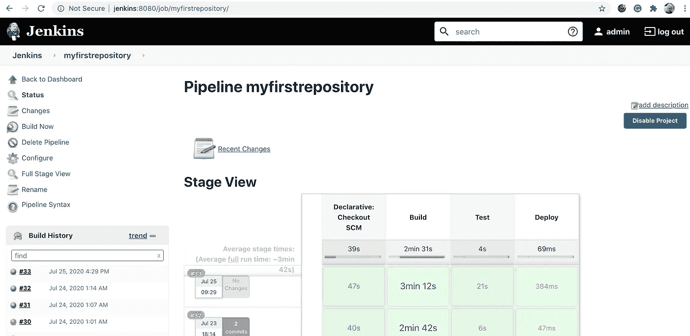

# 为初学者构建自动化(第 3 部分)

> 原文：<https://blog.devgenius.io/build-automation-for-beginners-part-3-d7f262799dd0?source=collection_archive---------10----------------------->

## 建筑测试


[JESHOOTS.COM](https://unsplash.com/@jeshoots?utm_source=unsplash&utm_medium=referral&utm_content=creditCopyText)在 [Unsplash](https://unsplash.com/s/photos/test?utm_source=unsplash&utm_medium=referral&utm_content=creditCopyText) 上拍照

除了手动测试，部署所有东西，看看是否有效之外，我至今没有做过任何测试。许多开发人员都坚信单元测试，但是我采用了另一种方法。在微服务领域，服务本身相当简单，但服务之间的协调却很复杂，我认为最好的测试方法是对系统中运行的服务进行测试。在我们的例子中，到目前为止只有一个服务，但是当我们将服务分解成许多小服务时会发生什么呢？单一应用程序中固有的复杂性现在分布在各个服务中。正是这种复杂性导致了我们的大多数问题，所以我们必须通过测试整个系统来克服它。

如果我正在构建一个库，或者一个框架，我仍然会做单元测试。但是我的大部分时间都花在了构建微服务上，而这些微服务并不足以证明单元测试的合理性。所以我一直等到它们被部署，然后我可以创建一套针对真实系统运行的测试。在我看来，这是对时间的更好利用，而且能更快地找到真正的问题。过去，当部署软件很困难时，单元测试是有意义的，因为它们在努力部署之前就发现了许多问题。现在部署可以自动化了，所以我们将重点转移到部署后的测试上。

我只是花了几段时间来论证这个可能会引起其他开发者争议的问题。现在让我们开始测试。

但是首先，让我提一下，虽然这篇文章的标题是为初学者构建自动化，但这并不意味着它很容易。我们在这里使用非常复杂的工具，其中许多是尖端的，这意味着除了最常见的情况之外，让它们在所有情况下都工作可能会有问题。我所说的“绝对初学者”是指你刚开始时只有一台普通的笔记本电脑和强烈的学习欲望。

这里没有太多的编程，大多是其他行业的人所说的后期制作。但是，为了让你拥有成为多面手所需的技能，为了让你在一家要求你面面俱到的初创企业中找到一份高薪工作，你需要学习。所以，如果你无所畏惧，请继续读下去！

本文假设您已经阅读了本系列的其他文章，并且已经在您的笔记本电脑上安装了一些东西，包括 Docker Desktop、Git 和 Atom。您可以使用 Atom 以外的其他编辑器，但我发现它是一个很好的通用工具，可以编辑所有类型的文件。我们将扩展我们在上一篇文章中创建的构建管道，专门用于测试本系列中构建的应用程序。

我们正在测试的这个应用程序与我通常构建的服务只是返回数据的应用程序略有不同。该应用程序获取数据并构建浏览器显示的 HTML。我可以写一整篇文章来测试这个应用程序，但是现在我将保持事情简单，只做几个断言。我将获取输出，并确保它被解析为正确的 HTML，我将断言第一行包含短语“My Awesome Server”

因为这个测试将在 Kubernetes 下运行，所以我将创建一个包含测试的图像。为了防止测试文件与应用程序文件混淆，但是仍然保持在同一个存储库中，我要做的第一件事是创建一个测试文件夹。回到 Atom，右键点击 myfirstrepository，选择“新建文件夹”，输入“测试”。我们所有的测试代码都会放在那里。为了确保测试代码没有被添加到我们的应用程序代码中，打开`.dockerignore`文件，添加一行“test”。这将防止测试文件夹中的任何内容被添加到应用程序映像中。

我应该提到，我创建存储库的通常策略是每个工件一个存储库。因此，对于我构建的每个映像，通常我会在一个存储库中拥有构建该工件所需的所有东西，除此之外别无其他。这确保了我们通过允许严格版本控制的二进制存储库共享代码。我总是说“分享很难，但不分享更难。”如果你在开始你的项目时就把分享放在心上，那么如果你在项目变得难以管理后决定把事情分开，那么它们将会变得不那么容易。有了 Artifactory 或 Nexus 这样的二进制存储库，你就没有理由不通过适当的渠道分享。

我完成了哲学思考，现在回到终端，运行`cd test`切换到`test`目录，然后运行`npm init`。它会问你一堆问题，我只是默认了每个问题。我将从主目录中复制几个文件:

```
cp ../.dockerignore .
cp ../Dockerfile .
```

测试文件夹中新 docker 文件的最后一行将改为:

```
CMD [ "node", "index.js" ]
```

这将使节点运行测试的`index.js`脚本。

我将使用 [axios](https://github.com/axios/axios) 读取服务，使用 [node-html-parser](https://github.com/taoqf/node-html-parser) 检查返回的 html。

```
npm install --save node-html-parser axios
```

现在，我们可以在测试文件夹中创建文件`index.js`，并在其中填入以下内容:

```
const axios = require('axios')
const assert = require('assert')
var HTMLParser = require('node-html-parser')const SUT_HOST = process.env.SUT_HOST || 'localhost';(async function() {
  try {
    const url = `[http://${SUT_HOST}`](/${SUT_HOST}`)
    console.log(`Reading ${url}`)
    const response = await axios.get(url) const root = HTMLParser.parse(response.data) console.log(`found html ${root}`) const h1 = root.querySelector('h1') console.log(`found h1 ${h1}`) assert.equal('My awesome server!', h1.text)
  } catch (err) {
    console.log(err.stack)
  }
})()
```

我们保持它非常简单！这是可行的，因为在我们的应用程序的输出中只有一个`<h1>`标签，否则，我们必须搜索正确的标签。

我们还必须修改 Jenkinsfile 来构建新的测试映像。我们将复制 Kaniko 第一次执行的代码行来构建测试:

```
steps {
  git '[https://github.com/rkamradt/myfirstrepository'](https://github.com/rkamradt/myfirstrepository')
          container(name: 'kaniko') {
            sh "/kaniko/executor \
                --dockerfile `pwd`/Dockerfile \
                --context `pwd` \
                --destination=docker.io/rlkamradt/myfirstrepository:latest"
            sh "/kaniko/executor \
                --dockerfile `pwd`/test/Dockerfile \
                --context `pwd`/test \
                --destination=docker.io/rlkamradt/myfirstrepositorytest:latest"
```

在第二次执行中，我们更改了`dockerfile`和`context`参数以包含`test`文件夹，并且在`destination`参数中我们给了图像另一个名称。记得控制-s 来保存！

现在我们可以提交和推动一切，然后让 Jenkins 来构建这一切。首先，把这些都上传到 GitHub:

```
git status
git add .
git status
git commit -m "added test suite"
git push
```

注意，我在`git add .`前后添加了`git status`，这是我的一个小习惯，用来仔细检查我将要提交的内容。

回到 Jenkins，您应该能够按下“立即构建”按钮来构建应用程序和测试。

我应该在这里指出，Kaniko 在获得 DockerHub 的授权时遇到了一些问题。似乎如果图像不在 DockerHub 中，它就不会创建它。Kaniko 是由谷歌的团队开发的，常见的情况是使用谷歌仓库而不是 DockerHub。这是一个例子，尖端工具专注于使通用路径工作，而忽略了它认为应该工作的其他用例。我手动推送图像，詹金斯管道运行顺利。如果我能缩小问题的范围，我可能会向 Kaniko 提出一个问题，它是一个非常好的工具，不会不可靠地工作。如果您有类似的问题，请尝试像我们在本系列前面所做的那样手动推送。不管怎样，你可以去 DockerHub 查看图片是否被推送:



## 运行测试

现在我们已经创建了测试映像，我们如何运行它呢？这是一个好问题，因为我们希望在部署服务之前运行我们的测试，那么我们如何在不干扰可能实际存在的部署的情况下部署服务来进行测试呢？答案是名称空间。Kubernetes 允许您通过使用名称空间来创建“虚拟”集群。一个服务可以同时存在于不同的名称空间中。到目前为止，我们一直使用“默认”名称空间，这是一个坏主意。我们将创建两个不同的名称空间，`test`和`prod`。创建名称空间很简单:

```
kubectl create namespace test
kubectl create namespace prod
```

现在大多数`kubectl`命令都需要一个`-n`参数，例如`kubectl get pods -n test`。如果您现在运行它，您将发现没有 pod，因为没有部署任何东西。

因为我们将运行 mongodb，所以我们还需要在每个名称空间中创建一个秘密。

```
kubectl create secret generic mongo-secret \
    --from-literal=username=mongo \
    --from-literal=password=ognom -n test
kubectl create secret generic mongo-secret \
    --from-literal=username=mongo \
    --from-literal=password=ognom -n prod
```

我们需要能够在 Jenkinsfile 中运行`kubectl`命令。完成这一点最简单的方法是向我们的 kaniko-pod.yaml 添加一个`kubectl`图像。这可能不是完成这一点的最佳方法，因为我们只是为我们的工人 pod 制作一个大的通用 pod，将它们分开可能更好。但是，我们试图让事情尽可能简单。因此，让我们向 kaniko-pod.yaml 添加一个新容器:

```
apiVersion: v1
kind: Pod
metadata:
  name: kaniko
spec:
  containers:
    - name: jnlp
      workingDir: /tmp/jenkins
    - name: kubectl
      image: gcr.io/cloud-builders/kubectl
      workingDir: /tmp/jenkins
      command:
      - cat
      tty: true
    - name: kaniko
      workingDir: /tmp/jenkins
      image: gcr.io/kaniko-project/executor:debug-v0.19.0
      imagePullPolicy: Always
      command:
      - /busybox/cat
      tty: true
      volumeMounts:
        - name: docker-config
          mountPath: /kaniko/.docker
  volumes:
    - name: docker-config
      configMap:
        name: docker-config
```

现在我们有了一个名为`kubectl`的带有`gcr.io/cloud-builders/kubectl`图像的容器。

让我们添加到我们的`Jenkinsfile`部署中。我们现在还不会费心实际运行测试。编辑 Jenkinsfile 以填充测试阶段:

```
stage('Test') {
      agent {
        kubernetes {
          label 'kaniko'
          idleMinutes 5
          yamlFile 'kaniko-pod.yaml'
          defaultContainer 'kaniko'
        }
      }
      steps {
        container(name: 'kubectl') {
          sh "kubectl apply -n test -f mongodb.yaml"
          sh "kubectl apply -n test -f myfirstrepository.yaml"
        }
      }
    }
```

Control-s 保存并运行常用的`git`命令，以推送到 GitHub(您现在应该已经记住它们了)。

现在回到 Jenkins，按下 Build Now 按钮，看看它是否部署了测试名称空间中的所有内容。



一切看起来都很好，但有一个问题。当我查看测试名称空间中的服务时，我看到了以下内容:

```
randalkamradt@Fuji myfirstrepository % kubectl get all -n test
NAME                                                READY   STATUS    RESTARTS   AGE
pod/mongodb-0                                       1/1     Running   0          2m18s
pod/myfirstrepository-deployment-757c4c9b4b-ndw66   1/1     Running   0          2m14sNAME                                TYPE           CLUSTER-IP      EXTERNAL-IP   PORT(S)        AGE
service/mongodb                     ClusterIP      None            <none>        27017/TCP      2m18s
service/myfirstrepository-service   LoadBalancer   10.107.144.57   <pending>     80:32163/TCP   2m14s
```

`service/myfirstrepository-service`有一个<的外部 IP 等待>。原来我忽略了删除运行在默认名称空间中的服务，您只能有一个服务运行在端口 80 上。虽然我可以(并且将会)删除在默认名称空间中运行的服务，但这会导致另一个问题，当我最终将它部署到 prod 名称空间时，我们将会遇到同样的冲突。

因为我们只在测试命名空间中测试，所以我不需要向外界公开 running，所以我可以将类型设置回 ClusterIP，这样我的测试就可以看到它(它将在 [http://myfirstrepository、](http://myfirstrepository),)上运行)，但它不会试图占用 localhost 上的端口 80。我也可以给每个名称空间不同的端口，但是我可以以后再做。我的新`myfirstrepository.yaml`服务部分将如下所示:

```
...
apiVersion: v1
kind: Service
metadata:
  name: myfirstrepository-service
spec:
  type: ClusterIP
  selector:
    app: myfirstrepository
  ports:
  - port: 80
    targetPort: 3000
```

此外，在某些情况下,`kubectl apply`命令无法应用更改，所以让我们向 Jenkins 文件添加一个`kubectl delete`,以确保服务是新创建的，而不仅仅是升级的。

```
sh "kubectl delete -n test --ignore-not-found=true \
           -f myfirstrepository.yaml"
```

以通常的方式将所有内容推回 GitHub(不要忘记控制-s)。

回到詹金斯再次运行管道。如果一切正常，在测试名称空间中签出您的服务:

```
randalkamradt@Fuji myfirstrepository % kubectl get services -n test                       
NAME                        TYPE        CLUSTER-IP      EXTERNAL-IP   PORT(S)     AGE
mongodb                     ClusterIP   None            <none>        27017/TCP   48m
myfirstrepository-service   ClusterIP   10.104.187.43   <none>        80/TCP      2m34s
```

现在我们只需运行测试应用程序。测试应用程序不是长期运行的应用程序，所以我们不需要部署描述符。我们有几个选择，创建一个作业描述符而不是部署描述符，或者只是作为一个“裸机”运行。因为我是一个简单的人，我将选择简单的方法“裸吊舱”。这只是意味着我们定义了 pod 并让它运行。我们还可以检查结果，并打印出日志。

测试将需要一个定义，因此创建一个名为`myfirstrepostiorytest.yaml`的文件，并用以下内容填充它:

```
apiVersion: v1
kind: Pod
metadata:
  name: myfirstrepositorytest
spec:
  containers:
    - name: myfirstrepositorytest
      image: rlkamradt/myfirstrepositorytest
      env:
        - name: SUT_HOST
        value: myfirstrepository
```

请注意，它将运行的主机是`myfirstrepository-service` (Kubernetes 使用服务的名称创建一个具有该名称的主机，以便名称空间中的其他应用程序可以访问它)。我之前没有解释过，但是 SUT 主机中的 SUT 来自于“测试对象”，一个常见的测试缩写。

接下来，我们将在 Jenkinsfile 中添加运行 pod 的命令。我将收集脚本中的所有命令，然后从 Jenkins 运行该脚本。创建一个名为`run_test`的文件，并填入以下内容:

```
kubectl apply -n test -f mongodb.yaml
kubectl delete -n test --ignore-not-found=true -f myfirstrepository.yaml
kubectl apply -n test -f myfirstrepository.yaml
kubectl delete -n test --ignore-not-found=true pod myfirstrepositorytest
kubectl apply -n test -f myfirstrepositorytest.yaml
sleep 20s
kubectl logs -n test myfirstrepositorytest -f --pod-running-timeout=20s
kubectl get -n test pod myfirstrepositorytest \
     -o jsonpath='{.status.containerStatuses[0].lastState.terminated.exitCode}'
```

这将创建或更新任何现有的 MongoDB 实例，创建一个新的`myfirstrepository`和`myfirstrepositorytest`实例，等待二十秒钟让系统稳定下来，显示测试实例的日志，并获得退出代码。我不喜欢等待，因为那会使考试变得不靠谱。如果需要更长的时间来稳定，测试将失败。我还没有找到一种好的方法来检查一个 pod 是否准备好了(通常的方法似乎不可靠)，如果我试图在 pod 准备好之前访问日志，那么它将失败。

为了让 Jenkins 能够运行它，我们需要将其设置为可执行的:

```
chmod +x run_test
```

然后在测试阶段将它添加到 Jenkinsfile 中:

```
steps {
  container(name: 'kubectl') {
    sh "./run_test"
  }
}
```

您会注意到 pod 的名称只是`myfirstrepositorytest`，没有添加任何随机字符串。当我们在一个名称空间中部署裸 pod 时，我们必须注意不要有 pod 名称冲突。

在我们应用 pod 定义之后，我们等待它进入就绪状态，然后我们跟踪日志(f 标志导致它跟踪)。完成后，log 命令将停止，我们将继续下一步。保存一切，提交并推送到 GitHub，试一试。在 Jenkins 中按 Build Now，观看它的构建和测试。如果测试工作正常，您应该在构建日志中看到以下内容:

```
found h1 <h1>My awesome server!</h1>
0
```

测试工作正常，并返回“0”作为退出代码！

我不会说这是完整的，但我得到了它的工作。如果你能跟上并让它也能工作，你肯定有勇气在这个行业工作。我喜欢说“编程不难，做产品难。”我们离制造产品只有一步之遥。在本系列的下一篇文章中，我们将部署到生产环境中！感谢您抽出时间与我一起踏上这一旅程，我真诚地希望您能从中有所收获。下次见。

本文的存储库:

[](https://github.com/rkamradt/myfirstrepository/tree/v0.3) [## rkamradt/myfirstrepository

### 我的第一个仓库。通过在 GitHub 上创建一个帐户，为 rkamradt/myfirstrepository 开发做出贡献。

github.com](https://github.com/rkamradt/myfirstrepository/tree/v0.3) 

本系列的其他文章:

[](https://medium.com/dev-genius/application-programming-for-absolute-beginners-bf2a035efdf6) [## 绝对初学者的应用程序设计

### 如何将您的普通 Mac 笔记本电脑变成一个疯狂的开发怪物

medium.com](https://medium.com/dev-genius/application-programming-for-absolute-beginners-bf2a035efdf6) [](https://medium.com/dev-genius/application-containers-for-absolute-beginners-253a61bb6e39) [## 绝对初学者的应用程序容器

### 为真实世界准备您的应用程序

medium.com](https://medium.com/dev-genius/application-containers-for-absolute-beginners-253a61bb6e39) [](https://medium.com/dev-genius/build-automation-for-absolute-beginners-part-1-73ecf15ebd72) [## 为绝对初学者构建自动化(第 1 部分)

### 自动化应用程序构建、测试和部署

medium.com](https://medium.com/dev-genius/build-automation-for-absolute-beginners-part-1-73ecf15ebd72) [](https://medium.com/dev-genius/build-automation-for-absolute-beginners-part-2-244551a4168a) [## 为绝对初学者构建自动化(第 2 部分)

### 一键构建、测试和部署应用程序。

medium.com](https://medium.com/dev-genius/build-automation-for-absolute-beginners-part-2-244551a4168a)