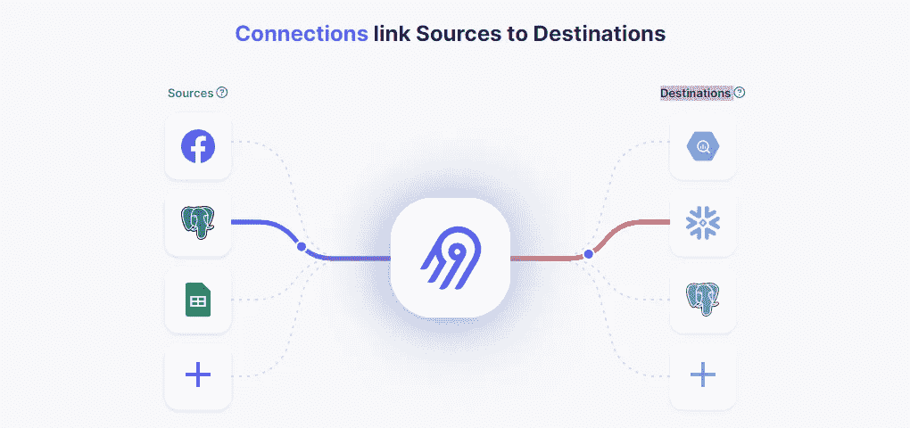
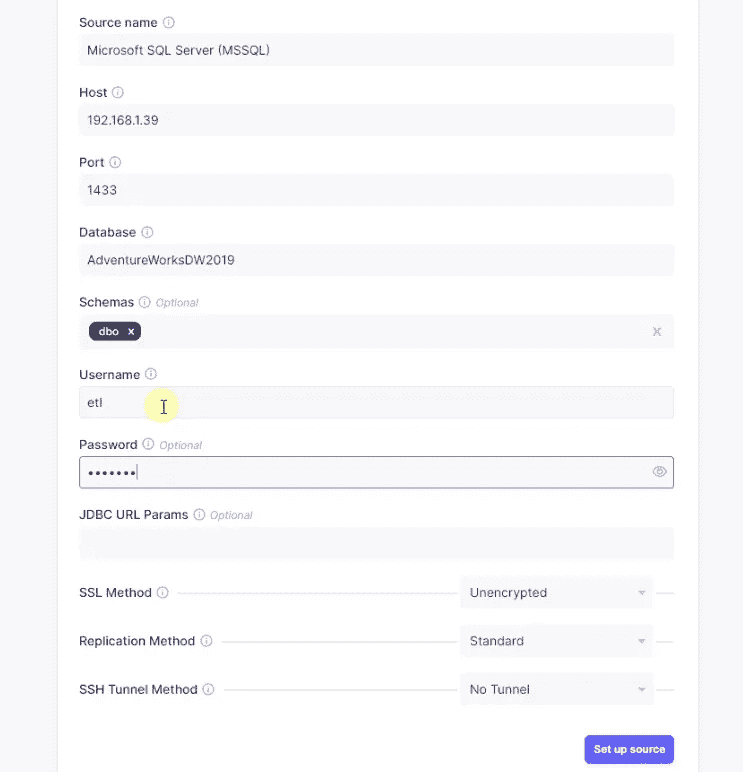
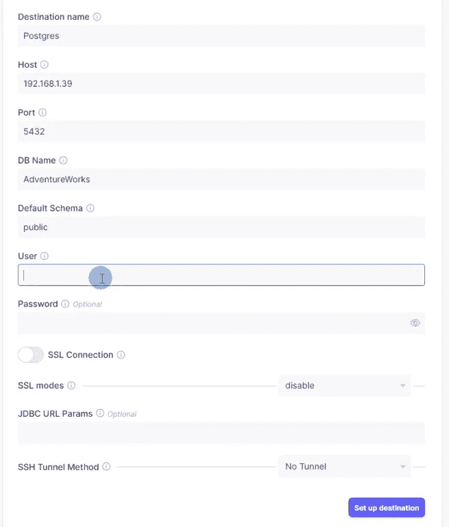
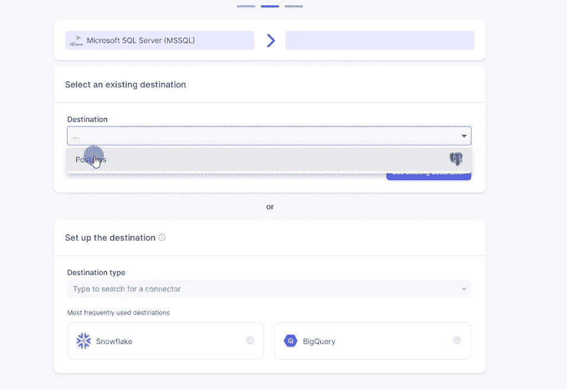
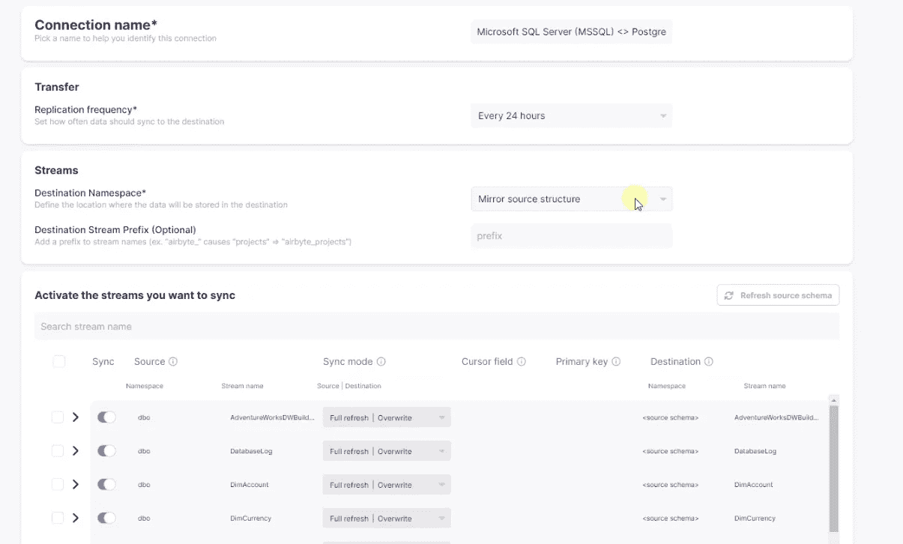
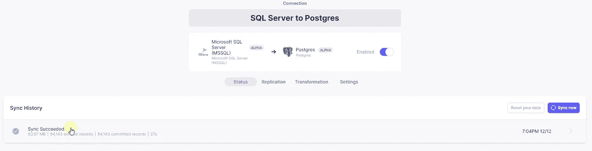

# 使用新的数据集成工具 Airbyte 构建数据管道

> 原文：<https://blog.devgenius.io/build-data-pipelines-with-airbyte-a-new-data-integration-tool-536b113d69fb?source=collection_archive---------4----------------------->

**使用 Airbyte、SQL Server、PostgreSQL**



空气字节

今天我们将介绍一种叫做 Airbyte 的新数据集成工具。Airbyte 是一个开源数据集成平台，使用户能够在云和本地应用程序之间快速轻松地移动数据。它旨在使开发人员能够轻松构建数据管道，将数据从一个平台传输到另一个平台。借助 Airbyte，用户可以轻松创建和管理数据管道，自动进行数据同步，并监控数据流。它提供了广泛的连接器，可用于连接任何数据源，包括数据库、SaaS 应用程序、云存储等等。Airbyte 还提供了一个直观的用户界面，可以轻松配置和监控数据管道。

如果你是视觉学习者，那么我在 [YouTube](https://www.youtube.com/watch?v=2FvMa7vaxDY) 上有一个附带的视频，里面有完整教程的演示。

本 Airbyte 教程将使您能够:

*   部署 Airbyte 开源应用程序
*   创建到关系数据库的源和目标连接
*   在 SQL Server 和 PostgreSQL 数据库之间同步数据

**该成立了**

我们将部署开源风格的 Airbyte。Airbyte 有一个 git 存储库，我们在本地克隆它。我们准备了 [SQL Server](https://www.youtube.com/watch?v=e5mvoKuV3xs) 和 [PostgreSQL](https://www.youtube.com/watch?v=fjYiWXHI7Mo) 环境，分别作为源环境和目的环境。我们将使用 SQL Server 的 AdventureWorks 数据库作为源，并使用 Airbyte 在 PostgreSQL 中加载数据。此外，我们已经在此会话[中执行了数据库设置](https://medium.com/dev-genius/how-to-build-an-etl-pipeline-with-python-1b78407c3875)。如果你想继续下去，一定要检查这些来源。

```
git clone https://github.com/airbytehq/airbyte.git
cd airbyte
docker-compose up
```

这个设置需要 Git 和 Docker。一旦 Git 存储库被克隆，我们将目录更改为 Airbyte 文件夹。从这个目录中，我们将调用 docker-compose up 命令。一旦 docker 容器启动，我们就可以导航到 *localhost:8000* 来访问应用程序。我们使用默认凭证( *airbyte* ， *password* )登录。我们可以更改默认凭据。它们位于。环境文件。

**添加信号源**

Airbyte 有许多内置的连接器。我们可以搜索并选择我们的源连接器。我们从 SQL Server 获取数据，因此，我们将选择 SQL Server。Airbyte 向我们展示了一个包含源系统连接细节的表单。我们完成表格，我们的来源就建立了。



SQL Server 源连接器

**添加目的地**

我们需要一个保存源数据的目的地。这可以是平面文件、数据库或云存储。在我们的例子中，我们希望将数据持久化到 PostgreSQL 数据库中。同样，我们搜索和选择 Postgres 目的地。完成连接细节，我们的目的地就设置好了。



PostgreSQL 连接器

**建立连接**

现在，我们已经准备好在源和目的地之间建立连接。我们选择 SQL Server 作为源，Postgres 作为目的地。Airbyte 将源模式和表映射到目标数据库。它允许我们改变模式和表的命名约定。此外，我们可以选择希望在目标端复制的表。



在源和目标之间创建连接

当我们创建一个连接时，我们指定我们想要复制哪个数据源。我们还可以选择完整或增量复制方法。我们可以按计划运行复制方法，以便我们的数据在选定的时间间隔自动更新。



源到目的地的连接

**同步**

一旦我们的源和目标连接起来，我们就可以同步目标数据库上的数据。我们可以手动触发同步，也可以按照选定的计划开始同步。我们可以查看同步历史来检查数据管道的状态。它记录了高级概述和详细日志。我们的同步已成功完成。我们已经将 84，000 多条记录从源移动到目的地。我们可以查询目的地来检查和验证数据。



空气字节同步

就是这样。我们已经使用 Airbyte 成功地构建了一个 EL 管道。这只是使用 Airbyte 的开始。Airbyte 支持大量的源和目的地集合。该工具与 DBT(数据构建工具)和现代云数据库解决方案一起，是现代数据堆栈的一部分。在现代平台中，ETL 分为两部分 EL(提取和加载)。Airbyte 覆盖了 EL 部分。转换由另一个叫做 DBT 的工具处理。

**结论**

*   我们展示了使用 Airbyte 创建 EL(T)管道是多么容易。
*   我们使用 Airbyte 实现了一个基本的 ETL 管道。
*   完整的 Airbyte 教程可以在[这里](https://www.youtube.com/watch?v=2FvMa7vaxDY)找到