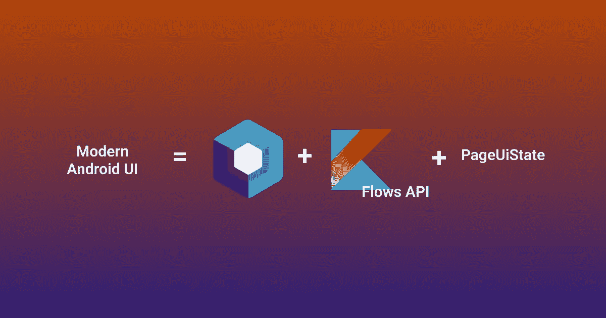
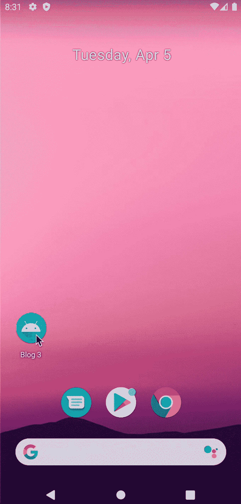

# 使用 Compose、PageUiState 和 FlowState 构建现代用户界面

> 原文：<https://blog.devgenius.io/build-modern-uis-with-compose-pageuistate-and-flowstate-fcb2951ffa0?source=collection_archive---------2----------------------->



多年来，我们一直在开发和更新 android 的 UI 组件，为你的活动/片段提供一个单独的 XML 文件。这有很多缺点，比如视图组件与视图逻辑的解耦、UI 更新的困难、增加的代码行等等。

## 什么是 Jetpack Compose？

Jetpack 是一个为 Android 构建 UI 元素的工具包。有了它，你可以直接在 Kotlin 中编写你的 UI 组件和组件逻辑。它是声明性的，意味着你不必写逻辑是如何更新的，而只需提到更新了什么(我知道这一开始很复杂:P)

> 注意:本文假设您对 Jetpack Compose 有基本的了解。

## 好酷！那么我们在构建什么，我为什么要继续阅读这篇文章呢？

本文主要关注如何使用 twist :P 更新屏幕中的 UI 元素。我们将通过使用 **Jetpack Compose** ，一个名为 **StateFlow** 的 Kotlin 特性和一个名为 **PageUiState** 的概念来进行更新。



要创建的应用程序

上面的 UI 由一个项目列表、一个加载初始列表的进度条和一个向列表添加随机项目的按钮组成。我们将通过使用*延迟*来模拟初始列表和列表更新通过一些外部源获取/更新。

1.  **创建一个空的合成项目**

打开你的安卓工作室。现在，从可用的初学者模板列表中，单击 Jetpack Compose。现在，您将看到一个空项目，其中只包含一个 MainActivity，它将是 app 的启动器活动。

2.**添加依赖关系**

将以下依赖项添加到 build.gradle 文件中(应用程序级别)。

```
plugins {
   ....
   ......... 
}android {
   ....
   ......... 
}dependencies **{** implementation 'androidx.core:core-ktx:1.7.0'
    implementation "androidx.compose.ui:ui:$compose_version"
    implementation "androidx.compose.material:material:$compose_version"
    implementation "androidx.compose.ui:ui-tooling-preview:$compose_version"
    implementation 'androidx.lifecycle:lifecycle-runtime-ktx:2.3.1'
    implementation 'androidx.activity:activity-compose:1.3.1'
    debugImplementation "androidx.compose.ui:ui-tooling:$compose_version"
    implementation "androidx.activity:activity-ktx:1.4.0"
    implementation "androidx.lifecycle:lifecycle-viewmodel-ktx:2.4.1"
    implementation "androidx.lifecycle:lifecycle-viewmodel-compose:2.4.1"
**}**
```

3.**创建一个视图模型，并将其与您的视图层链接。**

在 *src/viewmodels* 下创建一个新的 **MainViewModel.kt** 文件，并添加以下内容。

```
class MainViewModel : ViewModel() {
    private var _nextItem: String = getNextItem() // gets a random string from a list of strings
    private fun getNextItem(): String {
        val randomItems = *listOf*(
            "C", "C#", "Kotlin", "Ruby", "R", "Dart", "SQL"
        )
        val randomIndex = (randomItems.*indices*).*random*()
        return randomItems[randomIndex]
    }

}
```

4.**创建一个页面状态**

PageUiState 是一个数据类，它保存所有 UI 组件的状态，这些组件可能会在屏幕的整个生命周期中更新。

PageUiState 应该遵循的一些准则是:

*   所有属性都应该是 val 而不是 var。
*   所有属性都应该有默认值
*   页面状态类可以命名为 <screenname>UiState</screenname>

所以让我们为我们的主屏幕创建一个页面状态。在 *src/uistates* 下创建一个 **MainScreenUiState.kt** 文件，并添加以下内容。

```
data class MainScreenUiState(
    val isLoading: Boolean = true,
    val itemList: List<String> = *emptyList*(),
    val btnText: String = ""
)
```

现在让我们来看看我们编写的每个属性:

*   isLoading:进度条组件将使用该属性来决定它是否应该可见
*   item list:lazy column 将使用该属性作为数据源来填充列表
*   btnText:这个属性将用于设置按钮内的文本，该按钮将项目添加到列表中

5.**添加一个状态流到你的视图模型**

现在让我们向 MainViewModel 添加一个状态流，它的默认值是 MainScreenUiState 的一个对象，并从我们的 UI 中观察它。

将以下代码添加到您的 **MainViewModel** 中。

```
class MainViewModel : ViewModel() {
    private val _uiState= *MutableStateFlow*(MainScreenUiState())
    val uiState = _uiState.*asStateFlow*()
    private var _nextItem: String = getNextItem()

    init {
        *viewModelScope*.*launch* **{** delay(2000)
            _uiState.value = _uiState.value.copy(
                isLoading = false,
                itemList = *listOf*("Java","Python","Js", "Ts"),
                btnText = "Add $_nextItem"
            )
        **}** }

    private fun getNextItem(): String {
        val randomItems = *listOf*("C", "C#", "Kotlin", "Ruby", "R", "Dart", "SQL")
        val randomIndex = (randomItems.*indices*).*random*()
        return randomItems[randomIndex]
    }

}
```

在初始化程序块中，我们正在启动一个协程函数并将数据设置到我们的初始列表中。

6.**创建 UI 并观察 UI 状态**

修改您的 MainScreen 函数以匹配以下代码行。

```
class MainActivity : ComponentActivity() {
    override fun onCreate(savedInstanceState: Bundle?) {
        super.onCreate(savedInstanceState)
        *setContent* **{** *Blog3Theme* **{** *Surface*(modifier = Modifier.*fillMaxSize*(),
                    color = MaterialTheme.colors.background) **{** *MainScreen*()
                **}
            }
        }** }
}

@Composable
fun MainScreen(viewModel: MainViewModel = *viewModel*()) {
    val uiState by viewModel.uiState.*collectAsState*()
    *Column* **{** if(uiState.isLoading) {
            *LinearProgressIndicator*(modifier = Modifier.*fillMaxWidth*())
        } else {
            *LazyColumn*(Modifier.*weight*(1f))**{** *items*(uiState.itemList) **{** item **->** *Text*(text = item)
                **}
            }** *Button*(
                onClick = (viewModel::addItem),
                modifier = Modifier.*fillMaxWidth*().*padding*(16.*dp*)
            ) **{** *Text*(text = uiState.btnText)
            **}** }
    **}** }
```

不要担心解析 *viewModel::addItem* 时的错误，我们将很快在我们的 viewModel 中添加这个方法。

通过使用' *by viewModels()'* 委托，将视图模型作为参数传递给 MainScreen composable 函数。

> 注:此处***Blog3 主题*** 是由我提供的 app 名称(blog 3)生成的主题名称。它将根据您为项目提供的应用程序名称而有所不同。

7.**添加方法更新按钮上的列表点击**

现在让我们试着在点击按钮时更新列表。为此，我们将在 MainViewModel 中创建一个附加方法，并在按钮的 click 处理程序中传递对该方法的引用。

```
class MainViewModel : ViewModel() { ....
    ........ fun addItem() {
        _uiState.value = _uiState.value.copy(isLoading = true)

        *viewModelScope*.*launch* **{** delay(2000)
            val itemToAdd = _nextItem
            _nextItem = getNextItem()
            _uiState.value = _uiState.value.copy(
                isLoading = false,
                itemList = _uiState.value.itemList.*toMutableList*().*apply* **{** add(itemToAdd) **}**,
                btnText = "Add $_nextItem"
            )
        **}** }
}
```

在上面的代码片段中，注意我们最初是如何将 *isLoading* 设置为 *true 的。*这将确保在用户界面上显示进度条。

***瞧！你完了！！***

尝试运行您的应用程序，看看一切看起来如何。这是一个关于如何以现代方式更新你的 compose ui 的基本实现，你可以在**主屏**上添加额外的特性来学习和实验。

如果你喜欢这篇文章，可以分享一下。如果您有改进的建议或需要帮助，请留言。*一路平安！！*