# 使用 FastAPI 构建 Python web APIs

> 原文：<https://blog.devgenius.io/build-python-web-apis-using-fastapi-7f1524139428?source=collection_archive---------1----------------------->


应用程序编程接口是一个重要的组件，它使您的应用程序可以被广泛的用户访问。如今，创建 API 并不是一件困难的事情，然而，选择合适的框架却是一个挑战。

Python 以其实现各种 AI、ML、DL 任务的能力而闻名。它有一些微框架，如 flask 和 Django，用于构建 web APIs。如今，开发人员正在转向一个更年轻的框架 FastAPI。

在本节中，我们将学习 FastAPI 的基础知识。

# 入门指南

## 目录

*   [什么是 FastAPI](#208e)
*   [烧瓶 vs FastAPI](#7b54)
*   [立项](#d6d2)
*   [FastAPI Hello World](#6adc)
*   [交互式 API 文档](#0d47)
*   [基本 FastAPI 构建模块](#2be8)
*   [路径参数](#84d9)
*   [查询参数](#3c32)
*   [请求体](#0a6b)
*   [数据转换](#2c3c)
*   [数据验证](#e3f5)

## 什么是 [FastAPI](https://fastapi.tiangolo.com/)

FastAPI 是一个现代的、高性能的、受 Python 3.7+版本支持的 web 框架。它于 2018 年作为基于标准 Python 类型提示的开源框架发布。它构建在异步服务器网关接口(ASGI) web 服务器 Uvicorn 上，Uvicorn 还安装了 web 服务器网关接口(WSGI)应用程序。

**关键特性**

*   **高速** — FastAPI 是一个高性能的 Python web 框架，因为 ASGI，它通过声明端点来支持并发和异步代码。
*   **内置并发** — FastAPI 消除了对事件循环或异步/等待管理的需求。然后可以使用 async def 将初始路径函数指定为协程，并等待特定的位置。
*   **依赖注入支持** — FastAPI 支持依赖注入，这使得修改代码变得更加容易。它增加了代码的模块化和系统的可伸缩性。
*   **内置文档** — FastAPI 提供自动交互文档，简化前端工程师对后端的使用，并简化 API 端点测试。
*   **内置验证** — FastAPI 内置验证检测不正确的数据类型，并返回 JSON 中的底层推理。它使用 Pydantic 模块来简化验证。
*   **基于标准的** —基于 API 的开放标准:OpenAPI 和 JSON Schema。

## 烧瓶 vs FastAPI

Flask 是一个微型 python web 框架，用于构建轻量级 web 应用程序。它基于 Werkzeug 工具包和 Jinja2 模板引擎，部署在 WSGI (Python Web 服务器网关接口)上。

FastAPI 是一个现代的高性能 web 框架，用于开发 Python 3.7+版本支持的 API。

Flask 是一个古老流行的微型 web 框架，适合轻量级应用程序，而 FastAPI 是一个全栈框架，用于构建具有丰富文档和验证的解决方案。FastAPI 支持并发性，并使它比 flask 快得多。

> **Flask 更适合具有几个 API 端点的简单微服务，而 FastAPI 在速度和性能方面更受青睐。**

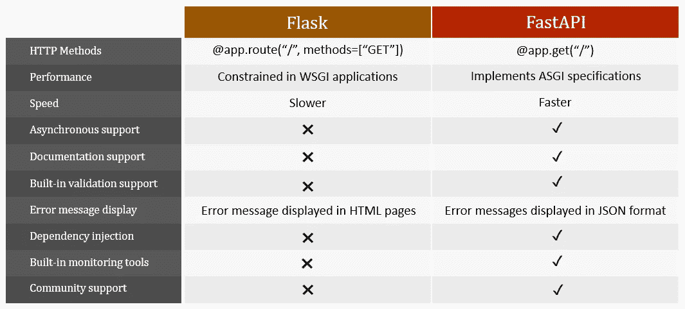

## 设置项目

我们可以通过通常的 Python 项目设置步骤来设置 fastapi 项目。

*   为项目创建一个文件夹，并导航到该文件夹。

```
mkdir firstapp
cd firstapp
```

*   创建一个虚拟环境并激活它。

```
python -m venv venv
venv/Scripts/activate
```

*   安装 FastAPI 和 uvicorn，一个 ASGI 服务器:

```
pip install fastapi uvicorn
```

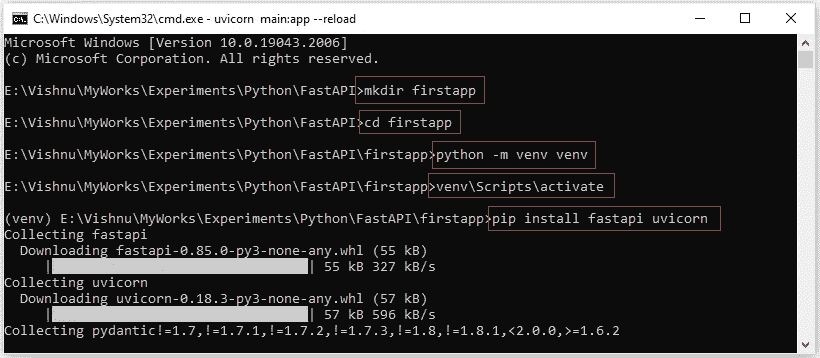

## FastAPI Hello World

让我们尝试在 FastAPI 中创建传统的“Hello World”应用程序并运行。它将帮助您了解应用程序的初始设置。

*   创建一个文件`main.py`，并向其中添加以下代码。

```
from fastapi import FastAPIapp = FastAPI()[@app](http://twitter.com/app).get("/")
async def root():
    return {"message": "Hello World"}
```

**理解代码:**

*   从 fastapi 包导入`FastAPI`
*   创建一个 FastAPI()的实例，并将其赋给`app`变量
*   `@app.get(“/”)`用于在用户请求`/`路径时执行以下方法
*   `async def root():`作为 python 协程运行`root()`方法
*   `return {“message”: “Hello World”}`发送到前端

## **运行 app**

*   执行以下命令来运行应用程序

```
uvicorn main:app --reload
```

命令`uvicorn main:app`是指:

*   `main`:文件`main.py`
*   `app`:用线`app = FastAPI()`创建的对象
*   `--reload`:修改代码后重启服务器

如果应用程序启动并运行，您将在控制台中获得一个 URL。在 web 浏览器中打开 URL 以查看 API 响应。

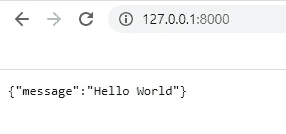

## 交互式 API 文档

FastAPI 自动为您的项目生成完全交互式的 API 文档。你可以在浏览器中点击网址[http://127 . 0 . 0 . 1:8000/docs](http://127.0.0.1:8000/docs)来查看。

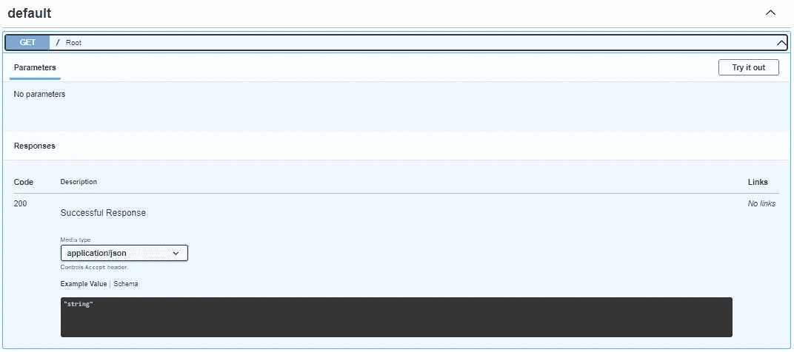

可以使用`redoc`查阅文档(打开网址[http://127 . 0 . 0 . 1:8000/redoc](http://127.0.0.1:8000/redoc))。

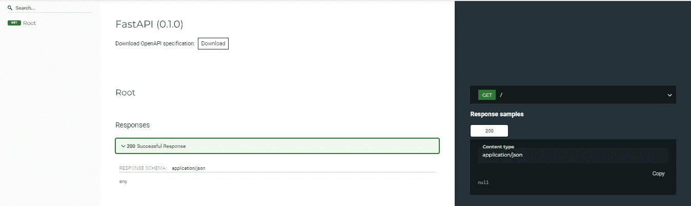

## 基本 FastAPI 构建块

让我们探索一下 FastAPI 的一些构件，比如路径参数、查询参数和请求体。

## 路径参数

路径参数包含在花括号`{}`中，这有助于将 API 调用的范围缩小到单个资源。

```
from fastapi import FastAPIapp = FastAPI()[@app](http://twitter.com/app).get("/user/{name}")
async def read_name(name):
    return {"user name": name}
```

路径参数`name`的值将作为参数`name`传递给函数`read_name()`。

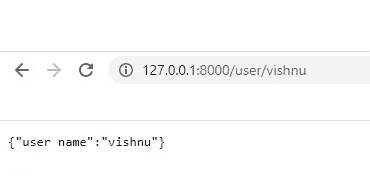

## 查询参数

不属于路径参数的函数参数会被自动解释为查询参数。它们以 URL 字符串中的问号`?`开始。

```
from fastapi import FastAPI
import randomapp = FastAPI()[@app](http://twitter.com/app).get("/user/")
async def create_user_id(start: int, end: int):
    return {"user id": random.randint(start,end)}
```

该查询是 URL 中问号`?`后面的一组键-值对，由一个&符号`&`分隔。打开网址[http://127 . 0 . 0 . 1:8000/user/？start=1 & end=10](http://127.0.0.1:8000/user/?start=1&end=10) 查看结果。

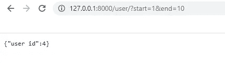

## 请求正文

我们还可以在请求体中向服务器发送数据。使用`Pydantic`模型来格式化我们从请求主体接收的数据。

```
from fastapi import FastAPI
from typing import Optional
from pydantic import BaseModelclass User(BaseModel):
    name: str
    age: Optional[int] = None
    gender: str
    phone: Optional[str] = Noneapp = FastAPI()[@app](http://twitter.com/app).post("/user/")
async def create_user(user: User):
    return user
```

您可以使用 FastAPI 文档试用选项检查用户发布 API ( `“/user”`)。为此，打开网址[http://127 . 0 . 0 . 1:8000/docs](http://127.0.0.1:8000/docs)。选择创建用户发布 API，然后单击试用按钮。在请求正文中提供用户信息，然后点击执行按钮。如果请求成功，您可以在响应正文中看到响应。

此外，您可以使用 postman 尝试 post API。

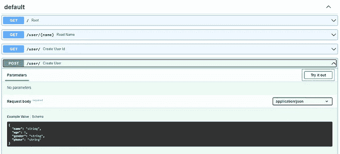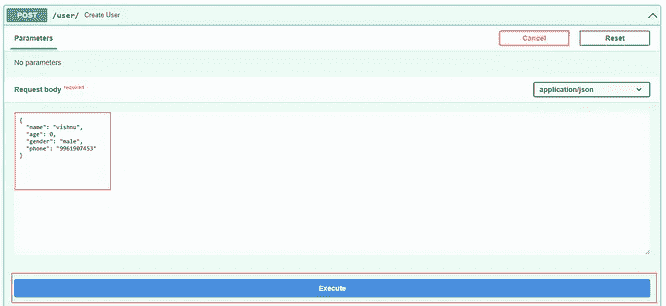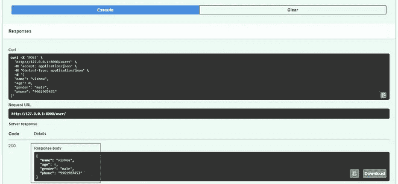

## 数据变换

声明路径参数的类型将为错误检查、数据转换等提供支持。如果您提到参数的类型，FastAPI 会自动解析请求。

```
from fastapi import FastAPIapp = FastAPI()[@app](http://twitter.com/app).get("/user/id/{id}")
async def read_name(id: int):
    return {"user id": id}
```


注意，返回值是`5`，是`int`而不是字符串`"5"`。

## 数据有效性

FastAPI 还为您提供内置的数据验证支持，并在发生任何验证错误时向您提供错误消息。

```
from fastapi import FastAPIapp = FastAPI()[@app](http://twitter.com/app).get("/user/id/{id}")
async def read_name(id: int):
    return {"user id": id}
```

如果你点击了 URL[http://127 . 0 . 0 . 1:8000/user/id/foo](http://127.0.0.1:8000/user/id/foo)，那么你会得到一个错误消息`“value is not a valid integer”`，由于类型不匹配。

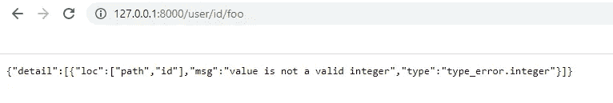

感谢阅读这篇文章。

感谢 [Gowri M Bhatt](https://www.linkedin.com/in/gowri-m-bhatt-85b31814b/) 审阅内容。

如果你喜欢这篇文章，请点击拍手按钮👏并且分享出来帮别人找！

这篇文章也可以在 [Dev](https://dev.to/codemaker2015/build-python-web-apis-using-fastapi-4gba) 上找到。

本教程的完整源代码可以在这里找到，

[](https://github.com/codemaker2015/fastapi-examples) [## GitHub-codemaker 2015/fastapi-示例:两个 fast API 示例项目

### 两个 fastapi 示例项目。通过在…上创建帐户，为 codemaker2015/fastapi-examples 开发做出贡献

github.com](https://github.com/codemaker2015/fastapi-examples) 

有用的链接，

[](https://fastapi.tiangolo.com/) [## FastAPI

### FastAPI 框架，高性能，简单易学，快速编码，准备生产文档…

fastapi.tiangolo.com](https://fastapi.tiangolo.com/) [](https://github.com/ChristopherGS/ultimate-fastapi-tutorial) [## GitHub-Christopher GS/Ultimate-fastapi-Tutorial:终极 FastAPI 教程

### 此时您不能执行该操作。您已使用另一个标签页或窗口登录。您已在另一个选项卡中注销，或者…

github.com](https://github.com/ChristopherGS/ultimate-fastapi-tutorial)