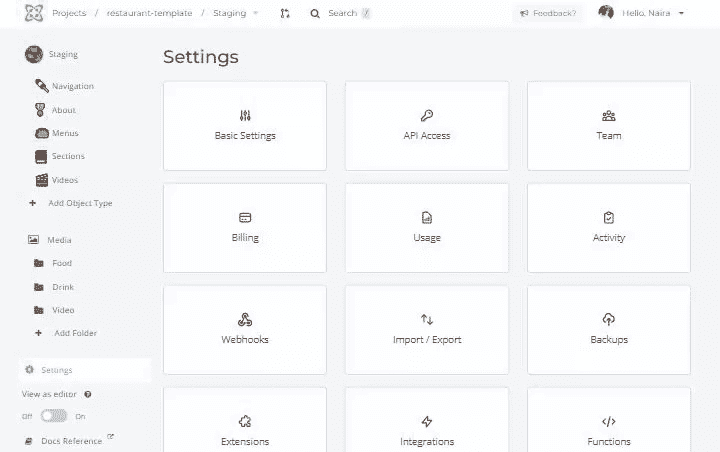

# 用 Next.js 和 Cosmic 搭建一个餐厅网站

> 原文：<https://blog.devgenius.io/build-restaurant-website-with-next-js-and-cosmic-e4ae1d9afcc8?source=collection_archive---------9----------------------->

在本教程中，我将向您展示如何使用 [Next.js](https://nextjs.org/) 和 [Cosmic](https://www.cosmicjs.com/) Headless CMS 来构建一个完全移动的响应式餐厅网站。Figma 模板可以在 ui8.net 的[找到。](https://ui8.net/iqonicdesign/products/gericht-restaurant-website-ui-in-figma)

额外的特性包括部署到 [Vercel](https://vercel.com/) 和使用 Cosmic Webhooks 设置自动静态内容重新验证。让我们开始吧。

# 我们将使用的工具

[Next.js](https://nextjs.org/) —一个 React 生产框架，可以轻松启动全栈应用。
[Cosmic](https://www.cosmicjs.com) —一个无头 CMS 实现了数据(内容)层的独立性，让我们能够快速管理网站内容。
[Sass](https://sass-lang.com) —一种稳定、强大的专业级 CSS 扩展语言。

# TL；速度三角形定位法(dead reckoning)

[查看代码](https://github.com/cosmicjs/nextjs-restaurant-website-cms)
[查看现场演示](https://nextjs-restaurant-website-cms.vercel.app/)
[安装 App 模板](https://www.cosmicjs.com/apps/nextjs-restaurant-website)

# 快速介绍

Next.js 是一个完整的套件，用于构建反应极快的应用程序。它对开发人员友好，使用直观。随着 [Next.js 12.1](https://nextjs.org/blog/next-12-1?utm_source=next-site&utm_medium=banner&utm_campaign=next-website) 的发布，事情只会变得更好，包括性能优化、中间件、React 18 支持、按需 ISR、对 SWC 的扩展支持等等。
**Cosmic** 是一个很棒的无头 CMS，它让我们能够完全管理和存储我们的网站内容和媒体，并快速更新它们。

# 探索 Next.js 的 4 个新杀手级特性，并使用它们作为模板

让我们[安装一个新的 Next.js](https://nextjs.org/docs) 应用程序，它包括工具和配置。对于本教程，您需要 [Node.js](https://nodejs.org/en/) 12.22.0 或更高版本。打开终端，粘贴或键入

从应用程序文件夹安装依赖项:

现在，您可以在开发模式下通过以下方式启动应用程序:

在你的浏览器中打开[*http://localhost:3000/*](http://localhost:3000/)查看苦行僧主页。

## 1.Rust 编译器

Next.js 12 的关键特性之一是性能优化。为了提高性能，Next.js 用一个可扩展的 Rust 编译器取代了 Babel 编译器，并默认启用了**next . js 12，[编译器](https://nextjs.org/docs/advanced-features/compiler)构建在代表`Speedy Web Compiler`的 [SWC](http://swc.rs/) 之上。它确实消耗 TypeScript/JavaScript，并发出可以在旧浏览器上执行的 JavaScript 代码。**

*SWC 在单线程上比 Babel 快 20 倍，在四核上快 70 倍。*

## 2.中间件

这是最令人兴奋的特性之一。中间件使我们能够使用代码而不是配置。这意味着您可以在请求完成之前运行代码，并且基于请求，您可以通过重写、重定向、添加头、设置 cookies 等来修改响应。有了中间件，你可以实现诸如[认证、僵尸防护、重定向和重写、服务器端分析、日志记录和处理不支持的浏览器](https://github.com/vercel/examples/tree/main/edge-functions)等等。

中间件被创建`/pages/_middleware.ts`，它将在`/pages`目录中的所有路由上运行。一个`_middleware.js`文件是什么样子的？让我们以模板为例来看看这一点。

## 3.按需增量静态再生 [ISR](https://nextjs.org/docs/basic-features/data-fetching/incremental-static-regeneration)

Next.js 现在公开了一个函数`unstable_revalidate()`，允许你重新验证使用`getStaticProps`的单个页面。在`getStaticProps`内部，你不需要指定重新验证来使用按需重新验证，只需要在调用`unstable_revalidate()`时按需重新验证页面。

## 4.使用 AVIF 加快图像优化和缩小图像

内置的[图像优化 API](https://nextjs.org/blog/next-12-1?utm_source=next-site&utm_medium=banner&utm_campaign=next-website#faster-image-optimization) 已经更新，支持与 [ISR](https://nextjs.org/docs/basic-features/data-fetching/incremental-static-regeneration) 页面相同的模式，其中图像在后台过时并重新验证。它还支持 AVIF 图像，与 WebP 相比，图像小 20%。

此功能是可选的，可以通过修改图像来启用。`next.config.js`文件中的格式属性:

# 宇宙特征概述

*   **可定制的 API** :从编辑器中为 API 构建模式、模型和控制器。为了方便起见，Cosmic 提供了 REST 和 graph QL API。
*   **全球快速安全**内容管理系统和 API 工具包。
*   **Webhooks** 使用 Cosmic API，在任何需要的地方进行回调，以获得您想要的功能。
*   [**包含 Imgix**](https://imgix.com/) **集成**，可让您为针对跨平台体验而优化的动态应用进行强大的图像处理。

## 宇宙整合

第一步制作一个[免费宇宙账号](https://app.cosmicjs.com/signup)。让我们选择“从头开始”选项。

太好了！现在让我们将内容组织成组，这些组使用对象类型共享相同的内容模型。例如，您有具有类似属性(如节名、标题、简介和图片)的节，并且希望重用此模块为不同的节创建内容。

创建节对象类型并添加节属性，以定义“内容模型”中的“元字段”。

现在，您可以为部分创建一个对象类型模型，并且可以像这样填充内容。

以类似的方式，您可以按照当前的数据模型、模式设计

*   唯一模型的单例，
*   多个可重用模型。

# 是时候获取 Next.js 应用程序的值了

将 Cosmic 模块安装到您的 Next.js 应用程序中。

然后去宇宙仪表板`Your Bucket > Settings > API Access`找到你的桶蛞蝓和 API 读取键。

厉害！将这个 Bucket slug 和 API read key 添加到你的 Next.js 应用`.env`

要使用模板 UI，您需要在 [GitHub](https://github.com/cosmicjs/nextjs-restaurant-website-cms) 中克隆它。打开终端，粘贴或键入以下代码来安装所有依赖项，然后运行它。

函数`getDataFromBucket`请求我们之前在宇宙仪表盘中创建的`bucket`，并通过`params`类型从宇宙中获取我们创建的内容。

让我们显示我们的内容，将其与我们的 UI 集成，并将一些元素呈现到主页上。为此，您需要将此添加到`index.js`。

`chooseByType`函数根据我们在宇宙仪表盘中创建的对象类型`slug`过滤数据。

恭喜你快成功了！

# 制作菜单项页面

在 Next.js 中，您可以创建动态路线。为了创建单独的菜单项页面和动态路线，考虑下面的页面`pages/menu/[slug].js`:

`getServerSideProps`该函数用于在每次调用该路线时从 Cosmic 获取数据。在`pages/api/revalidate.js`中，我们使用`unstable_revalidate`函数在调用`unstable_revalidate()`时按需重新验证页面，如果有错误，Next.js 将继续显示最后成功生成的页面。

在 [Vercel](https://nextjs.org/docs/deployment) 上部署您的代码库之后，您可以通过转到 Cosmic Dashboard 并导航到*Bucket Settings>web hooks*来启用内容更新的重新验证。编辑内容时要触发的事件是`object.edited.published`。Webhook URL 端点将类似于`${YOUR_VERCEL_DEPLOYMENT_URL}/api/revalidate`。

这也使得在创建或更新来自 headless CMS 的内容时更容易更新您的站点。

是时候进行测试了，在 Cosmic Dashboard 中编辑您的内容，并查看即时更新的静态内容！

# 结论

恭喜你。现在您有了一个动态的、可定制的、完全集成的模板，具有新的 Next.js 和 Cosmic 功能，您可以为其他类型的企业定制它，并按照您喜欢的方式使用它。

