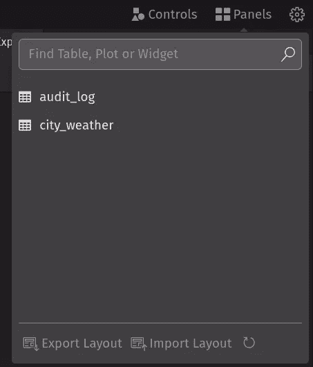
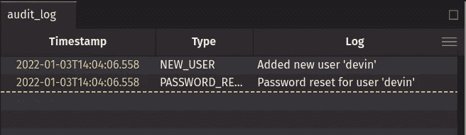
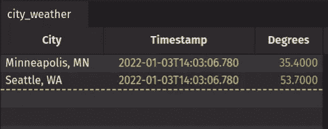

# 使用自定义实时数据源构建

> 原文：<https://blog.devgenius.io/build-with-custom-real-time-data-sources-f35a9103b651?source=collection_archive---------14----------------------->

使用高度灵活的输入表以编程方式接收和组合数据

## 戴文·史密斯


照片由 [Unsplash](https://unsplash.com?utm_source=medium&utm_medium=referral) 上的 [Ayrus Hill](https://unsplash.com/@ayrus_hill?utm_source=medium&utm_medium=referral) 拍摄

动态数据有多种来源。实时处理这些数据为分析和应用带来了许多机会。在现代系统中，像 Kafka 这样众所周知的协议很重要，但是您的定制源也很重要。在许多情况下，您可能希望在不连接 Kafka 的情况下从应用程序流式传输数据。

[Deephaven](https://deephaven.io/) 是一个数据引擎，它“只适用于”流表——本质上是可以经常更新或实时快速变化的表。在 [deephaven-core](https://deephaven.io/community/) 产品中，我们最近发布了一个名为“输入表”的构建模块。它旨在容纳您感兴趣的大量自定义数据源。例如，您将能够实时摄取:

*   第三方数据馈送
*   产生天气数据的 IOT 设备
*   用户界面的输出可以与您的后端进行通信

这些仅仅是几种可能性。

Deephaven 输入表提供了一个强大、灵活、简单的 API 来添加您自己的动态数据源。[输入表 API](https://github.com/deephaven/deephaven-core/blob/v0.8.0/proto/proto-backplane-grpc/src/main/proto/deephaven/proto/inputtable.proto) 暴露在 [gRPC](https://grpc.io/) 之上。
这篇博客演示了该特性在远程 Java 客户端中的使用，但是输入表也可以直接从服务器(通过[应用程序模式](https://deephaven.io/core/docs/how-to-guides/app-mode/))或通过 [web IDE](https://www.youtube.com/watch?v=a8I3wI96-UE&t=15s) 中的脚本会话来启用。下面的例子很容易适应 JS 客户机，或者(将来)Python 或 C++客户机(或者任何其他支持 gRPC 的语言)。

一旦添加了输入表集成，您就可以使用 Deephaven 表继承的所有强大功能:连接、过滤、操作、分组、嵌入 Python 函数等等。它们只是您的实时更新查询的[有向非循环图](https://deephaven.io/core/docs/conceptual/dag/)中的另一个源表。

# 类型[](https://docs-staging.deephaven.io/deploy-preview/741a17a477879f048d15ef01907f2b02878fd932/blog/2022/01/18/input-tables/#types)

输入表是一个实时更新的表，可以通过编程方式添加数据。从概念上讲，它类似于 SQL INSERT 或 MERGE 语句。

当前有两种类型的输入表:

1.  **仅追加输入表。**这些输入表将所有新行追加到表的末尾。它们适用于需要完整更新历史的用例。例如，来源于事件的审计日志、IOT 事件流或社交媒体源。
2.  **按键输入表。**这些输入表有键列(零个或更多)。如果键是新的，则追加一个新行，如果键已经存在，则更新现有行。(也可以根据关键字删除行。)这些适用于(I)有一个与数据相关联的重要键，以及(ii)不需要完整的更新历史的用例。以符号名称为关键字的图书价格提要、以城市名称为关键字的当前天气、以球队名称为关键字的棒球比赛实况比分都是相关的示例。也可能有一个空键(零列)；例如，单个灯开关的状态。

# 创建输入表请求[](https://docs-staging.deephaven.io/deploy-preview/741a17a477879f048d15ef01907f2b02878fd932/blog/2022/01/18/input-tables/#create-input-table-request)

远程客户端可以使用[创建输入表请求 RPC](https://github.com/deephaven/deephaven-core/blob/v0.8.0/proto/proto-backplane-grpc/src/main/proto/deephaven/proto/table.proto#L588-L614) 来创建输入表。最重要的部分是定义，它可能由一个[箭头模式](https://arrow.apache.org/docs/format/Columnar.html#schema-message)(描述列名和类型)指定，或者通过引用一个现有表的定义来指定。对于键支持的输入表，键列也很重要。

Java 客户端有[InMemoryAppendOnlyInputTable](https://deephaven.io/core/javadoc/io/deephaven/qst/table/InMemoryAppendOnlyInputTable.html)和[InMemoryKeyBackedInputTable](https://deephaven.io/core/javadoc/io/deephaven/qst/table/InMemoryKeyBackedInputTable.html)类来表示每种类型的输入表。

下面是一个从 Java 客户端创建名为`audit_log`的仅追加输入表的示例:

```
*// Create an append-only input table with a timestamp column "Timestamp", a string column "Type", and a string column "Log"*
TableHeader header = TableHeader.*of*(
        ColumnHeader.*ofInstant*("Timestamp"),
        ColumnHeader.*ofString*("Type"),
        ColumnHeader.*ofString*("Log"));
try (TableHandle handle = session.*execute*(InMemoryAppendOnlyInputTable.*of*(header))) {
    *// Publish `audit_log` so that the table can be referenced in the query scope by other sessions*
    session.*publish*("audit_log", handle);
}
```

下面是一个从 Java 客户端创建名为`city_weather`的键支持输入表的示例:

```
*// Create a key-backed input table with a string key column "City", a timestamp column "Timestamp", and a double column "Degrees"*
TableHeader header = TableHeader.*of*(
        ColumnHeader.*ofString*("City"),
        ColumnHeader.*ofInstant*("Timestamp"),
        ColumnHeader.*ofDouble*("Degrees")), Collections.*singletonList*("City"));
try (TableHandle handle = session.*execute*(InMemoryKeyBackedInputTable.*of*(header))) {
    *// Publish `city_weather` so that the table can be referenced in the query scope by other sessions*
    session.*publish*("city_weather", handle);
}
```

执行上述操作后，您应该能够在 web UI“Panels”下拉菜单中看到(空的)表格，通常可以在[http://localhost:10000/ide/](http://localhost:10000/ide/)找到。



这些示例的完整可运行源代码可在 [Deephaven 示例输入表库](https://github.com/deephaven-examples/input-tables)获得。

# 添加表格请求[](https://docs-staging.deephaven.io/deploy-preview/741a17a477879f048d15ef01907f2b02878fd932/blog/2022/01/18/input-tables/#add-table-request)

一旦创建了输入表，您可能会想要向其中添加数据。远程客户端可以使用[添加表请求 RPC](https://github.com/deephaven/deephaven-core/blob/v0.8.0/proto/proto-backplane-grpc/src/main/proto/deephaven/proto/inputtable.proto#L32-L35) 添加到输入表。表格数据通过 [Arrow Flight DoPut RPC](https://arrow.apache.org/docs/format/Flight.html) 导出到服务器，然后添加到之前创建的输入表格中。

例如，要从 Java 客户端向`audit_log`输入表添加新行，您可以执行:

```
*// Create a table in the builder-style pattern using the 'audit_log' column types*
NewTable table = *ofInstant*("Timestamp")
        .*header*(*ofString*("Type"))
        .*header*(*ofString*("Log"))
        .*row*(Instant.*now*(), "NEW_USER", "Added new user 'devin'")
        .*row*(Instant.*now*(), "PASSWORD_RESET", "Password reset for user 'devin'")
        .*newTable*();*// Add table into the input table 'audit_log'*
session.*addToInputTable*(new ScopeId("audit_log"), table, allocator);
```

要从 Java 客户端添加或更新`city_weather`输入表中的行，您可以执行:

```
*// Create a table in the builder-style pattern using the 'city_weather' column types*
NewTable table = *ofString*("City")
        .*header*(*ofInstant*("Timestamp"))
        .*header*(*ofDouble*("Degrees"))
        .*row*("Minneapolis, MN", Instant.*now*(), 35.4)
        .*row*("Seattle, WA", Instant.*now*(), 53.7)
        .*newTable*();*// Add table into the input table 'city_weather'*
session.*addToInputTable*(new ScopeId("city_weather"), table, allocator);
```

执行上述操作后，web UI 中的表格将显示数据已经成功添加。



# 集成[](https://docs-staging.deephaven.io/deploy-preview/741a17a477879f048d15ef01907f2b02878fd932/blog/2022/01/18/input-tables/#integrations)

上面的例子是有意最小化的，以隔离(I)创建输入表，然后(ii)添加到输入表的核心概念。当然，API 的本质是可以和其他系统集成。这个简单的带有静态示例数据的示例调用可以很容易地扩展到现实世界的集成，以编程方式获取数据，甚至可能以很高的速度获取数据。`audit_log`可以集成为真实应用程序审计日志的接收器；`city_weather`可以集成一个真正的天气 API。

Deephaven 输入表 API 是进入 Deephaven 流媒体生态系统的低门槛。

我对输入表集成的大量用例感到兴奋:

*   生产数据的 IOT 设备可以使用输入表和 Deephaven 来推动家庭自动化。
*   输入表可以作为 GUI 和后端应用程序进程之间的通信层。
*   体育业内人士可以通过使用输入表和 Deephaven 来创建新的客户端体验，以操纵精细的比赛细节，实时取悦球迷。
*   区块链数据可以驱动(非区块链)应用程序，以促进分析和体验。
*   快速概念验证可用于医疗遥测。

# 相关概念[](https://docs-staging.deephaven.io/deploy-preview/741a17a477879f048d15ef01907f2b02878fd932/blog/2022/01/18/input-tables/#related-concepts)

输入表并不是向 Deephaven 呈现动态数据的唯一方式。在其他方法中， [Kafka streams](https://docs-staging.deephaven.io/deploy-preview/741a17a477879f048d15ef01907f2b02878fd932/core/docs/how-to-guides/kafka-stream/) 经常被用于将实时数据放入实时 Deephaven 表中。它们对于已经建立了 Kafka 基础设施的系统特别有用。在这种情况下，Deephaven 服务器充当 Kafka 服务器的消费者，而 Deephaven 服务器和/或远程客户端使用 Kafka APIs 充当 Kafka 服务器的生产者。

# 源代码[](https://docs-staging.deephaven.io/deploy-preview/741a17a477879f048d15ef01907f2b02878fd932/blog/2022/01/18/input-tables/#source-code)

上述示例的源代码可在[deep haven-examples/input-tables](https://github.com/deephaven-examples/input-tables)获得。它有完整的可运行示例，提供了从远程客户端创建和添加到输入表的设置和上下文。除了上面展示的例子之外，它还有其他例子。