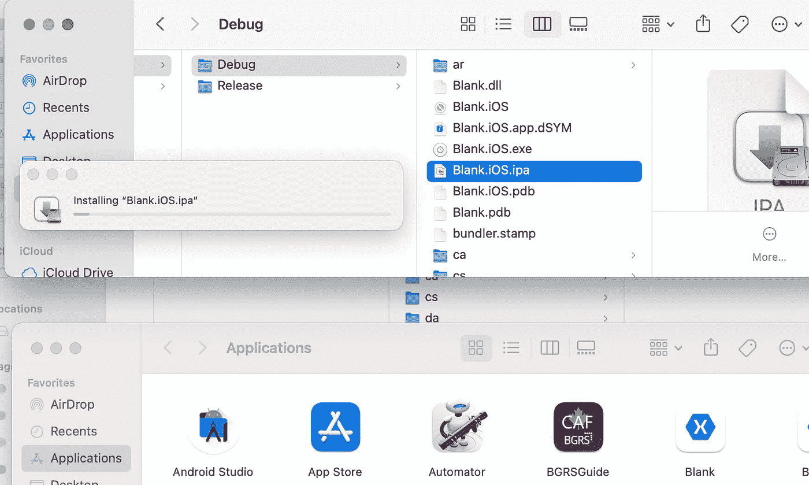

# 使用 VS 代码为 M1 苹果电脑、iPhones 和 Android 开发 Xamarin 应用程序

> 原文：<https://blog.devgenius.io/build-xamarin-apps-with-vs-code-to-m1-macs-iphones-android-11bc158f3773?source=collection_archive---------0----------------------->

## 你不需要打开 IDE，在终端中开始构建应用程序

在不同的论坛上有许多问题，开发人员询问如何使用终端/CLI 构建 Xamarin 应用程序。用于 Xamarin 跨平台开发的主要软件/程序是微软的 Visual Studio。 Visual Studio 被归类为用于构建 Xamarin 应用程序的集成开发环境(IDE)。因此，它拥有构建、调试和发布应用程序所需的所有功能。这自然使得 Visual Studio 体积庞大&比仅仅使用 CLI 构建要慢。

几十年来，软件开发人员在可能的情况下更喜欢使用轻量级的文本编辑器，因为它们修改起来既漂亮又快捷，因为很多任务不需要复杂的 IDE。微软的 [Visual Studio 代码](https://code.visualstudio.com/)是[最受开发者欢迎的文本编辑器](https://insights.stackoverflow.com/survey/2020#technology-how-technologies-are-connected)，拥有[无数免费扩展](https://marketplace.visualstudio.com/vscode)来增强开发者体验。

请注意，以下步骤不支持调试，iOS 命令需要在 Mac 上完成，并且如果您没有在 Apple Developer portal 中正确地[设置您的开发证书和预置描述文件](https://www.youtube.com/watch?v=DPCtq2whqg4)，构建将无法在 iPhones 和 Mac 上工作([按照这些步骤](https://docs.microsoft.com/en-us/xamarin/ios/get-started/installation/device-provisioning/free-provisioning?tabs=macos)进行临时设置)。

*第一个雏形是一个新兴的移动 App 设计开发咨询小企业，专门做* [*跨平台和原生 iOS&Android apps*](https://thefirstprototype.com/mobile-app-development-detroit-ios-android.html)*。在* [*我们的网站*](https://thefirstprototype.com) *，和* [*支持*](http://twitter.com/prototypemakers) *我们在* [*社交媒体*](http://instagram.com/prototypemakers) *上注册，了解我们在 iOS 上的 5 星* [*数字炸弹游戏**&*](https://apps.apple.com/app/numberbomb/id1560372045)[*安卓&等项目中的简单创新*](https://play.google.com/store/apps/details?id=com.tfp.numberbomb)

对于所有这些步骤，您需要安装 VS 代码，然后打开包含您的 Xamarin 解决方案文件的目录。然后在工具栏中选择“终端”->“新建终端”来打开终端。使用`nuget restore`命令恢复 nuget 包。然后，根据您想要构建的平台，按照下面的步骤，简单地用您的项目名称替换`Sample`:

## 使用 VS 代码构建和部署到 Android 的步骤

1.  在你的终端中，运行这个`msbuild Sample.Android/Sample.Android.csproj /verbosity:normal /t:Rebuild /t:PackageForAndroid /t:SignAndroidPackage /p:Configuration=Debug`
2.  然后，使用`cd Sample.Android/bin/Debug`切换目录，找到已签名的 APK 文件。
3.  使用 [ADB(Android 调试桥)](https://docs.microsoft.com/en-us/xamarin/android/get-started/installation/set-up-device-for-development#connecting-over-wifi)，用这个命令`adb install com.tfp.sample-Signed.apk`、[安装到你的设备/仿真器上，这里解释](https://stackoverflow.com/questions/7076240/install-an-apk-file-from-command-prompt/7076679#7076679)。

## 使用 VS 代码构建和部署 iOS 模拟器的步骤

1.  在您的终端中，运行此`msbuild Sample.iOS/Sample.iOS.csproj /verbosity:normal /t:Rebuild /p:Platform=iPhoneSimulator /p:Configuration=Debug`
2.  然后，使用`cd Sample.iOS/bin/iPhoneSimulator/Debug`更改目录，找到 Sample.iOS APP 文件，
3.  只需将该文件拖放到您的模拟器中进行安装，或者您可以只运行`xcrun simctl install booted Sample.iOS.app`。

## 使用 VS 代码构建和部署到 iPhone 设备的步骤

使用 Xcode 的设备和模拟器来直接安装应用程序

1.  在你的终端中，运行这个`msbuild Sample.iOS/Sample.iOS.csproj /verbosity:normal /t:Rebuild /p:Platform=iPhone /p:Configuration=Debug`
2.  然后，去`Sample.iOS/bin/iPhone/Debug`找到`Sample.iOS` APP 文件
3.  连接 iPhone 并解锁后，打开 Xcode-> Window-> Devices & Simulators->点击+号并选择应用程序文件。

## 使用 VS 代码在 Mac M1 上构建和安装 Xamarin 应用程序的步骤

双击空白处，iOS.ipa 会自动安装

1.  在您的终端中，如果您还没有为上面的 iPhone 运行它，请运行此`msbuild Sample.iOS/Sample.iOS.csproj /verbosity:normal /t:Rebuild /p:Platform=iPhone /p:Configuration=Debug`
2.  然后，使用`cd Sample.iOS/bin/iPhone/Debug/Sample.iOS.app`进入 app 文件的包内容。
3.  最后，使用`zip -r Blank.iOS.ipa ./`创建 ipa，双击它安装到 MacOS 应用程序目录，然后打开。

# 其他注意事项

*   您可以同时运行多个命令，将`&&`放在多个独立的命令之间，这样您就不必手动执行每个步骤。
*   如果您的 iPhone 模拟器版本有问题，您可以打开 Visual Studio，并在 iOS 项目设置中，将调试 iOS 模拟器捆绑签名标识和预置描述文件设置为自动。
*   如果您的 iPhone/Mac M1 部署有问题，请确保安装的 Apple 开发者证书和预置描述文件与您的`info.plist`文件中的应用程序的授权和捆绑标识符完全对应。
*   除了`/t:Rebuild`，你还可以使用`/t:Build`来加快速度

有时在追求知识的过程中，你会偶然发现比你最初寻找的更有价值的其他知识。不久前，我写了一篇关于 GitHub Actions 的文章，但是我没有发现任何其他文章将它提升到一个新的水平。我在为高级 GitHub Actions 文章(即将发布)进行研究时学到了这些很酷的技巧，所以我希望你也同样对它们感到兴奋！这里有一个简短的视频展示了所有这些工作:

Android、iPhone 和 Mac M1 部署和安装的视频演示