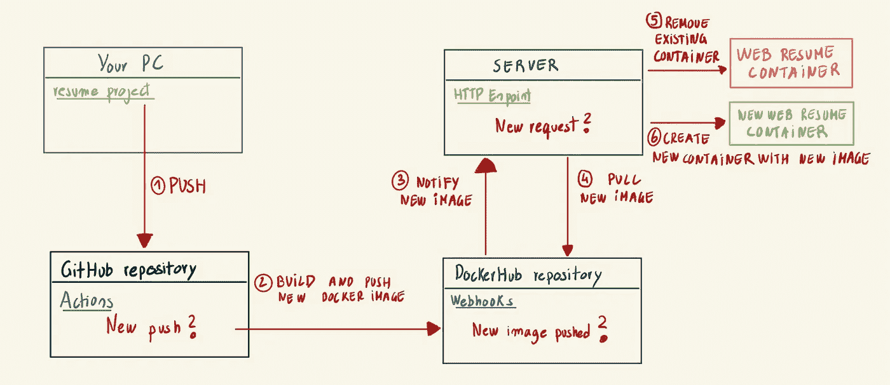

# 创建您自己的网络课程时，使用 Docker、Github Actions 和 Webhooks 构建您的第一个 CI/CD 管道

> 原文：<https://blog.devgenius.io/build-your-first-ci-cd-pipeline-using-docker-github-actions-and-webhooks-while-creating-your-own-da783110e151?source=collection_archive---------3----------------------->

在本教程中，您将学习一种通过将自动化引入开发阶段(称为持续集成/持续交付)来频繁向客户端交付应用程序的基本方法。

首先，我们将使用 JSON Resume，这是一个由社区创建的开源项目，旨在创建一个基于 JSON 的简历标准，帮助我们更快地发布我们的课程。该工具使用命令行工具从 JSON 文件创建 HTML 简历。

接下来，Github actions 将允许我们使用一个基本的 httpd 服务器创建一个 docker 映像，其中包括我们在上一步中生成的 HTML，每次我们的存储库被更新时。此外，该图像将被自动推送到 DockerHub。

最后一步，我们将使用 [adnanh/webhook](https://github.com/adnanh/webhook) 来重新创建我们的容器，只要有新的图像被推送到我们的 Docker Hub 存储库。Webhook 是一个用 Go 编写的简单、轻量级的应用程序，它允许您轻松地在您的服务器上创建 HTTP 端点，这些端点可用于执行命令。



项目示意图

这只是做这件事的一种方法，还有很多。您可以使用 Github 操作来构建 HTML 文件，而不是在本地构建并推送到存储库之后复制它。这只是一个很酷的小项目，因为它基本上只是一个学习 Docker、Github 动作的实验室…

假设你们中的大多数人对创建 GitHub 库、致力于它等等都有基本的了解。同样重要的是，您的计算机上安装了 docker、npm 和 git，这应该足够了。如果你有任何问题，请告诉我，我可以帮助你或者更新这篇文章。

## 创建简历

您需要做的第一件事是创建一个 GitHub 存储库并在本地克隆它。之后，我们可以安装 resume-cli，JSON Resume 命令行工具。为此，请在项目的根目录下运行以下命令:

**npm 安装恢复命令行界面**

一般来说，我更喜欢在本地(项目内)安装软件包，而不是全局安装，所以如果我的项目永远不会被删除，我也不必记得卸载全局软件包。此外，该项目更具可移植性。如果您全局安装软件包，则没有必要通过 npx 运行 resume-cli。

我们的下一步是初始化一份新简历:

**简历初始**

您将被要求输入您的姓名和电子邮件地址。将会有一个名为 resume.json 的新 JSON 文件，其中包含关于您的简历的信息。有几种方法可以定制你的简历，每种方法都有多个选项。我们邀请您查看它们，并选择最符合您需求的[主题](https://jsonresume.org/themes/)。请记住，如果你想要一个不同的主题，这将需要额外的配置。

让我们现在生成我们的 HTML 简历:

【resume.html npx 恢复出口】T2

一旦您将其推送到您的存储库，我们就可以进入下一部分。

## DOCKER 图像

假设您已经完成了上一部分，让我们构建一个 docker 映像，它包含基本的 Httpd web 服务器和之前创建的 resume.html。为了做到这一点，我们将制作一个相当简单的 order 文件，只有两行。在项目根目录中，创建一个名为 Dockerfile 的文件，其中包含以下几行:

```
**FROM httpd:latest
COPY resume.html /usr/local/apache2/htdocs/index.html**
```

第一行简单地声明我们将使用 Httpd 的最新版本作为我们的基础映像。最后一行把我们的简历复制到服务器的公共文件夹。为了确保一切按预期运行，我们将在本地测试我们的映像。第一步是构建我们的图像，并用一个标签 resume-test 保存它，这样在我们启动容器后，这个标签就可用了。

```
**docker build . -t resume-test**
```

下一步，我们将使用以下命令运行名为 container-resume 的容器:

```
**docker run -p 80:80 -d --name container-resume resume-test**
```

***-p*** *你的 _ 机器 _ 港口:集装箱 _ 港口。如果你前往 docker.hub 上的* [*httpd 文档*](https://hub.docker.com/_/httpd) *它们会在 80 端口暴露服务器。*

***-d*** *在后台运行容器并打印容器 ID，我们仍然可以在同一终端上工作。*

现在，在浏览器中键入 localhost 后，您的课程表就会出现。如果没有，请检查您的终端是否有任何错误，并重复该过程。

为了停止并删除机器上的容器，您必须运行以下命令:

```
**docker container stop container-resume
docker container rm container-resume**
```

## GITHUB 操作

我最喜欢的部分，在这里你将学习如何使用 GitHub actions 来构建我们的应用程序，每次有新的贡献加入到我们的库中。此外，在构建完成后，这会将图像上传到我们的 Docker Hub 存储库中。Docker 上有一个很棒的[文档](https://docs.docker.com/ci-cd/github-actions/)展示了如何做到这一点，这只是最简单的部分。如果您想了解如何实现更多自动化，请看看这个。

首先，你应该去 [docker hub](https://hub.docker.com/) 创建一个账户。之后，您需要将存储库命名为 web-resume，或者您想叫它什么都行。在接下来的步骤中，您将需要该名称。

创建存储库后，进入 ***账户设置- >安全- >访问令牌*** 并创建新令牌。请务必保存令牌，稍后会用到它。您现在可以在您的 ***GitHub 资源库的设置中添加以下两个秘密:Secrets->New Secret***。

`DOCKER_HUB_USERNAME`使用您的 docker hub 用户名。

`DOCKER_HUB_ACCESS_TOKEN`使用之前创建的令牌。

我们现在准备开始编写很酷的 GitHub actions YAML 文件。导航到顶部菜单 ***您的存储库- >操作- >新建工作流- >自行设置工作流*** 。复制以下文本并粘贴:

```
# This is a basic workflow to help you get started with Actions
name: CI
# Controls when the workflow will run
on:
  # Triggers the workflow on push or pull request events but only for the master branch
  push:
    branches: [ master ]
  pull_request:
    branches: [ master ]# Allows you to run this workflow manually from the Actions tab
  workflow_dispatch:# A workflow run is made up of one or more jobs that can run sequentially or in parallel
jobs:
  # This workflow contains a single job called "build"
  build:
    # The type of runner that the job will run on
    runs-on: ubuntu-latest# Steps represent a sequence of tasks that will be executed as part of the job
    steps:
      # Checks-out your repository under $GITHUB_WORKSPACE, so your job can access it
      - uses: actions/checkout@v2

        name: Login to Docker Hub
      - uses: docker/login-action@v1
        with:
          username: ${{ secrets.DOCKER_HUB_USERNAME }}
          password: ${{ secrets.DOCKER_HUB_ACCESS_TOKEN }}
      -
        name: Set up Docker Buildx
        uses: docker/setup-buildx-action@v1
      -
        name: Build and push
        uses: docker/build-push-action@v2
        with:
          context: .
          file: ./Dockerfile
          push: true
          tags: ${{ secrets.DOCKER_HUB_USERNAME }}/***YOUR-DOCKER-HUB-REPO-NAME***:latest
```

下面的代码摘自我前面提到的文档。这是有据可查的，也很容易理解。请注意，标题为“设置 Docker Buildx”的部分远程创建了我们的 Dockerfile 映像，就像我们在本地所做的一样。最后，我还用粗体字突出了“***YOUR-DOCKER-HUB-REPO-NAME***”。如果你给你的 Docker hub repo 起了不同的名字，我想是这样的，那么一定要把这个名字改成你选择的那个名字。

现在，每当您将某个东西推送到 master 时，都会构建一个新的映像并保存到您的存储库中，所以请继续测试它。

## 重建我们的容器

我们的项目几乎完成了，所以我们需要一种方法来创建我们的容器，其中包含了在我们的存储库上构建的最后一个映像。Docker Hub 存储库中的菜单上有一个名为 Webhooks 的部分。这让您可以在每次存储库中有 push 事件时发送一个 HTTP/S 请求，以及一堆关于它的[信息](https://docs.docker.com/docker-hub/webhooks/)。因此，剩下的唯一事情就是接收请求。为此，我将使用 [adnanh/webhook](https://github.com/adnanh/webhook) 。我们可以用它轻松地启动一个端点，并在几个步骤中设置好它。

在开始下一部分之前，需要一个服务器。可以使用你自己的电脑，但是要确保你有一个公共的 IP 地址，这样 webhook 请求才能找到你的电脑。我用的是最便宜最基本的 [Hertzner Cloud](https://www.hetzner.com/cloud?country=de) 基本服务器搭配 Ubuntu。确保 Docker 安装在您的服务器上，并登录到您的 Docker 帐户，以便能够下载新创建的图像。这可以通过以下方式轻松实现:

```
**docker login**
```

在安装 Webhook 工具之前，我们将首先启动我们的容器，并编写用于重启它的 shell 脚本。要启动容器:

```
**docker run -p 80:80 -d --name YOUR-CONTAINER-NAME YOUR-DOCKER-HUB-USER/YOUR-DOCKER-HUB-REPO-NAME**
```

接下来，在 shell 脚本中包含以下内容: (记住名称并添加执行权限 **chmod +x** )

```
*#!/bin/sh
# Pull latest version of the image*
**docker pull *YOUR-DOCKER-HUB-USER/YOUR-DOCKER-HUB-REPO-NAME*** *# Remove unused images* **docker image prune -f**
*# Stop the container*
**docker stop YOUR-CONTAINER-NAME** # Remove *the container* **docker rm YOUR-CONTAINER-NAME** # Recreate the container **docker run -p 80:80 -d --name YOUR-CONTAINER-NAME YOUR-DOCKER-HUB-USER/YOUR-DOCKER-HUB-REPO-NAME**
```

是时候安装 [adnanh/webhook](https://github.com/adnanh/webhook) 了。在 Ubuntu 中，就像这样简单:

**sudo apt-get 安装 webhook**

您也可以参考其他操作系统的文档。我们的下一步是创建另一个 JSON 文件，它将包含以下端点配置信息:

```
[
    { 
      "id": "**ENDPOINT-NAME**",
      "execute-command": "./script.sh",
      "command-working-directory": "/etc/scripts",
      "response-message": "Executing redeploy web resume container",
      "trigger-rule":
      {
        "match":
        {
          "type": "value",
          "value": "**CREATE-YOUR-OWN-TOKEN**",
          "parameter":
          {
            "source": "url",
            "name": "**GET-PARAM**"
          }
        }
      }
    }
]
```

**id** :指定您想要的任何名称，但是记住它将作为端点的名称 http://your server:9000/hooks/**id**

**execute-comand** :在这里写下我们之前创建的 shell 脚本的名称。

**命令-工作目录**:要指定存储脚本的工作目录，请输入保存脚本的目录路径。

用一个安全令牌更改 **CREATE-YOUR-OWN-TOKEN** 的值，以验证是您在请求重新部署容器。以及 **GET-PARAM** ，可以随意重命名。我们的网址会是**http://your server:9000/hooks/id？ **GET-PARAM** = **创建自己的令牌**。**

**只剩下两个步骤，第一步是启动我们的端点(如果您在后台运行这个命令将是最好的):**

```
**webhook -hooks web-resume.json -verbose**
```

**最后，但并非最不重要。转到 docker hub 的 webhooks 部分，创建一个新的 webhook。在那里键入您的 URL，并随意命名，记住您的 URL 格式是:**

**http://your server:9000/hooks/id？ **GET-PARAM** = **创建自己的令牌**。**

**Buala，现在当你更新你的 GitHub 网络课程时，将它推送到 master，你应该在几秒钟内看到更新的在线课程。**

**在 joanplaja.com 查看我的网络简历。除了域名，我还在我的网站上添加了 SSL 证书。如果你不知道如何做到这一点，我邀请你更新你的项目，以便能够做到这一点。如果你喜欢这个项目，请与你的朋友分享。**